# CARTO Upstream Sync

This document describes the automated process for keeping CARTO's LiteLLM fork synchronized with upstream [BerriAI/litellm](https://github.com/BerriAI/litellm) stable releases.

## Overview

CARTO maintains a fork of LiteLLM with custom workflows, documentation, and configurations. The upstream sync process ensures we stay current with stable releases while preserving CARTO-specific customizations.


## Branch Strategy

| Branch | Purpose | Protected |
|--------|---------|-----------|
| `main` | Mirror of upstream BerriAI/litellm | No |
| `carto/main` | **Production branch** with CARTO customizations | Yes |
| `upstream-sync/*` | Temporary branches for sync PRs | No |

### Why This Strategy?

1. **`main` as pure mirror** - Preserves upstream commit history, enables easy comparison
2. **`carto/main` for production** - Isolated from upstream churn, receives tested updates via PR
3. **Dedicated sync branches** - Allows conflict resolution commits without polluting main

---

## Workflow Ecosystem

Three workflows work together to automate the sync process:

```mermaid
flowchart TB
    subgraph Workflows["GitHub Actions Workflows"]
        SYNC["🔄 carto-upstream-sync<br/><i>Weekly sync check</i>"]
        RESOLVER["🔧 carto-upstream-sync-resolver<br/><i>Conflict resolution</i>"]
        FIXER["🩹 carto-upstream-sync-ci-fixer<br/><i>CI failure fixes</i>"]
    end

    SYNC -->|"PR has conflicts"| RESOLVER
    RESOLVER -->|"CI fails"| FIXER
    FIXER -->|"fixes pushed"| RESOLVER

    style SYNC fill:#3498db,color:#fff
    style RESOLVER fill:#9b59b6,color:#fff
    style FIXER fill:#e67e22,color:#fff
```



### 1. Main Sync Workflow

**File:** `.github/workflows/carto-upstream-sync.yml`

**Schedule:** Every Monday at 12:00 UTC (or manual trigger)

**Purpose:** Detect new stable releases and create sync PRs

### 2. Conflict Resolver

**File:** `.github/workflows/carto-upstream-sync-resolver.yml`

**Trigger:** Automatically when sync PR has conflicts, or manual

**Purpose:** Use Claude Code to resolve merge conflicts

### 3. CI Fixer

**File:** `.github/workflows/carto-upstream-sync-ci-fixer.yml`

**Trigger:** When CI fails on upstream-sync branches

**Purpose:** Automatically fix linting/test failures

---

## Main Sync Flow

```mermaid
flowchart TD
    START([🕐 Weekly Schedule<br/>Monday 12:00 UTC]) --> CHECK

    subgraph CHECK["Job 1: Check New Release"]
        C1[Checkout carto/main]
        C2[Get current version<br/>from pyproject.toml]
        C3[Fetch upstream releases<br/>via gh CLI]
        C4{New stable<br/>release?}

        C1 --> C2 --> C3 --> C4
    end

    C4 -->|No| SKIP([✅ Already up to date])
    C4 -->|Yes| SYNC

    subgraph SYNC["Job 2: Sync Main Branch"]
        S1[Checkout main]
        S2[git merge upstream/main<br/>-X theirs]
        S3[Push to origin/main]

        S1 --> S2 --> S3
    end

    SYNC --> CARTO_CHECK

    subgraph CARTO_CHECK["Job 3: Check carto/main"]
        CC1[Count commits behind]
        CC2{Existing<br/>sync PR?}

        CC1 --> CC2
    end

    CC2 -->|Yes| NOTIFY_EXIST([📨 Notify: PR exists])
    CC2 -->|No| CREATE

    subgraph CREATE["Job 4: Create Sync PR"]
        CR1[Create branch<br/>upstream-sync/vX.Y.Z]
        CR2[Generate PR body]
        CR3[Create PR to carto/main]
        CR4{Has conflicts?}

        CR1 --> CR2 --> CR3 --> CR4
    end

    CR4 -->|Yes| TRIGGER_RESOLVER([🔧 Trigger Resolver])
    CR4 -->|No| NOTIFY_CLEAN([📨 Notify: PR ready])

    style START fill:#3498db,color:#fff
    style SKIP fill:#2ecc71,color:#fff
    style NOTIFY_EXIST fill:#f39c12,color:#fff
    style NOTIFY_CLEAN fill:#2ecc71,color:#fff
    style TRIGGER_RESOLVER fill:#9b59b6,color:#fff
```



---

## Conflict Resolution Flow

When a sync PR has conflicts, the resolver workflow automatically resolves them:

```mermaid
flowchart TD
    START([🔧 Resolver Triggered]) --> SECURITY

    subgraph SECURITY["Security Verification"]
        SEC1{Authorized<br/>actor?}
        SEC2{Valid branch<br/>pattern?}
        SEC3{Has upstream-sync<br/>label?}

        SEC1 -->|Yes| SEC2
        SEC2 -->|Yes| SEC3
    end

    SEC1 -->|No| REJECT([❌ Unauthorized])
    SEC2 -->|No| REJECT
    SEC3 -->|No| REJECT
    SEC3 -->|Yes| CONFLICT_CHECK

    subgraph CONFLICT_CHECK["Conflict Detection"]
        CON1[Checkout sync branch]
        CON2[Start merge from carto/main]
        CON3{Conflicts<br/>detected?}

        CON1 --> CON2 --> CON3
    end

    CON3 -->|No| CLEAN([✅ No conflicts])
    CON3 -->|Yes| RESOLVE

    subgraph RESOLVE["Claude Resolution"]
        R1[🤖 Claude Code analyzes<br/>conflicted files]
        R2[Claude edits files<br/>to resolve markers]
        R3[Workflow completes<br/>merge commit]
        R4[Push to sync branch]

        R1 --> R2 --> R3 --> R4
    end

    RESOLVE --> CI_CHECK

    subgraph CI_CHECK["CI Validation"]
        CI1[CI runs on PR]
        CI2{CI passes?}

        CI1 --> CI2
    end

    CI2 -->|Yes| READY([✅ PR ready for review])
    CI2 -->|No| FIXER([🩹 Trigger CI Fixer])

    style START fill:#9b59b6,color:#fff
    style REJECT fill:#e74c3c,color:#fff
    style CLEAN fill:#2ecc71,color:#fff
    style READY fill:#2ecc71,color:#fff
    style FIXER fill:#e67e22,color:#fff
```



### Resolution Strategy

Claude resolves conflicts following these rules:

| File Pattern | Resolution | Rationale |
|--------------|------------|-----------|
| `.github/workflows/carto_*` | **Keep CARTO (ours)** | CARTO-specific workflows |
| `CARTO_*.md`, `docs/CARTO_*` | **Keep CARTO (ours)** | CARTO documentation |
| `litellm/**` | **Accept upstream (theirs)** | Core library code |
| `pyproject.toml` | **Accept upstream (theirs)** | Version must match upstream |
| `Dockerfile`, `Makefile` | **Manual review** | May have CARTO customizations |

---

## PR Lifecycle


### Important: Merge Strategy

> ⚠️ **NEVER SQUASH MERGE** upstream sync PRs.
>
> Always use **"Create a merge commit"**. Squashing destroys upstream commit history and breaks future syncs.

---

## Manual Operations

### Trigger Sync Manually

```bash
# Via GitHub CLI
gh workflow run carto-upstream-sync.yml --repo CartoDB/litellm

# Or use GitHub Actions UI
# Actions → CARTO - Upstream Sync → Run workflow
```

### Trigger Resolver Manually

```bash
# For a specific PR
gh workflow run carto-upstream-sync-resolver.yml \
  --repo CartoDB/litellm \
  -f pr-number=49
```

### Check Current Sync Status

```bash
# Current version in production
grep '^version' pyproject.toml

# Latest upstream stable
gh release list --repo BerriAI/litellm --limit 10 | grep stable

# Commits behind upstream
git fetch origin main carto/main
git rev-list --count origin/carto/main..origin/main
```

### Manual Conflict Resolution

If automated resolution fails:

```bash
# 1. Checkout the sync branch
git fetch origin
git checkout upstream-sync/v1.X.Y-stable

# 2. Start the merge
git merge origin/carto/main

# 3. Resolve conflicts manually
# Edit conflicted files, remove markers

# 4. Complete the merge
git add .
git commit -m "resolve: merge conflicts for v1.X.Y-stable"

# 5. Verify and push
make lint
make test-unit
git push origin upstream-sync/v1.X.Y-stable
```

---

## Notifications

The workflow sends Slack notifications to `#cartodb-ops`:

| Event | Message |
|-------|---------|
| New PR created | ✅ Version upgrade with PR link |
| PR already exists | ℹ️ Existing PR link |
| Up to date | ✅ Fully synced status |
| Sync failed | ❌ Error with workflow link |

---

## Troubleshooting

### PR Stuck with Conflicts

1. Check if resolver workflow ran (Actions tab)
2. If resolver failed, check logs for errors
3. Try manual resolution (see above)
4. If blocked, close PR and trigger new sync

### CI Keeps Failing

1. Check CI fixer workflow logs
2. Verify CARTO customizations weren't overwritten
3. Run locally: `make lint && make test-unit`
4. Push fixes to the sync branch

### Workflow Not Detecting New Releases

1. Verify release has `-stable` suffix
2. Check `gh release list --repo BerriAI/litellm`
3. Ensure version is greater than current (string comparison)
4. Check workflow logs for jq filter output

### "PR Already Exists" Blocking New Versions

Current behavior: Only one sync PR allowed at a time.

Options:
1. Merge or close existing PR
2. Manual trigger after closing old PR

See internal documentation for future improvement options (auto-supersede strategy).

---

## Security

### Authorized Actors

Only these users can trigger the resolver:
- `Cartofante` (automation account)
- `mateo-di`

### Protected Operations

- Resolver only runs on `upstream-sync/*` branches
- Cannot modify `main` or `carto/main` directly
- Requires `upstream-sync` label on PR
- Blocks PRs from external forks

### Tokens

| Token | Purpose | Scope |
|-------|---------|-------|
| `GITHUB_TOKEN` | Standard operations | Default permissions |
| `X_GITHUB_SUPERCARTOFANTE` | Workflow file modifications | `contents:write`, `workflows:write` |
| `ANTHROPIC_API_KEY` | Claude Code for resolver | API access |
| `SLACK_KEY` | Notifications | `chat:write` |

---

## Related Documentation

- [CARTO Release Process](./CARTO_RELEASE_PROCESS.md)
- [CARTO Customizations](../CARTO_CLAUDE.md)
