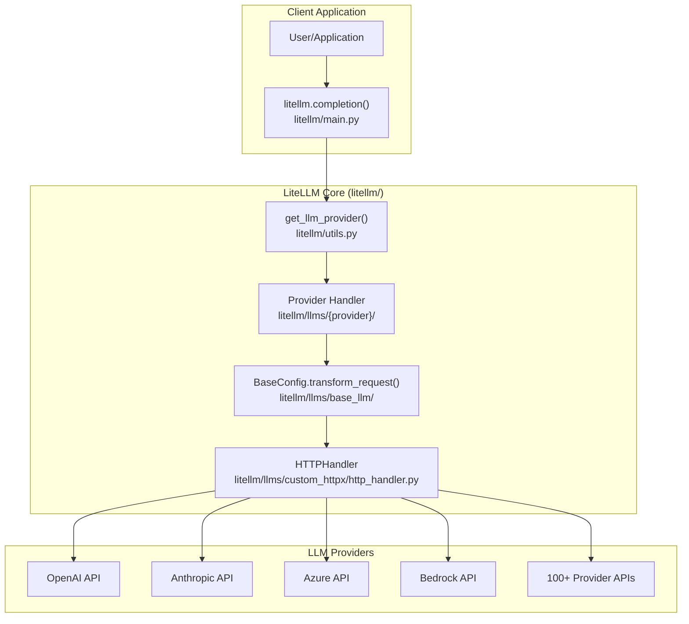
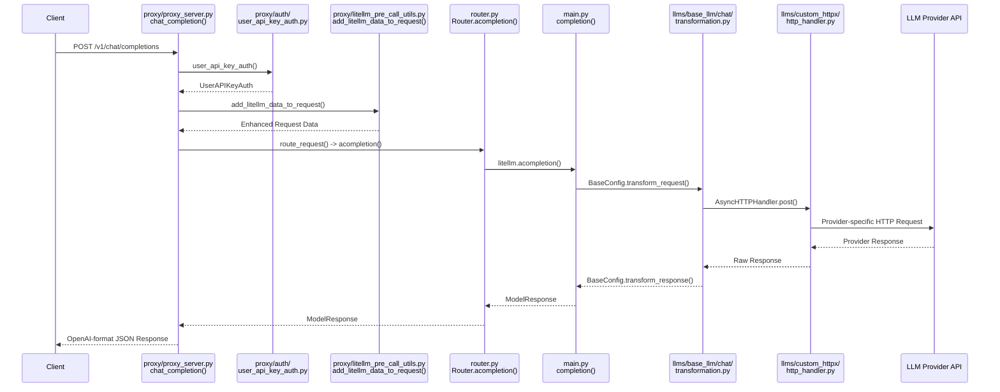
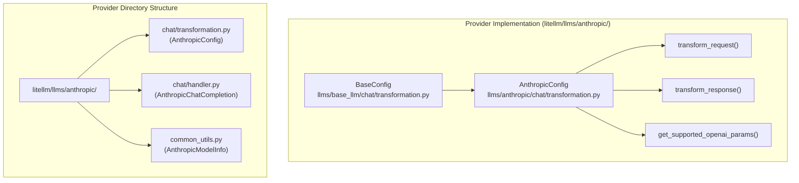
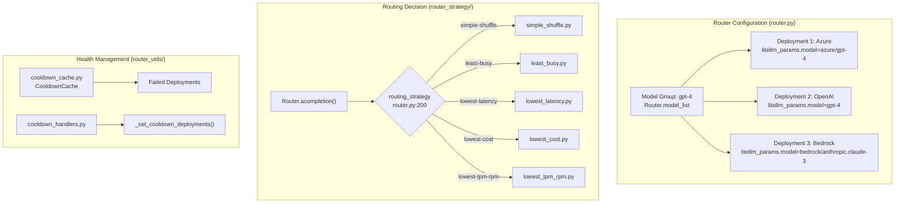
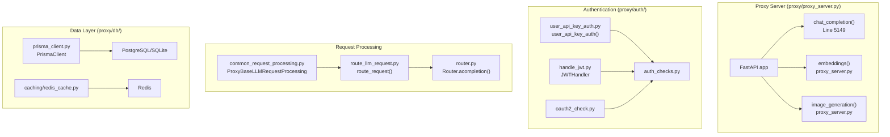
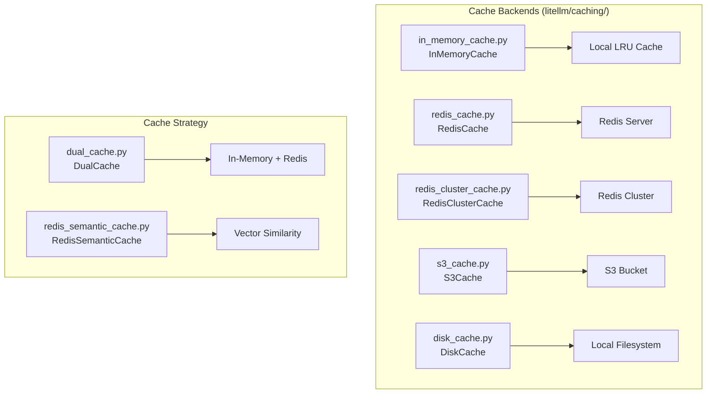
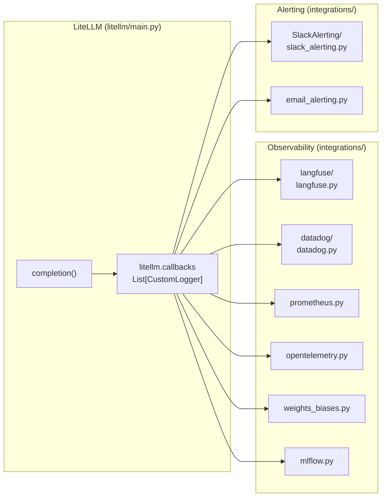
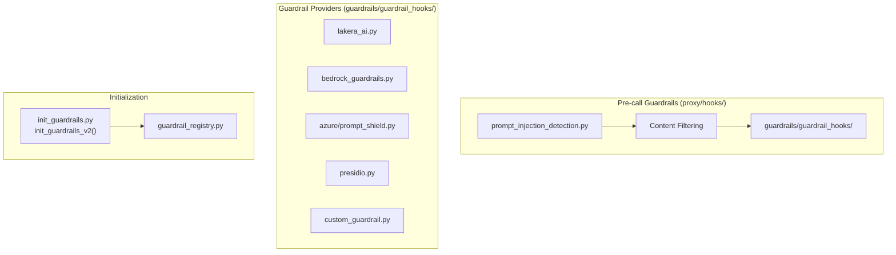

# LiteLLM Architecture

## 1. System Overview

LiteLLM is a unified interface for 100+ LLM providers. The system consists of two main components:
the **Core Library** for direct LLM interactions and the **Proxy Server** (LLM Gateway) for
production deployments with authentication, rate limiting, and observability.



**Core Library (`litellm/`):**
- **Purpose:** Provides a unified `completion()` interface that translates OpenAI-format requests
  to provider-specific formats and normalizes responses back to OpenAI format.
- **Mechanism:** Uses transformation classes to convert inputs/outputs, handles streaming,
  function calling, and error mapping across all providers.
- **Use Case:** Direct integration into Python applications for LLM calls.

**Proxy Server (`litellm/proxy/`):**
- **Purpose:** Production-ready LLM Gateway with authentication, rate limiting, load balancing,
  spend tracking, and admin UI.
- **Mechanism:** FastAPI server that wraps the core library with enterprise features.
- **Use Case:** Centralized LLM access for organizations with multiple teams and applications.

## 2. Request Flow

Every request flows through a standard chain of handlers. The transformation layer converts
inputs to provider-specific formats only after routing decisions are made.



### Request Processing Stages

1. **Authentication (`proxy/auth/user_api_key_auth.py`):** Validates API keys, JWT tokens, or OAuth2 credentials.
   Extracts user, team, and organization context for downstream processing.

2. **Pre-call Processing (`proxy/litellm_pre_call_utils.py`):** Adds metadata, applies guardrails via
   `proxy/hooks/`, and prepares request data.

3. **Routing (`proxy/route_llm_request.py` -> `router.py`):** The `route_request()` function selects
   the appropriate model deployment based on load balancing strategy, cooldowns, and rate limits.

4. **Provider Resolution (`litellm/utils.py`):** The `get_llm_provider()` function determines which
   provider handler to use based on the model name.

5. **Transformation (`llms/base_llm/chat/transformation.py`):** The provider's `BaseConfig` subclass
   converts OpenAI-format requests to provider-specific formats.

6. **HTTP Request (`llms/custom_httpx/http_handler.py`):** `AsyncHTTPHandler` or `HTTPHandler` makes
   the actual HTTP request to the LLM provider.

7. **Response Processing (`llms/{provider}/chat/transformation.py`):** Provider's `transform_response()`
   normalizes the response back to OpenAI format.

8. **Post-call Hooks (`integrations/custom_logger.py`):** Logs to observability platforms, updates
   spend tracking via callbacks registered in `litellm.callbacks`.

## 3. Core Library Architecture

### Main Entry Points

The core library exposes several main functions in `litellm/main.py`:

| Function | File Location | Purpose |
|----------|---------------|---------|
| `completion()` | `litellm/main.py:992` | Chat completions (sync) |
| `acompletion()` | `litellm/main.py:369` | Chat completions (async) |
| `embedding()` | `litellm/main.py:4352` | Text embeddings |
| `text_completion()` | `litellm/main.py:5445` | Legacy text completions |
| `image_generation()` | `litellm/main.py` | Image generation |
| `transcription()` | `litellm/main.py` | Audio transcription |
| `speech()` | `litellm/main.py` | Text-to-speech |

### Provider Resolution

When `completion()` is called, the provider is determined by `get_llm_provider()` in `litellm/utils.py`.
The function parses the model string (e.g., `anthropic/claude-3-opus`) and returns:
- `model` - The model name without provider prefix
- `custom_llm_provider` - The provider identifier (e.g., "anthropic", "openai", "bedrock")
- `api_key` - Resolved API key
- `api_base` - Provider endpoint URL

### Provider Implementation Pattern

Each provider follows a consistent implementation pattern:



**Key Files per Provider (`litellm/llms/{provider}/`):**
- `chat/transformation.py` - Request/response transformation inheriting from `BaseConfig`
- `chat/handler.py` - HTTP request handling and streaming logic
- `common_utils.py` - Shared utilities, model info, and constants

### Transformation Layer

The transformation layer (`litellm/llms/base_llm/`) provides base classes for all API types:

| Base Class | File | Purpose |
|------------|------|---------|
| `BaseConfig` | `llms/base_llm/chat/transformation.py` | Chat completions transformation |
| `BaseEmbeddingConfig` | `llms/base_llm/embedding/transformation.py` | Embedding transformation |
| `BaseImageGenerationConfig` | `llms/base_llm/image_generation/transformation.py` | Image generation transformation |
| `BaseAudioTranscriptionConfig` | `llms/base_llm/audio_transcription/transformation.py` | Audio transcription transformation |
| `BaseBatchesConfig` | `llms/base_llm/batches/transformation.py` | Batch API transformation |

Each provider implements these base classes to handle format conversion. Example from
`litellm/llms/anthropic/chat/transformation.py`:

```python
class AnthropicConfig(BaseConfig):
    def transform_request(
        self,
        model: str,
        messages: List[AllMessageValues],
        optional_params: dict,
        litellm_params: dict,
        headers: dict,
    ) -> dict:
        # Convert OpenAI format to Anthropic format
        return {"model": model, "messages": transformed_messages, ...}
    
    def transform_response(
        self,
        model: str,
        raw_response: httpx.Response,
        model_response: ModelResponse,
        logging_obj: LiteLLMLoggingObj,
        ...
    ) -> ModelResponse:
        # Convert Anthropic response to OpenAI format
        return ModelResponse(choices=[...], usage=Usage(...))
```

## 4. Router System

The Router (`litellm/router.py`) manages multiple model deployments with load balancing,
fallbacks, and health monitoring.



### Routing Strategies (`litellm/router_strategy/`)

| Strategy | File | Description |
|----------|------|-------------|
| `simple-shuffle` | `simple_shuffle.py` | Random selection across healthy deployments |
| `least-busy` | `least_busy.py` | Routes to deployment with lowest active requests |
| `lowest-latency` | `lowest_latency.py` | Routes to historically fastest deployment |
| `lowest-cost` | `lowest_cost.py` | Routes to cheapest available deployment |
| `lowest-tpm-rpm` | `lowest_tpm_rpm.py` | Routes based on token/request capacity |
| `tag-based` | `tag_based_routing.py` | Routes based on request metadata tags |

### Fallback and Retry Logic (`litellm/router_utils/`)

| File | Purpose |
|------|---------|
| `fallback_event_handlers.py` | `run_async_fallback()`, `get_fallback_model_group()` |
| `cooldown_handlers.py` | `_set_cooldown_deployments()`, `_async_get_cooldown_deployments()` |
| `cooldown_cache.py` | `CooldownCache` class for tracking failed deployments |
| `handle_error.py` | `send_llm_exception_alert()`, exception handling |
| `get_retry_from_policy.py` | `get_num_retries_from_retry_policy()` |

## 5. Proxy Server Architecture

The Proxy Server (`litellm/proxy/proxy_server.py`) is a FastAPI application that wraps the
core library with enterprise features.



### Endpoint Categories

**OpenAI-compatible Endpoints (defined in `proxy/proxy_server.py`):**

| Endpoint | Function | Line |
|----------|----------|------|
| `POST /v1/chat/completions` | `chat_completion()` | ~5149 |
| `POST /v1/completions` | `completion()` | proxy_server.py |
| `POST /v1/embeddings` | `embeddings()` | proxy_server.py |
| `POST /v1/images/generations` | `image_generation()` | image_endpoints/ |
| `POST /v1/audio/transcriptions` | `audio_transcriptions()` | proxy_server.py |
| `POST /v1/audio/speech` | `audio_speech()` | proxy_server.py |

**Management Endpoints (`proxy/management_endpoints/`):**

| File | Endpoints |
|------|-----------|
| `key_management_endpoints.py` | `/key/generate`, `/key/delete`, `/key/info` |
| `team_endpoints.py` | `/team/new`, `/team/update`, `/team/delete` |
| `internal_user_endpoints.py` | `/user/new`, `/user/update`, `/user/delete` |
| `model_management_endpoints.py` | `/model/new`, `/model/delete`, `/model/info` |
| `budget_management_endpoints.py` | `/budget/new`, `/budget/info` |
| `organization_endpoints.py` | `/organization/new`, `/organization/update` |

**Pass-through Endpoints (`proxy/pass_through_endpoints/`):**

| File | Purpose |
|------|---------|
| `llm_passthrough_endpoints.py` | Provider-specific API forwarding |
| `pass_through_endpoints.py` | Custom pass-through route initialization |

### Authentication System (`proxy/auth/`)

| File | Purpose |
|------|---------|
| `user_api_key_auth.py` | Main `user_api_key_auth()` dependency for FastAPI routes |
| `auth_checks.py` | `get_team_object()`, permission and budget validation |
| `handle_jwt.py` | `JWTHandler` class for JWT token processing |
| `oauth2_check.py` | OAuth2 flow handling |
| `model_checks.py` | `get_key_models()`, `get_team_models()` for access validation |
| `route_checks.py` | Endpoint permission checks |

### Database Schema (`proxy/schema.prisma`)

The proxy uses Prisma ORM with the following key entities:

| Table | Purpose |
|-------|---------|
| `LiteLLM_UserTable` | User accounts and settings |
| `LiteLLM_TeamTable` | Team definitions and membership |
| `LiteLLM_OrganizationTable` | Organization hierarchy |
| `LiteLLM_VerificationToken` | API keys (hashed) |
| `LiteLLM_SpendLogs` | Usage and spend tracking |
| `LiteLLM_ModelTable` | Model configurations |
| `LiteLLM_BudgetTable` | Budget definitions |

## 6. Caching System

LiteLLM provides multiple caching backends (`litellm/caching/`):



| Cache Type | File | Use Case |
|------------|------|----------|
| `InMemoryCache` | `in_memory_cache.py` | Single-instance deployments |
| `RedisCache` | `redis_cache.py` | Multi-instance with shared state |
| `RedisClusterCache` | `redis_cluster_cache.py` | Redis Cluster deployments |
| `DualCache` | `dual_cache.py` | Fast local + persistent remote |
| `S3Cache` | `s3_cache.py` | Long-term response storage |
| `RedisSemanticCache` | `redis_semantic_cache.py` | Similar query deduplication |
| `DiskCache` | `disk_cache.py` | Local filesystem caching |

## 7. Integrations and Observability

### Callback System (`litellm/integrations/`)

LiteLLM supports 30+ observability integrations through a callback system:



**Key Integration Files (`litellm/integrations/`):**

| Category | Files |
|----------|-------|
| **Tracing** | `langfuse/langfuse.py`, `datadog/datadog.py`, `opentelemetry.py`, `arize/arize.py` |
| **Metrics** | `prometheus.py`, `cloudzero/cloudzero.py`, `openmeter.py` |
| **Logging** | `s3.py`, `gcs_bucket/gcs_bucket.py`, `dynamodb.py` |
| **Alerting** | `SlackAlerting/slack_alerting.py`, `email_alerting.py` |

### Custom Callbacks

Implement `CustomLogger` (from `integrations/custom_logger.py`) for custom integrations:

```python
from litellm.integrations.custom_logger import CustomLogger

class MyCallback(CustomLogger):
    def log_success_event(self, kwargs, response_obj, start_time, end_time):
        # Log successful completion
        pass
    
    def log_failure_event(self, kwargs, response_obj, start_time, end_time):
        # Log failed completion
        pass
    
    async def async_log_success_event(self, kwargs, response_obj, start_time, end_time):
        # Async version for non-blocking logging
        pass
```

Register callbacks via `litellm.callbacks.append(MyCallback())` or in proxy config YAML.

## 8. Guardrails System

The guardrails system (`litellm/proxy/guardrails/`) provides content filtering and safety checks:



**Guardrail Providers (`proxy/guardrails/guardrail_hooks/`):**

| Provider | File |
|----------|------|
| Lakera AI | `lakera_ai.py`, `lakera_ai_v2.py` |
| Bedrock Guardrails | `bedrock_guardrails.py` |
| Azure Content Safety | `azure/prompt_shield.py`, `azure/text_moderation.py` |
| OpenAI Moderation | `openai/moderations.py` |
| Presidio (PII) | `presidio.py` |
| Aporia AI | `aporia_ai/aporia_ai.py` |
| Custom | `custom_guardrail.py` |

**Key Files:**
- `init_guardrails.py` - `init_guardrails_v2()` initializes guardrails from config
- `guardrail_registry.py` - Registry of available guardrail implementations
- `guardrail_helpers.py` - Shared helper functions

## 9. Type System

LiteLLM uses Pydantic models for type safety (`litellm/types/`):

| File | Purpose |
|------|---------|
| `types/utils.py` | Core response types (`ModelResponse`, `Usage`, `EmbeddingResponse`) |
| `types/router.py` | Router configuration (`Deployment`, `LiteLLM_Params`, `RetryPolicy`) |
| `types/llms/openai.py` | OpenAI-specific types (`ChatCompletionRequest`, `AllMessageValues`) |
| `types/llms/anthropic.py` | Anthropic-specific types |
| `types/integrations/*.py` | Integration configuration types |
| `types/guardrails.py` | Guardrail configuration types |

### Key Types (`litellm/types/utils.py`)

```python
# Core response type - returned by all completion calls
class ModelResponse(BaseModel):
    id: str
    choices: List[Choices]
    created: int
    model: str
    usage: Usage
    
# Usage tracking
class Usage(BaseModel):
    prompt_tokens: int
    completion_tokens: int
    total_tokens: int
```

### Router Types (`litellm/types/router.py`)

```python
# Model deployment configuration
class Deployment(BaseModel):
    model_name: str                    # User-facing model name
    litellm_params: LiteLLM_Params     # Provider-specific params
    model_info: Optional[ModelInfo]    # Pricing, context window info

class LiteLLM_Params(BaseModel):
    model: str           # Provider model string (e.g., "azure/gpt-4")
    api_key: Optional[str]
    api_base: Optional[str]
    # ... additional provider params
```

## 10. Directory Structure Reference

```
litellm/
├── main.py                 # completion(), acompletion(), embedding() - core entry points
├── router.py               # Router class - load balancing, fallbacks, health checks
├── utils.py                # get_llm_provider(), helper functions, response types
├── exceptions.py           # LiteLLM exception classes
├── cost_calculator.py      # completion_cost(), token counting
├── _logging.py             # Logging configuration
│
├── llms/                   # Provider implementations (100+ providers)
│   ├── base_llm/           # Base classes all providers inherit from
│   │   ├── chat/transformation.py        # BaseConfig class
│   │   ├── embedding/transformation.py   # BaseEmbeddingConfig
│   │   └── ...
│   ├── openai/
│   │   ├── chat/transformation.py        # OpenAIConfig
│   │   ├── chat/handler.py               # OpenAIChatCompletion
│   │   └── openai.py
│   ├── anthropic/
│   │   ├── chat/transformation.py        # AnthropicConfig
│   │   └── chat/handler.py               # AnthropicChatCompletion
│   ├── azure/              # Azure OpenAI
│   ├── bedrock/            # AWS Bedrock
│   ├── vertex_ai/          # Google Vertex AI
│   └── custom_httpx/
│       └── http_handler.py # HTTPHandler, AsyncHTTPHandler
│
├── proxy/                  # Proxy server (LLM Gateway)
│   ├── proxy_server.py     # FastAPI app, chat_completion(), embeddings()
│   ├── route_llm_request.py # route_request() - routes to router
│   ├── common_request_processing.py # ProxyBaseLLMRequestProcessing
│   ├── litellm_pre_call_utils.py    # add_litellm_data_to_request()
│   ├── auth/
│   │   ├── user_api_key_auth.py     # user_api_key_auth() dependency
│   │   ├── auth_checks.py           # Permission validation
│   │   └── handle_jwt.py            # JWTHandler
│   ├── management_endpoints/
│   │   ├── key_management_endpoints.py
│   │   ├── team_endpoints.py
│   │   └── model_management_endpoints.py
│   ├── guardrails/
│   │   ├── init_guardrails.py
│   │   └── guardrail_hooks/         # Provider implementations
│   ├── hooks/                       # Pre/post call hooks
│   ├── db/
│   │   └── prisma_client.py         # PrismaClient
│   └── schema.prisma                # Database schema
│
├── router_utils/           # Router helper modules
│   ├── cooldown_handlers.py         # Deployment cooldown logic
│   ├── fallback_event_handlers.py   # Fallback handling
│   └── handle_error.py              # Error handling utilities
│
├── router_strategy/        # Load balancing strategies
│   ├── simple_shuffle.py
│   ├── lowest_latency.py
│   ├── lowest_cost.py
│   └── tag_based_routing.py
│
├── caching/                # Cache implementations
│   ├── redis_cache.py
│   ├── in_memory_cache.py
│   ├── dual_cache.py
│   └── caching_handler.py
│
├── integrations/           # Observability callbacks
│   ├── custom_logger.py             # CustomLogger base class
│   ├── langfuse/langfuse.py
│   ├── datadog/datadog.py
│   ├── prometheus.py
│   └── SlackAlerting/slack_alerting.py
│
├── types/                  # Pydantic type definitions
│   ├── utils.py                     # ModelResponse, Usage, etc.
│   ├── router.py                    # Deployment, LiteLLM_Params
│   └── llms/                        # Provider-specific types
│
└── litellm_core_utils/     # Internal utilities
    ├── litellm_logging.py           # Logging class
    ├── streaming_handler.py         # Stream processing
    └── exception_mapping_utils.py   # Exception mapping
```

## 11. Contributing Guidelines

### Adding a New Provider

1. Create directory: `litellm/llms/{provider}/`
2. Create `chat/transformation.py` with class inheriting from `BaseConfig` (`llms/base_llm/chat/transformation.py`)
3. Implement `transform_request()` and `transform_response()` methods
4. Add provider routing in `litellm/main.py` (search for `custom_llm_provider ==`)
5. Add tests in `tests/llm_translation/test_{provider}.py`
6. Update `model_prices_and_context_window.json` with model pricing

### Adding a New Integration

1. Create file in `litellm/integrations/{integration}.py`
2. Implement class inheriting from `CustomLogger` (`integrations/custom_logger.py`)
3. Implement `log_success_event()`, `log_failure_event()`, and async variants
4. Register callback name in `litellm/__init__.py` (add to `_known_custom_logger_compatible_callbacks`)
5. Add configuration types in `litellm/types/integrations/`
6. Add tests in `tests/`

### Adding a New Guardrail

1. Create directory in `litellm/proxy/guardrails/guardrail_hooks/{guardrail}/`
2. Implement guardrail class with `async_pre_call_hook()` and `async_post_call_hook()` methods
3. Register in `proxy/guardrails/guardrail_registry.py`
4. Add configuration schema in `litellm/types/guardrails.py`
5. Add tests in `tests/proxy_unit_tests/`

## 12. Security Considerations

| Feature | Implementation |
|---------|----------------|
| API Key Storage | Keys hashed via `proxy/auth/auth_utils.py` before database storage |
| Secret Management | `litellm/secret_managers/` - AWS Secrets Manager, Azure Key Vault, HashiCorp Vault |
| Input Validation | Request validation in `proxy/litellm_pre_call_utils.py` |
| Rate Limiting | `proxy/hooks/` - per-key, per-user, per-team limits |
| Audit Logging | `proxy/spend_tracking/` - all requests logged with user context |
