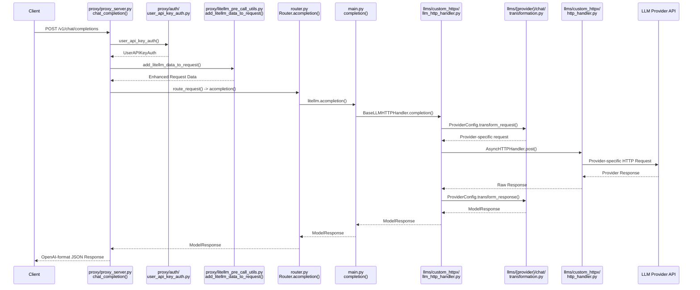
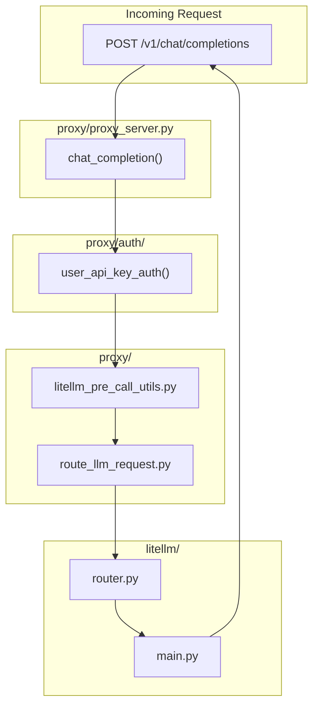

# LiteLLM Architecture

This document explains the internal architecture of LiteLLM for contributors. It describes the
major components, how they interact, and the key design decisions that shape the library.

## 1. Repo Composition

The repository has three main components:

### LiteLLM Python SDK (`litellm/`)

The core SDK provides multiple interface styles for calling LLMs:

| Interface | Location | Description |
|-----------|----------|-------------|
| **OpenAI-compatible** | `main.py` | `completion()`, `embedding()`, `image_generation()`, etc. |
| **Anthropic-compatible** | `anthropic_interface/` | Native Anthropic SDK interface |
| **Google GenAI-compatible** | `google_genai/` | Native Google GenAI SDK interface |
| **Responses API** | `responses/` | OpenAI Responses API interface |

Provider implementations live in `llms/{provider}/` with transformation classes that convert
between the standard interface and provider-specific formats.

### LiteLLM Proxy (`litellm/proxy/`)

A production-ready LLM Gateway (FastAPI server) with:

| Component | Location | Description |
|-----------|----------|-------------|
| **API Endpoints** | `proxy_server.py` | OpenAI-compatible REST API |
| **Authentication** | `auth/` | API keys, JWT, OAuth2 |
| **Management APIs** | `management_endpoints/` | Keys, teams, models, budgets |
| **Guardrails** | `guardrails/` | Content filtering, PII detection |
| **Database** | `db/` | Prisma ORM (PostgreSQL/SQLite) |
| **Pass-through** | `pass_through_endpoints/` | Direct provider API forwarding |

### Integrations (`litellm/integrations/`)

Logging, observability, and callback integrations:

| Category | Examples |
|----------|----------|
| **Tracing** | Langfuse, Datadog, OpenTelemetry, Arize |
| **Metrics** | Prometheus, CloudZero, OpenMeter |
| **Logging** | S3, GCS, DynamoDB |
| **Alerting** | Slack, Email |
| **Guardrails** | Lakera, Bedrock Guardrails, Presidio |

## Request Flow

The data flow for a proxy completion request is as follows:



## Provider Configuration

There is an architectural separation between the HTTP handling logic and provider-specific
transformations. The `BaseConfig` class is the base for all provider transformations. The
`BaseLLMHTTPHandler` in `llms/custom_httpx/llm_http_handler.py` is the central handler that
orchestrates all provider calls.

Each provider implements a `Config` class that inherits from `BaseConfig` and defines:
- `transform_request()` - Convert OpenAI format to provider format
- `transform_response()` - Convert provider response to OpenAI format
- `get_supported_openai_params()` - List of supported parameters
- `get_complete_url()` - Build the provider API endpoint

Example from `litellm/llms/bedrock/chat/agentcore/transformation.py`:

```python
class AmazonAgentCoreConfig(BaseConfig, BaseAWSLLM):
    def transform_request(self, model, messages, optional_params, litellm_params, headers):
        # Convert OpenAI messages to AgentCore format
        return {"messages": transformed_messages, ...}
    
    def transform_response(self, model, raw_response, model_response, logging_obj, ...):
        # Convert AgentCore response to OpenAI ModelResponse
        return ModelResponse(choices=[...], usage=Usage(...))
```

## HTTP Handler

The `BaseLLMHTTPHandler` (`llms/custom_httpx/llm_http_handler.py`) is the central orchestrator
for all provider calls. It:

1. Receives the provider's `Config` class
2. Calls `transform_request()` to build the provider-specific request
3. Makes the HTTP call via `HTTPHandler` or `AsyncHTTPHandler`
4. Calls `transform_response()` to normalize the response
5. Handles streaming, retries, and error mapping

This design means adding a new provider only requires implementing a `Config` class - no changes
to the HTTP handling logic.

## Router

The `Router` (`litellm/router.py`) manages multiple model deployments with load balancing,
fallbacks, and health monitoring. It wraps the core `completion()` function.

Key concepts:
- **Model Group**: A logical name (e.g., "gpt-4") that maps to multiple deployments
- **Deployment**: A specific provider endpoint with credentials
- **Routing Strategy**: Algorithm for selecting a deployment (e.g., `lowest-latency`, `simple-shuffle`)
- **Cooldown**: Temporarily removing failed deployments from rotation

The routing strategies are implemented in `litellm/router_strategy/`:
- `simple_shuffle.py` - Random selection
- `lowest_latency.py` - Route to fastest deployment
- `lowest_cost.py` - Route to cheapest deployment
- `lowest_tpm_rpm.py` - Route based on available capacity

## Proxy Server

The Proxy Server (`litellm/proxy/proxy_server.py`) is a FastAPI application that wraps the
core library with enterprise features:



Key subsystems:
- **Authentication** (`proxy/auth/`) - API key, JWT, OAuth2 validation
- **Management APIs** (`proxy/management_endpoints/`) - Key, team, model, budget management
- **Guardrails** (`proxy/guardrails/`) - Content filtering and safety checks
- **Database** (`proxy/db/`) - Prisma ORM for PostgreSQL/SQLite

## Caching

LiteLLM provides multiple caching backends in `litellm/caching/`:

| Backend | Use Case |
|---------|----------|
| `InMemoryCache` | Single-instance deployments |
| `RedisCache` | Multi-instance with shared state |
| `DualCache` | Fast local + persistent remote |
| `S3Cache` | Long-term response storage |

## Callbacks and Observability

The callback system (`litellm/integrations/`) enables logging to 30+ observability platforms.
Callbacks implement the `CustomLogger` interface from `integrations/custom_logger.py`:

```python
class CustomLogger:
    def log_success_event(self, kwargs, response_obj, start_time, end_time): ...
    def log_failure_event(self, kwargs, response_obj, start_time, end_time): ...
    async def async_log_success_event(self, kwargs, response_obj, start_time, end_time): ...
```

Register callbacks via `litellm.callbacks.append(MyCallback())` or in proxy config YAML.

## Adding a New Provider

1. Create `litellm/llms/{provider}/chat/transformation.py`
2. Implement a `Config` class inheriting from `BaseConfig`
3. Implement `transform_request()`, `transform_response()`, `get_complete_url()`
4. Add provider routing in `litellm/main.py`
5. Add tests in `tests/llm_translation/`
6. Update `model_prices_and_context_window.json`

See `litellm/llms/bedrock/chat/agentcore/transformation.py` for a complete example.

## Directory Structure

```
litellm/
├── main.py                 # Entry points: completion(), embedding(), etc.
├── router.py               # Load balancing and fallbacks
├── utils.py                # get_llm_provider(), helpers
│
├── llms/
│   ├── base_llm/           # Base transformation classes
│   │   └── chat/transformation.py  # BaseConfig
│   ├── custom_httpx/
│   │   ├── llm_http_handler.py     # BaseLLMHTTPHandler (central orchestrator)
│   │   └── http_handler.py         # HTTPHandler, AsyncHTTPHandler
│   └── {provider}/
│       └── chat/transformation.py  # ProviderConfig
│
├── proxy/
│   ├── proxy_server.py     # FastAPI application
│   ├── auth/               # Authentication
│   ├── management_endpoints/  # Admin APIs
│   └── guardrails/         # Content filtering
│
├── caching/                # Cache backends
├── integrations/           # Observability callbacks
└── types/                  # Pydantic models
```
