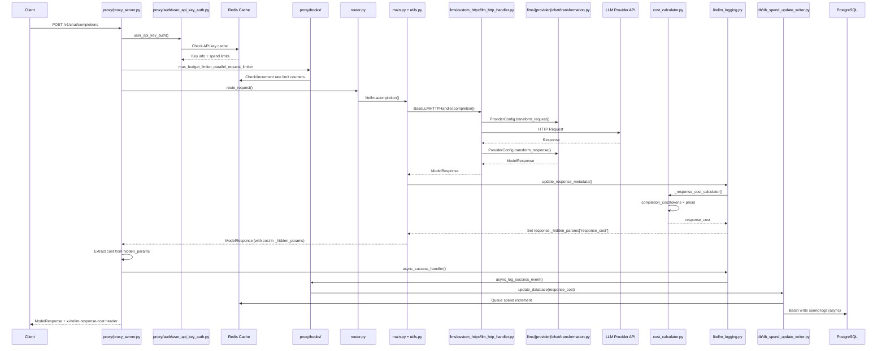
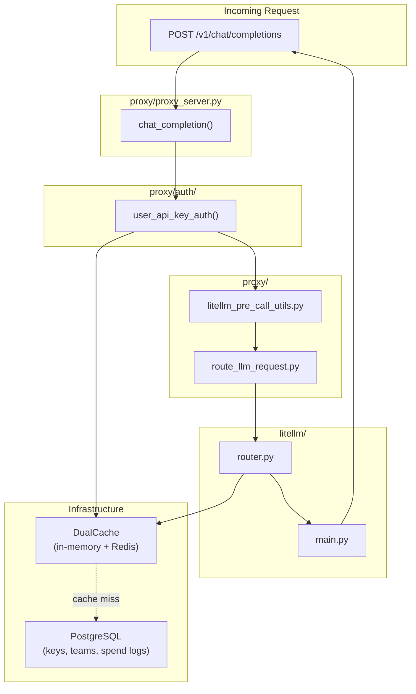
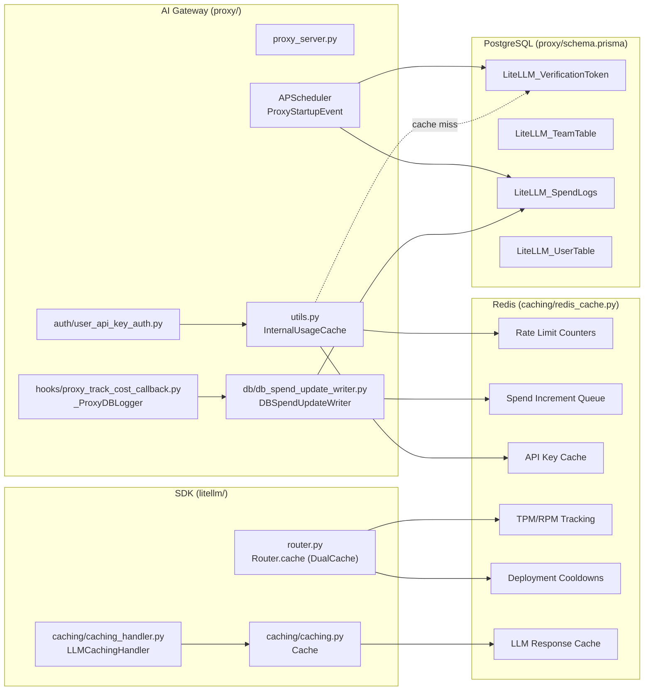
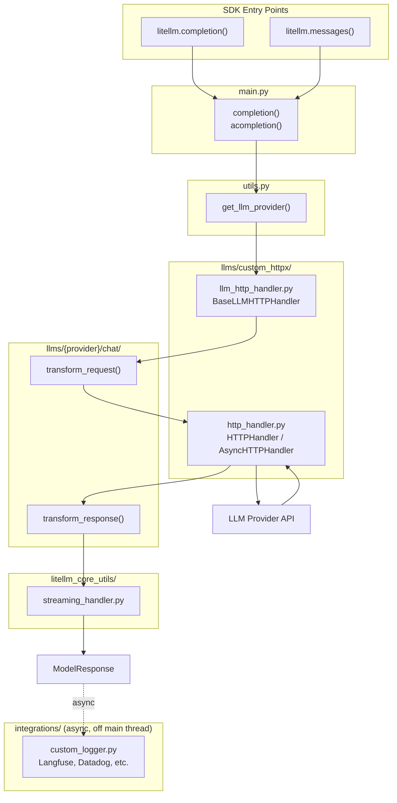

# LiteLLM Architecture - LiteLLM SDK + AI Gateway

This document helps contributors understand where to make changes in LiteLLM.

---

## How It Works

The LiteLLM AI Gateway (Proxy) uses the LiteLLM SDK internally for all LLM calls:

```
OpenAI SDK (client)    ──▶  LiteLLM AI Gateway (proxy/)  ──▶  LiteLLM SDK (litellm/)  ──▶  LLM API
Anthropic SDK (client) ──▶  LiteLLMAI Gateway (proxy/)  ──▶  LiteLLM SDK (litellm/)  ──▶  LLM API
Any HTTP client        ──▶  LiteLLMAI Gateway (proxy/)  ──▶  LiteLLM SDK (litellm/)  ──▶  LLM API
```

The **AI Gateway** adds authentication, rate limiting, budgets, and routing on top of the SDK.
The **SDK** handles the actual LLM provider calls, request/response transformations, and streaming.

---

## 1. AI Gateway (Proxy) Request Flow

The AI Gateway (`litellm/proxy/`) wraps the SDK with authentication, rate limiting, and management features.



### Proxy Components



**Key proxy files:**
- `proxy/proxy_server.py` - Main API endpoints
- `proxy/auth/` - Authentication (API keys, JWT, OAuth2)
- `proxy/hooks/` - Proxy-level callbacks
- `router.py` - Load balancing, fallbacks
- `router_strategy/` - Routing algorithms (`lowest_latency.py`, `simple_shuffle.py`, etc.)

**LLM-specific proxy endpoints:**

| Endpoint | Directory | Purpose |
|----------|-----------|---------|
| `/v1/messages` | `proxy/anthropic_endpoints/` | Anthropic Messages API |
| `/vertex-ai/*` | `proxy/vertex_ai_endpoints/` | Vertex AI passthrough |
| `/gemini/*` | `proxy/google_endpoints/` | Google AI Studio passthrough |
| `/v1/images/*` | `proxy/image_endpoints/` | Image generation |
| `/v1/batches` | `proxy/batches_endpoints/` | Batch processing |
| `/v1/files` | `proxy/openai_files_endpoints/` | File uploads |
| `/v1/fine_tuning` | `proxy/fine_tuning_endpoints/` | Fine-tuning jobs |
| `/v1/rerank` | `proxy/rerank_endpoints/` | Reranking |
| `/v1/responses` | `proxy/response_api_endpoints/` | OpenAI Responses API |
| `/v1/vector_stores` | `proxy/vector_store_endpoints/` | Vector stores |
| `/*` (passthrough) | `proxy/pass_through_endpoints/` | Direct provider passthrough |

**Proxy Hooks** (`proxy/hooks/__init__.py`):

| Hook | File | Purpose |
|------|------|---------|
| `max_budget_limiter` | `proxy/hooks/max_budget_limiter.py` | Enforce budget limits |
| `parallel_request_limiter` | `proxy/hooks/parallel_request_limiter_v3.py` | Rate limiting per key/user |
| `cache_control_check` | `proxy/hooks/cache_control_check.py` | Cache validation |
| `responses_id_security` | `proxy/hooks/responses_id_security.py` | Response ID validation |
| `litellm_skills` | `proxy/hooks/skills_injection.py` | Skills injection |

To add a new proxy hook, implement `CustomLogger` and register in `PROXY_HOOKS`.

### Infrastructure Components

The AI Gateway uses external infrastructure for persistence and caching:



| Component | Purpose | Key Files/Classes |
|-----------|---------|-------------------|
| **Redis** | Rate limiting, API key caching, TPM/RPM tracking, cooldowns, LLM response caching, spend queuing | `caching/redis_cache.py` (`RedisCache`), `caching/dual_cache.py` (`DualCache`) |
| **PostgreSQL** | API keys, teams, users, spend logs | `proxy/utils.py` (`PrismaClient`), `proxy/schema.prisma` |
| **InternalUsageCache** | Proxy-level cache for rate limits + API keys (in-memory + Redis) | `proxy/utils.py` (`InternalUsageCache`) |
| **Router.cache** | TPM/RPM tracking, deployment cooldowns, client caching (in-memory + Redis) | `router.py` (`Router.cache: DualCache`) |
| **LLMCachingHandler** | SDK-level LLM response/embedding caching | `caching/caching_handler.py` (`LLMCachingHandler`), `caching/caching.py` (`Cache`) |
| **DBSpendUpdateWriter** | Batches spend updates to reduce DB writes | `proxy/db/db_spend_update_writer.py` (`DBSpendUpdateWriter`) |
| **Cost Tracking** | Calculates and logs response costs | `proxy/hooks/proxy_track_cost_callback.py` (`_ProxyDBLogger`) |

**Background Jobs** (APScheduler, initialized in `proxy/proxy_server.py` → `ProxyStartupEvent.initialize_scheduled_background_jobs()`):

| Job | Interval | Purpose | Key Files |
|-----|----------|---------|-----------|
| `update_spend` | 60s | Batch write spend logs to PostgreSQL | `proxy/db/db_spend_update_writer.py` |
| `reset_budget` | 10-12min | Reset budgets for keys/users/teams | `proxy/management_helpers/budget_reset_job.py` |
| `add_deployment` | 10s | Sync new model deployments from DB | `proxy/proxy_server.py` (`ProxyConfig`) |
| `cleanup_old_spend_logs` | cron/interval | Delete old spend logs | `proxy/management_helpers/spend_log_cleanup.py` |
| `check_batch_cost` | 30min | Calculate costs for batch jobs | `proxy/management_helpers/check_batch_cost_job.py` |
| `check_responses_cost` | 30min | Calculate costs for responses API | `proxy/management_helpers/check_responses_cost_job.py` |
| `process_rotations` | 1hr | Auto-rotate API keys | `proxy/management_helpers/key_rotation_manager.py` |
| `_run_background_health_check` | continuous | Health check model deployments | `proxy/proxy_server.py` |
| `send_weekly_spend_report` | weekly | Slack spend alerts | `proxy/utils.py` (`SlackAlerting`) |
| `send_monthly_spend_report` | monthly | Slack spend alerts | `proxy/utils.py` (`SlackAlerting`) |

**Cost Attribution Flow:**
1. LLM response returns to `utils.py` wrapper after `litellm.acompletion()` completes
2. `update_response_metadata()` (`llm_response_utils/response_metadata.py`) is called
3. `logging_obj._response_cost_calculator()` (`litellm_logging.py`) calculates cost via `litellm.completion_cost()` (`cost_calculator.py`)
4. Cost is stored in `response._hidden_params["response_cost"]`
5. `proxy/common_request_processing.py` extracts cost from `hidden_params` and adds to response headers (`x-litellm-response-cost`)
6. `logging_obj.async_success_handler()` triggers callbacks including `_ProxyDBLogger.async_log_success_event()`
7. `DBSpendUpdateWriter.update_database()` queues spend increments to Redis
8. Background job `update_spend` flushes queued spend to PostgreSQL every 60s

---

## 2. SDK Request Flow

The SDK (`litellm/`) provides the core LLM calling functionality used by both direct SDK users and the AI Gateway.



**Key SDK files:**
- `main.py` - Entry points: `completion()`, `acompletion()`, `embedding()`
- `utils.py` - `get_llm_provider()` resolves model → provider
- `llms/custom_httpx/llm_http_handler.py` - Central HTTP orchestrator
- `llms/custom_httpx/http_handler.py` - Low-level HTTP client
- `llms/{provider}/chat/transformation.py` - Provider-specific transformations
- `litellm_core_utils/streaming_handler.py` - Streaming response handling
- `integrations/` - Async callbacks (Langfuse, Datadog, etc.)

---

## 3. Translation Layer

When a request comes in, it goes through a **translation layer** that converts between API formats.
Each translation is isolated in its own file, making it easy to test and modify independently.

### Where to find translations

| Incoming API | Provider | Translation File |
|--------------|----------|------------------|
| `/v1/chat/completions` | Anthropic | `llms/anthropic/chat/transformation.py` |
| `/v1/chat/completions` | Bedrock Converse | `llms/bedrock/chat/converse_transformation.py` |
| `/v1/chat/completions` | Bedrock Invoke | `llms/bedrock/chat/invoke_transformations/anthropic_claude3_transformation.py` |
| `/v1/chat/completions` | Gemini | `llms/gemini/chat/transformation.py` |
| `/v1/chat/completions` | Vertex AI | `llms/vertex_ai/gemini/transformation.py` |
| `/v1/chat/completions` | OpenAI | `llms/openai/chat/gpt_transformation.py` |
| `/v1/messages` (passthrough) | Anthropic | `llms/anthropic/experimental_pass_through/messages/transformation.py` |
| `/v1/messages` (passthrough) | Bedrock | `llms/bedrock/messages/invoke_transformations/anthropic_claude3_transformation.py` |
| `/v1/messages` (passthrough) | Vertex AI | `llms/vertex_ai/vertex_ai_partner_models/anthropic/experimental_pass_through/transformation.py` |
| Passthrough endpoints | All | `proxy/pass_through_endpoints/llm_provider_handlers/` |

### Example: Debugging prompt caching

If `/v1/messages` → Bedrock Converse prompt caching isn't working but Bedrock Invoke works:

1. **Bedrock Converse translation**: `llms/bedrock/chat/converse_transformation.py`
2. **Bedrock Invoke translation**: `llms/bedrock/chat/invoke_transformations/anthropic_claude3_transformation.py`
3. Compare how each handles `cache_control` in `transform_request()`

### How translations work

Each provider has a `Config` class that inherits from `BaseConfig` (`llms/base_llm/chat/transformation.py`):

```python
class ProviderConfig(BaseConfig):
    def transform_request(self, model, messages, optional_params, litellm_params, headers):
        # Convert OpenAI format → Provider format
        return {"messages": transformed_messages, ...}
    
    def transform_response(self, model, raw_response, model_response, logging_obj, ...):
        # Convert Provider format → OpenAI format
        return ModelResponse(choices=[...], usage=Usage(...))
```

The `BaseLLMHTTPHandler` (`llms/custom_httpx/llm_http_handler.py`) calls these methods - you never need to modify the handler itself.

---

## 4. Adding/Modifying Providers

### To add a new provider:

1. Create `llms/{provider}/chat/transformation.py`
2. Implement `Config` class with `transform_request()` and `transform_response()`
3. Add tests in `tests/llm_translation/test_{provider}.py`

### To add a feature (e.g., prompt caching):

1. Find the translation file from the table above
2. Modify `transform_request()` to handle the new parameter
3. Add unit tests that verify the transformation

### Testing checklist

When adding a feature, verify it works across all paths:

| Test | File Pattern |
|------|--------------|
| OpenAI passthrough | `tests/llm_translation/test_openai*.py` |
| Anthropic direct | `tests/llm_translation/test_anthropic*.py` |
| Bedrock Invoke | `tests/llm_translation/test_bedrock*.py` |
| Bedrock Converse | `tests/llm_translation/test_bedrock*converse*.py` |
| Vertex AI | `tests/llm_translation/test_vertex*.py` |
| Gemini | `tests/llm_translation/test_gemini*.py` |

### Unit testing translations

Translations are designed to be unit testable without making API calls:

```python
from litellm.llms.bedrock.chat.converse_transformation import BedrockConverseConfig

def test_prompt_caching_transform():
    config = BedrockConverseConfig()
    result = config.transform_request(
        model="anthropic.claude-3-opus",
        messages=[{"role": "user", "content": "test", "cache_control": {"type": "ephemeral"}}],
        optional_params={},
        litellm_params={},
        headers={}
    )
    assert "cachePoint" in str(result)  # Verify cache_control was translated
```
