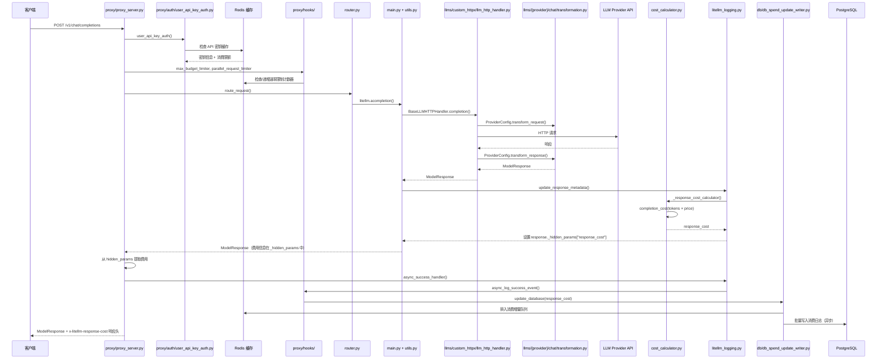
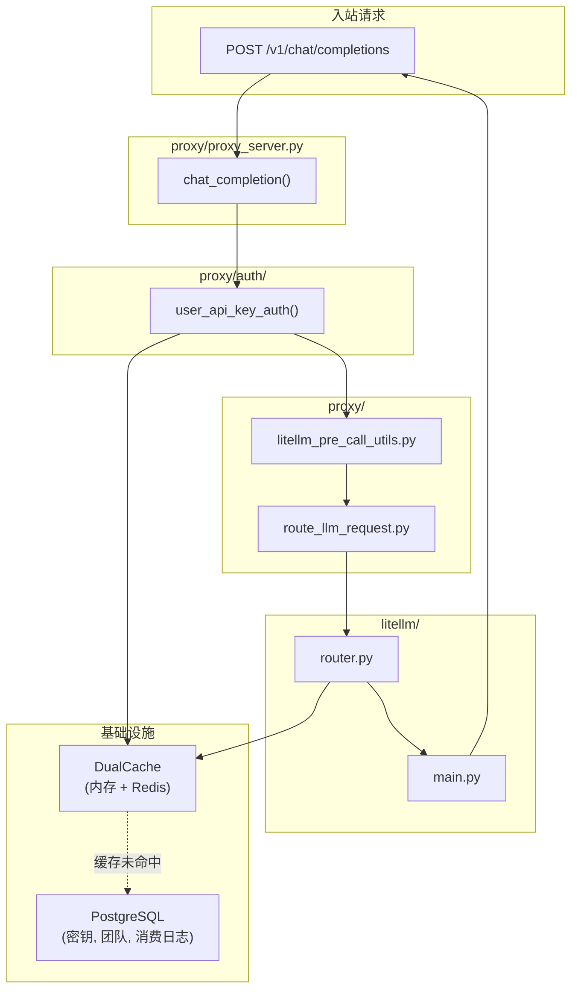
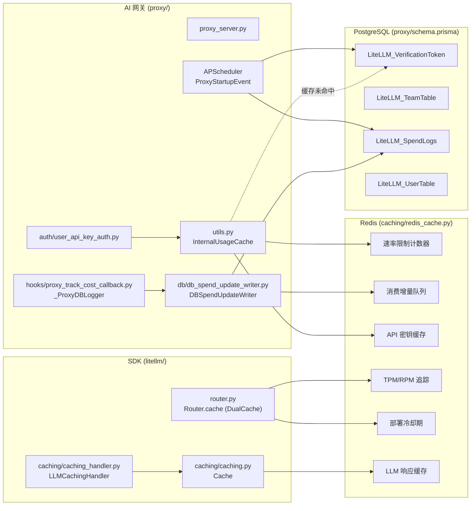
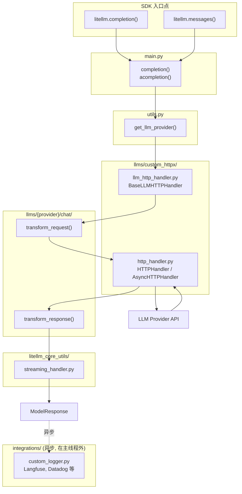

# LiteLLM 架构 - LiteLLM SDK + AI 网关

本文档帮助贡献者了解在 LiteLLM 中应该在哪里进行修改。

---

## 工作原理

LiteLLM AI 网关（代理）在内部对所有 LLM 调用使用 LiteLLM SDK：

```
OpenAI SDK（客户端）    ──▶  LiteLLM AI Gateway (proxy/)  ──▶  LiteLLM SDK (litellm/)  ──▶  LLM API
Anthropic SDK（客户端） ──▶  LiteLLM AI Gateway (proxy/)  ──▶  LiteLLM SDK (litellm/)  ──▶  LLM API
任意 HTTP 客户端        ──▶  LiteLLM AI Gateway (proxy/)  ──▶  LiteLLM SDK (litellm/)  ──▶  LLM API
```

**AI 网关** 在 SDK 之上增加了身份验证、限流、预算管理和路由功能。
**SDK** 负责实际的 LLM 提供商调用、请求/响应转换以及流式处理。

---

## 1. AI 网关（代理）请求流程

AI 网关（`litellm/proxy/`）在 SDK 外包装了身份验证、限流和管理功能。



### 代理组件



**核心代理文件：**
- `proxy/proxy_server.py` - 主 API 端点
- `proxy/auth/` - 身份验证（API 密钥、JWT、OAuth2）
- `proxy/hooks/` - 代理层回调钩子
- `router.py` - 负载均衡、故障转移
- `router_strategy/` - 路由算法（`lowest_latency.py`、`simple_shuffle.py` 等）

**LLM 专用代理端点：**

| 端点 | 目录 | 用途 |
|------|------|------|
| `/v1/messages` | `proxy/anthropic_endpoints/` | Anthropic Messages API |
| `/vertex-ai/*` | `proxy/vertex_ai_endpoints/` | Vertex AI 直通 |
| `/gemini/*` | `proxy/google_endpoints/` | Google AI Studio 直通 |
| `/v1/images/*` | `proxy/image_endpoints/` | 图像生成 |
| `/v1/batches` | `proxy/batches_endpoints/` | 批量处理 |
| `/v1/files` | `proxy/openai_files_endpoints/` | 文件上传 |
| `/v1/fine_tuning` | `proxy/fine_tuning_endpoints/` | 微调任务 |
| `/v1/rerank` | `proxy/rerank_endpoints/` | 重排序 |
| `/v1/responses` | `proxy/response_api_endpoints/` | OpenAI Responses API |
| `/v1/vector_stores` | `proxy/vector_store_endpoints/` | 向量存储 |
| `/*`（直通） | `proxy/pass_through_endpoints/` | 直接转发到提供商 |

**代理钩子**（`proxy/hooks/__init__.py`）：

| 钩子 | 文件 | 用途 |
|------|------|------|
| `max_budget_limiter` | `proxy/hooks/max_budget_limiter.py` | 强制预算限制 |
| `parallel_request_limiter` | `proxy/hooks/parallel_request_limiter_v3.py` | 按密钥/用户限流 |
| `cache_control_check` | `proxy/hooks/cache_control_check.py` | 缓存验证 |
| `responses_id_security` | `proxy/hooks/responses_id_security.py` | 响应 ID 验证 |
| `litellm_skills` | `proxy/hooks/skills_injection.py` | Skills 注入 |

要添加新的代理钩子，请实现 `CustomLogger` 并在 `PROXY_HOOKS` 中注册。

### 基础设施组件

AI 网关使用外部基础设施进行持久化和缓存：



| 组件 | 用途 | 关键文件/类 |
|------|------|------------|
| **Redis** | 限流、API 密钥缓存、TPM/RPM 追踪、冷却期管理、LLM 响应缓存、消费数据排队 | `caching/redis_cache.py`（`RedisCache`）、`caching/dual_cache.py`（`DualCache`）|
| **PostgreSQL** | API 密钥、团队、用户、消费日志 | `proxy/utils.py`（`PrismaClient`）、`proxy/schema.prisma` |
| **InternalUsageCache** | 代理层缓存，用于限流和 API 密钥（内存 + Redis） | `proxy/utils.py`（`InternalUsageCache`）|
| **Router.cache** | TPM/RPM 追踪、部署冷却期、客户端缓存（内存 + Redis） | `router.py`（`Router.cache: DualCache`）|
| **LLMCachingHandler** | SDK 层 LLM 响应/向量缓存 | `caching/caching_handler.py`（`LLMCachingHandler`）、`caching/caching.py`（`Cache`）|
| **DBSpendUpdateWriter** | 批量消费更新以减少数据库写入次数 | `proxy/db/db_spend_update_writer.py`（`DBSpendUpdateWriter`）|
| **Cost Tracking** | 计算并记录响应费用 | `proxy/hooks/proxy_track_cost_callback.py`（`_ProxyDBLogger`）|

**后台任务**（APScheduler，在 `proxy/proxy_server.py` → `ProxyStartupEvent.initialize_scheduled_background_jobs()` 中初始化）：

| 任务 | 间隔 | 用途 | 关键文件 |
|------|------|------|---------|
| `update_spend` | 60 秒 | 将消费日志批量写入 PostgreSQL | `proxy/db/db_spend_update_writer.py` |
| `reset_budget` | 10-12 分钟 | 重置密钥/用户/团队的预算 | `proxy/management_helpers/budget_reset_job.py` |
| `add_deployment` | 10 秒 | 从数据库同步新的模型部署 | `proxy/proxy_server.py`（`ProxyConfig`）|
| `cleanup_old_spend_logs` | cron/interval | 删除旧的消费日志 | `proxy/management_helpers/spend_log_cleanup.py` |
| `check_batch_cost` | 30 分钟 | 计算批量任务的费用 | `proxy/management_helpers/check_batch_cost_job.py` |
| `check_responses_cost` | 30 分钟 | 计算 Responses API 的费用 | `proxy/management_helpers/check_responses_cost_job.py` |
| `process_rotations` | 1 小时 | 自动轮换 API 密钥 | `proxy/management_helpers/key_rotation_manager.py` |
| `_run_background_health_check` | 持续 | 对模型部署进行健康检查 | `proxy/proxy_server.py` |
| `send_weekly_spend_report` | 每周 | Slack 消费告警 | `proxy/utils.py`（`SlackAlerting`）|
| `send_monthly_spend_report` | 每月 | Slack 消费告警 | `proxy/utils.py`（`SlackAlerting`）|

**费用归因流程：**
1. LLM 响应在 `litellm.acompletion()` 完成后返回到 `utils.py` 包装器
2. 调用 `update_response_metadata()`（`llm_response_utils/response_metadata.py`）
3. `logging_obj._response_cost_calculator()`（`litellm_logging.py`）通过 `litellm.completion_cost()`（`cost_calculator.py`）计算费用
4. 费用存储在 `response._hidden_params["response_cost"]` 中
5. `proxy/common_request_processing.py` 从 `hidden_params` 中提取费用并添加到响应头（`x-litellm-response-cost`）
6. `logging_obj.async_success_handler()` 触发回调，包括 `_ProxyDBLogger.async_log_success_event()`
7. `DBSpendUpdateWriter.update_database()` 将消费增量排入 Redis 队列
8. 后台任务 `update_spend` 每 60 秒将队列中的消费数据刷写到 PostgreSQL

---

## 2. SDK 请求流程

SDK（`litellm/`）提供核心 LLM 调用功能，SDK 直接用户和 AI 网关都使用它。



**核心 SDK 文件：**
- `main.py` - 入口点：`completion()`、`acompletion()`、`embedding()`
- `utils.py` - `get_llm_provider()` 解析 model → provider
- `llms/custom_httpx/llm_http_handler.py` - 核心 HTTP 调度器
- `llms/custom_httpx/http_handler.py` - 底层 HTTP 客户端
- `llms/{provider}/chat/transformation.py` - 提供商专属转换逻辑
- `litellm_core_utils/streaming_handler.py` - 流式响应处理
- `integrations/` - 异步回调（Langfuse、Datadog 等）

---

## 3. 转换层

请求进入后会经过一个**转换层**，在不同 API 格式之间进行转换。每种转换都隔离在独立的文件中，便于独立测试和修改。

### 转换文件位置

| 入站 API | 提供商 | 转换文件 |
|---------|--------|---------|
| `/v1/chat/completions` | Anthropic | `llms/anthropic/chat/transformation.py` |
| `/v1/chat/completions` | Bedrock Converse | `llms/bedrock/chat/converse_transformation.py` |
| `/v1/chat/completions` | Bedrock Invoke | `llms/bedrock/chat/invoke_transformations/anthropic_claude3_transformation.py` |
| `/v1/chat/completions` | Gemini | `llms/gemini/chat/transformation.py` |
| `/v1/chat/completions` | Vertex AI | `llms/vertex_ai/gemini/transformation.py` |
| `/v1/chat/completions` | OpenAI | `llms/openai/chat/gpt_transformation.py` |
| `/v1/messages`（直通） | Anthropic | `llms/anthropic/experimental_pass_through/messages/transformation.py` |
| `/v1/messages`（直通） | Bedrock | `llms/bedrock/messages/invoke_transformations/anthropic_claude3_transformation.py` |
| `/v1/messages`（直通） | Vertex AI | `llms/vertex_ai/vertex_ai_partner_models/anthropic/experimental_pass_through/transformation.py` |
| 直通端点 | 全部 | `proxy/pass_through_endpoints/llm_provider_handlers/` |

### 示例：调试 prompt caching

如果 `/v1/messages` → Bedrock Converse 的 prompt caching 不工作，但 Bedrock Invoke 正常：

1. **Bedrock Converse 转换**：`llms/bedrock/chat/converse_transformation.py`
2. **Bedrock Invoke 转换**：`llms/bedrock/chat/invoke_transformations/anthropic_claude3_transformation.py`
3. 比较两者在 `transform_request()` 中对 `cache_control` 的处理方式

### 转换层工作原理

每个提供商都有一个继承自 `BaseConfig`（`llms/base_llm/chat/transformation.py`）的 `Config` 类：

```python
class ProviderConfig(BaseConfig):
    def transform_request(self, model, messages, optional_params, litellm_params, headers):
        # 将 OpenAI 格式 → 提供商格式
        return {"messages": transformed_messages, ...}

    def transform_response(self, model, raw_response, model_response, logging_obj, ...):
        # 将提供商格式 → OpenAI 格式
        return ModelResponse(choices=[...], usage=Usage(...))
```

`BaseLLMHTTPHandler`（`llms/custom_httpx/llm_http_handler.py`）负责调用这些方法——你无需直接修改该处理器本身。

---

## 4. 添加/修改提供商

### 添加新提供商：

1. 创建 `llms/{provider}/chat/transformation.py`
2. 实现包含 `transform_request()` 和 `transform_response()` 的 `Config` 类
3. 在 `tests/llm_translation/test_{provider}.py` 中添加测试

### 添加新功能（例如 prompt caching）：

1. 从上表中找到对应的转换文件
2. 修改 `transform_request()` 以处理新参数
3. 添加验证转换逻辑的单元测试

### 测试清单

添加功能时，请验证所有路径均可正常工作：

| 测试 | 文件规律 |
|------|---------|
| OpenAI 直通 | `tests/llm_translation/test_openai*.py` |
| Anthropic 直接 | `tests/llm_translation/test_anthropic*.py` |
| Bedrock Invoke | `tests/llm_translation/test_bedrock*.py` |
| Bedrock Converse | `tests/llm_translation/test_bedrock*converse*.py` |
| Vertex AI | `tests/llm_translation/test_vertex*.py` |
| Gemini | `tests/llm_translation/test_gemini*.py` |

### 单元测试转换逻辑

转换逻辑设计为无需真实 API 调用即可进行单元测试：

```python
from litellm.llms.bedrock.chat.converse_transformation import BedrockConverseConfig

def test_prompt_caching_transform():
    config = BedrockConverseConfig()
    result = config.transform_request(
        model="anthropic.claude-3-opus",
        messages=[{"role": "user", "content": "test", "cache_control": {"type": "ephemeral"}}],
        optional_params={},
        litellm_params={},
        headers={}
    )
    assert "cachePoint" in str(result)  # 验证 cache_control 已被正确转换

