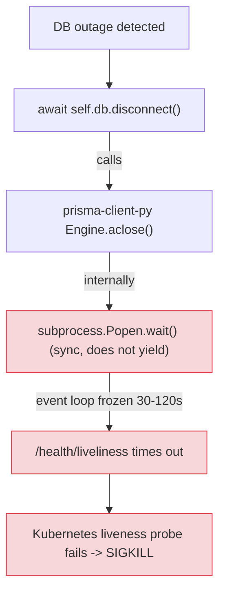

**Date:** April 2026
**Duration:** Multiple incidents across customer deployments before fix landed
**Severity:** High — surfaced as full proxy outages in Kubernetes
**Status:** Resolved

> **Note:** This fix is available starting from the release that contains [PR #26225](https://github.com/BerriAI/litellm/pull/26225) (merged April 29, 2026).

## Summary

When the upstream Postgres database became unreachable, the LiteLLM proxy's Prisma reconnect path called `await self.db.disconnect()`. Under prisma-client-py that call invokes a **synchronous** `subprocess.Popen.wait()` on the Rust query-engine subprocess. Because `wait()` does not yield, the asyncio event loop froze for as long as the engine took to shut down — typically 30–120 seconds in production when the engine was stuck on TCP close operations against the unresponsive database.

While the loop was frozen, **no coroutines ran**, including `/health/liveliness`. Kubernetes liveness probes timed out and the kubelet SIGKILLed the pod. From the operator's point of view the proxy looked dead even though the underlying issue was a *transient* DB outage that the reconnect logic was supposed to ride through.

**Impact:** Any customer whose Postgres briefly became unresponsive saw proxy pods get killed and restarted instead of degrading gracefully and reconnecting once the DB came back. Reported externally by FLock and reproduced internally.

{/* truncate */}

---

## Background

LiteLLM's proxy keeps a single long-lived Prisma client to talk to its Postgres metadata store (keys, teams, spend logs). When that connection drops it has to reconnect, otherwise every authenticated request fails. The reconnect path lives in `litellm/proxy/db/prisma_client.py`'s `recreate_prisma_client()` (and a now-removed "direct reconnect" branch in `litellm/proxy/utils.py`).

The intended flow was:

1. Health watchdog sees the DB queries failing.
2. Call `await self.db.disconnect()` to release the old engine process cleanly.
3. Construct a fresh `Prisma()` client.
4. `await new_client.connect()`.
5. Swap the proxy's `prisma_client.db` reference to the new client; resume serving.

The `/health/liveliness` route is intentionally cheap — it does not touch the database. The expectation was that even during a DB outage, liveliness would stay green and Kubernetes would leave the pod alone.



---

## Root cause

`prisma-client-py`'s engine cleanup is internally synchronous. The library's `Engine.aclose()` looks `async` from Python's perspective, but the implementation that finally shuts down the Rust query-engine subprocess calls:

```python
self.process.send_signal(signal.SIGTERM)
self.process.wait()   # <-- BLOCKING. Does not yield to the loop.
```

When the database is healthy the engine exits within milliseconds and the blocking call is invisible. When the database is *unhealthy*, the engine's own outbound TCP `close()` calls hang waiting for FIN/ACK from the unresponsive Postgres host, and `wait()` blocks the whole event loop for the duration.

The reconnect path was wrapped in `asyncio.wait_for()` as a "safety timeout", but **`wait_for` can only cancel at `await` points**. There is no `await` inside `subprocess.wait()`, so the timeout could not fire. The loop simply did not run any coroutines — including the cancellation coroutine — until `wait()` returned on its own.

As a result every Prisma reconnect during a DB outage froze the entire proxy, and Kubernetes consistently mistook the freeze for a liveness failure.

---

## The Fix

[PR #26225](https://github.com/BerriAI/litellm/pull/26225) replaces `disconnect()` in both reconnect paths with a direct, non-blocking kill of the engine subprocess. The new flow is:

1. Look up the engine PID via `_get_engine_pid()` (hardened to only return real integers, so unit-test mocks do not crash callers).
2. Send `SIGTERM` to the subprocess directly.
3. `await asyncio.sleep(0.5)` — this is a real `await`, so the loop keeps running and `/health/liveliness` continues to respond.
4. If the process is still alive, send `SIGKILL`.
5. Construct a fresh `Prisma()` client and `await new_client.connect()`.
6. Swap the proxy's reference to the new client.

Both reconnect call sites — `recreate_prisma_client` and the formerly-separate "direct reconnect" branch in `litellm/proxy/utils.py` — now go through `recreate_prisma_client`. The two engine-alive and engine-dead paths converge on the same kill-then-recreate flow, which removes a class of "what if the engine died between checks" bugs.

The relevant change (simplified):

```diff
- # Old: blocks event loop for as long as the engine takes to shut down
- await self.db.disconnect()
+ # New: signal the engine subprocess directly, yield via real await,
+ # then SIGKILL if it has not exited.
+ pid = self._get_engine_pid()
+ if pid is not None:
+     try:
+         os.kill(pid, signal.SIGTERM)
+     except ProcessLookupError:
+         pass
+ await asyncio.sleep(0.5)
+ if pid is not None:
+     try:
+         os.kill(pid, signal.SIGKILL)
+     except ProcessLookupError:
+         pass
```

The new `Prisma()` client and its `connect()` are kept as before — the only thing that changed is how the *old* engine is torn down.

### Verification

Reproduced end-to-end against a local proxy + Postgres in Docker, using `docker pause` on the Postgres container to simulate an unresponsive database:

| Condition                                         | max `/health/liveliness` latency | 2xx |
|---------------------------------------------------|----------------------------------|-----|
| Pre-fix, prod-like slow close (5s injected)       | **10006 ms** (probe timeout)     | 99.7% |
| With this fix, same slow close injected           | **52.7 ms**                      | 100% |
| With this fix, natural run (no injection)         | 78.8 ms                          | 100% |

After the simulated DB outage ends, `/health/readiness` returns `db: "connected"` and live row reads from `/key/list` succeed — reconnect works end-to-end.

40 unit tests across `tests/test_litellm/proxy/db/test_prisma_self_heal.py` and `tests/litellm/proxy/test_prisma_engine_watchdog.py` were updated to reflect the new code path. One previously-passing test, `test_lightweight_reconnect_skips_kill_on_successful_disconnect`, encoded the old "preserve the engine on successful disconnect" invariant that was itself part of the bug (prisma-client-py's `aclose()` kills the engine regardless) and was removed.

---

## Lessons learned

1. **Don't trust `async def` for shutdown paths in third-party libraries.** An async signature only commits the library to a coroutine-shaped API; it does not commit to actually yielding. When the cost of *not* yielding is "the pod gets killed", verify behavior under partial failure (network partition, paused DB) — not just under "DB is healthy" or "DB is hard-down".
2. **`asyncio.wait_for()` is not a safety net for sync work.** It can only cancel at `await` points, so wrapping a blocking call in `wait_for` does not give you a timeout — it just hides the bug until something else (Kubernetes, a load balancer, a customer) does notice.
3. **Health checks belong on the same event loop as the work they describe.** `/health/liveliness` was intentionally minimal so that it would survive a DB outage, but it shares the asyncio loop with every other request, so any synchronous blocking call elsewhere in the loop drags it down regardless of how cheap the route itself is.
4. **Prefer process-level signals to library-level cleanup for unrecoverable subprocesses.** When the engine has wedged on socket close, there is no graceful path that does not involve waiting on it. `SIGTERM` + bounded `asyncio.sleep` + `SIGKILL` gives a deterministic, async-friendly shutdown.

---

## Operator guidance

If you saw any of the following symptoms on LiteLLM versions before this fix, the bug above is the most likely cause:

- Kubernetes pods restarting repeatedly during transient Postgres incidents (RDS failovers, network partitions, brief CPU starvation on the DB).
- `/health/liveliness` returning 200 most of the time but timing out for tens of seconds during DB issues.
- Pods recovering on their own (re-roll, re-mount) instead of via in-proxy reconnect, and `litellm` logs showing nothing between "reconnect started" and the next pod startup.

To remediate:

1. Upgrade to a LiteLLM release that contains [PR #26225](https://github.com/BerriAI/litellm/pull/26225).
2. Verify the fix is active: `recreate_prisma_client` should not call `self.db.disconnect()` — it should signal the engine subprocess directly.
3. If you cannot upgrade immediately, increasing your liveness probe timeout to a value greater than your worst-case `engine.wait()` duration (e.g. 180s) will reduce pod kills but will leave the underlying event-loop freeze in place. This is a stopgap, not a fix.

---

## References

- [LIT-2613 — FLock Prisma Connection Issue Fix](https://linear.app/litellm-ai/issue/LIT-2613/flock-prisma-connection-issue-fix)
- [LIT-2614 — Prisma Connection Issue RCA](https://linear.app/litellm-ai/issue/LIT-2614/prisma-connection-issue-rca) (this writeup)
- [PR #26225 — Proxy: reconnect Prisma DB without blocking the event loop](https://github.com/BerriAI/litellm/pull/26225)
- Code: `litellm/proxy/db/prisma_client.py` (`recreate_prisma_client`, `_kill_engine_process`)
