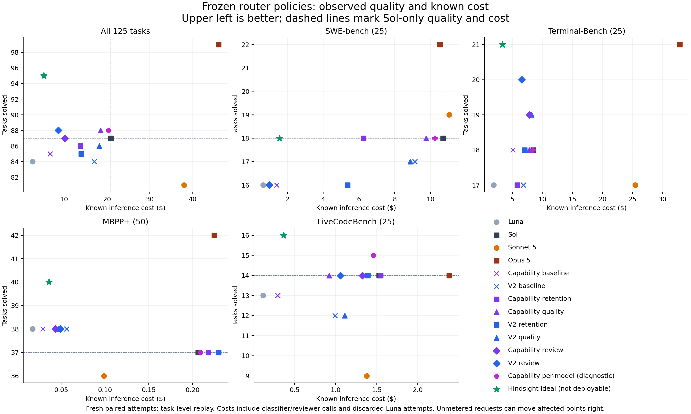

# Selective routing trained on clean paired attempts

These optional profiles learn when GPT-5.6 Sol adds a successful solve over GPT-5.6 Luna. They use one existing classifier response and a deterministic local prediction, with no second classifier call. They replace the earlier ROI cookbook, whose benchmark results were invalidated and are not the source of these fits

Training uses 160 fresh paired tasks and selection uses 64 separate validation tasks across SWE-bench, Terminal-Bench, MBPP+ and LiveCodeBench. The fitted policies were frozen before the 125-task held-out evaluation. The complete 125-task Luna/Sol comparison is available in PRIMARY_FINDINGS.md and PRIMARY_REPORT.md. The additional Sonnet/Opus controls are complete in REPORT.md

`strong-success-retention` minimizes validation cost while preserving every Sol-only success and meeting Sol quality within each benchmark. `quality-first-under-sol-budget` maximizes validation solves under Sol's total inference cost and permits task swaps. These names describe validation objectives, not guarantees on new requests

The selected upfront profiles use the original qualitative cards. The empirical card variation and all validation selections remain available in the accompanying records. Post-attempt review cascades are evaluated separately because they require a completed Luna attempt, verification and potentially a fresh Sol attempt

Set `ROI_GATEWAY_BASE_URL`, `ROI_GATEWAY_API_KEY` and `ROI_LOCAL_MASTER_KEY`, then start this branch with `litellm --config cookbook/auto_router_selective_training/proxy.yaml`. Use the model alias `selective-v3-strong-success-retention` or `selective-v3-quality-first-under-sol-budget`

The example config describes the SWE-bench agent harness. Match its execution conditions, solver endpoints, efforts and judge prompt to your benchmark. Route once on the opening task and pin the selected model for a comparable whole-task run. Independent per-turn routing or continuing Sol from a Luna patch requires a separate evaluation

`selective_policy` replaces the existing threshold decision and cannot be combined with the older probability calibration. Its `target` identifies the score: `scalar_calibration` and `per_model` estimate a success-probability difference, `paired` estimates Sol-only probability minus Luna-only probability, `rescue` estimates Sol-only probability, and `benefit_per_dollar` divides the paired difference by predicted incremental inference cost. Threshold units depend on this target. Raw classifier probabilities remain available in diagnostics

Defaults are unchanged when `selective_policy` is omitted. The local implementation validates coefficient dimensions and rejects another classifier's feature schema. Runtime parity checks compare scores and routing choices with the training implementation

The twelve prespecified upfront family controls are also available in `diagnostic_profiles.json` and `diagnostic_proxy.yaml`. Start the latter config to benchmark aliases such as `selective-v3-diagnostic-original-upfront-per-model`. These controls were frozen before final inference and are included for reproduction and fresh benchmarking. A family with no eligible validation candidate uses a direct Sol deployment that bypasses the classifier. Review cascades still require a separate agent workflow
## Held-out results

These profiles were selected before these results. They are not refitted or selected again on the held-out tasks

| Policy | Solved | Inference cost | Savings vs Sol | Gained / lost vs Sol |
|---|---:|---:|---:|---:|
| Luna only | 84/125 | ≥$2.6531 | ≤87.3% | +8 / -11 |
| Sol only | 87/125 | $20.8964 | 0.0% | +0 / -0 |
| Capability baseline | 85/125 | $6.7642 | 67.6% | +8 / -10 |
| Capability upfront, retention objective | 86/125 | $13.8156 | 33.9% | +1 / -2 |
| Capability upfront, quality objective | 88/125 | $18.5237 | 11.4% | +5 / -4 |
| Per-model control (exploratory) | 88/125 | $20.3797 | 2.5% | +1 / -0 |

Costs use recorded gateway bills. A ≥ cost and ≤ savings mark unmetered transport requests: cost is a lower bound and savings versus fully metered Sol is an upper bound. The JSON counts these requests per policy and task. They are not assumed free.

Costs include the classifier. These are task-pinned replays of fresh independent attempts, with one attempt per model per task. No guarantee of quality retention follows from a 125-task sample. The aggregate combines different benchmarks; inspect each benchmark before using a profile

The per-model control is an exploratory comparison among forty prespecified variants. None of the main selected profiles combines preservation of all Sol successes and lower cost across all 125 tasks. See PRIMARY_FINDINGS.md for the interpretation

