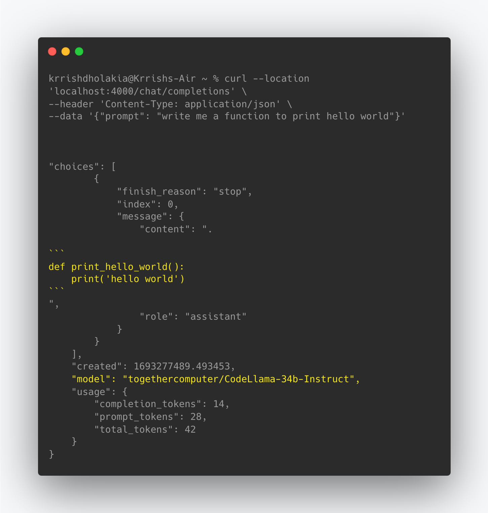
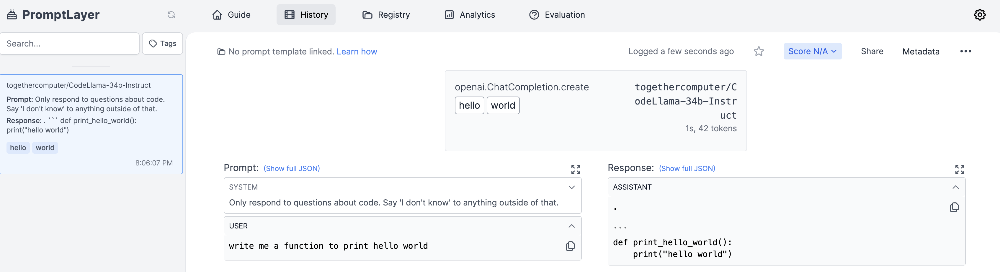

# CodeLlama Server: Streaming, Caching, Model Fallbacks (OpenAI + Anthropic), Prompt-tracking

Works with: Anthropic, Huggingface, Cohere, TogetherAI, Azure, OpenAI, etc.

[](https://pypi.org/project/litellm/)
[](https://pypi.org/project/litellm/0.1.1/)


[](https://railway.app/template/HuDPw-?referralCode=jch2ME)

**LIVE DEMO** - https://litellm.ai/playground

## What does CodeLlama Server do

- Uses Together AI's CodeLlama to answer coding questions, with GPT-4 + Claude-2 as backups (you can easily switch this to any model from Huggingface, Replicate, Cohere, AI21, Azure, OpenAI, etc.) 
- Sets default system prompt for guardrails `system_prompt = "Only respond to questions about code. Say 'I don't know' to anything outside of that."`
- Integrates with Promptlayer for model + prompt tracking 
- Example output



- **Consistent Input/Output** Format
  - Call all models using the OpenAI format - `completion(model, messages)`
  - Text responses will always be available at `['choices'][0]['message']['content']`
  - Stream responses will always be available at `['choices'][0]['delta']['content']`
- **Error Handling** Using Model Fallbacks (if `CodeLlama` fails, try `GPT-4`) with cooldowns, and retries
- **Prompt Logging** - Log successful completions to promptlayer for testing + iterating on your prompts in production! (Learn more: https://litellm.readthedocs.io/en/latest/advanced/

  **Example: Logs sent to PromptLayer**

    


- **Token Usage & Spend** - Track Input + Completion tokens used + Spend/model - https://docs.litellm.ai/docs/token_usage
- **Caching** - Provides in-memory cache + GPT-Cache integration for more advanced usage - https://docs.litellm.ai/docs/caching/gpt_cache

- **Streaming & Async Support** - Return generators to stream text responses - TEST IT 👉 https://litellm.ai/

## API Endpoints

### `/chat/completions` (POST)

This endpoint is used to generate chat completions for 50+ support LLM API Models. Use llama2, GPT-4, Claude2 etc

#### Input

This API endpoint accepts all inputs in raw JSON and expects the following inputs

- `prompt` (string, required): The user's coding related question
- Additional Optional parameters: `temperature`, `functions`, `function_call`, `top_p`, `n`, `stream`. See the full list of supported inputs here: https://litellm.readthedocs.io/en/latest/input/

#### Example JSON body

For claude-2

```json
{
  "prompt": "write me a function to print hello world"
}
```

### Making an API request to the Code-Gen Server

```python
import requests
import json

url = "localhost:4000/chat/completions"

payload = json.dumps({
  "prompt": "write me a function to print hello world"
})
headers = {
  'Content-Type': 'application/json'
}

response = requests.request("POST", url, headers=headers, data=payload)

print(response.text)

```

### Output [Response Format]

Responses from the server are given in the following format.
All responses from the server are returned in the following format (for all LLM models). More info on output here: https://litellm.readthedocs.io/en/latest/output/

```json
{
    "choices": [
        {
            "finish_reason": "stop",
            "index": 0,
            "message": {
                "content": ".\n\n```\ndef print_hello_world():\n    print(\"hello world\")\n",
                "role": "assistant"
            }
        }
    ],
    "created": 1693279694.6474009,
    "model": "togethercomputer/CodeLlama-34b-Instruct",
    "usage": {
        "completion_tokens": 14,
        "prompt_tokens": 28,
        "total_tokens": 42
    }
}
```

## Installation & Usage

### Running Locally

1. Clone liteLLM repository to your local machine:
   ```
   git clone https://github.com/BerriAI/litellm-CodeLlama-server
   ```
2. Install the required dependencies using pip
   ```
   pip install requirements.txt
   ```
3. Set your LLM API keys
   ```
   os.environ['OPENAI_API_KEY]` = "YOUR_API_KEY"
   or
   set OPENAI_API_KEY in your .env file
   ```
4. Run the server:
   ```
   python main.py
   ```

## Deploying

1. Quick Start: Deploy on Railway

   [](https://railway.app/template/HuDPw-?referralCode=jch2ME)

2. `GCP`, `AWS`, `Azure`
   This project includes a `Dockerfile` allowing you to build and deploy a Docker Project on your providers

# Support / Talk with founders

- [Our calendar 👋](https://calendly.com/d/4mp-gd3-k5k/berriai-1-1-onboarding-litellm-hosted-version)
- [Community Discord 💭](https://discord.gg/wuPM9dRgDw)
- Our numbers 📞 +1 (770) 8783-106 / +1 (412) 618-6238
- Our emails ✉️ ishaan@berri.ai / krrish@berri.ai

## Roadmap

- [ ] Implement user-based rate-limiting
- [ ] Spending controls per project - expose key creation endpoint
- [ ] Need to store a keys db -> mapping created keys to their alias (i.e. project name)
- [ ] Easily add new models as backups / as the entry-point (add this to the available model list)
