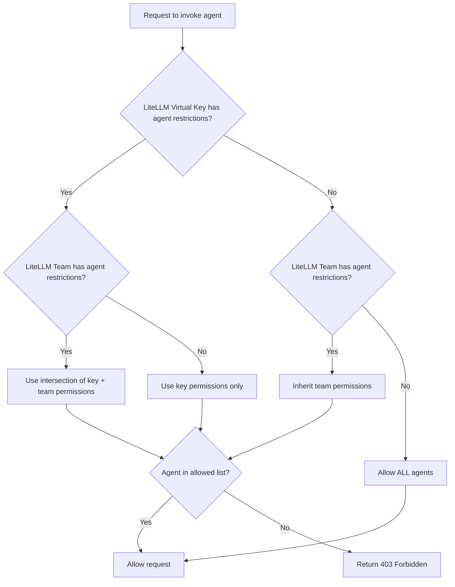

import Tabs from '@theme/Tabs';
import TabItem from '@theme/TabItem';
import Image from '@theme/IdealImage';

# Agent Permission Management

Control which A2A agents can be accessed by specific keys or teams in LiteLLM.

## Overview

Agent Permission Management lets you restrict which agents a LiteLLM Virtual Key or Team can access. This is useful for:

- **Multi-tenant environments**: Give different teams access to different agents
- **Security**: Prevent keys from invoking agents they shouldn't have access to
- **Compliance**: Enforce access policies for sensitive agent workflows

When permissions are configured:
- `GET /v1/agents` only returns agents the key/team can access
- `POST /a2a/{agent_id}` (Invoking an agent) returns `403 Forbidden` if access is denied

## Setting Permissions on a Key

This example shows how to create a key with agent permissions and test access.

### 1. Get Your Agent ID

<Tabs>
<TabItem value="ui" label="UI">

1. Go to **Agents** in the sidebar
2. Click into the agent you want
3. Copy the **Agent ID**

<Image 
  img={require('../img/agent_id.png')}
  style={{width: '80%', display: 'block', margin: '0', borderRadius: '8px'}}
/>

</TabItem>
<TabItem value="api" label="API">

```bash title="List all agents" showLineNumbers
curl "http://localhost:4000/v1/agents" \
  -H "Authorization: Bearer sk-master-key"
```

Response:
```json title="Response" showLineNumbers
{
  "agents": [
    {"agent_id": "agent-123", "name": "Support Agent"},
    {"agent_id": "agent-456", "name": "Sales Agent"}
  ]
}
```

</TabItem>
</Tabs>

### 2. Create a Key with Agent Permissions

<Tabs>
<TabItem value="ui" label="UI">

1. Go to **Keys** → **Create Key**
2. Expand **Agent Settings**
3. Select the agents you want to allow

<Image 
  img={require('../img/agent_key.png')}
  style={{width: '80%', display: 'block', margin: '0', borderRadius: '8px'}}
/>

</TabItem>
<TabItem value="api" label="API">

```bash title="Create key with agent permissions" showLineNumbers
curl -X POST "http://localhost:4000/key/generate" \
  -H "Authorization: Bearer sk-master-key" \
  -H "Content-Type: application/json" \
  -d '{
    "object_permission": {
      "agents": ["agent-123"]
    }
  }'
```

</TabItem>
</Tabs>

### 3. Test Access

**Allowed agent (succeeds):**
```bash title="Invoke allowed agent" showLineNumbers
curl -X POST "http://localhost:4000/a2a/agent-123" \
  -H "Authorization: Bearer sk-your-new-key" \
  -H "Content-Type: application/json" \
  -d '{"message": {"role": "user", "parts": [{"type": "text", "text": "Hello"}]}}'
```

**Blocked agent (fails with 403):**
```bash title="Invoke blocked agent" showLineNumbers
curl -X POST "http://localhost:4000/a2a/agent-456" \
  -H "Authorization: Bearer sk-your-new-key" \
  -H "Content-Type: application/json" \
  -d '{"message": {"role": "user", "parts": [{"type": "text", "text": "Hello"}]}}'
```

Response:
```json title="403 Forbidden Response" showLineNumbers
{
  "error": {
    "message": "Access denied to agent: agent-456",
    "code": 403
  }
}
```

## Setting Permissions on a Team

Restrict all keys belonging to a team to only access specific agents.

### 1. Create a Team with Agent Permissions

<Tabs>
<TabItem value="ui" label="UI">

1. Go to **Teams** → **Create Team**
2. Expand **Agent Settings**
3. Select the agents you want to allow for this team

<Image 
  img={require('../img/agent_key.png')}
  style={{width: '80%', display: 'block', margin: '0', borderRadius: '8px'}}
/>

</TabItem>
<TabItem value="api" label="API">

```bash title="Create team with agent permissions" showLineNumbers
curl -X POST "http://localhost:4000/team/new" \
  -H "Authorization: Bearer sk-master-key" \
  -H "Content-Type: application/json" \
  -d '{
    "team_alias": "support-team",
    "object_permission": {
      "agents": ["agent-123"]
    }
  }'
```

Response:
```json title="Response" showLineNumbers
{
  "team_id": "team-abc-123",
  "team_alias": "support-team"
}
```

</TabItem>
</Tabs>

### 2. Create a Key for the Team

<Tabs>
<TabItem value="ui" label="UI">

1. Go to **Keys** → **Create Key**
2. Select the **Team** from the dropdown

<Image 
  img={require('../img/agent_team.png')}
  style={{width: '80%', display: 'block', margin: '0', borderRadius: '8px'}}
/>

</TabItem>
<TabItem value="api" label="API">

```bash title="Create key for team" showLineNumbers
curl -X POST "http://localhost:4000/key/generate" \
  -H "Authorization: Bearer sk-master-key" \
  -H "Content-Type: application/json" \
  -d '{
    "team_id": "team-abc-123"
  }'
```

</TabItem>
</Tabs>

### 3. Test Access

The key inherits agent permissions from the team.

**Allowed agent (succeeds):**
```bash title="Invoke allowed agent" showLineNumbers
curl -X POST "http://localhost:4000/a2a/agent-123" \
  -H "Authorization: Bearer sk-team-key" \
  -H "Content-Type: application/json" \
  -d '{"message": {"role": "user", "parts": [{"type": "text", "text": "Hello"}]}}'
```

**Blocked agent (fails with 403):**
```bash title="Invoke blocked agent" showLineNumbers
curl -X POST "http://localhost:4000/a2a/agent-456" \
  -H "Authorization: Bearer sk-team-key" \
  -H "Content-Type: application/json" \
  -d '{"message": {"role": "user", "parts": [{"type": "text", "text": "Hello"}]}}'
```

## Agent Access Groups

Granting individual agents to every key or team gets unwieldy as the agent catalog grows. **Agent access groups** let you tag agents with logical labels in the dashboard, then grant the **group** to a key or team — adding a new agent to the group automatically makes it available to every key/team that holds the group.

### 1. Tag the agent with one or more groups

In the LiteLLM dashboard:

1. Go to **Agents**.
2. Create or edit an agent.
3. Under **Access Groups**, type a group name (e.g. `clinical-tools`) and press Enter.

:::note
Tagging an agent with access groups is currently a dashboard-only operation. The `POST /v1/agents` body schema does not expose `agent_access_groups` as a top-level field; the group tags persist via the underlying DB column and are consumed during permission resolution.
:::

### 2. Grant a key or team the group

```bash title="Key with access to two agent groups" showLineNumbers
curl -X POST "http://localhost:4000/key/generate" \
  -H "Authorization: Bearer sk-master-key" \
  -H "Content-Type: application/json" \
  -d '{
    "object_permission": {
      "agent_access_groups": ["clinical-tools", "research-tools"]
    }
  }'
```

The key now has access to every agent tagged with either group — no per-agent enumeration required. The same `agent_access_groups` field is also valid on a team's `object_permission`.

When a key has **both** a direct `agents` list and `agent_access_groups`, the union is computed (any agent reached by either path is allowed), and then the team-level intersection is applied as described below.

## How It Works



A2A permission resolution operates over two levels: Key and Team. (MCP's [permission hierarchy](./mcp_control#permission-hierarchy) extends to End-user / Agent / Org additionally — agent permissions are a narrower model today.)

| Key Permissions | Team Permissions | Result | Notes |
|-----------------|------------------|--------|-------|
| None | None | Key can access **all** agents | Open access by default when no restrictions are set |
| `["agent-1", "agent-2"]` | None | Key can access `agent-1` and `agent-2` | Key uses its own permissions |
| None | `["agent-1", "agent-3"]` | Key can access `agent-1` and `agent-3` | Key inherits team's permissions |
| `["agent-1", "agent-2"]` | `["agent-1", "agent-3"]` | Key can access `agent-1` only | Intersection of both lists (most restrictive wins) |
| `agent_access_groups: ["clinical"]` | None | Key can access every agent tagged `clinical` | Access groups resolved to concrete agent IDs |
| `agent_access_groups: ["clinical"]` | `agents: ["agent-1"]` | Intersection of (every agent tagged `clinical`) and `["agent-1"]` | Mixing direct and group grants is supported |

## Viewing Permissions

<Tabs>
<TabItem value="ui" label="UI">

1. Go to **Keys** or **Teams**
2. Click into the key/team you want to view
3. Agent permissions are displayed in the info view

</TabItem>
<TabItem value="api" label="API">

```bash title="Get key info" showLineNumbers
curl "http://localhost:4000/key/info?key=sk-your-key" \
  -H "Authorization: Bearer sk-master-key"
```

</TabItem>
</Tabs>
