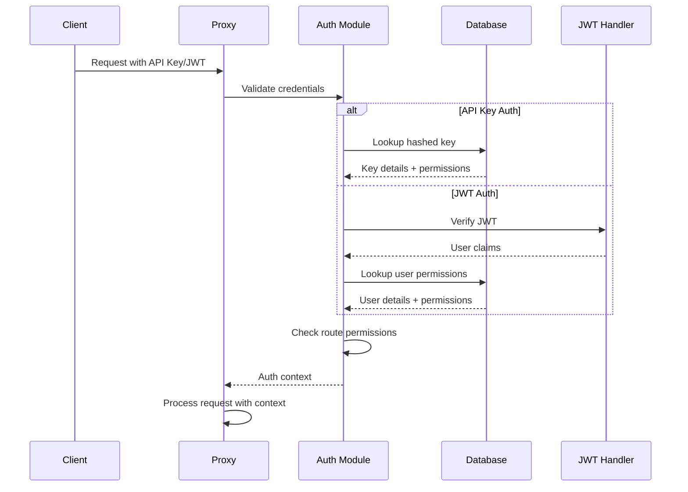

# Backend Architecture

## Service Architecture

### Controller/Route Organization
```text
litellm/proxy/
├── proxy_server.py              # Main FastAPI app
├── management_endpoints/        # Admin endpoints
│   ├── key_management.py       # API key CRUD
│   ├── team_management.py      # Team CRUD
│   ├── user_management.py      # User CRUD
│   └── model_management.py     # Model config
├── pass_through_endpoints/     # Provider pass-through
│   ├── langfuse_passthrough.py
│   └── success_handler.py
└── auth/                        # Authentication
    ├── auth_checks.py
    ├── jwt_handler.py
    └── user_api_key_auth.py
```

### Controller Template
```python
from fastapi import APIRouter, Depends, HTTPException
from typing import Optional
from litellm.proxy.auth import user_api_key_auth

router = APIRouter(prefix="/key", tags=["key-management"])

@router.post("/generate")
async def generate_key(
    data: GenerateKeyRequest,
    user_api_key_dict: dict = Depends(user_api_key_auth)
):
    """Generate a new API key"""
    try:
        # Check permissions
        if not _is_admin(user_api_key_dict):
            raise HTTPException(status_code=403, detail="Admin access required")
        
        # Generate key
        key = await prisma_client.create_key(
            key_alias=data.key_alias,
            team_id=data.team_id,
            models=data.models,
            max_budget=data.max_budget
        )
        
        return {"key": key.token, "key_id": key.key_id}
    except Exception as e:
        raise HTTPException(status_code=500, detail=str(e))
```

## Database Architecture

### Schema Design
```sql
-- See Database Schema section above for complete DDL
-- Additional indexes for performance
CREATE INDEX idx_spend_logs_date_model ON "LiteLLM_SpendLogs" (created_at, model);
CREATE INDEX idx_verification_token_team ON "LiteLLM_VerificationToken" (team_id);
CREATE INDEX idx_user_table_org ON "LiteLLM_UserTable" (organization_id);
```

### Data Access Layer
```python
class PrismaClient:
    """Database access layer using Prisma ORM"""
    
    async def create_key(
        self,
        key_alias: str,
        team_id: Optional[str] = None,
        models: Optional[List[str]] = None,
        max_budget: Optional[float] = None
    ) -> VerificationToken:
        """Create a new API key"""
        token = generate_token()
        hashed_token = hash_token(token)
        
        key = await self.db.litellm_verificationtoken.create({
            "data": {
                "token": hashed_token,
                "key_alias": key_alias,
                "team_id": team_id,
                "models": models or [],
                "max_budget": max_budget,
                "created_at": datetime.utcnow()
            }
        })
        
        return key
    
    async def get_key_spend(self, token: str) -> float:
        """Get current spend for a key"""
        result = await self.db.litellm_spendlogs.aggregate(
            where={"api_key": token},
            _sum={"spend": True}
        )
        return result._sum.spend or 0.0
```

## Authentication and Authorization

### Auth Flow


### Middleware/Guards
```python
async def user_api_key_auth(
    request: Request,
    api_key: str = Depends(get_api_key)
) -> dict:
    """Authentication middleware for API endpoints"""
    
    # Check cache first
    cached_key = await redis_client.get(f"key:{api_key}")
    if cached_key:
        return json.loads(cached_key)
    
    # Database lookup
    hashed_key = hash_token(api_key)
    key_data = await prisma_client.get_key(hashed_key)
    
    if not key_data:
        raise HTTPException(status_code=401, detail="Invalid API key")
    
    # Check expiration
    if key_data.expires and key_data.expires < datetime.utcnow():
        raise HTTPException(status_code=401, detail="API key expired")
    
    # Cache for performance
    await redis_client.setex(
        f"key:{api_key}",
        300,  # 5 minute TTL
        json.dumps(key_data.dict())
    )
    
    return key_data
```
