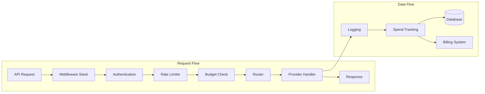

# Components

## LiteLLM Core Library
**Responsibility:** Core completion functions, provider abstraction, and model management

**Key Interfaces:**
- `completion()` - Synchronous completion API
- `acompletion()` - Asynchronous completion API
- `embedding()` - Text embedding generation
- `transcription()` - Audio transcription

**Dependencies:** httpx, openai, tiktoken, provider SDKs

**Technology Stack:** Python 3.8+, async/await, type hints

## Proxy Server
**Responsibility:** FastAPI server providing OpenAI-compatible endpoints with auth, rate limiting, and monitoring

**Key Interfaces:**
- OpenAI-compatible REST APIs
- Management endpoints for keys, teams, users
- Health and metrics endpoints
- WebSocket support for streaming

**Dependencies:** LiteLLM Core, FastAPI, Prisma, Redis

**Technology Stack:** FastAPI, Uvicorn, Gunicorn, Pydantic

## Router System
**Responsibility:** Intelligent load balancing and failover across multiple LLM deployments

**Key Interfaces:**
- `route()` - Select optimal deployment
- `mark_failure()` - Track deployment health
- `cooldown_deployment()` - Temporary failure handling

**Dependencies:** LiteLLM Core, Redis (optional)

**Technology Stack:** Python async, strategy pattern implementations

## Provider Translation Layer
**Responsibility:** Convert between OpenAI format and provider-specific formats

**Key Interfaces:**
- Provider-specific completion handlers
- Cost calculation per provider
- Token counting implementations
- Error standardization

**Dependencies:** Provider SDKs, tiktoken

**Technology Stack:** Python, provider-specific libraries

## Budget Manager
**Responsibility:** Real-time budget enforcement and spend tracking

**Key Interfaces:**
- `check_budget()` - Pre-call budget validation
- `update_spend()` - Post-call spend recording
- `get_usage()` - Usage reporting

**Dependencies:** PostgreSQL, Redis

**Technology Stack:** Prisma ORM, PostgreSQL, Redis

## Moneta Integration
**Responsibility:** Lago billing system integration with virtual currency conversion

**Key Interfaces:**
- `check_entitlement()` - Pre-call entitlement check
- `report_usage()` - Post-call usage reporting
- `convert_to_askii()` - USD to virtual currency conversion

**Dependencies:** Lago API, httpx

**Technology Stack:** Python, async HTTP client, thread-safe storage

## Component Diagrams

