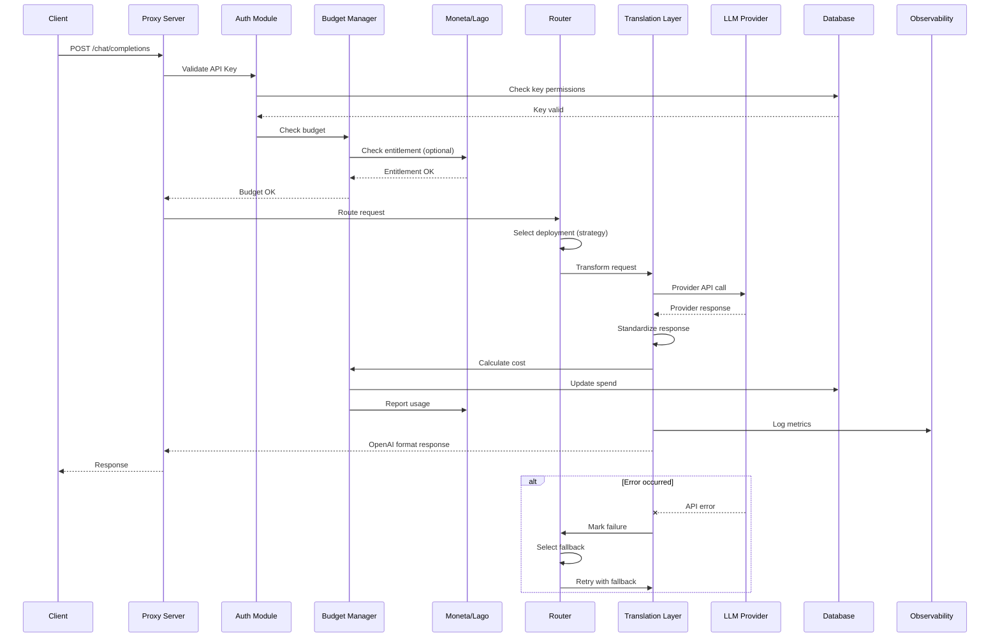

# Core Workflows

```mermaid
sequenceDiagram
    participant C as Client
    participant P as Proxy Server
    participant A as Auth Module
    participant B as Budget Manager
    participant M as Moneta/Lago
    participant R as Router
    participant T as Translation Layer
    participant L as LLM Provider
    participant D as Database
    participant O as Observability

    C->>P: POST /chat/completions
    P->>A: Validate API Key
    A->>D: Check key permissions
    D-->>A: Key valid
    A->>B: Check budget
    B->>M: Check entitlement (optional)
    M-->>B: Entitlement OK
    B-->>P: Budget OK
    
    P->>R: Route request
    R->>R: Select deployment (strategy)
    R->>T: Transform request
    T->>L: Provider API call
    L-->>T: Provider response
    T->>T: Standardize response
    
    T->>B: Calculate cost
    B->>D: Update spend
    B->>M: Report usage
    T->>O: Log metrics
    T-->>P: OpenAI format response
    P-->>C: Response
    
    alt Error occurred
        L--xT: API error
        T->>R: Mark failure
        R->>R: Select fallback
        R->>T: Retry with fallback
    end
```
