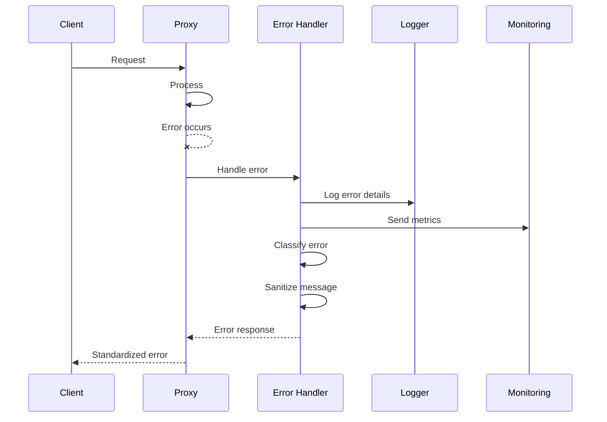

# Error Handling Strategy

## Error Flow


## Error Response Format
```typescript
interface ApiError {
  error: {
    code: string;
    message: string;
    details?: Record<string, any>;
    timestamp: string;
    requestId: string;
  };
}
```

## Frontend Error Handling
```typescript
class APIError extends Error {
  code: string;
  details?: Record<string, any>;
  
  constructor(response: Response, body: ApiError) {
    super(body.error.message);
    this.code = body.error.code;
    this.details = body.error.details;
  }
}

// Global error boundary
const ErrorBoundary: React.FC = ({ children }) => {
  return (
    <ErrorBoundaryComponent
      fallback={<ErrorFallback />}
      onError={(error) => {
        console.error(error);
        // Send to monitoring
      }}
    >
      {children}
    </ErrorBoundaryComponent>
  );
};
```

## Backend Error Handling
```python
from fastapi import HTTPException
from litellm.proxy.utils import StandardErrorResponse

class ProxyException(HTTPException):
    """Standard proxy exception"""
    
    def __init__(
        self,
        message: str,
        code: str,
        status_code: int = 500,
        details: dict = None
    ):
        self.code = code
        self.details = details
        super().__init__(
            status_code=status_code,
            detail=StandardErrorResponse(
                code=code,
                message=message,
                details=details,
                request_id=get_request_id()
            ).dict()
        )

@app.exception_handler(Exception)
async def global_exception_handler(request: Request, exc: Exception):
    """Global exception handler"""
    logger.error(f"Unhandled exception: {exc}", exc_info=True)
    
    if isinstance(exc, ProxyException):
        return JSONResponse(
            status_code=exc.status_code,
            content=exc.detail
        )
    
    # Don't expose internal errors
    return JSONResponse(
        status_code=500,
        content=StandardErrorResponse(
            code="internal_error",
            message="An internal error occurred",
            request_id=get_request_id()
        ).dict()
    )
```
