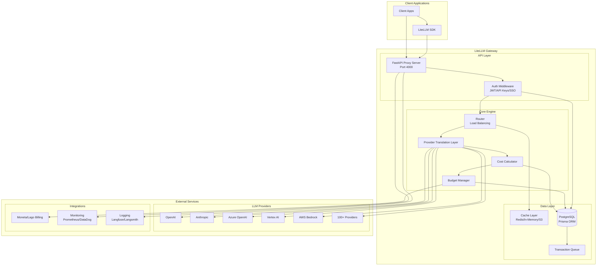

# High Level Architecture

## Technical Summary

LiteLLM implements a unified LLM gateway architecture using FastAPI for the proxy server and Python for the core library, providing OpenAI-compatible APIs to 100+ LLM providers. The system features intelligent load balancing, automatic failover, comprehensive cost tracking, and multi-tenant management with PostgreSQL for persistence and Redis for caching. The architecture employs provider abstraction patterns, async-first design, and extensive observability integrations to achieve enterprise-grade reliability and scalability. Infrastructure is containerized with Docker and deployable to Kubernetes, with built-in support for serverless deployments, making it suitable for both cloud-native and on-premise installations.

## Platform and Infrastructure Choice

**Platform:** Cloud-agnostic with Docker/Kubernetes support
**Key Services:** PostgreSQL, Redis, Prometheus, Various LLM Provider APIs
**Deployment Host and Regions:** Configurable based on deployment needs - supports AWS, Azure, GCP, or on-premise

## Repository Structure

**Structure:** Monorepo
**Monorepo Tool:** Poetry workspaces
**Package Organization:** Core library + Proxy server + Integrations as separate packages

## High Level Architecture Diagram

## Architectural Patterns

- **API Gateway Pattern:** Single entry point for all LLM requests with centralized auth, rate limiting, and monitoring - _Rationale:_ Simplifies client integration and provides consistent interface across providers
- **Provider Abstraction Pattern:** Unified interface hiding provider-specific implementations - _Rationale:_ Enables seamless provider switching and multi-provider strategies
- **Load Balancer Pattern:** Intelligent request distribution across multiple deployments - _Rationale:_ Optimizes for cost, latency, or availability based on configuration
- **Circuit Breaker Pattern:** Automatic failure detection and recovery - _Rationale:_ Prevents cascade failures and improves system resilience
- **Repository Pattern:** Abstract data access logic with Prisma ORM - _Rationale:_ Enables testing and future database migration flexibility
- **Async-First Architecture:** Non-blocking I/O throughout the stack - _Rationale:_ Maximizes throughput for I/O-bound LLM operations
- **Multi-Tenant Architecture:** Organization/Team/User hierarchy with isolated resources - _Rationale:_ Supports enterprise deployments with complex access controls
- **Event-Driven Callbacks:** Extensible hook system for custom business logic - _Rationale:_ Allows customization without modifying core code
- **Cost-First Design:** Budget enforcement and tracking at every layer - _Rationale:_ Prevents unexpected LLM costs and enables chargeback models
