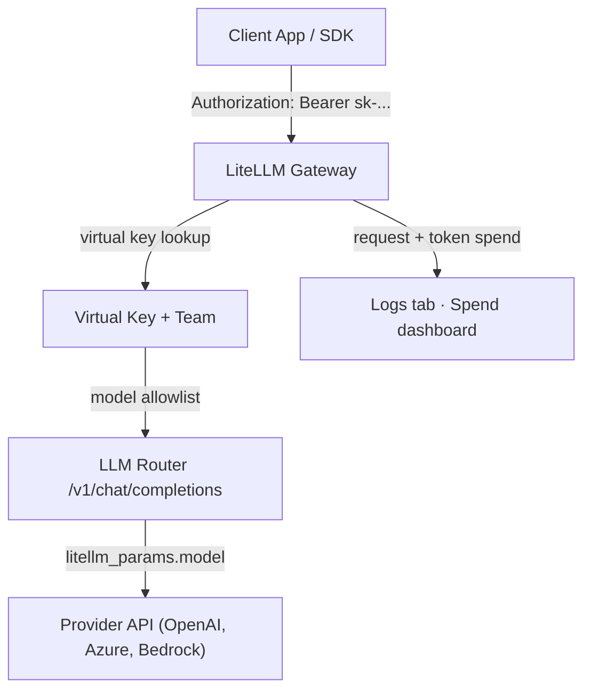
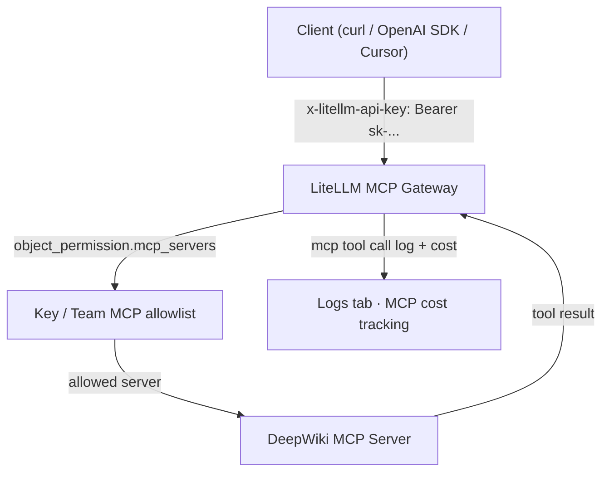
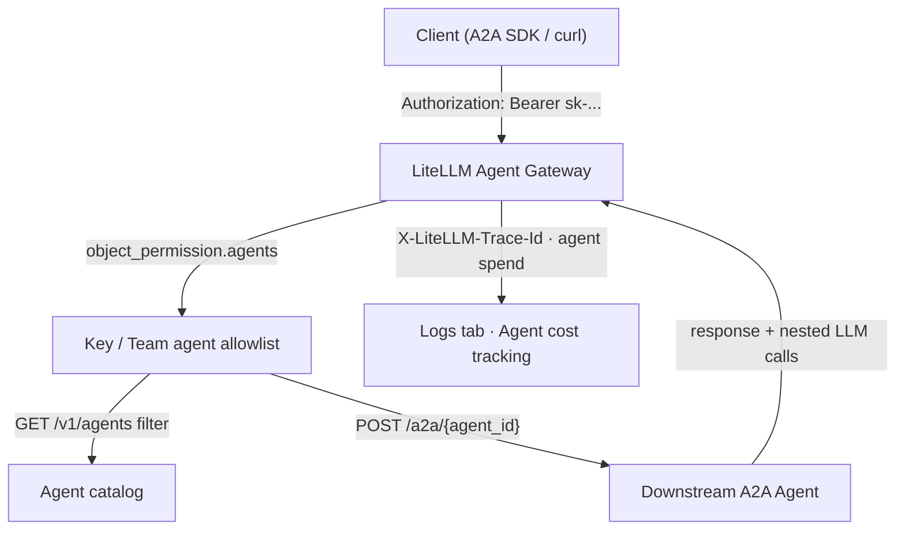
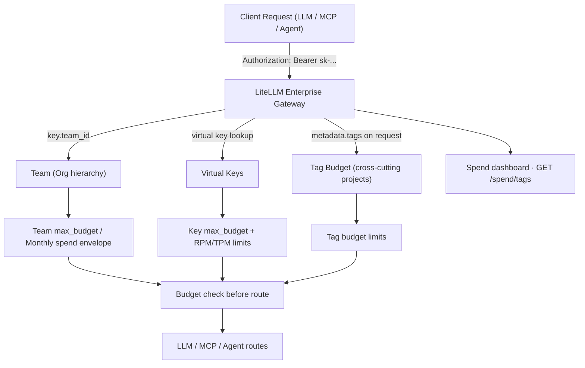

import NavigationCards from '@site/src/components/NavigationCards';
import Tabs from '@theme/Tabs';
import TabItem from '@theme/TabItem';

Use this guide if you are on an **Enterprise trial** to evaluate LiteLLM as a unified **LLM, MCP, and Agent gateway** with enterprise controls and budget enforcement.

:::info

- **Free trial**: [30-day enterprise license](https://www.litellm.ai/enterprise#trial)
- **Talk to us**: [Book a demo](https://enterprise.litellm.ai/demo)
- **SSO is free for up to 5 users.** Beyond that, an enterprise license is required.
- **Full feature catalog**: [Enterprise](/docs/enterprise)

:::


## Deploy + Shared Setup

All gateway and budget tests share one deployment and one org/team/key. Do this section first.

<Tabs>
<TabItem value="self-hosted" label="Self-Hosted">

### Prerequisites

- Docker + Docker Compose
- **Postgres** — required for Admin UI, virtual keys, MCP/Agent registries, and budget tracking
- An LLM provider API key (OpenAI, Azure, Anthropic, etc.)
- Your **Enterprise license key** 

### Deploy with Docker Compose

Follow the [Docker Compose tab](/docs/proxy/docker_quick_start) in the Getting Started Tutorial. Condensed steps:

```bash
docker pull ghcr.io/berriai/litellm-database:main-latest
curl -O https://raw.githubusercontent.com/BerriAI/litellm/main/docker-compose.yml
```

Create `.env`:

```bash
LITELLM_MASTER_KEY="sk-1234"
LITELLM_SALT_KEY="sk-salt-change-me"
LITELLM_LICENSE="eyJ..."
OPENAI_API_KEY="your-api-key"
```

Create `config.yaml`:

```yaml title="config.yaml" showLineNumbers
model_list:
  - model_name: gpt-5.5
    litellm_params:
      model: openai/gpt-5.5
      api_key: os.environ/OPENAI_API_KEY

litellm_settings:
  callbacks: ["prometheus"]

general_settings:
  master_key: os.environ/LITELLM_MASTER_KEY
  database_url: "postgresql://llmproxy:dbpassword9090@db:5432/litellm"
  store_model_in_db: true
```

```bash
docker compose up
```

### Verify Enterprise Edition

Open `http://localhost:4000/` — Swagger should show **"Enterprise Edition"** in the description. See the [Enterprise license FAQ](/docs/enterprise#how-do-i-set-up-and-verify-an-enterprise-license).

Open the Admin UI at `http://localhost:4000/ui` and sign in with your master key.

</TabItem>
</Tabs>

### Shared tenant setup

Complete these steps in the Admin UI before starting the gateway tracks.

| Step | Action | Why |
| ---- | ------ | --- |
| 1 | Create an **Organization** and a **Team** | Organizations are used as top-level entities (Department of Computer Science), which contain multiple Teams (Robotics Club, Frontend Engineering team) |
| 2 | Invite **Internal Users** | Add multiple users within a team and to govern spend |
| 2 | Set **team `max_budget`** (e.g. `$10`, duration `30d`) | Creates a hard spend envelope early so you can verify budget enforcement and over-budget behavior after running LLM calls. |
| 3 | Create a **team-scoped virtual key** with model access | Give admins and internal users access to team models and enforce budgets. Track spend for individual teams. |


→ [Multi-tenant Architecture](/docs/proxy/multi_tenant_architecture) · [Virtual Keys](/docs/proxy/virtual_keys)

---

## 1. LLM Gateway

Prove LiteLLM routes LLM requests through your virtual key, tracks spend, and enforces RBAC.



### Steps

1. **Confirm model** `gpt-5.5` (or your model) appears in `model_list` (config or Admin UI → Models).

2. **Test with your master key**:

```bash
curl -X POST 'http://localhost:4000/chat/completions' \
  -H 'Content-Type: application/json' \
  -H 'Authorization: Bearer sk-1234' \
  -d '{
    "model": "gpt-5.5",
    "messages": [{"role": "user", "content": "Hello from LiteLLM Enterprise Gateway"}]
  }'
```

3. **Use your team virtual key** — repeat the same request with the key from shared setup.

4. **Verify response** — expect `200 OK`; assistant text is in `choices[0].message.content`.

5. **Verify logs** — open **Logs** tab; confirm key, team, model, latency, and spend appear.

6. **Verify team spend** — open **Teams** tab → select your team; confirm spend incremented toward `max_budget`.


→ [Virtual Keys](/docs/proxy/virtual_keys)
→ [Gateway Quickstart](/docs/learn/gateway_quickstart)
→ [Role-Based Access Control](/docs/proxy/access_control)

---

## 2. MCP Gateway

Prove LiteLLM registers MCP servers, enforces per-key access, routes tool calls, and tracks MCP cost.



### Steps

1. **Register MCP server** — Admin UI → **MCP Servers** → Add New MCP Server:

   - Name: `deepwiki`
   - URL: `https://mcp.deepwiki.com/mcp`
   - Transport: HTTP

   Or add to `config.yaml`:

```yaml
mcp_servers:
  - server_name: deepwiki
    url: https://mcp.deepwiki.com/mcp
    transport: http
    available_on_public_internet: true
```

2. **Assign to team/key** — under MCP Settings on the virtual key or team, allow the `deepwiki` server. See [MCP Permission Management](/docs/mcp_control).

3. **List tools** — confirm tools appear in Admin UI under **MCP Servers → MCP Tools**.

4. **Invoke** via `/v1/chat/completions`:

```bash
curl -X POST 'http://localhost:4000/v1/chat/completions' \
  -H 'Authorization: Bearer sk-team-key' \
  -H 'Content-Type: application/json' \
  -d '{
    "model": "gpt-5.5",
    "messages": [{"role": "user", "content": "TLDR of BerriAI/litellm repo"}],
    "tools": [{
      "type": "mcp",
      "server_url": "litellm_proxy/deepwiki",
      "server_label": "deepwiki",
      "require_approval": "never"
    }]
  }'
```

5. **Verify response** — contains tool output and an assistant summary.

6. **Verify logs** — **Logs** tab shows MCP tool call with namespaced tool name and cost.

→ [MCP Overview](/docs/mcp) · [MCP Permission Management](/docs/mcp_control) · [Using your MCP](/docs/mcp_usage)

---

## 3. Agent Gateway

Prove LiteLLM registers A2A agents, enforces per-key access, invokes agents, and tracks agent-attributed spend.



### Steps

1. **Deploy a sample agent** — use [**Multi-agent collaboration using A2A**](https://github.com/a2aproject/a2a-samples/tree/main/demo) (simple deployable A2A agent with streaming support).

2. **Register in Admin UI** — **Agents** tab → **Add Agent** → enter name and URL.

3. **Assign to team/key** — under Agent Settings on the virtual key, allow the agent. See [Agent Permission Management](/docs/a2a_agent_permissions).

4. **List agents**:

```bash
curl -H 'Authorization: Bearer sk-team-key' \
  'http://localhost:4000/v1/agents'
```

5. **Invoke** via the A2A SDK:

```python showLineNumbers title="invoke_a2a_agent.py"
import httpx, asyncio
from uuid import uuid4
from a2a.client import A2ACardResolver, A2AClient
from a2a.types import MessageSendParams, SendMessageRequest

LITELLM_BASE_URL = "http://localhost:4000"
LITELLM_VIRTUAL_KEY = "sk-team-key"

async def main():
    headers = {"Authorization": f"Bearer {LITELLM_VIRTUAL_KEY}"}
    async with httpx.AsyncClient(headers=headers) as client:
        agents = (await client.get(f"{LITELLM_BASE_URL}/v1/agents")).json()
        agent_id = agents[0]["agent_id"]
        base_url = f"{LITELLM_BASE_URL}/a2a/{agent_id}"
        resolver = A2ACardResolver(httpx_client=client, base_url=base_url)
        a2a_client = A2AClient(
            httpx_client=client,
            agent_card=await resolver.get_agent_card(),
        )
        response = await a2a_client.send_message(
            SendMessageRequest(
                id=str(uuid4()),
                params=MessageSendParams(
                    message={
                        "role": "user",
                        "parts": [{"kind": "text", "text": "Hello, what can you do?"}],
                        "messageId": uuid4().hex,
                    }
                ),
            )
        )
        print(response.model_dump(mode="json", exclude_none=True, indent=2))

asyncio.run(main())
```

6. **Verify logs** — **Logs** tab shows key, team, latency, and agent-attributed cost. Cost counts toward team/key spend from Section 0.

→ [Agent Gateway Overview](/docs/a2a) · [Invoking A2A Agents](/docs/a2a_invoking_agents) · [Agent Cost Tracking](/docs/a2a_cost_tracking)

---

## 4. Budgets & Spend

Budget enforcement runs on **all three gateways** through the same virtual key — one control plane governs LLM, MCP, and Agent spend.



### 4a. Key budget + rate limits

1. Create a test key with a tight budget and RPM limit:

```bash
curl -X POST 'http://localhost:4000/key/generate' \
  -H 'Authorization: Bearer sk-1234' \
  -H 'Content-Type: application/json' \
  -d '{
    "max_budget": 0.01,
    "rpm_limit": 1,
    "team_id": "<your-team-id>"
  }'
```

2. **First request** with the new key → `200 OK`.
3. **Second request within the same minute** → rate limit error (RPM exceeded).
4. Confirm key spend in Admin UI under **Virtual Keys**.

→ [Virtual Keys](/docs/proxy/virtual_keys) · [Docker Quick Start — RPM test](/docs/proxy/docker_quick_start)

### 4b. Team budget

Team `max_budget` was set in Section 0. After completing Sections 1–3:

1. Open **Teams** tab → select your PoC team.
2. Confirm **spend** accumulated across LLM, MCP, and Agent calls.
3. **Optional negative test** — set team `max_budget` very low (e.g. `$0.0001`), make one LLM call, confirm budget-exceeded error.

→ [Multi-tenant Architecture](/docs/proxy/multi_tenant_architecture)

### 4c. Tag budget

1. Add `tag_budget_config` to `config.yaml` and restart the proxy:

```yaml
litellm_settings:
  tag_budget_config:
    poc:chat-app:
      max_budget: 0.000000000001
      budget_duration: 1d
```

2. Make a tagged request:

```bash
curl -X POST 'http://localhost:4000/chat/completions' \
  -H 'Authorization: Bearer sk-team-key' \
  -H 'Content-Type: application/json' \
  -d '{
    "model": "gpt-5.5",
    "messages": [{"role": "user", "content": "Hello"}],
    "metadata": {"tags": ["poc:chat-app"]}
  }'
```

3. **First call** succeeds; **second call** with the same tag fails with a budget-exceeded error.

4. Query tag spend:

```bash
curl -X GET 'http://localhost:4000/spend/tags' \
  -H 'Authorization: Bearer sk-1234'
```

**Verify:** response lists `poc:chat-app` with `total_spend` and `log_count`.


**Explore next:** [Projects](/docs/proxy/project_management) · [Temporary budget increases](/docs/proxy/temporary_budget_increase) · [Soft budget alerts](/docs/proxy/ui_team_soft_budget_alerts) · [Spend reports](/docs/proxy/cost_tracking) · [Budget Routing](/docs/proxy/provider_budget_routing) · [Enterprise Spend Tracking](/docs/enterprise#-spend-tracking)

---

## 5. Enterprise Controls

Layer security and compliance on top of working gateways and budgets.

### Audit logs

Enable via `store_audit_logs: true` under litellm_settings of your `config.yml`. Delete a virtual key via API or UI, then check the **Audit Logs** tab.

→ [Audit Logs](/docs/proxy/multiple_admins)

### Team/key guardrails

1. **Guardrails** → create a guardrail (secret detection or content moderation)
2. **Policies** → attach the guardrail to a team or key
3. Send a request that should be blocked; confirm the guardrail fires

→ [Guardrail Policies](/docs/proxy/guardrails/guardrail_policies)
→ [Guardrails Quick Start](/docs/proxy/guardrails/quick_start)

### SSO for Admin UI

SSO controls **Admin UI login** — separate from API auth (virtual keys or JWT). Register this redirect URI in your IdP:

```
https://<your-proxy-base-url>/sso/callback
```

<Tabs>
<TabItem value="google" label="Google">

```bash
GOOGLE_CLIENT_ID="<your-client-id>"
GOOGLE_CLIENT_SECRET="<your-client-secret>"
PROXY_BASE_URL="https://<your-proxy-base-url>"
```

</TabItem>
<TabItem value="microsoft" label="Microsoft">

```bash
MICROSOFT_CLIENT_ID="<your-client-id>"
MICROSOFT_CLIENT_SECRET="<your-client-secret>"
MICROSOFT_TENANT="<your-tenant-id>"
PROXY_BASE_URL="https://<your-proxy-base-url>"
```

</TabItem>
<TabItem value="okta" label="Okta / Generic OIDC">

```bash
GENERIC_CLIENT_ID="<your-client-id>"
GENERIC_CLIENT_SECRET="<your-client-secret>"
GENERIC_AUTHORIZATION_ENDPOINT="https://<your-idp>/oauth2/v1/authorize"
GENERIC_TOKEN_ENDPOINT="https://<your-idp>/oauth2/v1/token"
GENERIC_USERINFO_ENDPOINT="https://<your-idp>/oauth2/v1/userinfo"
PROXY_BASE_URL="https://<your-proxy-base-url>"
```

</TabItem>
</Tabs>

**Verify:** sign in to the Admin UI through your identity provider.

**Also available:** [Custom SSO](/docs/proxy/custom_sso) · [CLI SSO](/docs/proxy/cli_sso) · [SCIM provisioning](/docs/tutorials/scim_litellm)

→ [SSO for Admin UI](/docs/proxy/admin_ui_sso)

### JWT/OIDC Auth

Authenticate application requests with your identity provider's JWT tokens instead of static virtual keys.

→ [JWT-based Authentication](/docs/proxy/token_auth)

### Secret manager

Point LiteLLM at your secret manager so provider keys are read from vault instead of config files.

→ [Secret Managers Overview](/docs/secret_managers/overview)

---


## 7. Additional Enterprise Value

<NavigationCards
columns={3}
items={[
  {
    icon: "💰",
    title: "Governance & Cost",
    description: "Tag budgets, soft budget alerts, spend reports, and temporary budget increases.",
    to: "/docs/proxy/cost_tracking",
  },
  {
    icon: "📡",
    title: "Observability",
    description: "Team-based logging, log export to GCS/Azure Blob, per-team Langfuse routing.",
    to: "/docs/proxy/team_logging",
  },
  {
    icon: "🌐",
    title: "AI Hub",
    description: "Public branded page of available models and agents for your users.",
    to: "/docs/proxy/ai_hub",
  },
  {
    icon: "🏗️",
    title: "Control Plane",
    description: "Multi-region control plane and data plane architecture.",
    to: "/docs/proxy/control_plane_and_data_plane",
  },
  {
    icon: "🔒",
    title: "Data Security",
    description: "SOC 2, ISO 27001, data regions, and compliance FAQs.",
    to: "/docs/data_security",
  },
  {
    icon: "✨",
    title: "Full Enterprise Catalog",
    description: "Complete feature reference, deployment options, and support SLAs.",
    to: "/docs/enterprise",
  },
]}
/>

---

## 8. Need Help?

Every Enterprise license includes a dedicated Slack or Teams channel with our engineering team. Reach out to us `support@berri.ai` and we'll be more than happy to help you!

See [Professional Support](/docs/enterprise#professional-support). 

