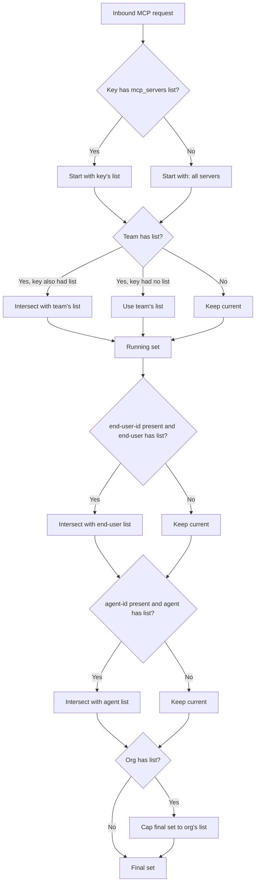

import Tabs from '@theme/Tabs';
import TabItem from '@theme/TabItem';
import Image from '@theme/IdealImage';

# MCP Permission Management

Control which MCP servers and tools can be accessed by specific keys, teams, or organizations in LiteLLM. When a client attempts to list or call tools, LiteLLM enforces access controls based on configured permissions.

## Overview

LiteLLM provides fine-grained permission management for MCP servers, allowing you to:

- **Restrict MCP access by entity**: Control which keys, teams, or organizations can access specific MCP servers
- **Tool-level filtering**: Automatically filter available tools based on entity permissions
- **Centralized control**: Manage all MCP permissions from the LiteLLM Admin UI or API
- **One-click public MCPs**: Mark specific servers as available to every LiteLLM API key when you don't need per-key restrictions

This ensures that only authorized entities can discover and use MCP tools, providing an additional security layer for your MCP infrastructure.

:::info Related Documentation
- [MCP Overview](./mcp.md) - Learn about MCP in LiteLLM
- [MCP Cost Tracking](./mcp_cost.md) - Track costs for MCP tool calls
- [MCP Guardrails](./mcp_guardrail.md) - Apply security guardrails to MCP calls
- [Using MCP](./mcp_usage.md) - How to use MCP with LiteLLM
:::

## How It Works

LiteLLM supports managing permissions for MCP Servers by Keys, Teams, Organizations (entities) on LiteLLM. When a MCP client attempts to list tools, LiteLLM will only return the tools the entity has permissions to access.

When Creating a Key, Team, or Organization, you can select the allowed MCP Servers that the entity has access to.

<Image 
  img={require('../img/mcp_key.png')}
  style={{width: '80%', display: 'block', margin: '0'}}
/>

## Permission Hierarchy

Permissions can be set at five distinct levels. When more than one level applies to a request, LiteLLM **intersects** the lists (most-restrictive wins) — except for the organization level, which acts as a **ceiling**.

| Level | Source | How it composes |
|---|---|---|
| **Key** | `object_permission.mcp_servers` / `object_permission.mcp_access_groups` on the virtual key | If the key has an explicit list, it's used. |
| **Team** | Same fields on the team | If both key and team have lists, the result is the **intersection** (only servers in both). If only the team has a list, the key inherits it. |
| **End user** | Same fields on the `LiteLLM_EndUserTable` row matching `x-litellm-end-user-id` | Intersected with the running result. Skipped if no end-user-id is present on the request. |
| **Agent** | Same fields on the agent identified by `x-litellm-agent-id` | Intersected with the running result. Skipped if no agent-id is present. |
| **Organization** | Same fields on the org owning the key/team | Acts as a **ceiling** — the final allowed-server set is intersected with the org's list. If the org has no list, no additional restriction. |

If no level has a list, the request can access **every** MCP server (open by default).



The same intersection model applies to the per-server tool-level dict `mcp_tool_permissions` (see [Per-entity Tool-Level Permissions](#per-entity-tool-level-permissions) below).

## Allow/Disallow MCP Tools
  
Control which tools are available from your MCP servers. You can either allow only specific tools or block dangerous ones.

<Tabs>
<TabItem value="allowed" label="Only Allow Specific Tools">

Use `allowed_tools` to specify exactly which tools users can access. All other tools will be blocked.

```yaml title="config.yaml" showLineNumbers
mcp_servers:
  github_mcp:
    url: "https://api.githubcopilot.com/mcp"
    auth_type: oauth2
    authorization_url: https://github.com/login/oauth/authorize
    token_url: https://github.com/login/oauth/access_token
    client_id: os.environ/GITHUB_OAUTH_CLIENT_ID
    client_secret: os.environ/GITHUB_OAUTH_CLIENT_SECRET
    scopes: ["public_repo", "user:email"]
    allowed_tools: ["list_tools"]
    # only list_tools will be available
```

**Use this when:**
- You want strict control over which tools are available
- You're in a high-security environment
- You're testing a new MCP server with limited tools

</TabItem>
<TabItem value="blocked" label="Block Specific Tools">

Use `disallowed_tools` to block specific tools. All other tools will be available.

```yaml title="config.yaml" showLineNumbers
mcp_servers:
  github_mcp:
    url: "https://api.githubcopilot.com/mcp"
    auth_type: oauth2
    authorization_url: https://github.com/login/oauth/authorize
    token_url: https://github.com/login/oauth/access_token
    client_id: os.environ/GITHUB_OAUTH_CLIENT_ID
    client_secret: os.environ/GITHUB_OAUTH_CLIENT_SECRET
    scopes: ["public_repo", "user:email"]
    disallowed_tools: ["repo_delete"]
    # only repo_delete will be blocked
```

**Use this when:**
- Most tools are safe, but you want to block a few dangerous ones
- You want to prevent expensive API calls
- You're gradually adding restrictions to an existing server

</TabItem>
</Tabs>

### Important Notes

- If you specify both `allowed_tools` and `disallowed_tools`, the allowed list takes priority
- Tool names are case-sensitive

## Public MCP Servers (allow_all_keys)

Some MCP servers are meant to be shared broadly—think internal knowledge bases, calendar integrations, or other low-risk utilities where every team should be able to connect without requesting access. Instead of adding those servers to every key, team, or organization, enable the new `allow_all_keys` toggle.

<Tabs>
<TabItem value="ui" label="UI">

1. Open **MCP Servers → Add / Edit** in the Admin UI.
2. Expand **Permission Management / Access Control**.
3. Toggle **Allow All LiteLLM Keys** on.

<Image 
  img={require('../img/mcp_allow_all_ui.png')}
  style={{width: '80%', display: 'block', margin: '1rem auto'}}
  alt="MCP server configuration in Admin UI"
/> 

The toggle makes the server “public” without touching existing access groups.

</TabItem>
<TabItem value="config" label="config.yaml">

Set `allow_all_keys: true` to mark the server as public:

```yaml title="Make an MCP server public" showLineNumbers
mcp_servers:
  deepwiki:
    url: https://mcp.deepwiki.com/mcp
    allow_all_keys: true
```

</TabItem>
</Tabs>

### When to use it

- You have shared MCP utilities where fine-grained ACLs would only add busywork.
- You want a “default enabled” experience for internal users, while still being able to layer tool-level restrictions.
- You’re onboarding new teams and want the safest MCPs available out of the box.

Once enabled, LiteLLM automatically includes the server for every key during tool discovery/calls—no extra virtual-key or team configuration is required.

---

## Allow/Disallow MCP Tool Parameters

Control which parameters are allowed for specific MCP tools using the `allowed_params` configuration. This provides fine-grained control over tool usage by restricting the parameters that can be passed to each tool.

### Configuration

`allowed_params` is a dictionary that maps tool names to lists of allowed parameter names. When configured, only the specified parameters will be accepted for that tool - any other parameters will be rejected with a 403 error.

```yaml title="config.yaml with allowed_params" showLineNumbers
mcp_servers:
  deepwiki_mcp:
    url: https://mcp.deepwiki.com/mcp
    transport: "http"
    auth_type: "none"
    allowed_params:
      # Tool name: list of allowed parameters
      read_wiki_contents: ["status"]
  
  my_api_mcp:
    url: "https://my-api-server.com"
    auth_type: "api_key"
    auth_value: "my-key"
    allowed_params:
      # Using unprefixed tool name
      getpetbyid: ["status"]
      # Using prefixed tool name (both formats work)
      my_api_mcp-findpetsbystatus: ["status", "limit"]
      # Another tool with multiple allowed params
      create_issue: ["title", "body", "labels"]
```

### How It Works

1. **Tool-specific filtering**: Each tool can have its own list of allowed parameters
2. **Flexible naming**: Tool names can be specified with or without the server prefix (e.g., both `"getpetbyid"` and `"my_api_mcp-getpetbyid"` work)
3. **Whitelist approach**: Only parameters in the allowed list are permitted
4. **Unlisted tools**: If `allowed_params` is not set, all parameters are allowed
5. **Error handling**: Requests with disallowed parameters receive a 403 error with details about which parameters are allowed

### Example Request Behavior

With the configuration above, here's how requests would be handled:

**✅ Allowed Request:**
```json
{
  "tool": "read_wiki_contents",
  "arguments": {
    "status": "active"
  }
}
```

**❌ Rejected Request:**
```json
{
  "tool": "read_wiki_contents",
  "arguments": {
    "status": "active",
    "limit": 10  // This parameter is not allowed
  }
}
```

**Error Response:**
```json
{
  "error": "Parameters ['limit'] are not allowed for tool read_wiki_contents. Allowed parameters: ['status']. Contact proxy admin to allow these parameters."
}
```

### Use Cases

- **Security**: Prevent users from accessing sensitive parameters or dangerous operations
- **Cost control**: Restrict expensive parameters (e.g., limiting result counts)
- **Compliance**: Enforce parameter usage policies for regulatory requirements
- **Staged rollouts**: Gradually enable parameters as tools are tested
- **Multi-tenant isolation**: Different parameter access for different user groups

### Combining with Tool Filtering

`allowed_params` works alongside `allowed_tools` and `disallowed_tools` for complete control:

```yaml title="Combined filtering example" showLineNumbers
mcp_servers:
  github_mcp:
    url: "https://api.githubcopilot.com/mcp"
    auth_type: oauth2
    authorization_url: https://github.com/login/oauth/authorize
    token_url: https://github.com/login/oauth/access_token
    client_id: os.environ/GITHUB_OAUTH_CLIENT_ID
    client_secret: os.environ/GITHUB_OAUTH_CLIENT_SECRET
    scopes: ["public_repo", "user:email"]
    # Only allow specific tools
    allowed_tools: ["create_issue", "list_issues", "search_issues"]
    # Block dangerous operations
    disallowed_tools: ["delete_repo"]
    # Restrict parameters per tool
    allowed_params:
      create_issue: ["title", "body", "labels"]
      list_issues: ["state", "sort", "perPage"]
      search_issues: ["query", "sort", "order", "perPage"]
```

This configuration ensures that:
1. Only the three listed tools are available
2. The `delete_repo` tool is explicitly blocked
3. Each tool can only use its specified parameters

---

## MCP Server Access Control

LiteLLM Proxy provides two methods for controlling access to specific MCP servers:

1. **URL-based Namespacing** - Use URL paths to directly access specific servers or access groups
2. **Header-based Namespacing** - Use the `x-mcp-servers` header to specify which servers to access

---

### Method 1: URL-based Namespacing

LiteLLM Proxy supports URL-based namespacing for MCP servers using the format `/<servers or access groups>/mcp`. This allows you to:

- **Direct URL Access**: Point MCP clients directly to specific servers or access groups via URL
- **Simplified Configuration**: Use URLs instead of headers for server selection
- **Access Group Support**: Use access group names in URLs for grouped server access

#### URL Format

```
<your-litellm-proxy-base-url>/<server_alias_or_access_group>/mcp
```

**Examples:**
- `/github_mcp/mcp` - Access tools from the "github_mcp" MCP server
- `/zapier/mcp` - Access tools from the "zapier" MCP server  
- `/dev_group/mcp` - Access tools from all servers in the "dev_group" access group
- `/github_mcp,zapier/mcp` - Access tools from multiple specific servers

#### Usage Examples

<Tabs>
<TabItem value="openai" label="OpenAI API">

```bash title="cURL Example with URL Namespacing" showLineNumbers
curl --location 'https://api.openai.com/v1/responses' \
--header 'Content-Type: application/json' \
--header "Authorization: Bearer $OPENAI_API_KEY" \
--data '{
    "model": "gpt-4o",
    "tools": [
        {
            "type": "mcp",
            "server_label": "litellm",
            "server_url": "<your-litellm-proxy-base-url>/github_mcp/mcp",
            "require_approval": "never",
            "headers": {
                "x-litellm-api-key": "Bearer YOUR_LITELLM_API_KEY"
            }
        }
    ],
    "input": "Run available tools",
    "tool_choice": "required"
}'
```

This example uses URL namespacing to access only the "github" MCP server.

</TabItem>

<TabItem value="litellm" label="LiteLLM Proxy">

```bash title="cURL Example with URL Namespacing" showLineNumbers
curl --location '<your-litellm-proxy-base-url>/v1/responses' \
--header 'Content-Type: application/json' \
--header "Authorization: Bearer $LITELLM_API_KEY" \
--data '{
    "model": "gpt-4o",
    "tools": [
        {
            "type": "mcp",
            "server_label": "litellm",
            "server_url": "litellm_proxy",
            "require_approval": "never",
            "headers": {
                "x-litellm-api-key": "Bearer YOUR_LITELLM_API_KEY"
            }
        }
    ],
    "input": "Run available tools",
    "tool_choice": "required"
}'
```

This example uses the `x-mcp-servers` header to access all servers in the "dev_group" access group. Use `server_url: "litellm_proxy"` when calling the proxy's `/v1/responses` endpoint—do not use the full proxy URL.

</TabItem>

<TabItem value="cursor" label="Cursor IDE">

```json title="Cursor MCP Configuration with URL Namespacing" showLineNumbers
{
  "mcpServers": {
    "LiteLLM": {
      "url": "<your-litellm-proxy-base-url>/github_mcp,zapier/mcp",
      "headers": {
        "x-litellm-api-key": "Bearer $LITELLM_API_KEY"
      }
    }
  }
}
```

This configuration uses URL namespacing to access tools from both "github" and "zapier" MCP servers.

</TabItem>
</Tabs>

#### Benefits of URL Namespacing

- **Direct Access**: No need for additional headers to specify servers
- **Clean URLs**: Self-documenting URLs that clearly indicate which servers are accessible
- **Access Group Support**: Use access group names for grouped server access
- **Multiple Servers**: Specify multiple servers in a single URL with comma separation
- **Simplified Configuration**: Easier setup for MCP clients that prefer URL-based configuration

---

### Method 2: Header-based Namespacing

You can choose to access specific MCP servers and only list their tools using the `x-mcp-servers` header. This header allows you to:
- Limit tool access to one or more specific MCP servers
- Control which tools are available in different environments or use cases

The header accepts a comma-separated list of server aliases: `"alias_1,Server2,Server3"`

**Notes:**
- If the header is not provided, tools from all available MCP servers will be accessible
- This method works with the standard LiteLLM MCP endpoint

<Tabs>
<TabItem value="openai" label="OpenAI API">

```bash title="cURL Example with Header Namespacing" showLineNumbers
curl --location 'https://api.openai.com/v1/responses' \
--header 'Content-Type: application/json' \
--header "Authorization: Bearer $OPENAI_API_KEY" \
--data '{
    "model": "gpt-4o",
    "tools": [
        {
            "type": "mcp",
            "server_label": "litellm",
            "server_url": "<your-litellm-proxy-base-url>/mcp/",
            "require_approval": "never",
            "headers": {
                "x-litellm-api-key": "Bearer YOUR_LITELLM_API_KEY",
                "x-mcp-servers": "alias_1"
            }
        }
    ],
    "input": "Run available tools",
    "tool_choice": "required"
}'
```

In this example, the request will only have access to tools from the "alias_1" MCP server.

</TabItem>

<TabItem value="litellm" label="LiteLLM Proxy">

```bash title="cURL Example with Header Namespacing" showLineNumbers
curl --location '<your-litellm-proxy-base-url>/v1/responses' \
--header 'Content-Type: application/json' \
--header "Authorization: Bearer $LITELLM_API_KEY" \
--data '{
    "model": "gpt-4o",
    "tools": [
        {
            "type": "mcp",
            "server_label": "litellm",
            "server_url": "litellm_proxy",
            "require_approval": "never",
            "headers": {
                "x-litellm-api-key": "Bearer YOUR_LITELLM_API_KEY",
                "x-mcp-servers": "alias_1,Server2"
            }
        }
    ],
    "input": "Run available tools",
    "tool_choice": "required"
}'
```

This configuration restricts the request to only use tools from the specified MCP servers. Use `server_url: "litellm_proxy"` when calling the proxy's `/v1/responses` endpoint.

</TabItem>

<TabItem value="cursor" label="Cursor IDE">

```json title="Cursor MCP Configuration with Header Namespacing" showLineNumbers
{
  "mcpServers": {
    "LiteLLM": {
      "url": "<your-litellm-proxy-base-url>/mcp/",
      "headers": {
        "x-litellm-api-key": "Bearer $LITELLM_API_KEY",
        "x-mcp-servers": "alias_1,Server2"
      }
    }
  }
}
```

This configuration in Cursor IDE settings will limit tool access to only the specified MCP servers.

</TabItem>
</Tabs>

---

### Comparison: Header vs URL Namespacing

| Feature | Header Namespacing | URL Namespacing |
|---------|-------------------|-----------------|
| **Method** | Uses `x-mcp-servers` header | Uses URL path `/<servers>/mcp` |
| **Endpoint** | Standard `litellm_proxy` endpoint | Custom `/<servers>/mcp` endpoint |
| **Configuration** | Requires additional header | Self-contained in URL |
| **Multiple Servers** | Comma-separated in header | Comma-separated in URL path |
| **Access Groups** | Supported via header | Supported via URL path |
| **Client Support** | Works with all MCP clients | Works with URL-aware MCP clients |
| **Use Case** | Dynamic server selection | Fixed server configuration |

<Tabs>
<TabItem value="openai" label="OpenAI API">

```bash title="cURL Example with Server Segregation" showLineNumbers
curl --location 'https://api.openai.com/v1/responses' \
--header 'Content-Type: application/json' \
--header "Authorization: Bearer $OPENAI_API_KEY" \
--data '{
    "model": "gpt-4o",
    "tools": [
        {
            "type": "mcp",
            "server_label": "litellm",
            "server_url": "<your-litellm-proxy-base-url>/mcp/",
            "require_approval": "never",
            "headers": {
                "x-litellm-api-key": "Bearer YOUR_LITELLM_API_KEY",
                "x-mcp-servers": "alias_1"
            }
        }
    ],
    "input": "Run available tools",
    "tool_choice": "required"
}'
```

In this example, the request will only have access to tools from the "alias_1" MCP server.

</TabItem>

<TabItem value="litellm" label="LiteLLM Proxy">

```bash title="cURL Example with Server Segregation" showLineNumbers
curl --location '<your-litellm-proxy-base-url>/v1/responses' \
--header 'Content-Type: application/json' \
--header "Authorization: Bearer $LITELLM_API_KEY" \
--data '{
    "model": "gpt-4o",
    "tools": [
        {
            "type": "mcp",
            "server_label": "litellm",
            "server_url": "litellm_proxy",
            "require_approval": "never",
            "headers": {
                "x-litellm-api-key": "Bearer YOUR_LITELLM_API_KEY",
                "x-mcp-servers": "alias_1,Server2"
            }
        }
    ],
    "input": "Run available tools",
    "tool_choice": "required"
}'
```

This configuration restricts the request to only use tools from the specified MCP servers.

</TabItem>

<TabItem value="cursor" label="Cursor IDE">

```json title="Cursor MCP Configuration with Server Segregation" showLineNumbers
{
  "mcpServers": {
    "LiteLLM": {
      "url": "litellm_proxy",
      "headers": {
        "x-litellm-api-key": "Bearer $LITELLM_API_KEY",
        "x-mcp-servers": "alias_1,Server2"
      }
    }
  }
}
```

This configuration in Cursor IDE settings will limit tool access to only the specified MCP server.

</TabItem>
</Tabs>

### Grouping MCPs (Access Groups)

MCP Access Groups allow you to group multiple MCP servers together for easier management.

#### 1. Create an Access Group

##### A. Creating Access Groups using Config:

```yaml title="Creating access groups for MCP using the config" showLineNumbers
mcp_servers:
  "deepwiki_mcp":
    url: https://mcp.deepwiki.com/mcp
    transport: "http"
    auth_type: "none"
    access_groups: ["dev_group"]
```

While adding `mcp_servers` using the config:
- Pass in a list of strings inside `access_groups`
- These groups can then be used for segregating access using keys, teams and MCP clients using headers

##### B. Creating Access Groups using UI

To create an access group:
- Go to MCP Servers in the LiteLLM UI
- Click "Add a New MCP Server" 
- Under "MCP Access Groups", create a new group (e.g., "dev_group") by typing it
- Add the same group name to other servers to group them together

<Image 
  img={require('../img/mcp_create_access_group.png')}
  style={{width: '80%', display: 'block', margin: '0'}}
/>

#### 2. Use Access Group in Cursor

Include the access group name in the `x-mcp-servers` header:

```json title="Cursor Configuration with Access Groups" showLineNumbers
{
  "mcpServers": {
    "LiteLLM": {
      "url": "litellm_proxy",
      "headers": {
        "x-litellm-api-key": "Bearer $LITELLM_API_KEY",
        "x-mcp-servers": "dev_group"
      }
    }
  }
}
```

This gives you access to all servers in the "dev_group" access group.
- Which means that if deepwiki server (and any other servers) which have the access group `dev_group` assigned to them will be available for tool calling

#### Advanced: Connecting Access Groups to API Keys

When creating API keys, you can assign them to specific access groups for permission management:

- Go to "Keys" in the LiteLLM UI and click "Create Key"
- Select the desired MCP access groups from the dropdown
- The key will have access to all MCP servers in those groups
- This is reflected in the Test Key page

<Image 
  img={require('../img/mcp_key_access_group.png')}
  style={{width: '80%', display: 'block', margin: '0'}}
/>


## Per-entity Tool-Level Permissions {#per-entity-tool-level-permissions}

Control which tools different teams can access from the same MCP server. For example, give your Engineering team access to `list_repositories`, `create_issue`, and `search_code`, while Sales only gets `search_code` and `close_issue`.

This video shows how to set allowed tools for a Key, Team, or Organization.

<iframe width="840" height="500" src="https://www.loom.com/embed/7464d444c3324078892367272fe50745" frameborder="0" webkitallowfullscreen mozallowfullscreen allowfullscreen></iframe>

### `mcp_tool_permissions` API

`object_permission.mcp_tool_permissions` is a `Dict[server_id, List[tool_name]]` on the key, team, end-user, agent, or organization. It's evaluated **after** server-level access has been resolved (see [Permission Hierarchy](#permission-hierarchy) above) and applies the same five-level intersection — most-restrictive wins, organization acts as a ceiling.

This is distinct from the server-registration-level `allowed_tools` / `disallowed_tools` (which apply to **every** caller of the server). `mcp_tool_permissions` lets you carve out per-team subsets without changing the server config.

<Tabs>
<TabItem value="key" label="On a Key">

```bash title="Engineering key — full GitHub access" showLineNumbers
curl -X POST "http://localhost:4000/key/generate" \
  -H "Authorization: Bearer sk-master-key" \
  -H "Content-Type: application/json" \
  -d '{
    "object_permission": {
      "mcp_servers": ["github_mcp"],
      "mcp_tool_permissions": {
        "github_mcp": ["list_repositories", "create_issue", "search_code"]
      }
    }
  }'
```

```bash title="Sales key — read-only on the same server" showLineNumbers
curl -X POST "http://localhost:4000/key/generate" \
  -H "Authorization: Bearer sk-master-key" \
  -H "Content-Type: application/json" \
  -d '{
    "object_permission": {
      "mcp_servers": ["github_mcp"],
      "mcp_tool_permissions": {
        "github_mcp": ["search_code", "close_issue"]
      }
    }
  }'
```

</TabItem>
<TabItem value="team" label="On a Team">

```bash title="Team-wide tool subset (all keys inherit)" showLineNumbers
curl -X POST "http://localhost:4000/team/new" \
  -H "Authorization: Bearer sk-master-key" \
  -H "Content-Type: application/json" \
  -d '{
    "team_alias": "engineering",
    "object_permission": {
      "mcp_servers": ["github_mcp", "deepwiki_mcp"],
      "mcp_tool_permissions": {
        "github_mcp": ["list_repositories", "create_issue", "search_code"]
      }
    }
  }'
```

When the key also sets `mcp_tool_permissions` for `github_mcp`, the resulting tool list is the **intersection** of the two.

</TabItem>
<TabItem value="agent" label="On an Agent">

When an agent (identified by `x-litellm-agent-id`) calls MCP tools, the agent's own `mcp_tool_permissions` participate in the intersection. Useful for capping what an autonomous agent can do regardless of which key originally invoked it.

```bash showLineNumbers
curl -X PATCH "http://localhost:4000/v1/agents/{agent_id}" \
  -H "Authorization: Bearer sk-master-key" \
  -H "Content-Type: application/json" \
  -d '{
    "object_permission": {
      "mcp_servers": ["github_mcp"],
      "mcp_tool_permissions": {
        "github_mcp": ["search_code"]
      }
    }
  }'
```

</TabItem>
</Tabs>


## Rate Limiting per MCP Server

Cap how many tool calls a key or team can make to a specific MCP server per minute with `mcp_rpm_limit`. This is a `Dict[str, int]` keyed by MCP server name, where the name is the server's alias if one is set, otherwise the configured server name. Each entry sets the requests-per-minute limit for that one server, so a limit on `github` does not affect calls to `slack`. Servers without an entry are uncapped.

Once the limit is exceeded within the window, further tool calls to that server return `429 Too Many Requests` until the window rolls over. The cap only applies to actual MCP tool calls; it has no effect on regular LLM requests.

<Tabs>
<TabItem value="key" label="On a Key">

```bash title="Cap a key at 100 github + 200 slack calls per minute" showLineNumbers
curl -X POST "http://localhost:4000/key/generate" \
  -H "Authorization: Bearer sk-master-key" \
  -H "Content-Type: application/json" \
  -d '{
    "mcp_rpm_limit": {"github": 100, "slack": 200},
    "object_permission": {"mcp_servers": ["github", "slack"]}
  }'
```

</TabItem>
<TabItem value="team" label="On a Team">

```bash title="Cap a team at 500 github calls per minute (all keys share the counter)" showLineNumbers
curl -X POST "http://localhost:4000/team/new" \
  -H "Authorization: Bearer sk-master-key" \
  -H "Content-Type: application/json" \
  -d '{
    "team_alias": "engineering",
    "mcp_rpm_limit": {"github": 500},
    "object_permission": {"mcp_servers": ["github"]}
  }'
```

</TabItem>
</Tabs>

`mcp_rpm_limit` is also accepted on `/key/update`, `/team/update`, `/user/new`, and `/user/update`. A key-level limit takes precedence over a team-level limit for the same server; the team limit otherwise applies to every key on the team as a shared counter.


## Dashboard View Modes

Proxy admins can also control what non-admins see inside the MCP dashboard via `general_settings.user_mcp_management_mode`:

- `restricted` *(default)* – users only see servers that their team explicitly has access to.
- `view_all` – every dashboard user can see the full MCP server list. 

```yaml title="Config example"
general_settings:
  user_mcp_management_mode: view_all
```

This is useful when you want discoverability for MCP offerings without granting additional execution privileges.


## Publish MCP Registry

If you want other systems—for example external agent frameworks such as MCP-capable IDEs running outside your network—to automatically discover the MCP servers hosted on LiteLLM, you can expose a Model Context Protocol Registry endpoint. This registry lists the built-in LiteLLM MCP server and every server you have configured, using the [official MCP Registry spec](https://github.com/modelcontextprotocol/registry).

1. Set `enable_mcp_registry: true` under `general_settings` in your proxy config (or DB settings) and restart the proxy.
2. LiteLLM will serve the registry at `GET /v1/mcp/registry.json`.
3. Each entry points to either `/mcp` (built-in server) or `/{mcp_server_name}/mcp` for your custom servers, so clients can connect directly using the advertised Streamable HTTP URL.

:::note Permissions still apply
The registry only advertises server URLs. Actual access control is still enforced by LiteLLM when the client connects to `/mcp` or `/{server}/mcp`, so publishing the registry does not bypass per-key permissions.
:::
