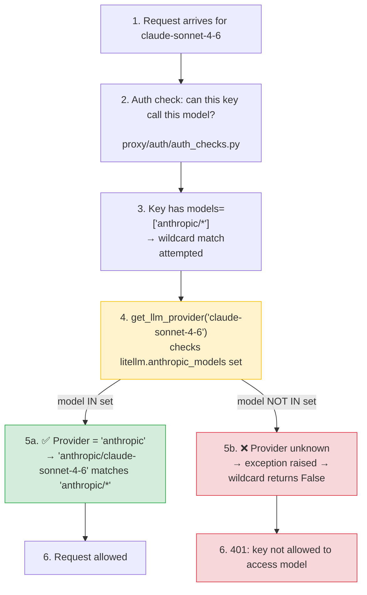

**Date:** Feb 23, 2026  
**Duration:** ~3 hours  
**Severity:** High (for users with provider wildcard access rules)  
**Status:** Resolved

## Summary

When a new Anthropic model (e.g. `claude-sonnet-4-6`) was added to the LiteLLM model cost map and a cost map reload was triggered, requests to the new model were rejected with:

```
key not allowed to access model. This key can only access models=['anthropic/*']. Tried to access claude-sonnet-4-6.
```

The reload updated `litellm.model_cost` correctly but never re-ran `add_known_models()`, so `litellm.anthropic_models` (the in-memory set used by the wildcard resolver) remained stale. The new model was invisible to the `anthropic/*` wildcard even though the cost map knew about it.

- **LLM calls:** All requests to newly-added Anthropic models were blocked with a 401.
- **Existing models:** Unaffected — only models missing from the stale provider set were impacted.
- **Other providers:** Same bug class existed for any provider wildcard (e.g. `openai/*`, `gemini/*`).

{/* truncate */}

---

## Background

LiteLLM supports provider-level wildcard access rules. When an admin configures a key or team with `models=['anthropic/*']`, any model whose provider resolves to `anthropic` should be allowed. The resolution happens in `_model_custom_llm_provider_matches_wildcard_pattern`:



`litellm.anthropic_models` is a Python `set` populated at import time by `add_known_models()`. It is the source `get_llm_provider()` consults to map a bare model name like `claude-sonnet-4-6` to the provider string `"anthropic"`.

---

## Root Cause

`add_known_models()` is called **once** at module import time. Both reload paths in `proxy_server.py` updated `litellm.model_cost` with the fresh map but never called `add_known_models()` again:

```python
# Before the fix — both reload paths looked like this:
new_model_cost_map = get_model_cost_map(url=model_cost_map_url)
litellm.model_cost = new_model_cost_map          # ✅ cost map updated
_invalidate_model_cost_lowercase_map()           # ✅ cache cleared
# ❌ add_known_models() never called
#    → litellm.anthropic_models still has the old set
#    → new model not in the set
#    → get_llm_provider() raises for the new model
#    → wildcard match returns False
#    → 401 for every request to the new model
```

The gap existed in two places:
1. `_check_and_reload_model_cost_map` — the periodic automatic reload (every 10 s)
2. The `/reload/model_cost_map` admin endpoint — the manual reload

**Timeline:**

1. New model (`claude-sonnet-4-6`) added to `model_prices_and_context_window.json`
2. Admin triggers cost map reload via UI → `litellm.model_cost` updated
3. Users with `anthropic/*` wildcard keys attempt requests to `claude-sonnet-4-6`
4. `get_llm_provider('claude-sonnet-4-6')` raises → wildcard returns False → 401
5. Admin reloads cost map again — same result (root cause not addressed)
6. ~3 hours of investigation → root cause identified → fix deployed

---

## The Fix

After each reload, `add_known_models()` is called with the freshly fetched map passed explicitly. Passing the map directly (rather than relying on the module-level reference) removes any ambiguity about which dict is iterated:

```python
# After the fix — both reload paths now do:
new_model_cost_map = get_model_cost_map(url=model_cost_map_url)
litellm.model_cost = new_model_cost_map
_invalidate_model_cost_lowercase_map()
litellm.add_known_models(model_cost_map=new_model_cost_map)  # ✅ sets repopulated
```

`add_known_models()` was also updated to accept an optional explicit map so callers cannot accidentally iterate a stale module-level reference:

```python
# Before
def add_known_models():
    for key, value in model_cost.items():   # reads module global — ambiguous after reload
        ...

# After
def add_known_models(model_cost_map: Optional[Dict] = None):
    _map = model_cost_map if model_cost_map is not None else model_cost
    for key, value in _map.items():         # always iterates the map you just fetched
        ...
```

After the fix, the provider sets (`anthropic_models`, `open_ai_chat_completion_models`, etc.) are always consistent with `litellm.model_cost` immediately after every reload. New models become accessible via wildcard rules without any proxy restart.

---

## Remediation

| # | Action | Status | Code |
|---|---|---|---|
| 1 | Call `add_known_models(model_cost_map=...)` in the periodic reload path | ✅ Done | [`proxy_server.py#L4393`](https://github.com/BerriAI/litellm/blob/main/litellm/proxy/proxy_server.py#L4393) |
| 2 | Call `add_known_models(model_cost_map=...)` in the `/reload/model_cost_map` endpoint | ✅ Done | [`proxy_server.py#L11904`](https://github.com/BerriAI/litellm/blob/main/litellm/proxy/proxy_server.py#L11904) |
| 3 | Update `add_known_models()` to accept an explicit map parameter | ✅ Done | [`__init__.py#L617`](https://github.com/BerriAI/litellm/blob/main/litellm/__init__.py#L617) |
| 4 | Regression test: `add_known_models(model_cost_map=...)` populates provider sets | ✅ Done | [`test_auth_checks.py`](https://github.com/BerriAI/litellm/blob/main/tests/proxy_unit_tests/test_auth_checks.py) |
| 5 | Regression test: `anthropic/*` wildcard grants/denies access correctly after reload | ✅ Done | [`test_auth_checks.py`](https://github.com/BerriAI/litellm/blob/main/tests/proxy_unit_tests/test_auth_checks.py) |

---
