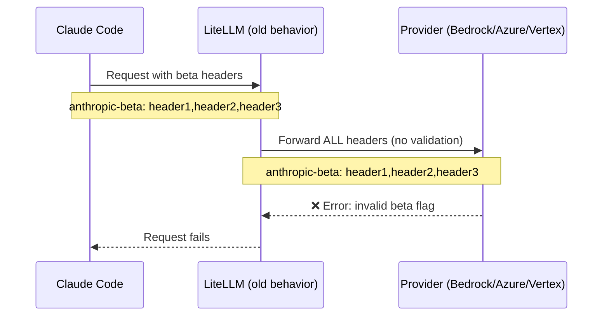
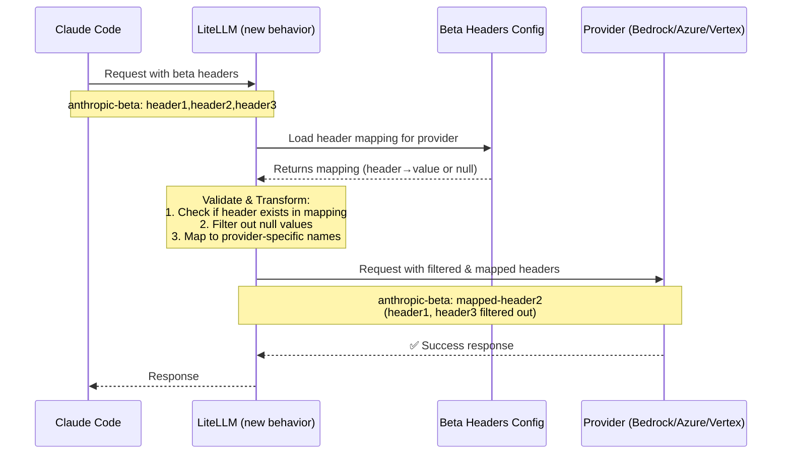

**Date:** February 13, 2026
**Duration:** ~3 hours
**Severity:** High
**Status:** Resolved

## Summary

Claude Code began sending unsupported Anthropic beta headers to non-Anthropic providers (Bedrock, Azure AI, Vertex AI), causing `invalid beta flag` errors. LiteLLM was forwarding all beta headers without provider-specific validation. Users experienced request failures when routing Claude Code requests through LiteLLM to these providers.

- **LLM calls to Anthropic:** No impact.
- **LLM calls to Bedrock/Azure/Vertex:** Failed with `invalid beta flag` errors when unsupported headers were present.
- **Cost tracking and routing:** No impact.

{/* truncate */}

---

## Background

Anthropic uses beta headers to enable experimental features in Claude. When Claude Code makes API requests, it includes headers like `anthropic-beta: prompt-caching-scope-2026-01-05,advanced-tool-use-2025-11-20`. However, not all providers support all Anthropic beta features.

Before this incident, LiteLLM forwarded all beta headers to all providers without validation:



Requests succeeded for Anthropic (native support) but failed for other providers when Claude Code sent headers those providers didn't support.

---

## Root cause

LiteLLM lacked provider-specific beta header validation. When Claude Code introduced new beta features or sent headers that specific providers didn't support, those headers were blindly forwarded, causing provider API errors.

---

## Remediation

| # | Action | Status | Code |
|---|---|---|---|
| 1 | Create `anthropic_beta_headers_config.json` with provider-specific mappings | ✅ Done | [`anthropic_beta_headers_config.json`](https://github.com/BerriAI/litellm/blob/main/litellm/anthropic_beta_headers_config.json) |
| 2 | Implement strict validation: headers must be explicitly mapped to be forwarded | ✅ Done | [`litellm_logging.py`](https://github.com/BerriAI/litellm/blob/main/litellm/litellm_core_utils/litellm_logging.py) |
| 3 | Add `/reload/anthropic_beta_headers` endpoint for dynamic config updates | ✅ Done | Proxy management endpoints |
| 4 | Add `/schedule/anthropic_beta_headers_reload` for automatic periodic updates | ✅ Done | Proxy management endpoints |
| 5 | Support `LITELLM_ANTHROPIC_BETA_HEADERS_URL` for custom config sources | ✅ Done | Environment configuration |
| 6 | Support `LITELLM_LOCAL_ANTHROPIC_BETA_HEADERS` for air-gapped deployments | ✅ Done | Environment configuration |

Now LiteLLM validates and transforms headers per-provider:



---

## Dynamic configuration updates

A key improvement is zero-downtime configuration updates. When Anthropic releases new beta features, users can update their configuration without restarting:

```bash
# Manually trigger reload (no restart needed)
curl -X POST "https://your-proxy-url/reload/anthropic_beta_headers" \
  -H "Authorization: Bearer YOUR_ADMIN_TOKEN"

# Or schedule automatic reloads every 24 hours
curl -X POST "https://your-proxy-url/schedule/anthropic_beta_headers_reload?hours=24" \
  -H "Authorization: Bearer YOUR_ADMIN_TOKEN"
```

This prevents future incidents where Claude Code introduces new headers before LiteLLM configuration is updated.

---

## Configuration format

The `anthropic_beta_headers_config.json` file maps input headers to provider-specific output headers:

```json
{
  "description": "Mapping of Anthropic beta headers for each provider.",
  "anthropic": {
    "advanced-tool-use-2025-11-20": "advanced-tool-use-2025-11-20",
    "computer-use-2025-01-24": "computer-use-2025-01-24"
  },
  "bedrock_converse": {
    "advanced-tool-use-2025-11-20": null,
    "computer-use-2025-01-24": "computer-use-2025-01-24"
  },
  "azure_ai": {
    "advanced-tool-use-2025-11-20": "advanced-tool-use-2025-11-20",
    "computer-use-2025-01-24": "computer-use-2025-01-24"
  }
}
```

**Validation rules:**
1. Headers must exist in the mapping for the target provider
2. Headers with `null` values are filtered out (unsupported)
3. Header names can be transformed per-provider (e.g., Bedrock uses different names for some features)

---

## Resolution steps for users

For users still experiencing issues, update to the latest LiteLLM version if < v1.81.11-nightly:

```bash
pip install --upgrade litellm
```

Or manually reload the configuration without restarting:

```bash
curl -X POST "https://your-proxy-url/reload/anthropic_beta_headers" \
  -H "Authorization: Bearer YOUR_ADMIN_TOKEN"
```

---

## Related documentation

- [Managing Anthropic Beta Headers](../proxy/sync_anthropic_beta_headers.md) - Complete configuration guide
- [`anthropic_beta_headers_config.json`](https://github.com/BerriAI/litellm/blob/main/litellm/anthropic_beta_headers_config.json) - Current configuration file
