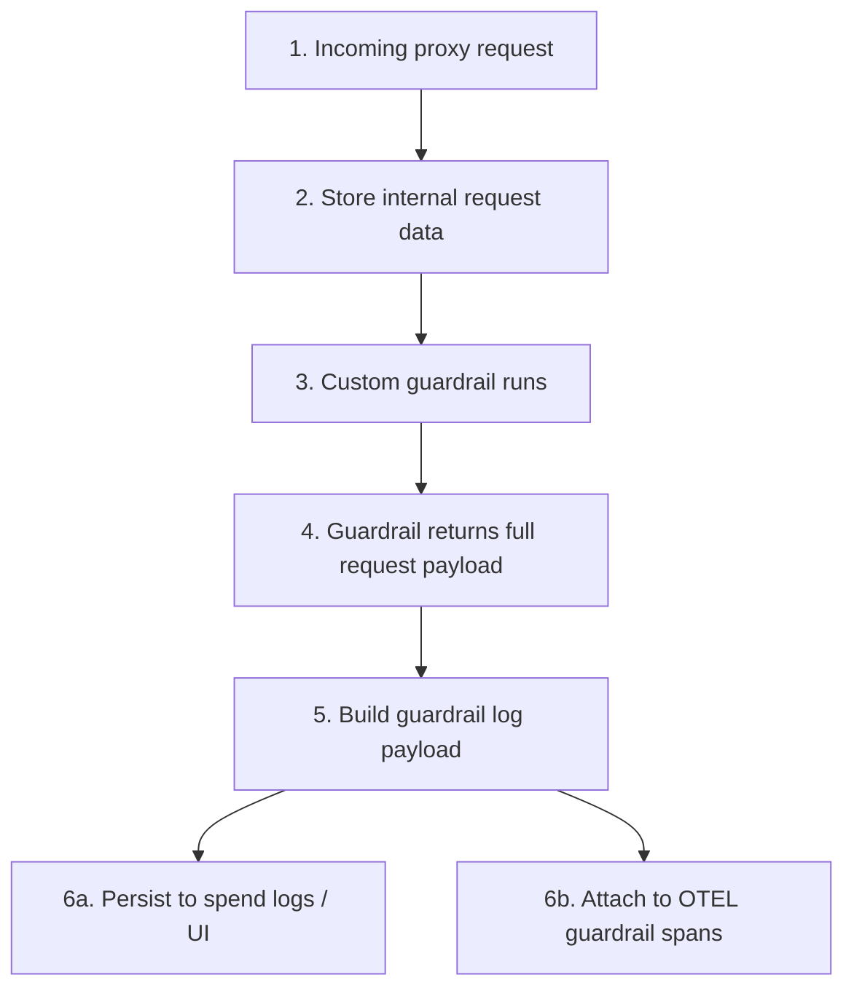

**Date:** March 18, 2026
**Duration:** Unknown
**Severity:** High
**Status:** Resolved

## Summary

When a custom guardrail returned the full LiteLLM request/data dictionary, the guardrail response logged by LiteLLM could include `secret_fields.raw_headers`, including plaintext `Authorization` headers containing API keys or other credentials.

This information could then propagate to logging and observability surfaces that consume guardrail metadata, including:

- **Spend logs in the LiteLLM UI:** visible to admins with access to spend-log data
- **OpenTelemetry traces:** visible to anyone with access to the relevant telemetry backend

LLM calls, proxy routing, and provider execution were not blocked by this bug. The impact was exposure of sensitive request headers in observability and logging paths.

{/* truncate */}

---

## Background

LiteLLM keeps internal request data (including request headers) for use during the call. That data is not meant to be written to logs or telemetry.

When custom guardrails run, their outcomes are logged so they can appear in spend logs, OpenTelemetry traces, and other observability backends. If a guardrail returned the full request payload instead of a minimal result, that internal request data could be included in what was logged. Before the fix, the guardrail logging path did not strip that data before sending it to those systems.

---

## Root Cause

The root cause was incomplete sanitization in the guardrail logging path. When building the payload that gets sent to spend logs and traces, LiteLLM prepared guardrail responses for logging but did not strip internal request data (such as headers) from them. If a guardrail returned a response that included that data, it was passed through to the logging and observability systems unchanged.

---

## Impact

This issue required all of the following:

1. A custom guardrail returned the full LiteLLM request/data dictionary, or another response object containing `secret_fields`.
2. LiteLLM logged that guardrail response through the standard guardrail logging path.
3. An operator, admin, or telemetry consumer had access to the resulting logs or traces.

When those conditions were met, sensitive values could become visible through:

- **Spend logs / UI responses:** guardrail metadata could be included in spend-log payloads rendered in the admin UI.
- **OpenTelemetry traces:** `guardrail_response` could be written as a span attribute on guardrail spans.
- **Other downstream observability backends:** any integration consuming the same guardrail metadata could receive the leaked values.

This was a logging and telemetry exposure bug. It did not let callers bypass auth, access other tenants directly, or change model behavior, but it could expose plaintext credentials to people with access to those observability systems.

---

## Guidance For Users

- Upgrade to LiteLLM 1.82.3+.
- If you operated custom guardrails that return the full request/data dict, review whether spend logs or telemetry traces were retained during the affected period.
- Rotate any credentials that may have appeared in `Authorization` or other forwarded request headers in those systems.
- Apply least-privilege access controls to spend-log views and telemetry backends that may contain request-derived metadata.
