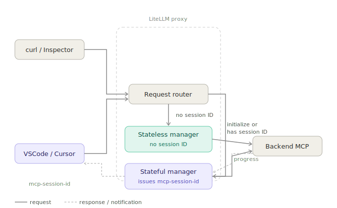
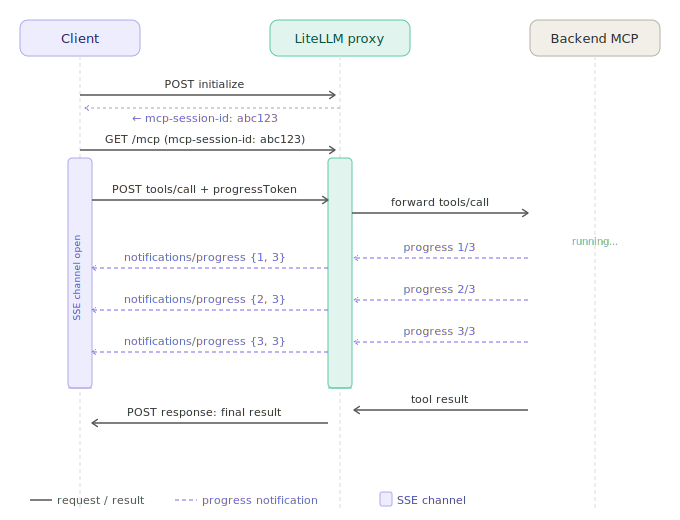

LiteLLM Proxy's MCP Gateway now supports **both stateless and stateful Streamable HTTP clients** on the same endpoint. curl and MCP Inspector work without changes, while Claude Code, Cursor, and VSCode get session IDs and **progress notifications** for long-running tools.

## Architecture



## The Problem

Previously, LiteLLM used a single stateless session manager. That meant:

- **curl, Inspector, Notion** - No session ID needed
- **Progress notifications** - Silently failed (no session to push to)
- **mcp-session-id** - Never returned to clients

Stateful clients (IDEs) need sessions to receive `notifications/progress` during tool execution. Stateless clients don't. We needed both.

## The Solution: Automatic Routing

LiteLLM now routes requests based on the `mcp-session-id` header and request method:

| Scenario | Route | Result |
|----------|-------|--------|
| `initialize` (no session) | Stateful | Client gets `mcp-session-id` |
| Request with `mcp-session-id` | Stateful | Progress notifications work |
| Other (no session) | Stateless | curl, Inspector work as before |

No configuration required—routing is automatic.

## Progress Flow



## Quick Test

**1. Initialize** - Get `mcp-session-id` from response headers.

**2. Open GET channel (Terminal A)** - Connect with `Accept: text/event-stream` and `mcp-session-id`.

**3. Call progress tool (Terminal B)** - POST `tools/call` with `_meta.progressToken`.

Progress events stream in Terminal A while Terminal B waits for the final result.

<details>
<summary>Full code example</summary>

```bash
# 1. Initialize, get session ID
SESSION_ID=$(curl -s -D - http://localhost:4000/mcp/progress_test \
  -H "Content-Type: application/json" \
  -H "x-litellm-api-key: Bearer sk-1234" \
  -d '{"jsonrpc":"2.0","id":1,"method":"initialize","params":{"protocolVersion":"2024-11-05","capabilities":{},"clientInfo":{"name":"test","version":"1.0"}}}' \
  | grep -i mcp-session-id | cut -d' ' -f2 | tr -d '\r')

# 2. Open GET channel (Terminal A)
curl -N http://localhost:4000/mcp/progress_test \
  -H "Accept: text/event-stream" \
  -H "x-litellm-api-key: Bearer sk-1234" \
  -H "mcp-session-id: $SESSION_ID"

# 3. Call progress tool (Terminal B)
curl -N http://localhost:4000/mcp/progress_test \
  -H "Content-Type: application/json" \
  -H "x-litellm-api-key: Bearer sk-1234" \
  -H "mcp-session-id: $SESSION_ID" \
  -d '{"jsonrpc":"2.0","id":2,"method":"tools/call","params":{"name":"progress_test-progress_tool","arguments":{"steps":3},"_meta":{"progressToken":"tok-123"}}}'
```

</details>

<iframe width="740" height="500" src="https://www.loom.com/embed/8d83322e7b3247818f8b30e431d30049?autoplay=1" frameborder="0" webkitallowfullscreen mozallowfullscreen allowfullscreen></iframe>

## Stale Sessions

If LiteLLM restarts, clients may reconnect with an old `mcp-session-id`. LiteLLM strips the stale header and treats the request as a new connection—no 400 errors. For `initialize`, the client gets a fresh session ID.

## FAQ

**Q: When do I need to send `mcp-session-id`?**  
A: Only if you want progress notifications. Stateless clients (curl, Inspector) can omit it and work as before.

**Q: Do I need to configure stateless vs stateful routing?**  
A: No. LiteLLM routes automatically based on the `mcp-session-id` header and whether the request is `initialize`.

**Q: I'm not seeing progress events. What's wrong?**  
A: Ensure you (1) call `initialize` first and capture the `mcp-session-id` from response headers, (2) open a GET connection with `Accept: text/event-stream` and the same session ID, and (3) include `_meta.progressToken` in your `tools/call` params.

**Q: What happens if I use an old session ID after LiteLLM restarts?**  
A: LiteLLM treats it as a new connection. Send `initialize` again to get a fresh session ID.

