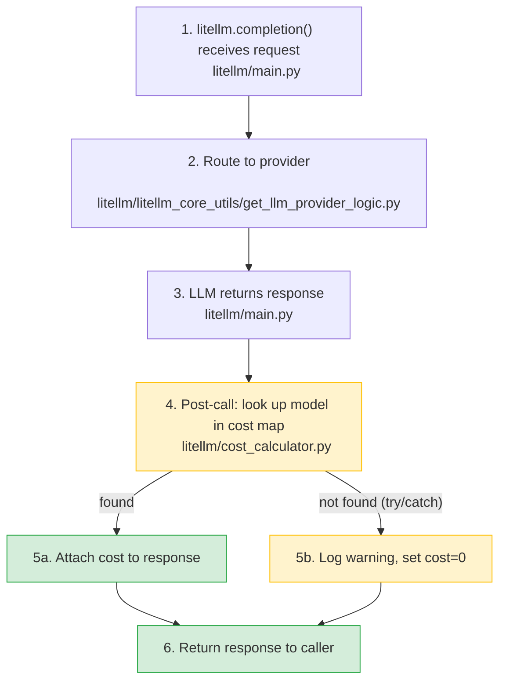

**Date:** January 27, 2026
**Duration:** ~20 minutes
**Severity:** Low
**Status:** Resolved

## Summary

A malformed JSON entry in `model_prices_and_context_window.json` was merged to `main` ([`562f0a0`](https://github.com/BerriAI/litellm/commit/562f0a028251750e3d75386bee0e630d9796d0df)). This caused LiteLLM to silently fall back to a stale local copy of the model cost map. Users on older package versions lost cost tracking for newer models only (e.g. `azure/gpt-5.2`). No LLM calls were blocked.

- **LLM calls and proxy routing:** No impact.
- **Cost tracking:** Impacted for newer models not present in the local backup. Older models were unaffected. The incident lasted ~20 minutes until the commit was reverted.

{/* truncate */}

---

## Background

The model cost map is not in the request path. It is used after the LLM response comes back, inside a try/catch, to calculate spend. A missing entry never blocks a call.

Both paths return a response to the caller. When the cost map lookup fails, the only difference is `cost=0` on that request.

---

## Root cause

LiteLLM fetches the model cost map from GitHub `main` at import time. If the fetch fails, it falls back to a local backup bundled with the package. Before this incident, the fallback was completely silent -- no warning was logged.

A contributor PR introduced an extra `{` bracket, producing invalid JSON. The remote fetch failed with `JSONDecodeError`, triggering the silent fallback. Users on older package versions had backup files missing newer models.

**Timeline:**

1. Malformed JSON merged to `main`
2. LiteLLM installations fall back to local backup on next import
3. Users report `"This model isn't mapped yet"` for newer models
4. Bad commit identified and reverted (~20 minutes)

---

## Remediation

| Action | Status |
|---|---|
| CI validation on every PR that touches the model cost map | ✅ Done ([PR #20605](https://github.com/BerriAI/litellm/pull/20605)) |
| Warning log when falling back to local backup | ✅ Done |
| Integrity validation of fetched map before using it (type check, min model count, shrinkage detection) | ✅ Done |
| Resilience test suite covering bad hosted map, bad backup, and fallback behavior | ✅ Done |
| Sync backup file on every release | Planned |

Enterprises that require zero external dependencies at import time can set `LITELLM_LOCAL_MODEL_COST_MAP=True` to skip the GitHub fetch entirely.

---

## Other dependencies on external resources

| Dependency | Impact if unavailable | Fallback |
|---|---|---|
| Model cost map (GitHub) | Cost tracking for newer models | Local backup (now with warning) |
| JWT public keys (IDP/SSO) | Auth fails | None |
| OIDC UserInfo (IDP/SSO) | Auth fails | None |
| HuggingFace model API | HF provider calls fail | None |
| Ollama tags (localhost) | Ollama model list stale | Static list |
