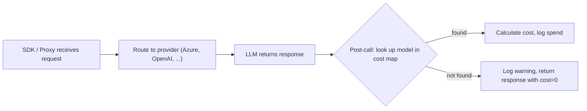

# Incident Report: Invalid model cost map on `main`

**Date:** January 27, 2026
**Duration:** ~20 minutes
**Severity:** Low
**Status:** Resolved

## Summary

A malformed JSON entry in `model_prices_and_context_window.json` was merged to `main` ([`562f0a0`](https://github.com/BerriAI/litellm/commit/562f0a028251750e3d75386bee0e630d9796d0df)). This caused LiteLLM to silently fall back to a stale local copy of the model cost map. Users on older package versions lost cost tracking for **newer models only** (e.g. `azure/gpt-5.2`). No LLM calls were blocked.

## Impact

- **LLM calls (`litellm.completion`, proxy routing):** No impact.
- **Cost tracking for newer models:** Impacted. Models not present in the local backup (e.g. `gpt-5.2`) returned `"This model isn't mapped yet"` during cost lookups. Older models already in the backup were unaffected.

{/* truncate */}

---

## How the model cost map fits into a request

The model cost map is **not** in the request path. It is only used **after** the LLM response comes back, inside a try/catch. A missing entry never blocks a call.

When the cost map lookup fails, the response is still returned to the caller. The only impact is that spend tracking reports `cost=0` for that request.

---

## Root cause

LiteLLM fetches the model cost map from GitHub `main` at import time. If the fetch fails, it falls back to a local backup bundled with the package. The fallback was silent -- no warning was logged.

A contributor PR introduced an extra `{` bracket, producing invalid JSON. The remote fetch failed with `JSONDecodeError`, triggering the silent fallback. Users on older package versions had backup files missing newer models.

## Timeline

1. Malformed JSON merged to `main`
2. LiteLLM installations fall back to local backup on next import
3. Users report `"This model isn't mapped yet"` for newer models
4. Bad commit identified and reverted (~20 minutes)

---

## Remediation

| # | Action | Status |
|---|---|---|
| 1 | CI validation on `model_prices_and_context_window.json` | Shipped ([PR #20605](https://github.com/BerriAI/litellm/pull/20605)) |
| 2 | Warning log on fallback to local backup | Shipped |
| 3 | Integrity validation of fetched map (min model count, shrinkage check) | Shipped |
| 4 | Resilience test suite for bad/missing cost maps | Shipped |
| 5 | Sync backup file on every release | Planned |
| 6 | Default to local-only cost map in production | Planned |

## Other upstream dependencies

| Dependency | Impact if unavailable | Fallback |
|---|---|---|
| Model cost map (GitHub) | Cost tracking for newer models | Local backup (now with warning) |
| JWT public keys | Auth fails | None |
| OIDC UserInfo | Auth fails | None |
| HuggingFace model API | HF provider calls fail | None |
| Ollama tags (localhost) | Ollama model list stale | Static list |
