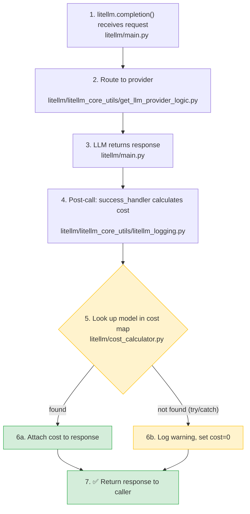
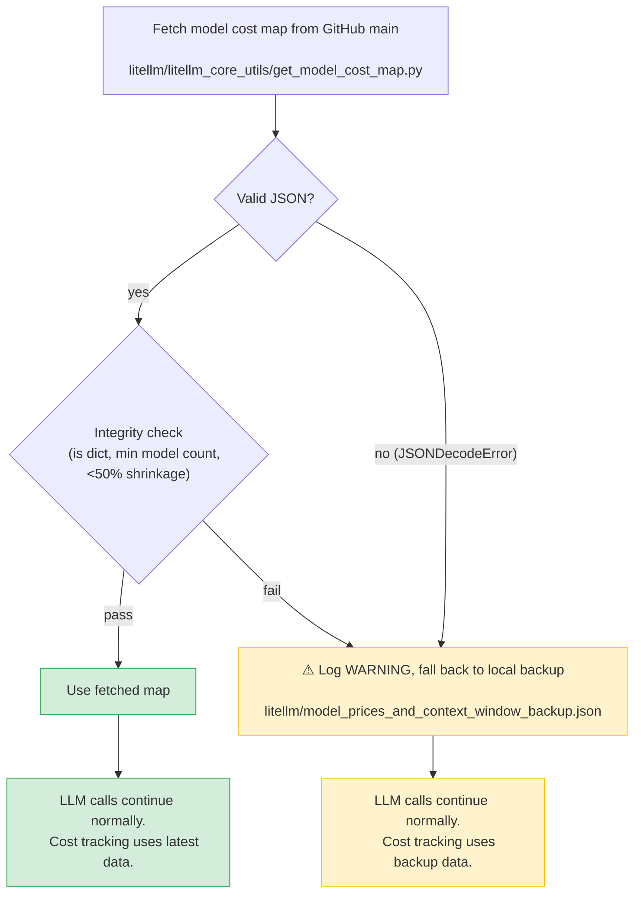

# Incident Report: Invalid model cost map on `main`

**Date:** January 27, 2026
**Duration:** ~20 minutes
**Severity:** Low
**Status:** Resolved

## Summary

A malformed JSON entry in `model_prices_and_context_window.json` was merged to `main` ([`562f0a0`](https://github.com/BerriAI/litellm/commit/562f0a028251750e3d75386bee0e630d9796d0df)). This caused LiteLLM to silently fall back to a stale local copy of the model cost map. Users on older package versions lost cost tracking for **newer models only** (e.g. `azure/gpt-5.2`). No LLM calls were blocked.

## Impact

- **LLM calls (`litellm.completion`, proxy routing):** No impact.
- **Cost tracking for newer models:** Impacted. Models not present in the local backup (e.g. `gpt-5.2`) returned `"This model isn't mapped yet"` during cost lookups. Older models already in the backup were unaffected.

{/* truncate */}

---

## How the model cost map fits into a request

The model cost map is **not** in the request path. It is only used **after** the LLM response comes back, inside a try/catch. A missing entry never blocks a call.



Both paths converge -- the caller always gets a response. The cost map lookup at step 5 is wrapped in a try/catch. When it fails, the only difference is `cost=0` on that request.

---

## Root cause

LiteLLM fetches the model cost map from GitHub `main` at import time. If the fetch fails, it falls back to a local backup bundled with the package. The fallback was silent -- no warning was logged.

A contributor PR introduced an extra `{` bracket, producing invalid JSON. The remote fetch failed with `JSONDecodeError`, triggering the silent fallback. Users on older package versions had backup files missing newer models.

## Timeline

1. Malformed JSON merged to `main`
2. LiteLLM installations fall back to local backup on next import
3. Users report `"This model isn't mapped yet"` for newer models
4. Bad commit identified and reverted (~20 minutes)

---

## What happens if the hosted model cost map is bad

After addressing this incident, `get_model_cost_map()` now validates the fetched JSON before using it. If the hosted map is corrupted, empty, or has shrunk significantly, LiteLLM falls back to the local backup and logs a warning.



Previously, this fallback was completely silent. Now operators see:

```
WARNING - LiteLLM: Failed to fetch remote model cost map from <url>: <error>. Falling back to local backup.
```

---

## Opting out of the hosted map entirely

For enterprise deployments that require full control over dependencies, set:

```bash
export LITELLM_LOCAL_MODEL_COST_MAP=True
```

This skips the GitHub fetch entirely. LiteLLM uses only the local backup bundled with the installed package. No external network call is made at import time.

This is recommended for production environments where deterministic behavior matters more than day-0 model pricing updates.

---

## Enterprise deployment stability

We are investing in making LiteLLM more predictable for enterprise deployments:

- **Day-0 model launches on dedicated branches.** New model pricing will be added to a staging branch first, validated by CI, then merged -- so `main` is never broken by a model cost map update.

---

## Remediation

| # | Action | Status | Code |
|---|---|---|---|
| 1 | CI validation on `model_prices_and_context_window.json` | ✅ Done | [PR #20605](https://github.com/BerriAI/litellm/pull/20605) |
| 2 | Warning log on fallback to local backup | ✅ Done | [`get_model_cost_map.py`](https://github.com/BerriAI/litellm/blob/main/litellm/litellm_core_utils/get_model_cost_map.py) |
| 3 | `GetModelCostMap` class with integrity validation helpers | ✅ Done | [`get_model_cost_map.py`](https://github.com/BerriAI/litellm/blob/main/litellm/litellm_core_utils/get_model_cost_map.py) |
| 4 | Validation constants (`MODEL_COST_MAP_MIN_MODEL_COUNT`, `MODEL_COST_MAP_MAX_SHRINK_PERCENT`) | ✅ Done | [`constants.py`](https://github.com/BerriAI/litellm/blob/main/litellm/constants.py) |
| 5 | Resilience test suite (bad hosted map, bad backup, fallback, completion) | ✅ Done | [`test_model_cost_map_resilience.py`](https://github.com/BerriAI/litellm/blob/main/tests/llm_translation/test_model_cost_map_resilience.py) |
| 6 | Test that backup model cost map always exists and contains common models | ✅ Done | [`test_model_cost_map_resilience.py`](https://github.com/BerriAI/litellm/blob/main/tests/llm_translation/test_model_cost_map_resilience.py) |
| 7 | Sync backup file on every release | Planned | |
| 8 | Default to local-only cost map in production | Planned | |

## Other upstream dependencies

During this investigation, we also found the following dependcies depend on online / external resources. JWT/OIDC depend on your IDP / SSO provider being live. HuggingFace model API and Ollama tags (localhost) depend on the service being available during the pre/post LLM Call phases.

| Dependency | Impact if unavailable | Fallback |
|---|---|---|
| Model cost map (GitHub) | Cost tracking for newer models | Local backup (now with warning) |
| JWT public keys | Auth fails | None |
| OIDC UserInfo | Auth fails | None |
| HuggingFace model API | HF provider calls fail | None |
| Ollama tags (localhost) | Ollama model list stale | Static list |
