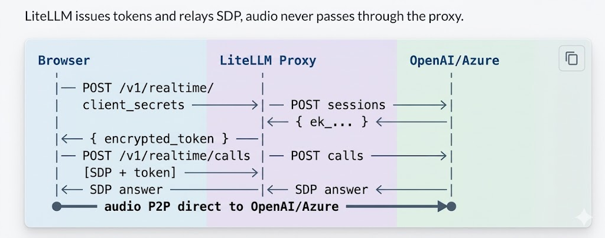
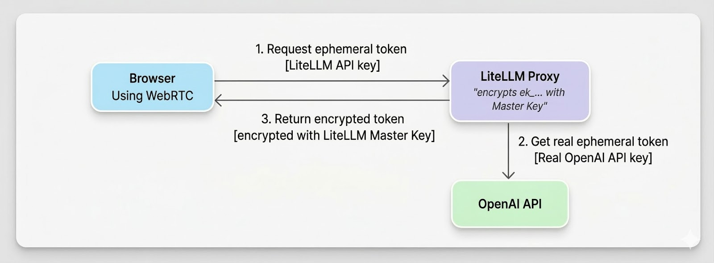

import WebRTCTester from '@site/src/components/WebRTCTester';

Connect to the Realtime API via WebRTC from browser/mobile clients. LiteLLM handles auth and key management.

{/* truncate */}

## How it works



**Flow of generating ephemeral token**




## Proxy Setup

```yaml
model_list:
  - model_name: gpt-4o-realtime
    litellm_params:
      model: openai/gpt-4o-realtime-preview-2024-12-17
      api_key: os.environ/OPENAI_API_KEY
    model_info:
      mode: realtime
```

**Azure:** use `model: azure/gpt-4o-realtime-preview`, `api_key`, `api_base`.

```bash
litellm --config /path/to/config.yaml
```

## Try it live

<WebRTCTester />

## Client Usage

**1. Get token** - `POST /v1/realtime/client_secrets` with LiteLLM API key and `{ model }`.

**2. WebRTC handshake** - Create `RTCPeerConnection`, add mic track, create data channel `oai-events`, send SDP offer to `POST /v1/realtime/calls` with `Authorization: Bearer <encrypted_token>` and `Content-Type: application/sdp`.

**3. Events** - Use the data channel for `session.update` and other events.

<details>
<summary>Full code example</summary>

```javascript
// 1. Token
const r = await fetch("http://proxy:4000/v1/realtime/client_secrets", {
  method: "POST",
  headers: { "Authorization": "Bearer sk-litellm-key", "Content-Type": "application/json" },
  body: JSON.stringify({ model: "gpt-4o-realtime" }),
});
const { client_secret } = await r.json();
const token = client_secret.value;

// 2. WebRTC
const pc = new RTCPeerConnection();
const audio = document.createElement("audio");
audio.autoplay = true;
pc.ontrack = (e) => (audio.srcObject = e.streams[0]);
const ms = await navigator.mediaDevices.getUserMedia({ audio: true });
pc.addTrack(ms.getTracks()[0]);
const dc = pc.createDataChannel("oai-events");
const offer = await pc.createOffer();
await pc.setLocalDescription(offer);

const sdpRes = await fetch("http://proxy:4000/v1/realtime/calls", {
  method: "POST",
  headers: { "Authorization": `Bearer ${token}`, "Content-Type": "application/sdp" },
  body: offer.sdp,
});
await pc.setRemoteDescription({ type: "answer", sdp: await sdpRes.text() });

// 3. Events
dc.send(JSON.stringify({ type: "session.update", session: { instructions: "..." } }));
```

</details>

## FAQ

**Q: What do I do if I get a 401 Token expired error?**  
A: Tokens are short-lived. Get a fresh token right before creating the WebRTC offer.

**Q: Which key should I use for `/v1/realtime/calls`?**  
A: Use the **encrypted token** from `client_secrets`, not your raw API key.

**Q: Should I pass the `model` parameter when making the call?**  
A: No, the encrypted token already encodes all routing information including model.

**Q: How do I resolve Azure `api-version` errors?**  
A: Set the correct `api_version` in `litellm_params` (or via the `AZURE_API_VERSION` environment variable), along with the right `api_base` and deployment values.

**Q: What if I get no audio?**  
A: Make sure you grant microphone permission, ensure `pc.ontrack` assigns the audio element with `autoplay` enabled, check your network/firewall for WebRTC traffic, and inspect the browser console for ICE or SDP errors.
