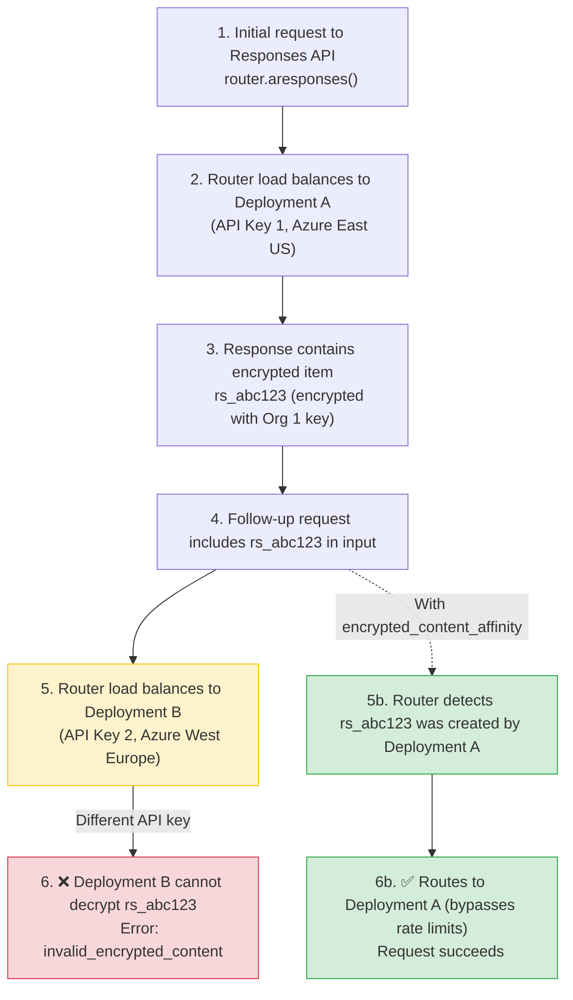

**Date:** Feb 24, 2026  
**Duration:** Ongoing (until fix deployed)  
**Severity:** High (for users load balancing Responses API across different API keys)  
**Status:** Resolved

## Summary

When load balancing OpenAI's Responses API across deployments with **different API keys** (e.g., different Azure regions or OpenAI organizations), follow-up requests containing encrypted content items (like `rs_...` reasoning items) would fail with:

```json
{
  "error": {
    "message": "The encrypted content for item rs_0d09d6e56879e76500699d6feee41c8197bd268aae76141f87 could not be verified. Reason: Encrypted content organization_id did not match the target organization.",
    "type": "invalid_request_error",
    "code": "invalid_encrypted_content"
  }
}
```

Encrypted content items are cryptographically tied to the API key's organization that created them. When the router load balanced a follow-up request to a deployment with a different API key, decryption failed.

- **Responses API calls with encrypted content:** Complete failure when routed to wrong deployment
- **Initial requests:** Unaffected — only follow-up requests containing encrypted items failed
- **Other API endpoints:** No impact — chat completions, embeddings, etc. functioned normally

{/* truncate */}

---

## Background

OpenAI's Responses API can return encrypted "reasoning items" (with IDs like `rs_...`) that contain intermediate reasoning steps. These items are encrypted with the organization's key and can only be decrypted by the same organization's API key.

When load balancing across deployments with different API keys, the existing affinity mechanisms were insufficient:

- **`responses_api_deployment_check`**: Requires `previous_response_id` which some clients (like Codex) don't provide
- **`deployment_affinity`**: Too broad — pins *all* requests from a user to one deployment, reducing effective quota by the number of users
- **`session_affinity`**: Requires explicit session IDs and still reduces quota



---

## Root Cause

LiteLLM's router had no mechanism to track which deployment created specific encrypted content items and route follow-up requests accordingly. The router treated all deployments as interchangeable, leading to decryption failures when encrypted content crossed organizational boundaries.

**The Problem Flow:**

1. User calls `router.aresponses()` with model `gpt-5.1-codex`
2. Router load balances to Deployment A (Azure East US, API Key 1)
3. Response contains encrypted reasoning item `rs_abc123` (encrypted with Org 1's key)
4. User makes follow-up request with `rs_abc123` in the input
5. Router load balances to Deployment B (Azure West Europe, API Key 2)
6. Deployment B tries to decrypt `rs_abc123` with Org 2's key → **fails**

**Why Existing Solutions Didn't Work:**

- **`previous_response_id`**: Not provided by all clients (e.g., Codex)
- **`deployment_affinity`**: Pins *all* user requests to one deployment → reduces quota to 1/N where N = number of deployments
- **`session_affinity`**: Requires explicit session management and still reduces quota

**Timeline:**

1. Users configured multi-region Responses API load balancing with different API keys
2. Initial requests succeeded, but follow-up requests with encrypted content failed intermittently
3. Error rate correlated with number of deployments (more deployments = higher chance of routing to wrong one)
4. Investigation revealed encrypted content was organization-bound
5. Existing affinity mechanisms deemed unsuitable (quota reduction, missing `previous_response_id`)
6. New solution designed and implemented: `encrypted_content_affinity`

---

## The Fix

Implemented a new `encrypted_content_affinity` pre-call check that intelligently tracks encrypted content and routes follow-up requests **only when necessary**.

### Implementation

**1. Encoding `model_id` into output item IDs** ([`responses/utils.py`](https://github.com/BerriAI/litellm/blob/main/litellm/litellm/responses/utils.py))

The same approach used for `previous_response_id` affinity — no cache needed. When a response contains output items with `encrypted_content`, LiteLLM rewrites their IDs to embed the originating deployment's `model_id`:

```python
# On response: rs_abc123 → encitem_{base64("litellm:model_id:{model_id};item_id:rs_abc123")}
def _build_encrypted_item_id(model_id: str, item_id: str) -> str:
    assembled = f"litellm:model_id:{model_id};item_id:{item_id}"
    encoded = base64.b64encode(assembled.encode("utf-8")).decode("utf-8")
    return f"encitem_{encoded}"

# On request: decode encitem_... → extract model_id for routing
def _decode_encrypted_item_id(encoded_id: str) -> Optional[Dict[str, str]]:
    if not encoded_id.startswith("encitem_"):
        return None
    cleaned = encoded_id[len("encitem_"):]
    missing = len(cleaned) % 4
    if missing:
        cleaned += "=" * (4 - missing)  # restore padding stripped in transit
    decoded = base64.b64decode(cleaned).decode("utf-8")
    model_id, item_id = decoded.split(";", 1)
    return {"model_id": model_id.replace("litellm:model_id:", ""),
            "item_id": item_id.replace("item_id:", "")}
```

Before forwarding to the upstream provider, LiteLLM restores the original item IDs so the provider never sees the encoded form:

```python
# In responses/main.py — before calling the handler
input = ResponsesAPIRequestUtils._restore_encrypted_content_item_ids_in_input(input)
```

**2. `EncryptedContentAffinityCheck` — routing only** ([`encrypted_content_affinity_check.py`](https://github.com/BerriAI/litellm/blob/main/litellm/litellm/router_utils/pre_call_checks/encrypted_content_affinity_check.py))

No `async_log_success_event` or cache lookups — the `model_id` is decoded directly from the item ID:

```python
class EncryptedContentAffinityCheck(CustomLogger):
    async def async_filter_deployments(self, model, healthy_deployments, ...):
        """Decode encitem_ IDs in input to extract model_id and pin to that deployment."""
        for item in request_kwargs.get("input", []):
            decoded = ResponsesAPIRequestUtils._decode_encrypted_item_id(item.get("id", ""))
            if decoded:
                deployment = self._find_deployment_by_model_id(
                    healthy_deployments, decoded["model_id"]
                )
                if deployment:
                    request_kwargs["_encrypted_content_affinity_pinned"] = True
                    return [deployment]
        return healthy_deployments
```

**3. Rate Limit Bypass** ([`router.py`](https://github.com/BerriAI/litellm/blob/main/litellm/litellm/router.py))

When encrypted content requires a specific deployment, RPM/TPM limits are bypassed (the request would fail on any other deployment anyway):

```python
# In async_get_available_deployment, after filtering healthy deployments:
if (
    request_kwargs.get("_encrypted_content_affinity_pinned")
    and len(healthy_deployments) == 1
):
    return healthy_deployments[0]  # Bypass routing strategy (RPM/TPM checks)
```

**3. Configuration**

```yaml
router_settings:
  routing_strategy: usage-based-routing-v2
  enable_pre_call_checks: true
  optional_pre_call_checks:
    - encrypted_content_affinity
  deployment_affinity_ttl_seconds: 86400  # 24 hours
```

### Key Benefits

✅ **No quota reduction**: Only pins requests containing encrypted items  
✅ **Bypasses rate limits**: When encrypted content requires a specific deployment, RPM/TPM limits don't block it  
✅ **No `previous_response_id` required**: Works by encoding `model_id` directly into the item ID  
✅ **No cache required**: `model_id` is decoded on-the-fly from the item ID — no Redis, no TTL  
✅ **Globally safe**: Can be enabled for all models; non-Responses-API calls are unaffected  
✅ **Surgical precision**: Normal requests continue to load balance freely

---

## Remediation

| # | Action | Status | Code |
|---|---|---|---|
| 1 | Encode `model_id` into encrypted-content item IDs on response | ✅ Done | [`responses/utils.py`](https://github.com/BerriAI/litellm/blob/main/litellm/litellm/responses/utils.py) |
| 2 | Restore original item IDs before forwarding to upstream provider | ✅ Done | [`responses/main.py`](https://github.com/BerriAI/litellm/blob/main/litellm/litellm/responses/main.py) |
| 3 | `EncryptedContentAffinityCheck`: decode item IDs to route (no cache) | ✅ Done | [`encrypted_content_affinity_check.py`](https://github.com/BerriAI/litellm/blob/main/litellm/litellm/router_utils/pre_call_checks/encrypted_content_affinity_check.py) |
| 4 | Add `encrypted_content_affinity` to `OptionalPreCallChecks` type | ✅ Done | [`types/router.py`](https://github.com/BerriAI/litellm/blob/main/litellm/litellm/types/router.py) |
| 5 | Implement rate limit bypass for affinity-pinned requests | ✅ Done | [`router.py`](https://github.com/BerriAI/litellm/blob/main/litellm/litellm/router.py) |
| 6 | Unit tests: encoding/decoding utilities, routing, RPM bypass | ✅ Done | [`test_encrypted_content_affinity_check.py`](https://github.com/BerriAI/litellm/blob/main/litellm/tests/test_litellm/router_utils/pre_call_checks/test_encrypted_content_affinity_check.py) |
| 7 | Documentation: Responses API guide, load balancing guide, config reference | ✅ Done | [Docs](https://docs.litellm.ai/docs/response_api#encrypted-content-affinity-multi-region-load-balancing) |

---

## Migration Guide

### Before (Using `deployment_affinity`)

```yaml
router_settings:
  optional_pre_call_checks:
    - deployment_affinity  # ❌ Reduces quota by number of users
```

**Problem:** All requests from a user pin to one deployment, reducing effective quota to 1/N.

### After (Using `encrypted_content_affinity`)

```yaml
router_settings:
  optional_pre_call_checks:
    - encrypted_content_affinity  # ✅ Only pins requests with encrypted content
```

**Benefit:** Normal requests load balance freely, only encrypted content requests pin when necessary.

---
