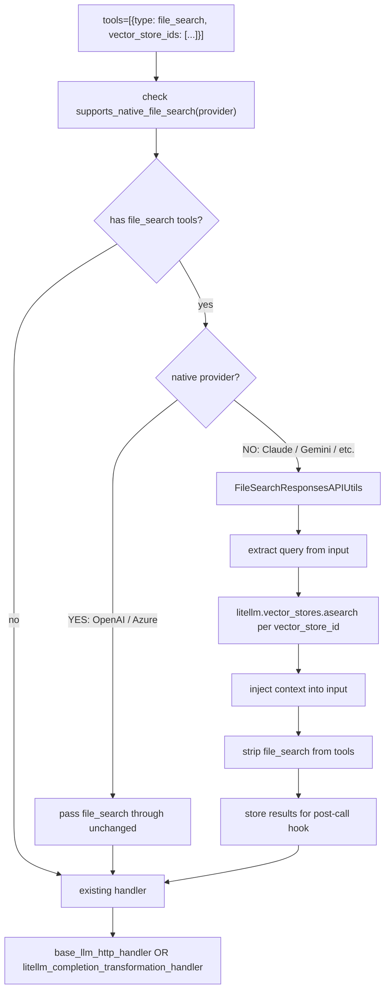

# Generic file_search in the Responses API

The **`file_search` tool** in the OpenAI Responses API lets models query vector stores for retrieval-augmented generation (RAG). Until now, only OpenAI and Azure natively supported it. LiteLLM now extends this to **all providers**—Claude, Gemini, Vertex AI, Bedrock, and more—via a single, unified contract.

Pass `tools=[{"type": "file_search", "vector_store_ids": ["vs_abc123"]}]` and LiteLLM handles the rest.

## Architecture



**Native path (OpenAI, Azure):** The `file_search` tool is forwarded to the provider as-is. The provider performs retrieval and returns citations in its response.

**Non-native path (Claude, Gemini, etc.):** LiteLLM intercepts the request before routing:

1. Extracts the query from the last user message in `input`
2. Calls `litellm.vector_stores.asearch()` for each `vector_store_id`
3. Builds a context string from the retrieved chunks
4. Injects the context as a user message before the original input
5. Strips the `file_search` tool from `tools` (other tools are preserved)
6. Forwards the enriched request to the model
7. Stores search results in `model_call_details["search_results"]` for logging and citations

## Usage

```python
import litellm

# Works with any provider—Claude, Gemini, GPT-4, etc.
response = litellm.responses(
    model="anthropic/claude-opus-4-5",
    input="What does our docs say about testing?",
    tools=[
        {
            "type": "file_search",
            "vector_store_ids": ["vs_abc123"],
        }
    ],
)
print(response)
```

Via the LiteLLM Proxy with the OpenAI SDK:

```python
from openai import OpenAI

client = OpenAI(
    base_url="http://localhost:4000",
    api_key="your-proxy-api-key",
)

response = client.responses.create(
    model="anthropic/claude-opus-4-5",
    input="Summarise the company handbook.",
    tools=[{"type": "file_search", "vector_store_ids": ["vs_handbook_abc"]}],
)
```

## Prerequisites

- **Vector stores** must be created and populated (e.g. via [Create a Vector Store](/docs/vector_stores/create)).
- **`vector_store_registry`** must be configured in the proxy `config.yaml` or via the Python SDK so LiteLLM can resolve each `vector_store_id` to the correct provider and credentials.

## Learn more

- [Responses API file_search docs](/docs/response_api#file_search-vector-store-rag)
- [Vector Store Create](/docs/vector_stores/create)
- [Vector Store Search](/docs/vector_stores/search)
