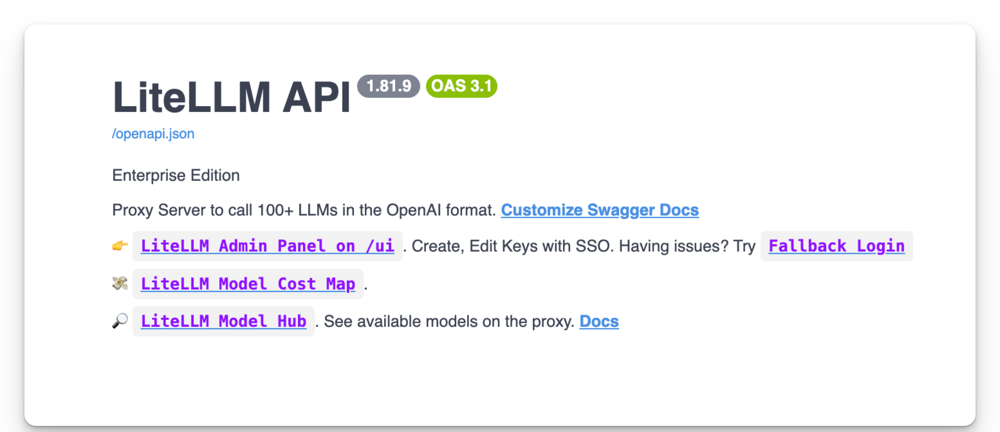

import Tabs from '@theme/Tabs';
import TabItem from '@theme/TabItem';

> **Status:** Active investigation
> **Last updated:** March 24, 2026, 2:00 PM ET

LiteLLM AI Gateway is investigating a suspected supply chain attack involving unauthorized PyPI package publishes. Current evidence suggests a maintainer's PyPI account may have been compromised and used to distribute malicious code.

At this time, we believe this incident may be linked to the broader [Trivy security compromise](https://www.aquasec.com/blog/trivy-supply-chain-attack-what-you-need-to-know/), in which stolen credentials were reportedly used to gain unauthorized access to the LiteLLM publishing pipeline.

This investigation is ongoing. Details below may change as we confirm additional findings.

## Confirmed affected versions

The following LiteLLM versions published to PyPI were impacted:

- **v1.82.7**: contained a malicious payload in the LiteLLM AI Gateway `proxy_server.py`
- **v1.82.8**: contained `litellm_init.pth` and a malicious payload in the LiteLLM AI Gateway `proxy_server.py`

If you installed or ran either of these versions, review the recommendations below immediately.

Note: These versions have already been removed from PyPI.

## What happened

Initial evidence suggests the attacker bypassed official CI/CD workflows and uploaded malicious packages directly to PyPI.

These compromised versions appear to have included a credential stealer designed to:

- Harvest secrets by scanning for:
  - environment variables
  - SSH keys
  - cloud provider credentials (AWS, GCP, Azure)
  - Kubernetes tokens
  - database passwords
- Encrypt and exfiltrate data via a `POST` request to `models.litellm.cloud`, which is **not** an official BerriAI / LiteLLM domain

## Who is affected

You may be affected if **any** of the following are true:

- You installed or upgraded LiteLLM via `pip` on **March 24, 2026**, between **10:39 UTC and 16:00 UTC**
- You ran `pip install litellm` without pinning a version and received **v1.82.7** or **v1.82.8**
- You built a Docker image during this window that included `pip install litellm` without a pinned version
- A dependency in your project pulled in LiteLLM as a transitive, unpinned dependency
  (for example through AI agent frameworks, MCP servers, or LLM orchestration tools)

You are **not** affected if any of the following are true:

**LiteLLM AI Gateway/Proxy users:** Customers running the official LiteLLM Proxy Docker image were not impacted. That deployment path pins dependencies in requirements.txt and does not rely on the compromised PyPI packages.

- You are using **LiteLLM Cloud**
- You are using the official LiteLLM AI Gateway Docker image: `ghcr.io/berriai/litellm`
- You are on **v1.82.6 or earlier** and did not upgrade during the affected window
- You installed LiteLLM from source via the GitHub repository, which was **not** compromised


### How to check if you are affected

<Tabs>
<TabItem value="sdk" label="SDK">

```bash
pip show litellm
```
</TabItem>
<TabItem value="proxy" label="PROXY">

Go to the proxy base url, and check the version of the installed LiteLLM.


</TabItem>
</Tabs>


## Indicators of compromise (IoCs)

Review affected systems for the following indicators:

- `litellm_init.pth` present in your `site-packages`
- Outbound traffic or requests to `models.litellm[.]cloud`
  This domain is **not** affiliated with LiteLLM


## Immediate actions for affected users

If you installed or ran **v1.82.7** or **v1.82.8**, take the following actions immediately.

### 1. Rotate all secrets

Treat any credentials present on the affected systems as compromised, including:

- API keys
- Cloud access keys
- Database passwords
- SSH keys
- Kubernetes tokens
- Any secrets stored in environment variables or configuration files

### 2. Inspect your filesystem

Check your `site-packages` directory for a file named `litellm_init.pth`:

```bash
find /usr/lib/python3.13/site-packages/ -name "litellm_init.pth"
```

If present:

- remove it immediately
- investigate the host for further compromise
- preserve relevant artifacts if your security team is performing forensics

### 3. Audit version history

Review your:

- Local environments
- CI/CD pipelines
- Docker builds
- Deployment logs

Confirm whether **v1.82.7** or **v1.82.8** was installed anywhere.

Pin LiteLLM to a known safe version such as **v1.82.6 or earlier**, or to a later verified release once announced.


## Response and remediation

The LiteLLM AI Gateway team has already taken the following steps:

- Removed compromised packages from PyPI
- Rotated maintainer credentials and established new authorized maintainers
- Engaged Google's Mandiant security team to assist with forensic analysis of the build and publishing chain


## Questions and support

If you believe your systems may be affected, contact us immediately:

- **Security:** `security@berri.ai`
- **Support:** `support@berri.ai`
- **Slack:** Reach out to the LiteLLM team directly

For real-time updates, follow [LiteLLM (YC W23) on X](https://x.com/LiteLLM).

