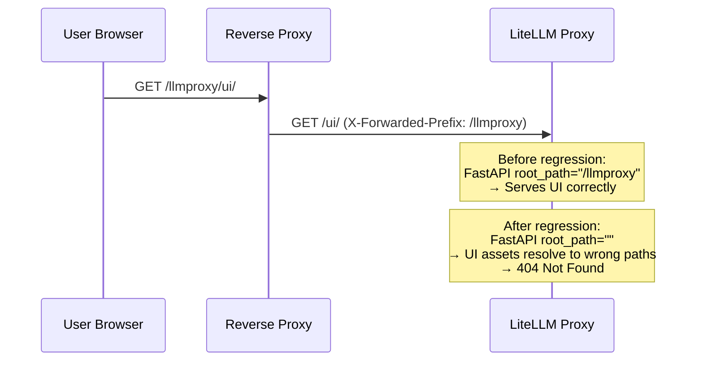
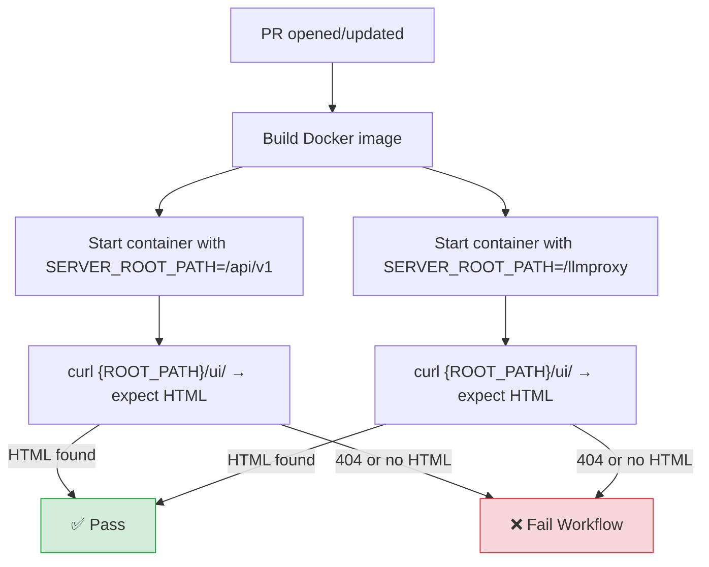

**Date:** January 22, 2026
**Duration:** ~4 days (until fix merged January 26, 2026)
**Severity:** High
**Status:** Resolved

> **Note:** This fix is available starting from LiteLLM `v1.81.3.rc.6` or higher.

## Summary

A PR ([`#19467`](https://github.com/BerriAI/litellm/pull/19467)) accidentally removed the `root_path=server_root_path` parameter from the FastAPI app initialization in `proxy_server.py`. This caused the proxy to ignore the `SERVER_ROOT_PATH` environment variable when serving the UI. Users who deploy LiteLLM behind a reverse proxy with a path prefix (e.g., `/api/v1` or `/llmproxy`) found that all UI pages returned 404 Not Found.

- **LLM API calls:** No impact. API routing was unaffected.
- **UI pages:** All UI pages returned 404 for deployments using `SERVER_ROOT_PATH`.
- **Swagger/OpenAPI docs:** Broken when accessed through the configured root path.

{/* truncate */}

---

## Background

Many LiteLLM deployments run behind a reverse proxy (e.g., Nginx, Traefik, AWS ALB) that routes traffic to LiteLLM under a path prefix. FastAPI's `root_path` parameter tells the application about this prefix so it can correctly serve static files, generate URLs, and handle routing.



The `root_path` parameter was present in `proxy_server.py` since early versions of LiteLLM. It was removed as a side effect of PR [#19467](https://github.com/BerriAI/litellm/pull/19467), which was intended to fix a different UI 404 issue.

---

## Root cause

PR [#19467](https://github.com/BerriAI/litellm/pull/19467) (`73d49f8`) removed the `root_path=server_root_path` line from the `FastAPI()` constructor in `proxy_server.py`:

```diff
 app = FastAPI(
     docs_url=_get_docs_url(),
     redoc_url=_get_redoc_url(),
     title=_title,
     description=_description,
     version=version,
-    root_path=server_root_path,
     lifespan=proxy_startup_event,
 )
```

Without `root_path`, FastAPI treated all requests as if the application was mounted at `/`, causing path mismatches for any deployment using `SERVER_ROOT_PATH`.

The regression went undetected because:

1. **No automated test** verified that `root_path` was set on the FastAPI app.
2. **No manual test procedure** existed for `SERVER_ROOT_PATH` functionality.
3. **Default deployments** (without `SERVER_ROOT_PATH`) were unaffected, so most CI tests passed.

---

## Remediation

| #   | Action                                                                                            | Status  | Code                                                                                                                       |
| --- | ------------------------------------------------------------------------------------------------- | ------- | -------------------------------------------------------------------------------------------------------------------------- |
| 1   | Restore `root_path=server_root_path` in FastAPI app initialization                                | ✅ Done | [`#19790`](https://github.com/BerriAI/litellm/pull/19790) (`5426b3c`)                                                      |
| 2   | Add unit tests for `get_server_root_path()` and FastAPI app initialization                        | ✅ Done | [`test_server_root_path.py`](https://github.com/BerriAI/litellm/blob/main/tests/proxy_unit_tests/test_server_root_path.py) |
| 3   | Add CI workflow that builds Docker image and tests UI routing with `SERVER_ROOT_PATH` on every PR | ✅ Done | [`test_server_root_path.yml`](https://github.com/BerriAI/litellm/blob/main/.github/workflows/test_server_root_path.yml)    |
| 4   | Document manual test procedure for `SERVER_ROOT_PATH`                                             | ✅ Done | [Discussion #8495](https://github.com/BerriAI/litellm/discussions/8495)                                                    |

---

## CI workflow details

The new [`test_server_root_path.yml`](https://github.com/BerriAI/litellm/blob/main/.github/workflows/test_server_root_path.yml) workflow runs on every PR against `main`. It:

1. Builds the LiteLLM Docker image
2. Starts a container with `SERVER_ROOT_PATH` set (tests both `/api/v1` and `/llmproxy`)
3. Verifies the UI returns valid HTML at `{ROOT_PATH}/ui/`
4. Fails the workflow if the UI is unreachable



This prevents future regressions where changes to `proxy_server.py` accidentally break `SERVER_ROOT_PATH` support.

---

## Timeline

| Time (UTC)         | Event                                                                                                                                                        |
| ------------------ | ------------------------------------------------------------------------------------------------------------------------------------------------------------ |
| Jan 22, 2026 04:20 | PR [#19467](https://github.com/BerriAI/litellm/pull/19467) merged, removing `root_path=server_root_path`                                                     |
| Jan 22–26          | Users on nightly builds report UI 404 errors when using `SERVER_ROOT_PATH`                                                                                   |
| Jan 26, 2026 17:48 | Fix PR [#19790](https://github.com/BerriAI/litellm/pull/19790) merged, restoring `root_path=server_root_path`                                                |
| Feb 18, 2026       | CI workflow [`test_server_root_path.yml`](https://github.com/BerriAI/litellm/blob/main/.github/workflows/test_server_root_path.yml) added to run on every PR |

---

## Resolution steps for users

For users still experiencing issues, update to the latest LiteLLM version:

```bash
pip install --upgrade litellm
```

Verify your `SERVER_ROOT_PATH` is correctly set:

```bash
# In your environment or docker-compose.yml
SERVER_ROOT_PATH="/your-prefix"
```

Then confirm the UI is accessible at `http://your-host:4000/your-prefix/ui/`.
