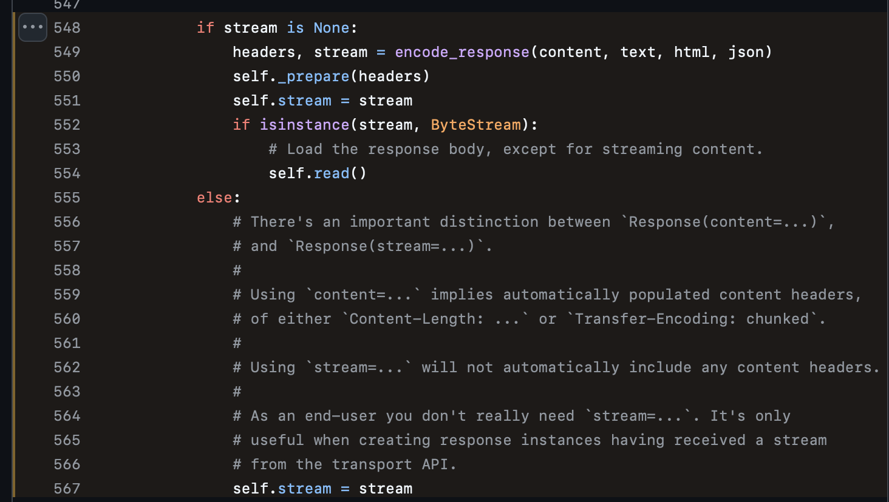

import { HappyPathScene, LeakScene, FixScene, StreamChainDiagram, ContentVsStreamDiagram } from '@site/src/components/StreamingDiagrams';

> Sometimes after roughly 30 minutes of running the LiteLLM proxy, streaming requests would just hang. Direct requests to the providers worked fine. Since the requests were hanging rather than failing, and the providers themselves were healthy, this pointed to a streaming connection issue.

{/* truncate */}

---

## Reproducing It

We wrote a self-contained Python script that starts a fake OpenAI server, starts the LiteLLM proxy pointed at it, and makes streaming requests where the client disconnects mid-stream. With the connection pool limit set to 2, the first two requests leak their connections, and the third request hangs forever waiting for a pool slot, confirming the bug.

<details>
<summary>Repro script</summary>

```python
"""
Tests streaming connection pool leak THROUGH the proxy (the real-world scenario).

Run: poetry run python tests/repro_connection_leak_proxy.py

How it works:
1. Starts a fake OpenAI server on :8099 (slow-streaming, never finishes quickly)
2. Starts the LiteLLM proxy on :4111 configured to route to the fake server
3. Client makes streaming requests to the proxy, reads a few chunks, then disconnects
4. After exhausting the pool, tries one more request to see if it hangs

BEFORE fix: Request 3 hangs (pool exhausted, connections leaked)
AFTER fix:  Request 3 succeeds (async_data_generator finally block releases connections)
"""

import os

# Set low pool limits BEFORE importing litellm
os.environ["AIOHTTP_CONNECTOR_LIMIT_PER_HOST"] = "2"
os.environ["AIOHTTP_CONNECTOR_LIMIT"] = "2"
# Disable auth so we don't need a real key for the proxy
os.environ["LITELLM_MASTER_KEY"] = "sk-test-master-key"

import asyncio
import json
import uuid
import subprocess
import sys
import time
import signal

import httpx
from fastapi import FastAPI
from fastapi.responses import StreamingResponse
import uvicorn

# ── Fake slow-streaming OpenAI server ──────────────────────────

fake_app = FastAPI()


async def slow_stream():
    for i in range(200):
        chunk = {
            "id": f"chatcmpl-{uuid.uuid4().hex}",
            "object": "chat.completion.chunk",
            "created": 1677652288,
            "model": "gpt-3.5-turbo",
            "choices": [
                {
                    "index": 0,
                    "delta": {"content": f"word{i} "},
                    "finish_reason": None,
                }
            ],
        }
        yield f"data: {json.dumps(chunk)}\n\n"
        await asyncio.sleep(0.5)  # slow enough that client will disconnect before done
    yield "data: [DONE]\n\n"


@fake_app.post("/v1/chat/completions")
async def completions():
    return StreamingResponse(slow_stream(), media_type="text/event-stream")


def start_fake_server():
    uvicorn.run(fake_app, host="127.0.0.1", port=8099, log_level="warning")


# ── Proxy config ──────────────────────────────────────────────

PROXY_CONFIG = {
    "model_list": [
        {
            "model_name": "fake-model",
            "litellm_params": {
                "model": "openai/gpt-3.5-turbo",
                "api_key": "fake-key",
                "api_base": "http://127.0.0.1:8099/v1",
            },
        }
    ],
    "general_settings": {
        "master_key": "sk-test-master-key",
    },
}

PROXY_PORT = 4111
PROXY_URL = f"http://127.0.0.1:{PROXY_PORT}"


# ── Client that disconnects mid-stream ────────────────────────


async def stream_and_disconnect(request_num: int):
    """Connect to the proxy, read a few chunks, then disconnect abruptly."""
    async with httpx.AsyncClient() as client:
        async with client.stream(
            "POST",
            f"{PROXY_URL}/v1/chat/completions",
            json={
                "model": "fake-model",
                "messages": [{"role": "user", "content": "hello"}],
                "stream": True,
            },
            headers={"Authorization": "Bearer sk-test-master-key"},
            timeout=30.0,
        ) as resp:
            chunks_read = 0
            async for line in resp.aiter_lines():
                if line.startswith("data: ") and line != "data: [DONE]":
                    chunks_read += 1
                    if chunks_read >= 3:
                        print(
                            f"[Request {request_num}] Read {chunks_read} chunks, disconnecting..."
                        )
                        return  # abrupt disconnect — context manager closes connection


async def main():
    import threading
    import tempfile
    import yaml

    pool_limit = int(os.environ["AIOHTTP_CONNECTOR_LIMIT_PER_HOST"])

    print("=" * 60)
    print("CONNECTION POOL LEAK TEST (through proxy)")
    print(f"Pool limit per host: {pool_limit}")
    print("=" * 60)

    # 1. Start fake OpenAI server
    print("\n[Setup] Starting fake OpenAI server on :8099...")
    server_thread = threading.Thread(target=start_fake_server, daemon=True)
    server_thread.start()
    await asyncio.sleep(1)

    # 2. Write temp config and start proxy as subprocess
    config_path = tempfile.NamedTemporaryFile(
        mode="w", suffix=".yaml", delete=False, prefix="litellm_test_"
    )
    yaml.dump(PROXY_CONFIG, config_path)
    config_path.close()

    print(f"[Setup] Starting LiteLLM proxy on :{PROXY_PORT}...")
    proxy_proc = subprocess.Popen(
        [
            "litellm",
            "--config", config_path.name,
            "--port", str(PROXY_PORT),
            "--num_workers", "1",
        ],
        stdout=subprocess.PIPE,
        stderr=subprocess.STDOUT,
        env={**os.environ},
    )

    # Wait for proxy to be ready
    for i in range(30):
        ret = proxy_proc.poll()
        if ret is not None:
            stdout = proxy_proc.stdout.read().decode() if proxy_proc.stdout else ""
            print(f"[Setup] ERROR: Proxy exited with code {ret}")
            return
        try:
            async with httpx.AsyncClient() as client:
                r = await client.get(f"{PROXY_URL}/health/liveliness")
                if r.status_code == 200:
                    print("[Setup] Proxy is ready!")
                    break
        except (httpx.ConnectError, httpx.RemoteProtocolError):
            pass
        await asyncio.sleep(1)
    else:
        print("[Setup] ERROR: Proxy failed to start (timeout)")
        proxy_proc.kill()
        return

    # 3. Exhaust the connection pool
    try:
        for i in range(pool_limit):
            print(f"\n[Request {i+1}] Streaming from proxy then disconnecting...")
            await stream_and_disconnect(i + 1)
            await asyncio.sleep(0.5)

        # 4. Try one more — will it hang?
        next_req = pool_limit + 1
        print(f"\n{'=' * 60}")
        print(f"[Request {next_req}] If pool is leaked, this will HANG...")
        print(f"{'=' * 60}\n")

        try:
            await asyncio.wait_for(stream_and_disconnect(next_req), timeout=15)
            print(f"\n** SUCCESS: Request {next_req} completed! No pool exhaustion. **")
        except asyncio.TimeoutError:
            print(f"\n!! FAILURE: Request {next_req} TIMED OUT — connection pool exhausted !!")

    finally:
        proxy_proc.send_signal(signal.SIGTERM)
        try:
            stdout, _ = proxy_proc.communicate(timeout=5)
        except subprocess.TimeoutExpired:
            proxy_proc.kill()
            stdout, _ = proxy_proc.communicate()
        os.unlink(config_path.name)


if __name__ == "__main__":
    asyncio.run(main())
```

</details>

---

## How the Connection Pool Works

When a client makes a streaming request through the proxy, there are two separate connections:

```
Client ↔ Connection A ↔ Proxy ↔ Connection B ↔ Provider
```

The proxy holds Connection B in a pool. By default there are 500 slots per provider host. On the happy path, a connection is acquired from the pool, used for streaming, and released when the stream completes:

<HappyPathScene />

---

## The Leak

When a client disconnects mid-stream, the upstream HTTP connection should be released back to the pool. Instead, it stays stuck in its pool slot. Over time, leaked connections accumulate and the pool fills up. New requests hang waiting for a slot that will never free up:

<LeakScene />

---

## The Initial Fix

LiteLLM's `CustomStreamWrapper` is the universal streaming adapter that wraps every provider's raw HTTP stream and normalizes the chunks into a single response format. The proxy interacts with this wrapper, not the raw provider connection. But `CustomStreamWrapper` didn't have an `aclose()` method, so there was no way for cleanup code to reach through it and release the underlying HTTP connection.

The obvious first step: give the cleanup path a way to release the connection, and make sure it always runs.

<StreamChainDiagram />

1. **Added `aclose()` to `CustomStreamWrapper`** so that cleanup code can delegate down through the wrapper to the underlying stream's close and release the HTTP connection.

2. **Added a `finally` block in `async_data_generator`** to ensure the connection is always released, whether the stream completes normally, the client disconnects, or something throws. `async_data_generator` is the async generator that pulls chunks from `CustomStreamWrapper` and yields them to the client as they come in.

We ran the repro script. The leak was still there.

---

## Why It Was Still Leaking

We added logging throughout the cleanup chain and reran the repro. `aclose()` wasn't actually closing anything, and the `finally` block wasn't even being hit. Here's what we found.

### The `aclose()` call chain was broken

This was the hardest problem to track down, and the most impactful.

In our aiohttp transport layer (`aiohttp_transport.py`), the httpx Response was constructed using `content=` instead of `stream=`:

```python
# Before (broken): content= eagerly reads the body and wraps it in a ByteStream
# whose aclose() is a no-op
return httpx.Response(status_code=status_code, content=stream, ...)

# After (fixed): stream= preserves the original async stream so aclose()
# propagates to the real connection
return httpx.Response(status_code=status_code, stream=stream, ...)
```

This single-word difference has significant consequences. Here's the relevant section from httpx's [Response constructor](https://github.com/encode/httpx/blob/master/httpx/_models.py#L548-L567), where a 6-year-old comment leads the way:



When `content=` is used, httpx consumes the data immediately and discards the original stream. By the time `aclose()` is called, there's nothing left to close. The real HTTP connection is never released.

When you pass `stream=`, httpx keeps the original stream intact. Closing the response actually closes the underlying connection and returns it to the pool. 

The httpx source code comment goes: "stream= is only useful when creating response instances having received a stream from the transport API", which is exactly what our aiohttp transport does.


<ContentVsStreamDiagram />

Because we were using `content=`, every cancelled streaming request had a silently broken cleanup path. When a client disconnected mid-stream, the `aclose()` call that should have released the connection was a no-op. It wasn't a missing reference that garbage collection could fix; the close mechanism itself was pointing at the wrong thing.

#### Smaller fixes that also needed to happen

<details>
<summary>Cleanup was cancelled before it could finish</summary>

With the stream fix in place, `aclose()` now reached the right function. But it wasn't completing.

When a client disconnects, Starlette cancels the streaming task. This cancellation is aggressive: it interrupts every `await` inside the task, including the ones in our `finally` block that are trying to clean up the connection. The cleanup code runs, but each async call inside it is immediately killed before it can finish.

So the fix was wrapping the cleanup in `anyio.CancelScope(shield=True)`, which temporarily protects it from cancellation so it can complete before the task is torn down.

</details>

<details>
<summary>Uvicorn disconnect detection gap</summary>

On Uvicorn versions 0.28 through 0.32.0, the `finally` block in our async generator wasn't being triggered on client disconnect at all. These versions of Uvicorn reported support for ASGI spec 2.4 but didn't actually implement its disconnect signaling. Starlette saw the reported spec version and skipped its own fallback disconnect detection, meaning disconnects went completely unnoticed.

This has been fixed upstream in Uvicorn 0.32.1+, which correctly references ASGI spec 2.3 and causes Starlette to use its own disconnect detection. LiteLLM now pins Uvicorn to `>=0.32.1` to ensure this works correctly.

</details>

---

## The Complete Fix

Running the repro script again: request 3 completes instead of hanging. The `finally` block now properly releases the connection on disconnect:

<FixScene />

---

## Going Forward

Streaming performance and reliability has been a top issue for us. We're putting a [sustained emphasis on performance and reliability](https://www.linkedin.com/feed/update/urn:li:activity:7433372716365332480/) for streaming workloads, and this fix is part of that recent effort.

For LiteLLM users, streaming connections through the proxy are now properly released on client disconnect instead of leaking until pool exhaustion.

In addition to regression and e2e tests in our CI/CD workflow, we are also adding a test suite to the [LiteLLM Observatory](/blog/litellm-observatory) to verify on major releases that there are no breaking regressions for these streaming changes under a production workload.
