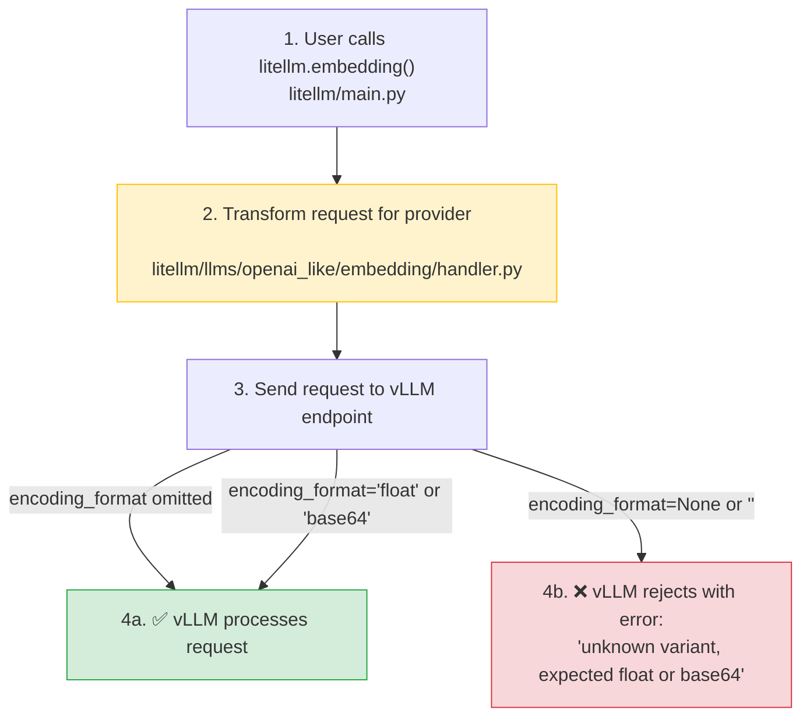

**Date:** Feb 16, 2026
**Duration:** ~3 hours
**Severity:** High (for vLLM embedding users)
**Status:** Resolved

## Summary

A commit ([`dbcae4a`](https://github.com/BerriAI/litellm/commit/dbcae4aca5836770d0e9cd43abab0333c3d61ab2)) intended to fix OpenAI SDK behavior broke vLLM embeddings by explicitly passing `encoding_format=None` in API requests. vLLM rejects this with error: `"unknown variant \`\`, expected float or base64"`.

- **vLLM embedding calls:** Complete failure - all requests rejected
- **Other providers:** No impact - OpenAI and other providers functioned normally
- **Other vLLM functionality:** No impact - only embeddings were affected

{/* truncate */}

---

## Background

The `encoding_format` parameter for embeddings specifies whether vectors should be returned as `float` arrays or `base64` encoded strings. Different providers have different expectations:

- **OpenAI SDK:** If `encoding_format` is omitted, the SDK adds a default value of `"float"`
- **vLLM:** Strictly validates `encoding_format` - only accepts `"float"`, `"base64"`, or complete omission. Rejects `None` or empty string values.



---

## Root cause

A well-intentioned fix for OpenAI SDK behavior inadvertently broke vLLM embeddings:

**The Breaking Change ([`dbcae4a`](https://github.com/BerriAI/litellm/commit/dbcae4aca5836770d0e9cd43abab0333c3d61ab2)):**

In `litellm/main.py`, the code was changed to explicitly set `encoding_format=None` instead of omitting it:

```python
# Added in dbcae4a
if encoding_format is not None:
    optional_params["encoding_format"] = encoding_format
else:
    # Omitting causes openai sdk to add default value of "float"
    optional_params["encoding_format"] = None
```

This fix worked correctly for OpenAI - explicitly passing `None` prevented the SDK from adding its default value. However, vLLM's strict parameter validation rejected `None` values, causing all embedding requests to fail.

---

## The Fix

Fix deployed ([`55348dd`](https://github.com/BerriAI/litellm/commit/55348dd9c51b5b028f676d25ad023b8f052fc071)). The solution filters out `None` and empty string values from `optional_params` before sending requests to OpenAI-like providers (including vLLM).

**In `litellm/llms/openai_like/embedding/handler.py`:**

```python
# Before (broken)
data = {"model": model, "input": input, **optional_params}

# After (fixed)
filtered_optional_params = {k: v for k, v in optional_params.items() if v not in (None, '')}
data = {"model": model, "input": input, **filtered_optional_params}
```

This ensures:
- Valid values (`"float"`, `"base64"`) are preserved and sent
- `None` and empty string values are filtered out (parameter omitted entirely)
- OpenAI SDK no longer adds defaults because liteLLM handles the parameter upstream

---

## Remediation

| # | Action | Status | Code |
|---|---|---|---|
| 1 | Filter `None` and empty string values in OpenAI-like embedding handler | ✅ Done | [`handler.py#L108`](https://github.com/BerriAI/litellm/blob/main/litellm/llms/openai_like/embedding/handler.py#L108) |
| 2 | Unit tests for parameter filtering (None, empty string, valid values) | ✅ Done | [`test_openai_like_embedding.py`](https://github.com/BerriAI/litellm/blob/main/tests/test_litellm/llms/openai_like/embedding/test_openai_like_embedding.py) |
| 3 | Transformation tests for hosted_vllm embedding config | ✅ Done | [`test_hosted_vllm_embedding_transformation.py`](https://github.com/BerriAI/litellm/blob/main/tests/test_litellm/llms/hosted_vllm/embedding/test_hosted_vllm_embedding_transformation.py) |
| 4 | E2E tests with actual vLLM endpoint | ✅ Done | [`test_hosted_vllm_embedding_e2e.py`](https://github.com/BerriAI/litellm/blob/main/tests/test_litellm/llms/hosted_vllm/embedding/test_hosted_vllm_embedding_e2e.py) |
| 5 | Validate JSON payload structure matches vLLM expectations | ✅ Done | Tests verify exact JSON sent to endpoint |

---
