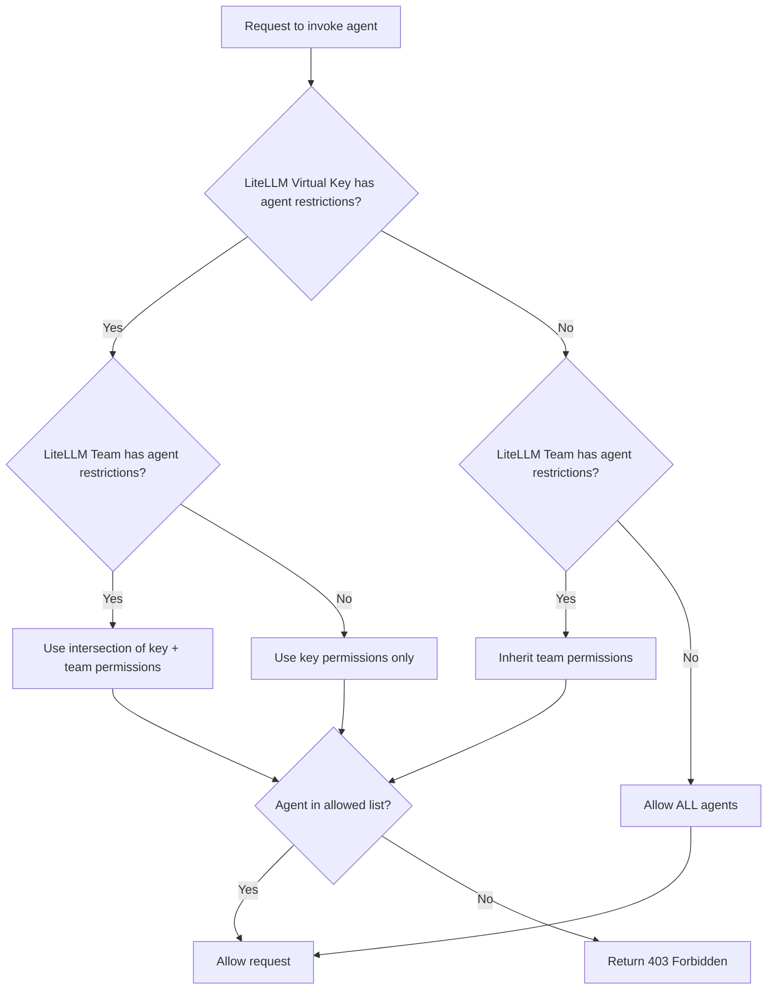

import Tabs from '@theme/Tabs';
import TabItem from '@theme/TabItem';
import Image from '@theme/IdealImage';

# Agent Permission Management

Control which A2A agents can be accessed by specific keys or teams in LiteLLM.

## Overview

Agent Permission Management lets you restrict which agents a LiteLLM Virtual Key or Team can access. This is useful for:

- **Multi-tenant environments**: Give different teams access to different agents
- **Security**: Prevent keys from invoking agents they shouldn't have access to
- **Compliance**: Enforce access policies for sensitive agent workflows

When permissions are configured:
- `GET /v1/agents` only returns agents the key/team can access
- `POST /a2a/{agent_id}` (Invoking an agent) returns `403 Forbidden` if access is denied

## Setting Permissions on a Key

This example shows how to create a key with agent permissions and test access.

### 1. Get Your Agent ID

<Tabs>
<TabItem value="ui" label="UI">

[TODO: Add screenshot of agents list in UI]

</TabItem>
<TabItem value="api" label="API">

```bash title="List all agents" showLineNumbers
curl "http://localhost:4000/v1/agents" \
  -H "Authorization: Bearer sk-master-key"
```

Response:
```json title="Response" showLineNumbers
{
  "agents": [
    {"agent_id": "agent-123", "name": "Support Agent"},
    {"agent_id": "agent-456", "name": "Sales Agent"}
  ]
}
```

</TabItem>
</Tabs>

### 2. Create a Key with Agent Permissions

<Tabs>
<TabItem value="ui" label="UI">

[TODO: Add screenshot of key creation with agent permissions]

</TabItem>
<TabItem value="api" label="API">

```bash title="Create key with agent permissions" showLineNumbers
curl -X POST "http://localhost:4000/key/generate" \
  -H "Authorization: Bearer sk-master-key" \
  -H "Content-Type: application/json" \
  -d '{
    "object_permission": {
      "agents": ["agent-123"]
    }
  }'
```

</TabItem>
</Tabs>

### 3. Test Access

**Allowed agent (succeeds):**
```bash title="Invoke allowed agent" showLineNumbers
curl -X POST "http://localhost:4000/a2a/agent-123" \
  -H "Authorization: Bearer sk-your-new-key" \
  -H "Content-Type: application/json" \
  -d '{"message": {"role": "user", "parts": [{"type": "text", "text": "Hello"}]}}'
```

**Blocked agent (fails with 403):**
```bash title="Invoke blocked agent" showLineNumbers
curl -X POST "http://localhost:4000/a2a/agent-456" \
  -H "Authorization: Bearer sk-your-new-key" \
  -H "Content-Type: application/json" \
  -d '{"message": {"role": "user", "parts": [{"type": "text", "text": "Hello"}]}}'
```

Response:
```json title="403 Forbidden Response" showLineNumbers
{
  "error": {
    "message": "Access denied to agent: agent-456",
    "code": 403
  }
}
```

## Setting Permissions on a Team

Restrict all keys belonging to a team to only access specific agents.

### 1. Create a Team with Agent Permissions

<Tabs>
<TabItem value="ui" label="UI">

[TODO: Add screenshot of team creation with agent permissions]

</TabItem>
<TabItem value="api" label="API">

```bash title="Create team with agent permissions" showLineNumbers
curl -X POST "http://localhost:4000/team/new" \
  -H "Authorization: Bearer sk-master-key" \
  -H "Content-Type: application/json" \
  -d '{
    "team_alias": "support-team",
    "object_permission": {
      "agents": ["agent-123"]
    }
  }'
```

Response:
```json title="Response" showLineNumbers
{
  "team_id": "team-abc-123",
  "team_alias": "support-team"
}
```

</TabItem>
</Tabs>

### 2. Create a Key for the Team

<Tabs>
<TabItem value="ui" label="UI">

[TODO: Add screenshot of key creation for team]

</TabItem>
<TabItem value="api" label="API">

```bash title="Create key for team" showLineNumbers
curl -X POST "http://localhost:4000/key/generate" \
  -H "Authorization: Bearer sk-master-key" \
  -H "Content-Type: application/json" \
  -d '{
    "team_id": "team-abc-123"
  }'
```

</TabItem>
</Tabs>

### 3. Test Access

The key inherits agent permissions from the team.

**Allowed agent (succeeds):**
```bash title="Invoke allowed agent" showLineNumbers
curl -X POST "http://localhost:4000/a2a/agent-123" \
  -H "Authorization: Bearer sk-team-key" \
  -H "Content-Type: application/json" \
  -d '{"message": {"role": "user", "parts": [{"type": "text", "text": "Hello"}]}}'
```

**Blocked agent (fails with 403):**
```bash title="Invoke blocked agent" showLineNumbers
curl -X POST "http://localhost:4000/a2a/agent-456" \
  -H "Authorization: Bearer sk-team-key" \
  -H "Content-Type: application/json" \
  -d '{"message": {"role": "user", "parts": [{"type": "text", "text": "Hello"}]}}'
```

## How It Works



| Scenario | Result |
|----------|--------|
| No agents configured on key or team | Access to ALL agents |
| Agents configured on key only | Only those agents allowed |
| Agents configured on team only | Key inherits team's agents |
| Agents on both key AND team | Intersection (most restrictive) |

## Viewing Permissions

<Tabs>
<TabItem value="ui" label="UI">

[TODO: Add screenshot showing agent permissions in key/team info view]

</TabItem>
<TabItem value="api" label="API">

```bash title="Get key info" showLineNumbers
curl "http://localhost:4000/key/info?key=sk-your-key" \
  -H "Authorization: Bearer sk-master-key"
```

</TabItem>
</Tabs>
