import Tabs from '@theme/Tabs';
import TabItem from '@theme/TabItem';
import Image from '@theme/IdealImage';

# Agent Permission Management

Control which A2A agents can be accessed by specific keys or teams in LiteLLM. When a client attempts to list or invoke agents, LiteLLM enforces access controls based on configured permissions.

## How It Works

```mermaid
flowchart TD
    A[Request to invoke agent] --> B{Key has agent restrictions?}
    B -->|Yes| C{Team has agent restrictions?}
    B -->|No| D{Team has agent restrictions?}
    
    C -->|Yes| E[Use intersection of key + team permissions]
    C -->|No| F[Use key permissions only]
    
    D -->|Yes| G[Inherit team permissions]
    D -->|No| H[Allow ALL agents]
    
    E --> I{Agent in allowed list?}
    F --> I
    G --> I
    H --> J[Allow request]
    
    I -->|Yes| J
    I -->|No| K[Return 403 Forbidden]
```



| Scenario | Result |
|----------|--------|
| No agents configured on key or team | Access to ALL agents |
| Agents configured on key only | Only those agents allowed |
| Agents configured on team only | Key inherits team's agents |
| Agents on both key AND team | Intersection (most restrictive) |

## Setting Agent Permissions

### On a Key

<Tabs>
<TabItem value="api" label="API">

```bash
curl -X POST "http://localhost:4000/key/generate" \
  -H "Authorization: Bearer sk-master-key" \
  -H "Content-Type: application/json" \
  -d '{
    "object_permission": {
      "agents": ["agent-id-1", "agent-id-2"]
    }
  }'
```

</TabItem>
<TabItem value="ui" label="UI">

[TODO: Add screenshot of key creation with agent permissions]

</TabItem>
</Tabs>

### On a Team

<Tabs>
<TabItem value="api" label="API">

```bash
curl -X POST "http://localhost:4000/team/new" \
  -H "Authorization: Bearer sk-master-key" \
  -H "Content-Type: application/json" \
  -d '{
    "object_permission": {
      "agents": ["agent-id-1"]
    }
  }'
```

</TabItem>
<TabItem value="ui" label="UI">

[TODO: Add screenshot of team creation with agent permissions]

</TabItem>
</Tabs>

## Viewing Agent Permissions

When agent permissions are configured on a key or team, the allowed agents are displayed in the info view.

<Tabs>
<TabItem value="api" label="API">

```bash
# Get key info
curl "http://localhost:4000/key/info?key=sk-your-key" \
  -H "Authorization: Bearer sk-master-key"

# Response includes object_permission.agents
```

</TabItem>
<TabItem value="ui" label="UI">

[TODO: Add screenshot showing agent permissions in key/team info view]

</TabItem>
</Tabs>

## Behavior

### Listing Agents (`GET /v1/agents`)

Returns only agents the key/team has permission to access.

### Invoking Agents (`POST /a2a/{agent_id}`)

Returns `403 Forbidden` if the key/team doesn't have access to the requested agent.

### Agent Discovery (`GET /a2a/{agent_id}/.well-known/agent.json`)

Returns `403 Forbidden` if the key/team doesn't have access to the agent.
