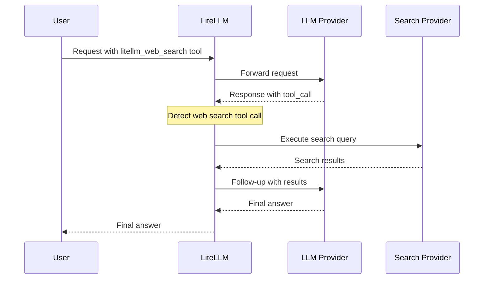

import Tabs from '@theme/Tabs';
import TabItem from '@theme/TabItem';

# Web Search

LiteLLM supports two complementary approaches to web search — choose the one that fits your use case:

| | **Native Provider Search** | **Web Search Interception** |
|---|---|---|
| **How it works** | Pass `web_search_options` or `web_search_preview` tool; the provider searches the web natively | LiteLLM intercepts `litellm_web_search` tool calls and executes them via a third-party search provider |
| **Providers** | OpenAI, xAI, Anthropic, Gemini, Perplexity (native search models only) | Any provider — OpenAI, Anthropic, Mistral, Groq, Bedrock, Azure, and 20+ more |
| **Search engine** | Provider's own (OpenAI Search, Google, Anthropic, xAI/X) | Perplexity, Tavily, Exa AI, Google PSE, Firecrawl, SearXNG, Linkup, and more |
| **LiteLLM version** | `v1.71.0+` | `v1.71.0+` |

---

## Approach 1: Native Provider Web Search

Use a provider's built-in search capability. Supported via `/chat/completions` (with `web_search_options`) and `/responses` (with `web_search_preview` tool).

### Supported Providers

| Provider | Search Engine | Models |
|----------|--------------|--------|
| **OpenAI** | OpenAI Search | `gpt-5-search-api`, `gpt-4o-search-preview`, `gpt-4o-mini-search-preview` |
| **xAI** | xAI Search + X/Twitter | `grok-3` |
| **Google AI / Vertex AI** | Google Search | `gemini-2.0-flash` |
| **Anthropic** | Anthropic Web Search | `claude-3-5-sonnet-latest`, `claude-3-5-haiku-latest`, `claude-3-7-sonnet-20250219` |
| **Perplexity** | Perplexity Search | Perplexity models |

:::warning Only search models support `web_search_options` on OpenAI
For OpenAI, only `gpt-4o-search-preview`, `gpt-4o-mini-search-preview`, and `gpt-5-search-api` support `web_search_options`. Regular models (`gpt-5`, `gpt-4.1`, `gpt-4o`) use the `/responses` endpoint with the `web_search_preview` tool instead.
:::

### `/chat/completions`

<Tabs>
<TabItem value="sdk" label="SDK">

```python showLineNumbers
from litellm import completion

response = completion(
    model="openai/gpt-5-search-api",
    messages=[{"role": "user", "content": "What was a positive news story from today?"}],
    web_search_options={
        "search_context_size": "medium"  # "low" | "medium" | "high"
    }
)
```

</TabItem>
<TabItem value="proxy" label="Proxy">

1. Setup `config.yaml`

```yaml
model_list:
  - model_name: gpt-5-search-api
    litellm_params:
      model: openai/gpt-5-search-api
      api_key: os.environ/OPENAI_API_KEY

  - model_name: grok-3
    litellm_params:
      model: xai/grok-3
      api_key: os.environ/XAI_API_KEY

  - model_name: claude-3-5-sonnet-latest
    litellm_params:
      model: anthropic/claude-3-5-sonnet-latest
      api_key: os.environ/ANTHROPIC_API_KEY

  - model_name: gemini-2-flash
    litellm_params:
      model: gemini-2.0-flash
      vertex_project: your-project-id
      vertex_location: us-central1
```

2. Start the proxy

```bash
litellm --config /path/to/config.yaml
```

3. Call it

```python showLineNumbers
from openai import OpenAI

client = OpenAI(api_key="sk-1234", base_url="http://0.0.0.0:4000")

response = client.chat.completions.create(
    model="gpt-5-search-api",
    messages=[{"role": "user", "content": "What was a positive news story from today?"}],
    extra_body={"web_search_options": {"search_context_size": "medium"}}
)
```

</TabItem>
</Tabs>

#### Search context size

<Tabs>
<TabItem value="sdk" label="SDK">

```python showLineNumbers
# OpenAI
response = completion(model="openai/gpt-5-search-api", messages=[...],
    web_search_options={"search_context_size": "low"})

# xAI
response = completion(model="xai/grok-3", messages=[...],
    web_search_options={"search_context_size": "high"})

# Anthropic (also supports user_location)
response = completion(model="anthropic/claude-3-5-sonnet-latest", messages=[...],
    web_search_options={
        "search_context_size": "medium",
        "user_location": {"type": "approximate", "approximate": {"city": "San Francisco"}}
    })

# Gemini
response = completion(model="gemini-2.0-flash", messages=[...],
    web_search_options={"search_context_size": "low"})
```

</TabItem>
<TabItem value="proxy" label="Proxy">

```python showLineNumbers
response = client.chat.completions.create(
    model="grok-3",
    messages=[{"role": "user", "content": "What was a positive news story from today?"}],
    web_search_options={"search_context_size": "low"}
)
```

</TabItem>
</Tabs>

### `/responses`

Use the `web_search_preview` tool with general-purpose models like `gpt-5`, `gpt-4.1`, `gpt-4o`.

:::info
Search-dedicated models (`gpt-5-search-api`, `gpt-4o-search-preview`) do **not** support `/responses`. Use them with `/chat/completions` + `web_search_options` instead.
:::

<Tabs>
<TabItem value="sdk" label="SDK">

```python showLineNumbers
from litellm import responses

response = responses(
    model="openai/gpt-5",
    input="What is the capital of France?",
    tools=[{"type": "web_search_preview"}]
)
```

</TabItem>
<TabItem value="proxy" label="Proxy">

1. Setup `config.yaml`

```yaml
model_list:
  - model_name: gpt-5
    litellm_params:
      model: openai/gpt-5
      api_key: os.environ/OPENAI_API_KEY
```

2. Start the proxy and call it

```python showLineNumbers
from openai import OpenAI

client = OpenAI(api_key="sk-1234", base_url="http://0.0.0.0:4000")

response = client.responses.create(
    model="gpt-5",
    tools=[{"type": "web_search_preview"}],
    input="What is the capital of France?",
)
print(response.output_text)
```

</TabItem>
</Tabs>

#### Search context size (responses)

```python showLineNumbers
response = responses(
    model="openai/gpt-5",
    input="What is the capital of France?",
    tools=[{"type": "web_search_preview", "search_context_size": "low"}]
)
```

### Configuring defaults in config.yaml

<Tabs>
<TabItem value="default" label="Default">

```yaml
model_list:
  - model_name: grok-3
    litellm_params:
      model: xai/grok-3
      api_key: os.environ/XAI_API_KEY
      web_search_options: {}  # enables web search with default settings
```

</TabItem>
<TabItem value="custom" label="Custom Context">

```yaml
model_list:
  - model_name: grok-3
    litellm_params:
      model: xai/grok-3
      api_key: os.environ/XAI_API_KEY
      web_search_options:
        search_context_size: "high"

  - model_name: gpt-5-search-api
    litellm_params:
      model: openai/gpt-5-search-api
      api_key: os.environ/OPENAI_API_KEY
      web_search_options:
        search_context_size: "low"
```

</TabItem>
</Tabs>

You can also configure the router to skip deployments that don't support web search:

```yaml
model_list:
  - model_name: gpt-4.1
    litellm_params:
      model: openai/gpt-4.1
  - model_name: gpt-4.1
    litellm_params:
      model: azure/gpt-4.1
      api_base: "x.openai.azure.com/"
      api_version: 2025-03-01-preview
    model_info:
      supports_web_search: false  # LiteLLM will skip this deployment for web search requests
```

### Checking if a model supports web search

<Tabs>
<TabItem value="sdk" label="SDK">

```python showLineNumbers
import litellm

litellm.supports_web_search(model="openai/gpt-5-search-api")    # True
litellm.supports_web_search(model="xai/grok-3")                  # True
litellm.supports_web_search(model="anthropic/claude-3-5-sonnet-latest")  # True
litellm.supports_web_search(model="gemini-2.0-flash")            # True
```

</TabItem>
<TabItem value="proxy" label="Proxy">

```bash
curl -X GET 'http://localhost:4000/model_group/info' \
  -H 'x-api-key: sk-1234'
```

Look for `"supports_web_search": true` in the response.

</TabItem>
</Tabs>

---

## Approach 2: Web Search Interception

Enable web search for **any provider** — including those without native search support. LiteLLM intercepts `litellm_web_search` tool calls and executes them using your configured search provider, then returns the final answer automatically.

### How it works



One API call in → complete answer with search results out.

### Supported Search Providers

| Provider | `search_provider` value | Environment Variable |
|----------|------------------------|----------------------|
| **Perplexity AI** | `perplexity` | `PERPLEXITYAI_API_KEY` |
| **Tavily** | `tavily` | `TAVILY_API_KEY` |
| **Exa AI** | `exa_ai` | `EXA_API_KEY` |
| **Parallel AI** | `parallel_ai` | `PARALLEL_AI_API_KEY` |
| **Google PSE** | `google_pse` | `GOOGLE_PSE_API_KEY`, `GOOGLE_PSE_ENGINE_ID` |
| **DataForSEO** | `dataforseo` | `DATAFORSEO_LOGIN`, `DATAFORSEO_PASSWORD` |
| **Firecrawl** | `firecrawl` | `FIRECRAWL_API_KEY` |
| **SearXNG** | `searxng` | `SEARXNG_API_BASE` |
| **Linkup** | `linkup` | `LINKUP_API_KEY` |

### Quick Start

**1. Configure `config.yaml`**

```yaml
model_list:
  - model_name: gpt-4o
    litellm_params:
      model: openai/gpt-4o
      api_key: os.environ/OPENAI_API_KEY

litellm_settings:
  callbacks:
    - websearch_interception:
        enabled_providers:
          - openai
          - anthropic
          - mistral
        search_tool_name: perplexity-search  # optional — uses first tool if not set

search_tools:
  - search_tool_name: perplexity-search
    litellm_params:
      search_provider: perplexity
      api_key: os.environ/PERPLEXITY_API_KEY

  - search_tool_name: tavily-search
    litellm_params:
      search_provider: tavily
      api_key: os.environ/TAVILY_API_KEY
```

**2. Call with the `litellm_web_search` tool**

<Tabs>
<TabItem value="sdk" label="SDK">

```python showLineNumbers
import litellm

response = await litellm.acompletion(
    model="gpt-4o",
    messages=[{"role": "user", "content": "What are the latest AI news?"}],
    tools=[
        {
            "type": "function",
            "function": {
                "name": "litellm_web_search",
                "description": "Search the web for current information",
                "parameters": {
                    "type": "object",
                    "properties": {"query": {"type": "string"}},
                    "required": ["query"]
                }
            }
        }
    ]
)
print(response.choices[0].message.content)
```

</TabItem>
<TabItem value="proxy" label="Proxy">

```bash
curl http://localhost:4000/v1/chat/completions \
  -H "Content-Type: application/json" \
  -H "Authorization: Bearer $LITELLM_API_KEY" \
  -d '{
    "model": "gpt-4o",
    "messages": [{"role": "user", "content": "What is the weather in San Francisco?"}],
    "tools": [
      {
        "type": "function",
        "function": {
          "name": "litellm_web_search",
          "description": "Search the web",
          "parameters": {
            "type": "object",
            "properties": {"query": {"type": "string"}},
            "required": ["query"]
          }
        }
      }
    ]
  }'
```

</TabItem>
</Tabs>

### Supported LLM Providers

Works with any provider that uses LiteLLM's Base HTTP Handler or OpenAI Handler:

| Provider | Provider | Provider |
|----------|----------|----------|
| OpenAI | Anthropic | Azure OpenAI |
| MiniMax | Mistral | Cohere |
| Fireworks AI | Together AI | Groq |
| Perplexity | DeepSeek | xAI |
| Hugging Face | Vertex AI | Bedrock |
| Sagemaker | Databricks | DataRobot |
| VLLM | Heroku | RAGFlow |

### `enabled_providers` values

| Provider | Value | Provider | Value |
|----------|-------|----------|-------|
| OpenAI | `openai` | Anthropic | `anthropic` |
| MiniMax | `minimax` | Mistral | `mistral` |
| Cohere | `cohere` | Fireworks AI | `fireworks_ai` |
| Together AI | `together_ai` | Groq | `groq` |
| Perplexity | `perplexity` | DeepSeek | `deepseek` |
| xAI | `xai` | Azure | `azure` |
| Vertex AI | `vertex_ai` | Bedrock | `bedrock` |
| Sagemaker | `sagemaker_chat` | Databricks | `databricks` |

---

## Related

- [Claude Code WebSearch](../tutorials/claude_code_websearch.md) — Web search with Claude Code
- [Tool Calling](./function_call.md) — General tool calling documentation
- [Search Providers](../search/index.md) — Detailed search provider setup
- [Callbacks](../observability/custom_callback.md) — Custom callback documentation
