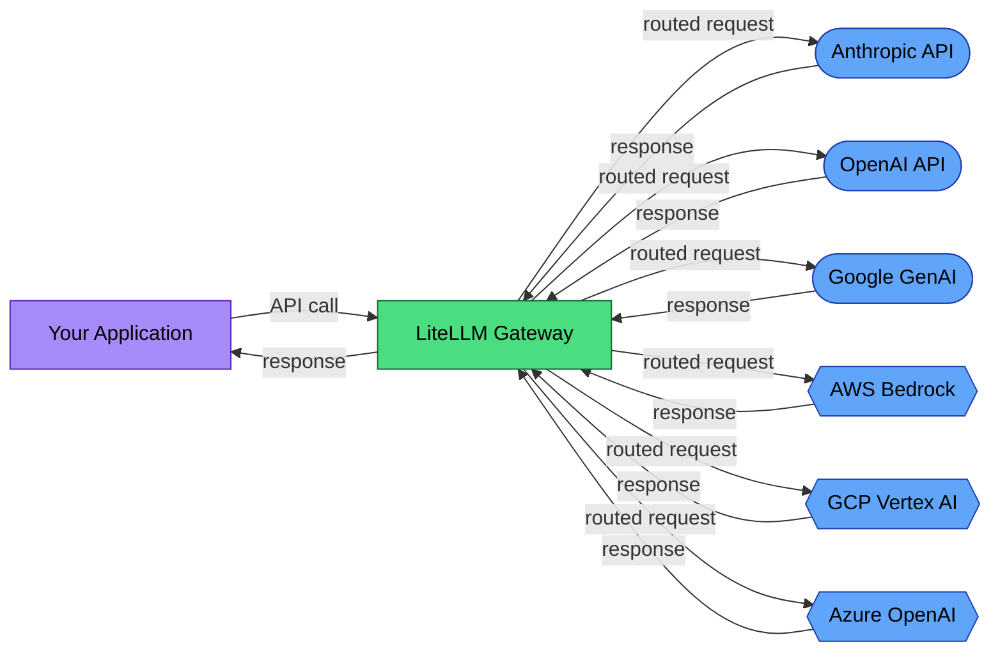

# EU AI Act Compliance Guide for LiteLLM Deployers

LiteLLM is an AI gateway. Every LLM call in your stack passes through it. That makes it the natural enforcement point for EU AI Act compliance: logging, monitoring, and transparency controls belong at the gateway layer.

This guide maps LiteLLM's existing features to regulatory requirements and identifies what deployers need to add.

## Why the gateway layer matters

The EU AI Act requires record-keeping (Article 12), transparency (Article 13), and human oversight (Article 14) for high-risk AI systems. These requirements apply to the deployed system, not to individual model providers.

LiteLLM sits between your application and 100+ LLM providers. It already captures:
- Model identifier per request
- Token counts (input, output, total)
- Cost per request
- Latency
- Error types and status codes
- User identity (via custom metadata)

This data is the raw material for compliance. The question is whether it satisfies the specific regulatory requirements.

## What the scanner found

Running [AI Trace Auditor](https://github.com/BipinRimal314/ai-trace-auditor) against the LiteLLM codebase:

- **Files scanned:** 4,861
- **AI providers supported:** Anthropic, OpenAI, Google GenAI, HuggingFace, Mistral, LangChain, LlamaIndex
- **Model identifiers:** 112 (across all supported providers)
- **External services:** 12
- **Data flows:** 12

These reflect what LiteLLM *supports*. Your deployment routes to a subset. Document which providers are active.

## Data flow diagram



Every provider is a **processor** under GDPR: they process data on your behalf. Each requires a Data Processing Agreement (Article 28).

LiteLLM itself, when self-hosted, is under your control (controller). When using LiteLLM's hosted proxy, LiteLLM becomes an additional processor.

## Article 12: Record-keeping

Article 12 requires automatic event recording for the lifetime of high-risk AI systems. Here is how LiteLLM's existing features map:

| Article 12 Requirement | LiteLLM Feature | Status |
|------------------------|----------------|--------|
| Event timestamps | Request/response timestamps in callbacks | **Covered** |
| Model version tracking | `model` field logged per request | **Covered** |
| Input content logging | `messages` logged via callbacks (opt-in) | **Opt-in** |
| Output content logging | `response` logged via callbacks (opt-in) | **Opt-in** |
| Token consumption | `usage.prompt_tokens`, `usage.completion_tokens` | **Covered** |
| Cost tracking | `response_cost` calculated per request | **Covered** |
| Error recording | `exception` type and message in failure callbacks | **Covered** |
| Operation latency | Calculated from request timing | **Covered** |
| User identification | `user` field in request metadata | **Available** |
| Data retention (6+ months) | Depends on your logging backend | **Your responsibility** |
| Temperature/parameters | Logged if passed in request | **Partial** |

LiteLLM covers approximately 70-80% of Article 12 requirements out of the box when callbacks are configured. The gaps are:
1. **Content logging is opt-in** — you must explicitly enable it
2. **Retention is your responsibility** — LiteLLM doesn't store data persistently by default
3. **Request parameters** (temperature, max_tokens, top_p) need to be explicitly included in your logging

### Configuring Article 12-compliant logging

Enable comprehensive logging via LiteLLM callbacks:

```python
import litellm

litellm.success_callback = ["your_logging_backend"]
litellm.failure_callback = ["your_logging_backend"]

# Ensure these fields are captured in your callback:
# - model, messages, response, usage, response_cost
# - temperature, max_tokens (from kwargs)
# - user, metadata
# - timestamps, latency
# - error type and message (on failure)
```

Connect to a persistent backend (Langfuse, Helicone, or your own database) with a retention policy of at least 6 months.

## Article 13: Transparency

Deployers must inform users that they are interacting with an AI system and provide information about its capabilities and limitations.

LiteLLM's contribution to transparency:
- **Model routing is logged** — you can tell users which model answered their query
- **Cost attribution** — you know which features consume the most AI resources
- **Fallback chains are visible** — when a primary model fails and a fallback serves the response, this is logged

What you need to add:
- User-facing disclosure that AI is involved in generating responses
- Documentation of which models are active and their known limitations
- Information about how routing decisions are made (cost, latency, quality)

## Article 14: Human oversight

LiteLLM's guardrails feature provides a foundation for human oversight:

| Guardrails Feature | Article 14 Mapping |
|-------------------|-------------------|
| Content moderation | Pre-response filtering for harmful content |
| Rate limiting | Prevents runaway AI usage |
| Budget controls | Cost caps per user/team/organization |
| Model access controls | Restricts which models specific users can access |

What you need to add:
- Escalation procedures when guardrails trigger
- Human review pipeline for high-stakes decisions
- Override mechanism to halt AI responses

## GDPR considerations

LiteLLM processes user prompts. If those prompts contain personal data:

1. **Legal basis** (Article 6): Document why you're processing this data
2. **Data Processing Agreements** (Article 28): Required for each LLM provider you route to
3. **Cross-border transfers**: US-based providers (OpenAI, Anthropic) require Standard Contractual Clauses or equivalent safeguards
4. **Data minimization**: Log what you need for compliance, not everything

Generate a GDPR Article 30 Record of Processing Activities:

```bash
pip install ai-trace-auditor
aitrace flow ./your-litellm-deployment -o data-flows.md
```

## Full compliance scan

Generate a complete compliance package:

```bash
aitrace comply ./your-litellm-deployment --split -o compliance/
```

## Recommendations

1. **Enable comprehensive logging** with a persistent backend and 6+ month retention
2. **Audit your traces** periodically: `aitrace audit your-traces.json -r "EU AI Act"`
3. **Document your routing policy** — which models, which fallbacks, which guardrails
4. **Establish DPAs** with every LLM provider you route to
5. **Use self-hosted models** (Ollama, vLLM) for sensitive data to avoid third-party transfers

## Resources

- [EU AI Act full text](https://artificialintelligenceact.eu/)
- [LiteLLM logging documentation](https://docs.litellm.ai/docs/observability/callbacks)
- [LiteLLM guardrails](https://docs.litellm.ai/docs/proxy/guardrails)
- [AI Trace Auditor](https://github.com/BipinRimal314/ai-trace-auditor) — open-source compliance scanning

---

*This guide was generated with assistance from [AI Trace Auditor](https://github.com/BipinRimal314/ai-trace-auditor) and reviewed for accuracy. It is not legal advice. Consult a qualified professional for compliance decisions.*
