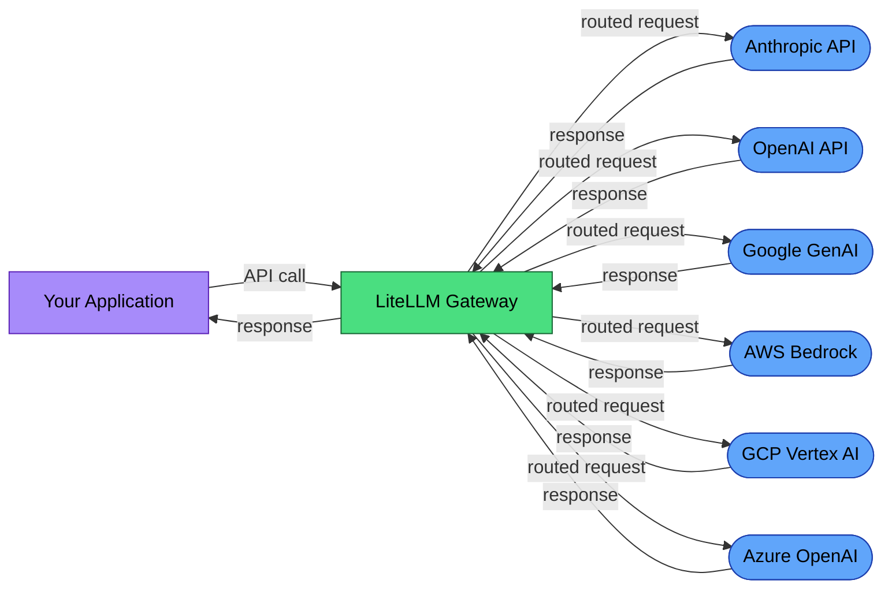

# EU AI Act Compliance Guide for LiteLLM Users

LiteLLM is an AI gateway. Every LLM call in your stack passes through it. That makes it the natural enforcement point for EU AI Act compliance: logging, monitoring, and transparency controls belong at the gateway layer.

This guide maps LiteLLM's existing features to regulatory requirements and identifies what you need to add.

## Are you a provider or a deployer?

The EU AI Act distinguishes between two roles with different obligations:

- **Provider** (Article 3(3)): The entity that develops or places a high-risk AI system on the market. If you are **building your own AI application** on top of LiteLLM and foundation model APIs, you are likely the provider. You carry the full Articles 9-21 obligations: risk management system, technical documentation, conformity assessment, CE marking, and post-market monitoring.

- **Deployer** (Article 3(4)): The entity that uses a high-risk AI system under its authority, but did not build it. If you are **integrating a pre-built, third-party AI system** and using LiteLLM as the gateway, you are the deployer. Your obligations are narrower, primarily under Article 26: human oversight, logging retention, and monitoring.

**Most LiteLLM users building custom applications are providers, not deployers.** This guide covers obligations relevant to both roles, noting where they differ. When in doubt, assume the heavier provider obligations — it is better to over-comply than under-comply.

## Is your system in scope?

Articles 12, 13, and 14 of the EU AI Act apply only to **high-risk AI systems** as defined in Annex III. Most LiteLLM deployments — general-purpose chatbots, internal productivity tools, code assistants — are not high-risk and are not subject to these obligations.

Your system is likely high-risk if it is used for:
- **Recruitment or HR decisions** (screening CVs, evaluating candidates, task allocation)
- **Credit scoring or insurance pricing**
- **Law enforcement or border control**
- **Critical infrastructure management** (energy, water, transport)
- **Education assessment** (grading, admissions)
- **Access to essential public services**

If your use case does not fall under Annex III, the high-risk obligations (Articles 9-15) do not apply via the Annex III pathway, though risk classification is context-dependent. **Do not self-classify without legal review.** You may still have obligations under **Article 50** (transparency for chatbots and AI systems interacting directly with users) and **GDPR** (if processing personal data). Focus on Article 50 (transparency) and GDPR (data protection) as your baseline obligations. Read those sections below.

## Why the gateway layer matters

For high-risk systems, the EU AI Act requires record-keeping (Article 12), transparency (Article 13), and human oversight (Article 14). These requirements apply to you (the provider or deployer of the AI system), not to the foundation model APIs you route through. OpenAI, Anthropic, and Google have their own provider obligations for their models, but your system-level compliance is your responsibility.

LiteLLM sits between your application and 100+ LLM providers. It already captures:
- Model identifier per request
- Token counts (input, output, total)
- Cost per request
- Latency
- Error types and status codes
- User identity (via custom metadata)

This data is the raw material for compliance. The question is whether it satisfies the specific regulatory requirements.

## Supported providers

LiteLLM integrates with 100+ LLM providers including Anthropic, OpenAI, Google GenAI, AWS Bedrock, GCP Vertex AI, and Azure OpenAI. Your deployment routes to a subset. Document which providers are active in your system, as each has different compliance implications.

## Data flow diagram



Each AI provider organization is typically a **processor** under GDPR when processing data on your behalf, though roles can vary by provider terms and processing purpose. Verify each provider's DPA/terms and document the role accordingly.

Your organization is the **controller** (you determine the purpose and means of processing). When using LiteLLM's hosted proxy, the organization operating LiteLLM becomes an additional processor.

## Article 12: Record-keeping

Article 12 requires automatic event recording for the lifetime of high-risk AI systems. Here is how LiteLLM's existing features map:

| Article 12 Requirement | LiteLLM Feature | Status |
|------------------------|----------------|--------|
| Event timestamps | Request/response timestamps in callbacks | **Covered** |
| Model version tracking | `model` field logged per request | **Covered** |
| Input content logging | `messages` logged via callbacks (opt-in) | **Opt-in** |
| Output content logging | `response` logged via callbacks (opt-in) | **Opt-in** |
| Token consumption | `usage.prompt_tokens`, `usage.completion_tokens` | **Covered** |
| Cost tracking | `response_cost` calculated per request | **Covered** |
| Error recording | `exception` type and message in failure callbacks | **Covered** |
| Operation latency | Calculated from request timing | **Covered** |
| User identification | `user` field in request metadata | **Available** |
| Data retention (Article 18: 10 years for providers; Article 26(5): 6 months for deployers) | Depends on your logging backend | **Your responsibility** |
| Temperature/parameters | Logged if passed in request | **Partial** |

When callbacks are configured, LiteLLM covers the majority of the data points needed for Article 12 compliance (see the table above for specifics). The remaining gaps are:
1. **Content logging is opt-in** — you must explicitly enable it
2. **Retention is your responsibility** — LiteLLM doesn't store data persistently by default
3. **Request parameters** (temperature, max_tokens, top_p) need to be explicitly included in your logging

### Configuring Article 12-compliant logging

**Option 1: Use a built-in integration** (recommended for most deployments):

```python
import litellm

# Use a built-in backend: "langfuse", "s3", "datadog", "helicone", etc.
litellm.success_callback = ["langfuse"]
litellm.failure_callback = ["langfuse"]
```

**Option 2: Custom compliance logger** (when you need full control over what's captured):

```python
import litellm
from litellm.integrations.custom_logger import CustomLogger

class ComplianceLogger(CustomLogger):
    async def async_log_success_event(self, kwargs, response_obj, start_time, end_time):
        # Article 12 fields to capture:
        # - kwargs["model"], kwargs["messages"] (input content)
        # - response_obj (output content)
        # - kwargs["optional_params"] (temperature, max_tokens)
        # - response_obj.usage (token counts)
        # - kwargs.get("response_cost") (cost per request)
        # - kwargs.get("user") (user identification)
        # - start_time, end_time (timestamps and latency)
        ...

    async def async_log_failure_event(self, kwargs, response_obj, start_time, end_time):
        # Capture: exception type, message, failing model, timestamp
        ...

litellm.callbacks = [ComplianceLogger()]
```

Whichever option you choose, connect to a persistent backend with a retention policy of at least 6 months (Article 26(5) for deployers; Article 18 requires 10 years for providers).

## Article 13: Transparency (provider → deployer)

Article 13 requires **providers** of high-risk AI systems to supply **deployers** with documentation covering: instructions for use, the system's intended purpose, level of accuracy and robustness, known foreseeable risks, and technical measures for monitoring. This is specification-level documentation about the AI system, flowing from provider to deployer.

If you are the **provider** (building a custom AI application on LiteLLM), you must produce this documentation for anyone who deploys your system. LiteLLM's operational data (routing logs, cost attribution, fallback chains) is useful internal infrastructure, but it does not constitute Article 13 documentation on its own.

What Article 13 documentation must include:
- Intended purpose and conditions of use for your AI system
- Level of accuracy, robustness, and cybersecurity relevant to the system
- Known foreseeable risks and instructions for mitigation
- Technical measures that enable deployers to monitor the system

**Note:** End-user transparency (informing users they are interacting with AI) is covered by **Article 50**, not Article 13. See the Article 50 section below.

## Article 14: Human oversight

Article 14 requires high-risk AI systems to be designed so that natural persons can effectively oversee them: interpret outputs, decide not to use them, and intervene or halt the system. This means human actors in the loop, not automated controls.

LiteLLM's guardrails (content moderation, rate limiting, budget controls, model access controls) are **automated technical controls** that fall under Articles 9 (risk management) and 15 (accuracy/robustness). They are useful infrastructure, but they do not satisfy Article 14 on their own.

What you need to build for Article 14 compliance:

| Requirement | What it means | LiteLLM foundation |
|-------------|---------------|-------------------|
| Human interpretation of outputs | A person can review what the AI produced before it acts | Logged responses via callbacks |
| Decision not to use output | A person can reject an AI recommendation | Requires your application layer |
| Intervention / halt | A person can stop the system mid-operation | Guardrails trigger points can route to human review |
| Escalation procedures | When automated filters flag content, a human reviews | Callback hooks available; escalation logic is yours |

LiteLLM provides the **logging and hook infrastructure** to build human oversight on top of. The oversight logic itself — review queues, approval workflows, kill switches — lives in your application layer.

## Article 50: Transparency for AI-interacting systems

Article 50 applies to **all AI systems that interact directly with users**, not just high-risk systems. If your LiteLLM deployment powers a chatbot, virtual assistant, or any interface where a user communicates with AI-generated responses, you must:

1. **Inform users they are interacting with an AI system** — before or at the start of the interaction
2. **Mark AI-generated content** — if you are the *provider* of an AI system generating synthetic text, audio, images, or video, you must ensure outputs are machine-readable as AI-generated (Article 50(2)). If you are a deployer using a third-party model, this obligation rests with your model provider (e.g., OpenAI, Anthropic).
3. **Disclose deepfakes** — if you deploy a system that generates or manipulates content depicting real people or events, this must be disclosed to the end user (Article 50(4)). This applies to both providers and deployers.

LiteLLM itself does not handle user-facing disclosure — it operates at the API gateway layer. Your application must implement the disclosure:

```python
# Example: Add AI disclosure fields to your API response payload
response = litellm.completion(model="gpt-4", messages=messages)

# Your application layer adds the disclosure
user_response = {
    "content": response.choices[0].message.content,
    "ai_disclosure": "This response was generated by an AI system.",
    "model_used": response.model,  # Transparency: which model answered
}
```

Article 50 obligations exist **independently of Annex III classification**. Even if your system is not high-risk, this section applies.

## GDPR considerations

LiteLLM processes user prompts. If those prompts contain personal data:

1. **Legal basis** (Article 6): Document why you're processing this data
2. **Data Processing Agreements** (Article 28): Required for each LLM provider you route to
3. **Cross-border transfers**: US-based providers (OpenAI, Anthropic) require Standard Contractual Clauses or equivalent safeguards
4. **Data minimization**: Log what you need for compliance, not everything

You must maintain a GDPR Article 30 Record of Processing Activities (RoPA) documenting each processing activity, its purpose, data categories, recipients, and transfers. This is a legal obligation — consult your Data Protection Officer or legal counsel.

## Recommendations

1. **Enable comprehensive logging** with a persistent backend (Article 18 requires 10 years retention for providers; Article 26(5) requires 6 months for deployers)
2. **Audit your traces** periodically against Article 12 requirements
3. **Document your routing policy** — which models, which fallbacks, which guardrails
4. **Establish DPAs** with every LLM provider you route to
5. **Use self-hosted models** (Ollama, vLLM) for sensitive data to avoid third-party transfers
6. **Produce Article 13 documentation** if you are the provider of a high-risk system

## Resources

- [EU AI Act full text](https://artificialintelligenceact.eu/)
- [Article 50: Transparency obligations](https://artificialintelligenceact.eu/article/50/)
- [LiteLLM logging documentation](https://docs.litellm.ai/docs/observability/callbacks)
- [LiteLLM guardrails](https://docs.litellm.ai/docs/proxy/guardrails)

---

*This guide is not legal advice. Consult a qualified professional for compliance decisions.*
