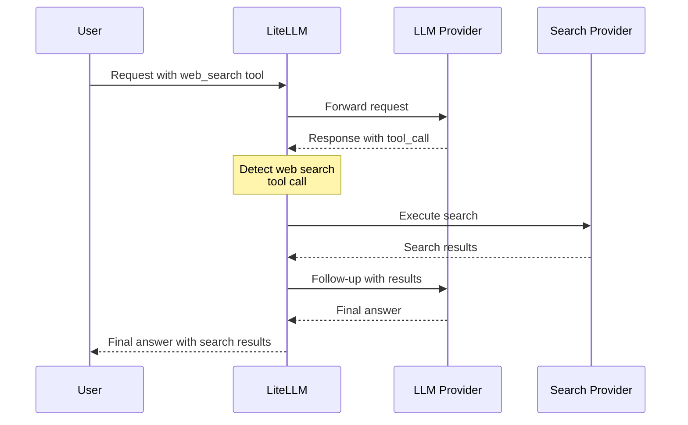

# Web Search Integration

Enable transparent server-side web search execution for any LLM provider. LiteLLM automatically intercepts web search tool calls and executes them using your configured search provider (Perplexity, Tavily, etc.).

## Quick Start

### 1. Configure Web Search Interception

Add to your `config.yaml`:

```yaml
model_list:
  - model_name: gpt-4o
    litellm_params:
      model: openai/gpt-4o
      api_key: os.environ/OPENAI_API_KEY

litellm_settings:
  callbacks:
    - websearch_interception:
        enabled_providers:
          - openai
          - minimax
          - anthropic
        search_tool_name: perplexity-search  # Optional

search_tools:
  - search_tool_name: perplexity-search
    litellm_params:
      search_provider: perplexity
      api_key: os.environ/PERPLEXITY_API_KEY
```

### 2. Use with Any Provider

```python
import litellm

response = await litellm.acompletion(
    model="gpt-4o",
    messages=[
        {"role": "user", "content": "What's the weather in San Francisco today?"}
    ],
    tools=[
        {
            "type": "function",
            "function": {
                "name": "litellm_web_search",
                "description": "Search the web for information",
                "parameters": {
                    "type": "object",
                    "properties": {
                        "query": {"type": "string", "description": "Search query"}
                    },
                    "required": ["query"]
                }
            }
        }
    ]
)

# Response includes search results automatically!
print(response.choices[0].message.content)
```

## How It Works

When a model makes a web search tool call, LiteLLM:

1. **Detects** the `litellm_web_search` tool call in the response
2. **Executes** the search using your configured search provider
3. **Makes a follow-up request** with the search results
4. **Returns** the final answer to the user



**Result**: One API call from user → Complete answer with search results

## Supported Providers

Web search integration works with **all providers** that use:
- ✅ **Base HTTP Handler** (`BaseLLMHTTPHandler`)
- ✅ **OpenAI Completion Handler** (`OpenAIChatCompletion`)

### Providers Using Base HTTP Handler

| Provider | Status | Notes |
|----------|--------|-------|
| **OpenAI** | ✅ Supported | GPT-4, GPT-3.5, etc. |
| **Anthropic** | ✅ Supported | Claude models via HTTP handler |
| **MiniMax** | ✅ Supported | All MiniMax models |
| **Mistral** | ✅ Supported | Mistral AI models |
| **Cohere** | ✅ Supported | Command models |
| **Fireworks AI** | ✅ Supported | All Fireworks models |
| **Together AI** | ✅ Supported | All Together AI models |
| **Groq** | ✅ Supported | All Groq models |
| **Perplexity** | ✅ Supported | Perplexity models |
| **DeepSeek** | ✅ Supported | DeepSeek models |
| **xAI** | ✅ Supported | Grok models |
| **Hugging Face** | ✅ Supported | Inference API models |
| **OCI** | ✅ Supported | Oracle Cloud models |
| **Vertex AI** | ✅ Supported | Google Vertex AI models |
| **Bedrock** | ✅ Supported | AWS Bedrock models (converse_like route) |
| **Azure OpenAI** | ✅ Supported | Azure-hosted OpenAI models |
| **Sagemaker** | ✅ Supported | AWS Sagemaker models |
| **Databricks** | ✅ Supported | Databricks models |
| **DataRobot** | ✅ Supported | DataRobot models |
| **Hosted VLLM** | ✅ Supported | Self-hosted VLLM |
| **Heroku** | ✅ Supported | Heroku-hosted models |
| **RAGFlow** | ✅ Supported | RAGFlow models |
| **Compactif** | ✅ Supported | Compactif models |
| **Cometapi** | ✅ Supported | Comet API models |
| **A2A** | ✅ Supported | Agent-to-Agent models |
| **Bytez** | ✅ Supported | Bytez models |

### Providers Using OpenAI Handler

| Provider | Status | Notes |
|----------|--------|-------|
| **OpenAI** | ✅ Supported | Native OpenAI API |
| **Azure OpenAI** | ✅ Supported | Azure-hosted OpenAI |
| **OpenAI-Compatible** | ✅ Supported | Any OpenAI-compatible API |

## Configuration

### WebSearch Interception Parameters

| Parameter | Type | Required | Description | Example |
|-----------|------|----------|-------------|---------|
| `enabled_providers` | List[String] | Yes | List of providers to enable web search for | `[openai, minimax, anthropic]` |
| `search_tool_name` | String | No | Specific search tool from `search_tools` config. If not set, uses first available. | `perplexity-search` |

### Provider Values

Use these values in `enabled_providers`:

| Provider | Value | Provider | Value |
|----------|-------|----------|-------|
| OpenAI | `openai` | Anthropic | `anthropic` |
| MiniMax | `minimax` | Mistral | `mistral` |
| Cohere | `cohere` | Fireworks AI | `fireworks_ai` |
| Together AI | `together_ai` | Groq | `groq` |
| Perplexity | `perplexity` | DeepSeek | `deepseek` |
| xAI | `xai` | Hugging Face | `huggingface` |
| OCI | `oci` | Vertex AI | `vertex_ai` |
| Bedrock | `bedrock` | Azure | `azure` |
| Sagemaker | `sagemaker_chat` | Databricks | `databricks` |
| DataRobot | `datarobot` | VLLM | `hosted_vllm` |
| Heroku | `heroku` | RAGFlow | `ragflow` |
| Compactif | `compactif` | Cometapi | `cometapi` |
| A2A | `a2a` | Bytez | `bytez` |

## Search Providers

Configure which search provider to use. LiteLLM supports multiple search providers:

| Provider | `search_provider` Value | Environment Variable |
|----------|------------------------|----------------------|
| **Perplexity AI** | `perplexity` | `PERPLEXITYAI_API_KEY` |
| **Tavily** | `tavily` | `TAVILY_API_KEY` |
| **Exa AI** | `exa_ai` | `EXA_API_KEY` |
| **Parallel AI** | `parallel_ai` | `PARALLEL_AI_API_KEY` |
| **Google PSE** | `google_pse` | `GOOGLE_PSE_API_KEY`, `GOOGLE_PSE_ENGINE_ID` |
| **DataForSEO** | `dataforseo` | `DATAFORSEO_LOGIN`, `DATAFORSEO_PASSWORD` |
| **Firecrawl** | `firecrawl` | `FIRECRAWL_API_KEY` |
| **SearXNG** | `searxng` | `SEARXNG_API_BASE` (required) |
| **Linkup** | `linkup` | `LINKUP_API_KEY` |

See [Search Providers Documentation](../search/index.md) for detailed setup instructions.

## Complete Configuration Example

```yaml
model_list:
  # OpenAI
  - model_name: gpt-4o
    litellm_params:
      model: openai/gpt-4o
      api_key: os.environ/OPENAI_API_KEY

  # MiniMax
  - model_name: minimax
    litellm_params:
      model: minimax/MiniMax-M2.1
      api_key: os.environ/MINIMAX_API_KEY

  # Anthropic
  - model_name: claude
    litellm_params:
      model: anthropic/claude-sonnet-4-5
      api_key: os.environ/ANTHROPIC_API_KEY

  # Azure OpenAI
  - model_name: azure-gpt4
    litellm_params:
      model: azure/gpt-4
      api_base: https://my-azure.openai.azure.com
      api_key: os.environ/AZURE_API_KEY

litellm_settings:
  callbacks:
    - websearch_interception:
        enabled_providers:
          - openai
          - minimax
          - anthropic
          - azure
        search_tool_name: perplexity-search

search_tools:
  - search_tool_name: perplexity-search
    litellm_params:
      search_provider: perplexity
      api_key: os.environ/PERPLEXITY_API_KEY

  - search_tool_name: tavily-search
    litellm_params:
      search_provider: tavily
      api_key: os.environ/TAVILY_API_KEY
```

## Usage Examples

### Python SDK

```python
import litellm

# Configure callbacks
litellm.callbacks = ["websearch_interception"]

# Make completion with web search tool
response = await litellm.acompletion(
    model="gpt-4o",
    messages=[
        {"role": "user", "content": "What are the latest AI news?"}
    ],
    tools=[
        {
            "type": "function",
            "function": {
                "name": "litellm_web_search",
                "description": "Search the web for current information",
                "parameters": {
                    "type": "object",
                    "properties": {
                        "query": {
                            "type": "string",
                            "description": "Search query"
                        }
                    },
                    "required": ["query"]
                }
            }
        }
    ]
)

print(response.choices[0].message.content)
```

### Proxy Server

```bash
# Start proxy with config
litellm --config config.yaml

# Make request
curl http://localhost:4000/v1/chat/completions \
  -H "Content-Type: application/json" \
  -H "Authorization: Bearer sk-1234" \
  -d '{
    "model": "gpt-4o",
    "messages": [
      {"role": "user", "content": "What is the weather in San Francisco?"}
    ],
    "tools": [
      {
        "type": "function",
        "function": {
          "name": "litellm_web_search",
          "description": "Search the web",
          "parameters": {
            "type": "object",
            "properties": {
              "query": {"type": "string"}
            },
            "required": ["query"]
          }
        }
      }
    ]
  }'
```

## How Search Tool Selection Works

1. **If `search_tool_name` is specified** → Uses that specific search tool
2. **If `search_tool_name` is not specified** → Uses first search tool in `search_tools` list

```yaml
search_tools:
  - search_tool_name: perplexity-search  # ← This will be used if no search_tool_name specified
    litellm_params:
      search_provider: perplexity
      api_key: os.environ/PERPLEXITY_API_KEY

  - search_tool_name: tavily-search
    litellm_params:
      search_provider: tavily
      api_key: os.environ/TAVILY_API_KEY
```

## Troubleshooting

### Web Search Not Working

1. **Check provider is enabled**:
   ```yaml
   enabled_providers:
     - openai  # Make sure your provider is in this list
   ```

2. **Verify search tool is configured**:
   ```yaml
   search_tools:
     - search_tool_name: perplexity-search
       litellm_params:
         search_provider: perplexity
         api_key: os.environ/PERPLEXITY_API_KEY
   ```

3. **Check API keys are set**:
   ```bash
   export PERPLEXITY_API_KEY=your-key
   ```

4. **Enable debug logging**:
   ```python
   litellm.set_verbose = True
   ```

### Common Issues

**Issue**: Model returns tool_calls instead of final answer
- **Cause**: Provider not in `enabled_providers` list
- **Solution**: Add provider to `enabled_providers`

**Issue**: "No search tool configured" error
- **Cause**: No search tools in `search_tools` config
- **Solution**: Add at least one search tool configuration

**Issue**: "Invalid function arguments json string" error (MiniMax)
- **Cause**: Fixed in latest version - arguments weren't properly JSON serialized
- **Solution**: Update to latest LiteLLM version

## Related Documentation

- [Search Providers](../search/index.md) - Detailed search provider setup
- [Claude Code WebSearch](../tutorials/claude_code_websearch.md) - Using with Claude Code
- [Tool Calling](../completion/function_call.md) - General tool calling documentation
- [Callbacks](./custom_callback.md) - Custom callback documentation

## Technical Details

### Architecture

Web search integration is implemented as a custom callback (`WebSearchInterceptionLogger`) that:

1. **Pre-request Hook**: Converts native web search tools to LiteLLM standard format
2. **Post-response Hook**: Detects web search tool calls in responses
3. **Agentic Loop**: Executes searches and makes follow-up requests automatically

### Supported APIs

- ✅ **Chat Completions API** (OpenAI format)
- ✅ **Anthropic Messages API** (Anthropic format)
- ✅ **Streaming** (automatically converted)
- ✅ **Non-streaming**

### Response Format Detection

The handler automatically detects response format:
- **OpenAI format**: `tool_calls` in assistant message
- **Anthropic format**: `tool_use` blocks in content

### Performance

- **Latency**: Adds one additional LLM call (follow-up request with search results)
- **Caching**: Search results can be cached (depends on search provider)
- **Parallel Searches**: Multiple search queries executed in parallel

## Contributing

Found a bug or want to add support for a new provider? See our [Contributing Guide](https://github.com/BerriAI/litellm/blob/main/CONTRIBUTING.md).
