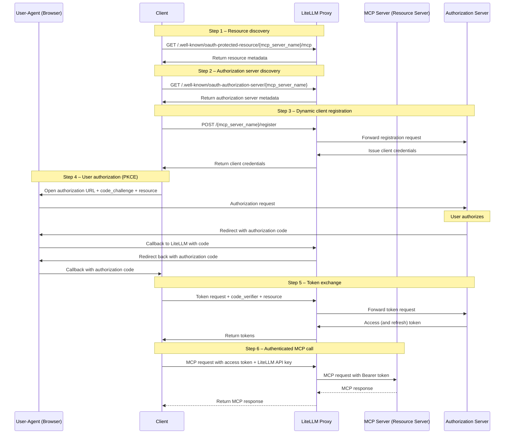
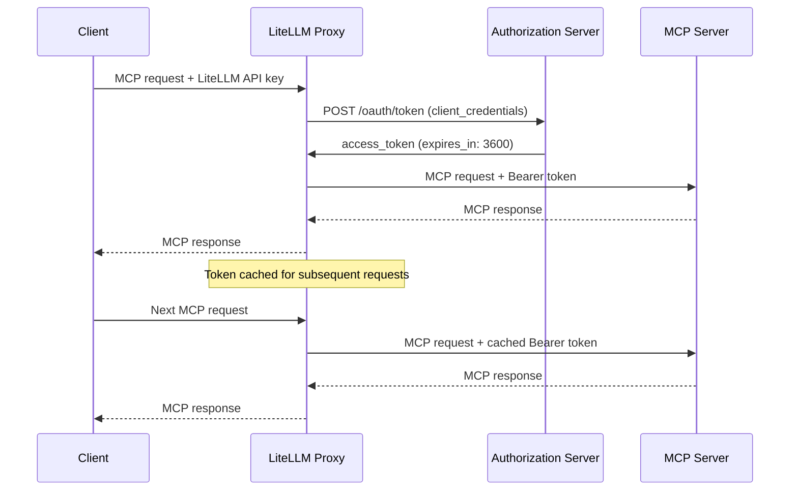

import Tabs from '@theme/Tabs';
import TabItem from '@theme/TabItem';

# MCP OAuth

LiteLLM supports two OAuth 2.0 flows for MCP servers:

| Flow | Use Case | How It Works |
|------|----------|--------------|
| **Interactive (PKCE)** | User-facing apps (Claude Code, Cursor) | Browser-based consent, per-user tokens |
| **Machine-to-Machine (M2M)** | Backend services, CI/CD, automated agents | `client_credentials` grant, proxy-managed tokens |

## Interactive OAuth (PKCE)

For user-facing MCP clients (Claude Code, Cursor), LiteLLM supports the full OAuth 2.0 authorization code flow with PKCE.

### Setup

```yaml title="config.yaml" showLineNumbers
mcp_servers:
  github_mcp:
    url: "https://api.githubcopilot.com/mcp"
    auth_type: oauth2
    client_id: os.environ/GITHUB_OAUTH_CLIENT_ID
    client_secret: os.environ/GITHUB_OAUTH_CLIENT_SECRET
```

[**See Claude Code Tutorial**](./tutorials/claude_responses_api#connecting-mcp-servers)

### How It Works



**Participants**

- **Client** -- The MCP-capable AI agent (e.g., Claude Code, Cursor, or another IDE/agent) that initiates OAuth discovery, authorization, and tool invocations on behalf of the user.
- **LiteLLM Proxy** -- Mediates all OAuth discovery, registration, token exchange, and MCP traffic while protecting stored credentials.
- **Authorization Server** -- Issues OAuth 2.0 tokens via dynamic client registration, PKCE authorization, and token endpoints.
- **MCP Server (Resource Server)** -- The protected MCP endpoint that receives LiteLLM's authenticated JSON-RPC requests.
- **User-Agent (Browser)** -- Temporarily involved so the end user can grant consent during the authorization step.

**Flow Steps**

1. **Resource Discovery**: The client fetches MCP resource metadata from LiteLLM's `.well-known/oauth-protected-resource` endpoint to understand scopes and capabilities.
2. **Authorization Server Discovery**: The client retrieves the OAuth server metadata (token endpoint, authorization endpoint, supported PKCE methods) through LiteLLM's `.well-known/oauth-authorization-server` endpoint.
3. **Dynamic Client Registration**: The client registers through LiteLLM, which forwards the request to the authorization server (RFC 7591). If the provider doesn't support dynamic registration, you can pre-store `client_id`/`client_secret` in LiteLLM (e.g., GitHub MCP) and the flow proceeds the same way.
4. **User Authorization**: The client launches a browser session (with code challenge and resource hints). The user approves access, the authorization server sends the code through LiteLLM back to the client.
5. **Token Exchange**: The client calls LiteLLM with the authorization code, code verifier, and resource. LiteLLM exchanges them with the authorization server and returns the issued access/refresh tokens.
6. **MCP Invocation**: With a valid token, the client sends the MCP JSON-RPC request (plus LiteLLM API key) to LiteLLM, which forwards it to the MCP server and relays the tool response.

See the official [MCP Authorization Flow](https://modelcontextprotocol.io/specification/2025-06-18/basic/authorization#authorization-flow-steps) for additional reference.

## Machine-to-Machine (M2M) Auth

LiteLLM automatically fetches, caches, and refreshes OAuth2 tokens using the `client_credentials` grant. No manual token management required.

### Setup

<Tabs>
<TabItem value="config" label="config.yaml">

```yaml title="config.yaml" showLineNumbers
mcp_servers:
  my_mcp_server:
    url: "https://my-mcp-server.com/mcp"
    auth_type: oauth2
    client_id: os.environ/MCP_CLIENT_ID
    client_secret: os.environ/MCP_CLIENT_SECRET
    token_url: "https://auth.example.com/oauth/token"
    scopes: ["mcp:read", "mcp:write"]  # optional
```

</TabItem>
<TabItem value="ui" label="LiteLLM UI">

Navigate to **MCP Servers → Add Server → Authentication → OAuth**, then fill in `client_id`, `client_secret`, and `token_url`.

</TabItem>
</Tabs>

### How It Works

1. On first MCP request, LiteLLM POSTs to `token_url` with `grant_type=client_credentials`
2. The access token is cached in-memory with TTL = `expires_in - 60s`
3. Subsequent requests reuse the cached token
4. When the token expires, LiteLLM fetches a new one automatically



### Test with Mock Server

Use [BerriAI/mock-oauth2-mcp-server](https://github.com/BerriAI/mock-oauth2-mcp-server) to test locally:

```bash title="Terminal 1 - Start mock server" showLineNumbers
pip install fastapi uvicorn
python mock_oauth2_mcp_server.py  # starts on :8765
```

```yaml title="config.yaml" showLineNumbers
mcp_servers:
  test_oauth2:
    url: "http://localhost:8765/mcp"
    auth_type: oauth2
    client_id: "test-client"
    client_secret: "test-secret"
    token_url: "http://localhost:8765/oauth/token"
```

```bash title="Terminal 2 - Start proxy and test" showLineNumbers
litellm --config config.yaml --port 4000

# List tools
curl http://localhost:4000/mcp-rest/tools/list \
  -H "Authorization: Bearer sk-1234"

# Call a tool
curl http://localhost:4000/mcp-rest/tools/call \
  -H "Content-Type: application/json" \
  -H "Authorization: Bearer sk-1234" \
  -d '{"name": "echo", "arguments": {"message": "hello"}}'
```

### Config Reference

| Field | Required | Description |
|-------|----------|-------------|
| `auth_type` | Yes | Must be `oauth2` |
| `client_id` | Yes | OAuth2 client ID. Supports `os.environ/VAR_NAME` |
| `client_secret` | Yes | OAuth2 client secret. Supports `os.environ/VAR_NAME` |
| `token_url` | Yes | Token endpoint URL |
| `scopes` | No | List of scopes to request |
