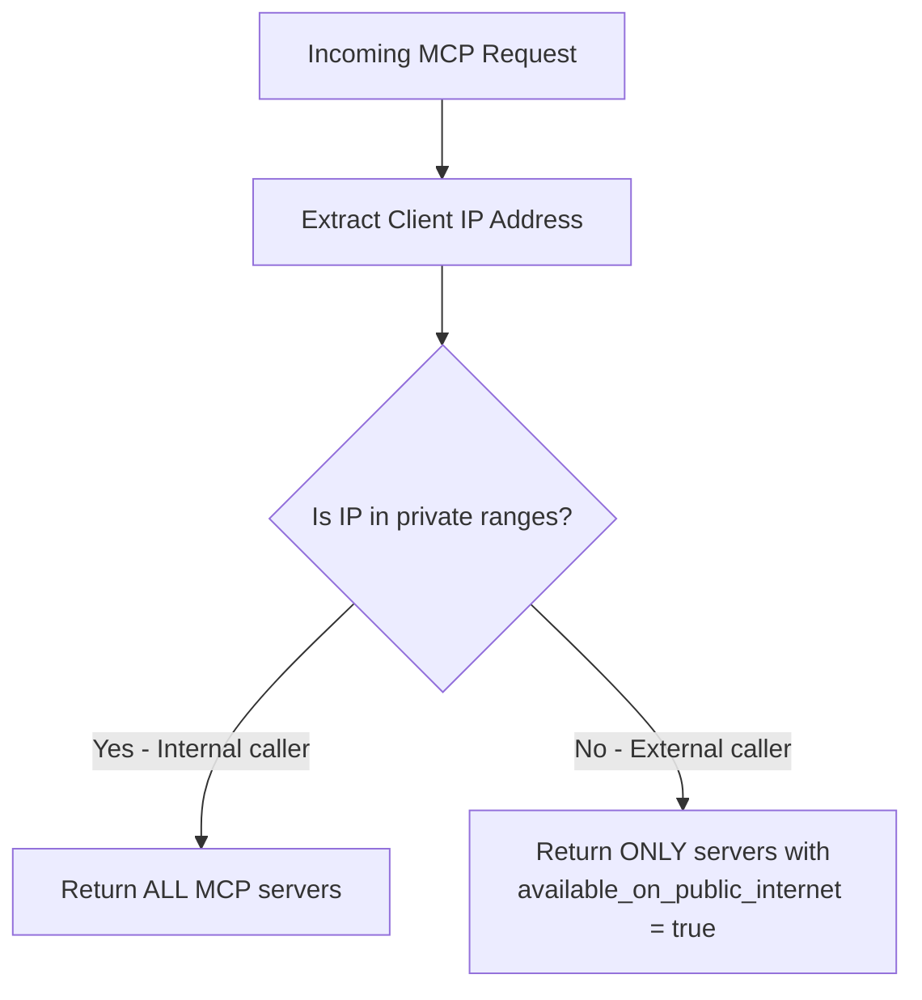

import Tabs from '@theme/Tabs';
import TabItem from '@theme/TabItem';

# Exposing MCPs on the Public Internet

Control which MCP servers are visible to external callers (e.g., ChatGPT, Claude Desktop) vs. internal-only callers. This is useful when you want a subset of your MCP servers available publicly while keeping sensitive servers restricted to your private network.

## Overview

| Property | Details |
|-------|-------|
| Description | IP-based access control for MCP servers — external callers only see servers marked as public |
| Setting | `available_on_public_internet` on each MCP server |
| Network Config | `mcp_internal_ip_ranges` in `general_settings` |
| Supported Clients | ChatGPT, Claude Desktop, Cursor, OpenAI API, or any MCP client |

## How It Works

When a request arrives at LiteLLM's MCP endpoints, LiteLLM checks the caller's IP address to determine whether they are an **internal** or **external** caller:

1. **Extract the client IP** from the incoming request (supports `X-Forwarded-For` when configured behind a reverse proxy).
2. **Classify the IP** as internal or external by checking it against the configured private IP ranges (defaults to RFC 1918: `10.0.0.0/8`, `172.16.0.0/12`, `192.168.0.0/16`, `127.0.0.0/8`).
3. **Filter the server list**:
   - **Internal callers** see all MCP servers (public and private).
   - **External callers** only see servers with `available_on_public_internet: true`.

This filtering is applied at every MCP access point: the MCP registry, tool listing, tool calling, dynamic server routes, and OAuth discovery endpoints.



## Walkthrough

This walkthrough covers two flows:
1. **Adding a public MCP server** (DeepWiki) and connecting to it from ChatGPT
2. **Making an existing server private** (Exa) and verifying ChatGPT no longer sees it

### Flow 1: Add a Public MCP Server (DeepWiki)

DeepWiki is a free MCP server — a good candidate to expose publicly so AI gateway users can access it from ChatGPT.

#### Step 1: Create the MCP Server

Navigate to the MCP Servers page and click **"+ Add New MCP Server"**.


Enter the server details — name it "DeepWiki" and set the URL to `https://mcp.deepwiki.com/mcp`.


Select **HTTP** as the transport type.


Fill in the MCP Server URL.


#### Step 2: Enable "Available on Public Internet"

Expand **Permission Management / Access Control** and toggle **"Available on Public Internet"** on. This ensures external callers (like ChatGPT) can discover this server.


Click **"Create"** to save the server.


The server is now created and visible in the table with a **"Public"** badge under Network Access.


#### Step 3: Connect from ChatGPT

Open ChatGPT and add a new MCP server. The endpoint to use is:

```
<your-litellm-url>/mcp
```

Click the MCP server icon in ChatGPT to add a new connection.


Select **"Add an MCP server"**.


Enter a label for the server.


Paste your LiteLLM MCP URL (`<your-litellm-url>/mcp`).


Enter your LiteLLM API key in the authentication field.


Click **"Connect"**.


ChatGPT now shows the available tools from your public MCP servers. Since DeepWiki is marked as public, its tools appear here.


---

### Flow 2: Make an Existing Server Private (Exa)

Now let's restrict an existing MCP server so it's no longer visible to external callers like ChatGPT.

#### Step 1: Edit the Server

Navigate to the Exa server and click to view its details.


Click **"Settings"** to edit.


#### Step 2: Toggle Off "Available on Public Internet"

Expand **Permission Management / Access Control**.


Toggle **"Available on Public Internet"** off.


Click **"Save Changes"**.


#### Step 3: Verify in ChatGPT

Go back to ChatGPT and reconnect to the LiteLLM MCP server.


Only DeepWiki tools are visible now — Exa has been successfully restricted to internal access only.


## Configuration Reference

### Per-Server Setting

<Tabs>
<TabItem value="ui" label="UI">

Toggle **"Available on Public Internet"** in the Permission Management section when creating or editing an MCP server.

</TabItem>
<TabItem value="config" label="config.yaml">

```yaml title="config.yaml" showLineNumbers
mcp_servers:
  deepwiki:
    url: https://mcp.deepwiki.com/mcp
    available_on_public_internet: true   # visible to external callers

  exa:
    url: https://exa.ai/mcp
    auth_type: api_key
    auth_value: os.environ/EXA_API_KEY
    available_on_public_internet: false  # internal only (default)
```

</TabItem>
<TabItem value="api" label="API">

```bash title="Create a public MCP server" showLineNumbers
curl -X POST <your-litellm-url>/v1/mcp/server \
  -H "Authorization: Bearer sk-..." \
  -H "Content-Type: application/json" \
  -d '{
    "server_name": "DeepWiki",
    "url": "https://mcp.deepwiki.com/mcp",
    "transport": "http",
    "available_on_public_internet": true
  }'
```

```bash title="Update an existing server" showLineNumbers
curl -X PUT <your-litellm-url>/v1/mcp/server \
  -H "Authorization: Bearer sk-..." \
  -H "Content-Type: application/json" \
  -d '{
    "server_id": "<server-id>",
    "available_on_public_internet": false
  }'
```

</TabItem>
</Tabs>

### Custom Private IP Ranges

By default, LiteLLM treats RFC 1918 private ranges as internal. You can customize this in the **Network Settings** tab under MCP Servers, or via config:

```yaml title="config.yaml" showLineNumbers
general_settings:
  mcp_internal_ip_ranges:
    - "10.0.0.0/8"
    - "172.16.0.0/12"
    - "192.168.0.0/16"
    - "100.64.0.0/10"    # Add your VPN/Tailscale range
```

When empty, the standard private ranges are used (`10.0.0.0/8`, `172.16.0.0/12`, `192.168.0.0/16`, `127.0.0.0/8`).
