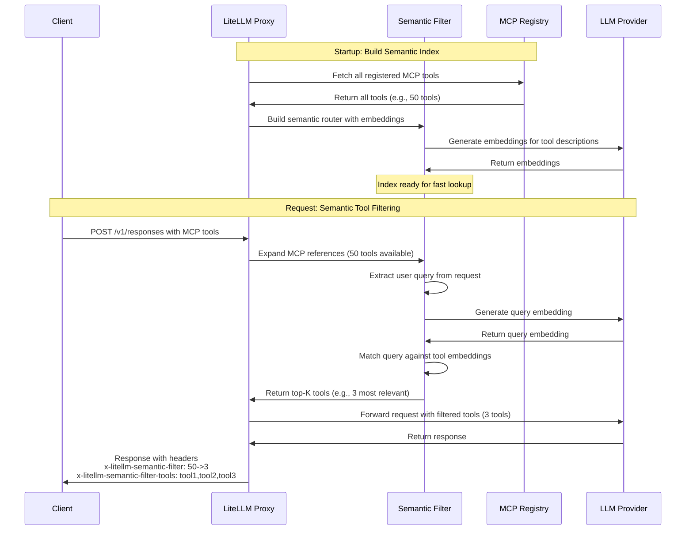

import Tabs from '@theme/Tabs';
import TabItem from '@theme/TabItem';

# MCP Semantic Tool Filter

Automatically filter MCP tools by semantic relevance. When you have many MCP tools registered, LiteLLM semantically matches the user's query against tool descriptions and sends only the most relevant tools to the LLM.

## How It Works

Tool search shifts tool selection from a prompt-engineering problem to a retrieval problem. Instead of injecting a large static list of tools into every prompt, the semantic filter:

1. Builds a semantic index of all available MCP tools on startup
2. On each request, semantically matches the user's query against tool descriptions
3. Returns only the top-K most relevant tools to the LLM

This approach improves context efficiency, increases reliability by reducing tool confusion, and enables scalability to ecosystems with hundreds or thousands of MCP tools.



## Configuration

Enable semantic filtering in your LiteLLM config:

```yaml title="config.yaml" showLineNumbers
litellm_settings:
  mcp_semantic_tool_filter:
    enabled: true
    embedding_model: "text-embedding-3-small"  # Model for semantic matching
    top_k: 5                                    # Max tools to return
    similarity_threshold: 0.3                   # Min similarity score
```

**Configuration Options:**
- `enabled` - Enable/disable semantic filtering (default: `false`)
- `embedding_model` - Model for generating embeddings (default: `"text-embedding-3-small"`)
- `top_k` - Maximum number of tools to return (default: `10`)
- `similarity_threshold` - Minimum similarity score for matches (default: `0.3`)

## Usage

Use MCP tools normally with the Responses API or Chat Completions. The semantic filter runs automatically:

<Tabs>
<TabItem value="responses" label="Responses API">

```bash title="Responses API with Semantic Filtering" showLineNumbers
curl --location 'http://localhost:4000/v1/responses' \
--header 'Content-Type: application/json' \
--header "Authorization: Bearer sk-1234" \
--data '{
    "model": "gpt-4o",
    "input": [
    {
      "role": "user",
      "content": "give me TLDR of what BerriAI/litellm repo is about",
      "type": "message"
    }
  ],
    "tools": [
        {
            "type": "mcp",
            "server_url": "litellm_proxy",
            "require_approval": "never"
        }
    ],
    "tool_choice": "required"
}'
```

</TabItem>
<TabItem value="chat" label="Chat Completions">

```bash title="Chat Completions with Semantic Filtering" showLineNumbers
curl --location 'http://localhost:4000/v1/chat/completions' \
--header 'Content-Type: application/json' \
--header "Authorization: Bearer sk-1234" \
--data '{
  "model": "gpt-4o",
  "messages": [
    {"role": "user", "content": "Search Wikipedia for LiteLLM"}
  ],
  "tools": [
    {
      "type": "mcp",
      "server_url": "litellm_proxy"
    }
  ]
}'
```

</TabItem>
</Tabs>

## Response Headers

The semantic filter adds diagnostic headers to every response:

```
x-litellm-semantic-filter: 10->3
x-litellm-semantic-filter-tools: wikipedia-fetch,github-search,slack-post
```

- **`x-litellm-semantic-filter`** - Shows before→after tool count (e.g., `10->3` means 10 tools were filtered down to 3)
- **`x-litellm-semantic-filter-tools`** - CSV list of the filtered tool names (max 150 chars, clipped with `...` if longer)

These headers help you understand which tools were selected for each request and verify the filter is working correctly.

## Example

If you have 50 MCP tools registered and make a request asking about Wikipedia, the semantic filter will:

1. Semantically match your query `"Search Wikipedia for LiteLLM"` against all 50 tool descriptions
2. Select the top 5 most relevant tools (e.g., `wikipedia-fetch`, `wikipedia-search`, etc.)
3. Pass only those 5 tools to the LLM
4. Add headers showing `x-litellm-semantic-filter: 50->5`

This dramatically reduces prompt size while ensuring the LLM has access to the right tools for the task.

## Performance

The semantic filter is optimized for production:
- Router builds once on startup (no per-request overhead)
- Semantic matching typically takes under 50ms
- Fails gracefully - returns all tools if filtering fails
- No impact on latency for requests without MCP tools

## Related

- [MCP Overview](./mcp.md) - Learn about MCP in LiteLLM
- [MCP Permission Management](./mcp_control.md) - Control tool access by key/team
- [Using MCP](./mcp_usage.md) - Complete MCP usage guide
