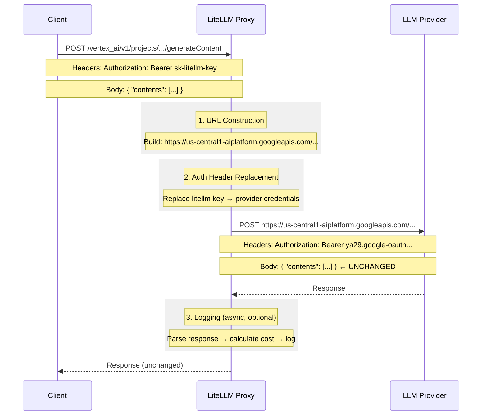

# Pass-Through Endpoints Architecture

## Why Pass-Through Endpoints Transform Requests

Even "pass-through" endpoints must perform essential transformations. The request **body** passes through unchanged, but:

## Essential Transformations

### 1. URL Construction
- **Vertex AI**: Regional endpoints (`us-central1-aiplatform.googleapis.com` vs `europe-west1-aiplatform.googleapis.com`)
- **Bedrock**: Region-specific (`bedrock-runtime.{region}.amazonaws.com`)
- **AssemblyAI**: EU vs US (`api.assemblyai.com` vs `api.eu.assemblyai.com`)

### 2. Auth Header Replacement

| Provider | LiteLLM Key → Provider Credential |
|----------|-----------------------------------|
| Vertex AI | `Bearer sk-litellm-*` → `Bearer ya29.oauth-token` |
| Anthropic | `Bearer sk-litellm-*` → `x-api-key: sk-ant-*` |
| Bedrock | `Bearer sk-litellm-*` → AWS SigV4 signed headers |
| Gemini | `Bearer sk-litellm-*` → `?key={api_key}` (query param) |

### 3. Logging (Optional)
- Parse provider-native response to extract usage
- Calculate cost using LiteLLM pricing
- Send to callbacks (Langfuse, etc.)

## What Does NOT Change
- Request body passes through unchanged
- Response body passes through unchanged
- Provider-specific parameters work as documented

## Key Files

| Component | File |
|-----------|------|
| Main handler | `proxy/pass_through_endpoints/pass_through_endpoints.py` |
| Provider routes | `proxy/pass_through_endpoints/llm_passthrough_endpoints.py` |
| Credential router | `proxy/pass_through_endpoints/passthrough_endpoint_router.py` |
| Logging handlers | `proxy/pass_through_endpoints/llm_provider_handlers/` |
