# Azure Model Router

Azure Model Router is a feature in Azure AI Foundry that automatically routes your requests to the best available model based on your requirements. This allows you to use a single endpoint that intelligently selects the optimal model for each request.

## Key Features

- **Automatic Model Selection**: Azure Model Router dynamically selects the best model for your request
- **Cost Tracking**: LiteLLM automatically tracks costs based on the actual model used (e.g., `gpt-4.1-nano`), plus the Model Router infrastructure fee
- **Streaming Support**: Full support for streaming responses with accurate cost calculation
- **Simple Configuration**: Easy to set up via UI or config file

## Model Naming Pattern

Use the pattern: `azure_ai/model_router/<deployment-name>`

**Components:**
- `azure_ai` - The provider identifier
- `model_router` - Indicates this is a Model Router deployment
- `<deployment-name>` - Your actual deployment name from Azure AI Foundry (e.g., `azure-model-router`)

**Example:** `azure_ai/model_router/azure-model-router`

**How it works:**
- LiteLLM automatically strips the `model_router/` prefix when sending requests to Azure
- Only your deployment name (e.g., `azure-model-router`) is sent to the Azure API
- The full path is preserved in responses and logs for proper cost tracking

## LiteLLM Python SDK

### Basic Usage

Use the pattern `azure_ai/model_router/<deployment-name>` where `<deployment-name>` is your Azure deployment name:

```python
import litellm
import os

response = litellm.completion(
    model="azure_ai/model_router/azure-model-router",  # Use your deployment name
    messages=[{"role": "user", "content": "Hello!"}],
    api_base="https://your-endpoint.cognitiveservices.azure.com/openai/v1/",
    api_key=os.getenv("AZURE_MODEL_ROUTER_API_KEY"),
)

print(response)
```

**Pattern Explanation:**
- `azure_ai` - The provider
- `model_router` - Indicates this is a model router deployment
- `azure-model-router` - Your actual deployment name from Azure AI Foundry

LiteLLM will automatically strip the `model_router/` prefix when sending the request to Azure, so only `azure-model-router` is sent to the API.

### Streaming with Usage Tracking

```python
import litellm
import os

response = await litellm.acompletion(
    model="azure_ai/model_router/azure-model-router",  # Use your deployment name
    messages=[{"role": "user", "content": "hi"}],
    api_base="https://your-endpoint.cognitiveservices.azure.com/openai/v1/",
    api_key=os.getenv("AZURE_MODEL_ROUTER_API_KEY"),
    stream=True,
    stream_options={"include_usage": True},
)

async for chunk in response:
    print(chunk)
```

## LiteLLM Proxy (AI Gateway)

### config.yaml

```yaml
model_list:
  - model_name: azure-model-router  # Public name for your users
    litellm_params:
      model: azure_ai/model_router/azure-model-router  # Use your deployment name
      api_base: https://your-endpoint.cognitiveservices.azure.com/openai/v1/
      api_key: os.environ/AZURE_MODEL_ROUTER_API_KEY
```

**Note:** Replace `azure-model-router` in the model path with your actual deployment name from Azure AI Foundry.

### Start Proxy

```bash
litellm --config config.yaml
```

### Test Request

```bash
curl -X POST http://localhost:4000/chat/completions \
  -H "Content-Type: application/json" \
  -H "Authorization: Bearer sk-1234" \
  -d '{
    "model": "azure-model-router",
    "messages": [{"role": "user", "content": "Hello!"}]
  }'
```

## Add Azure Model Router via LiteLLM UI

This walkthrough shows how to add an Azure Model Router endpoint to LiteLLM using the Admin Dashboard.

### Quick Start

1. Navigate to the **Models** page in the LiteLLM UI
2. Select **"Azure AI Foundry (Studio)"** as the provider
3. Enter your deployment name (e.g., `azure-model-router`)
4. LiteLLM will automatically format it as `azure_ai/model_router/azure-model-router`
5. Add your API base URL and API key
6. Test and save

### Detailed Walkthrough

#### Step 1: Select Provider

Navigate to the Models page and select "Azure AI Foundry (Studio)" as the provider.

##### Navigate to Models Page

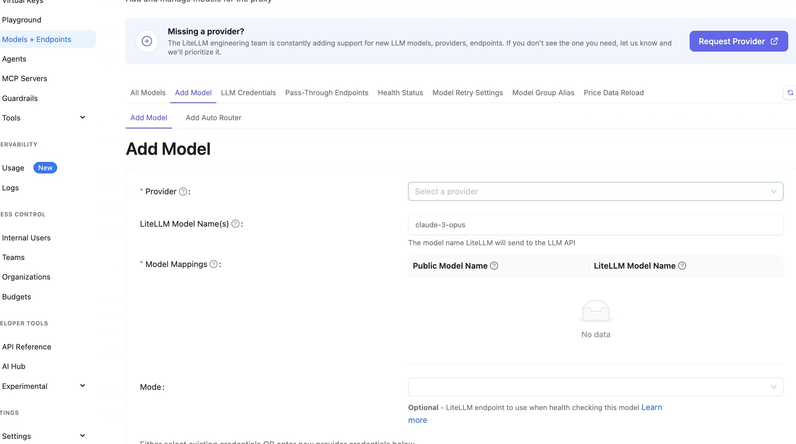

##### Click Provider Dropdown

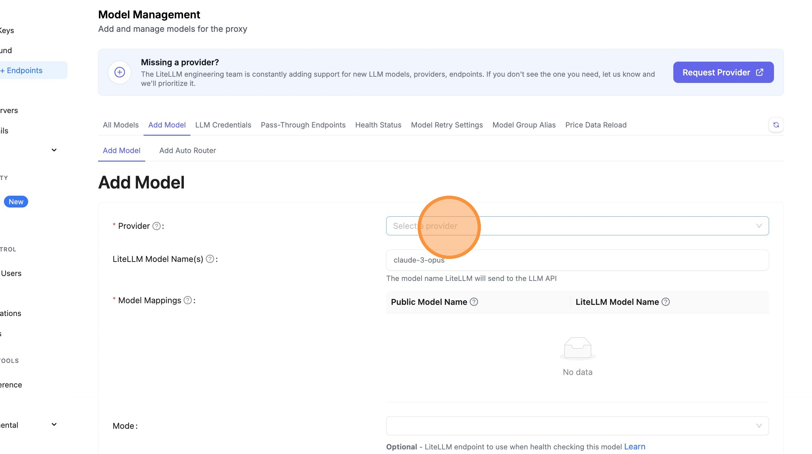

##### Choose Azure AI Foundry

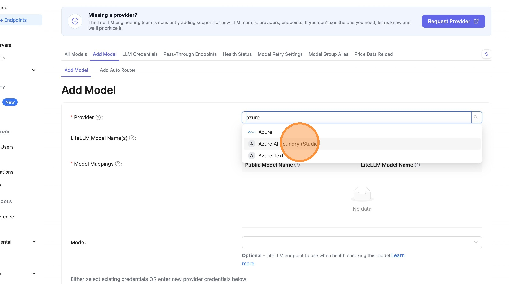

#### Step 2: Enter Deployment Name

**New Simplified Method:** Just enter your deployment name directly in the text field. If your deployment name contains "model-router" or "model_router", LiteLLM will automatically format it as `azure_ai/model_router/<deployment-name>`.

**Example:**
- Enter: `azure-model-router`
- LiteLLM creates: `azure_ai/model_router/azure-model-router`

##### Copy Deployment Name from Azure Portal

Switch to Azure AI Foundry and copy your model router deployment name.

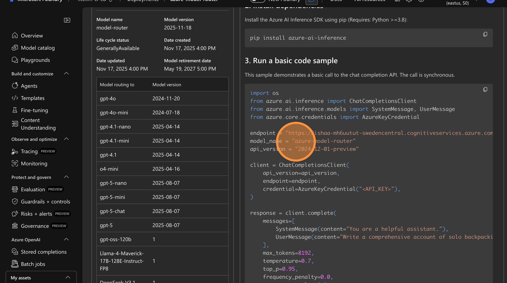

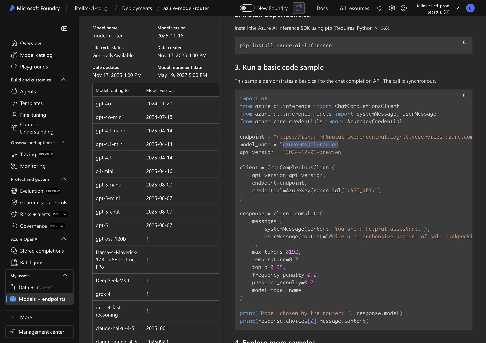

##### Enter Deployment Name in LiteLLM

Paste your deployment name (e.g., `azure-model-router`) directly into the text field.

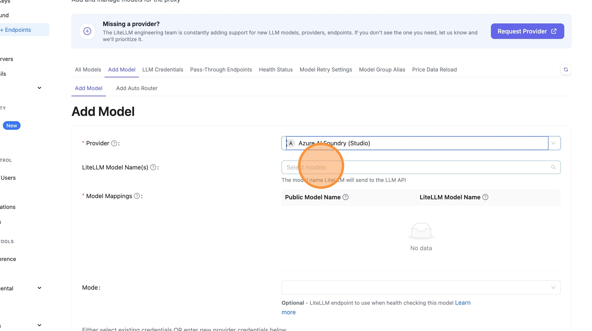

**What happens behind the scenes:**
- You enter: `azure-model-router`
- LiteLLM automatically detects this is a model router deployment
- The full model path becomes: `azure_ai/model_router/azure-model-router`
- When making API calls, only `azure-model-router` is sent to Azure

#### Step 3: Configure API Base and Key

Copy the endpoint URL and API key from Azure portal.

##### Copy API Base URL from Azure

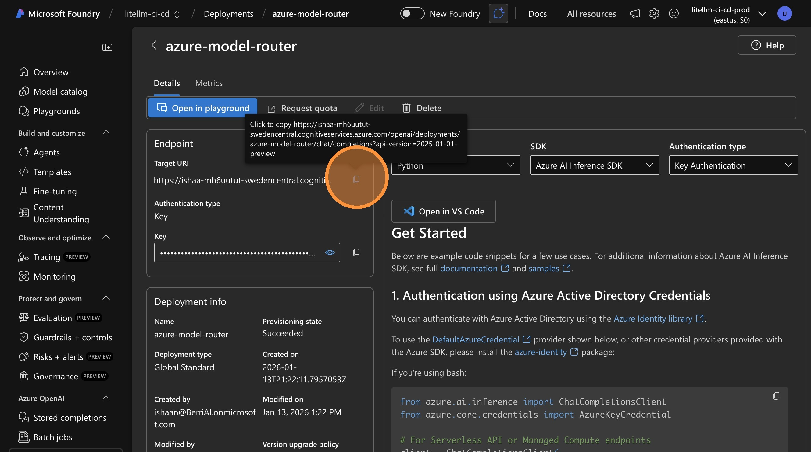

##### Enter API Base in LiteLLM

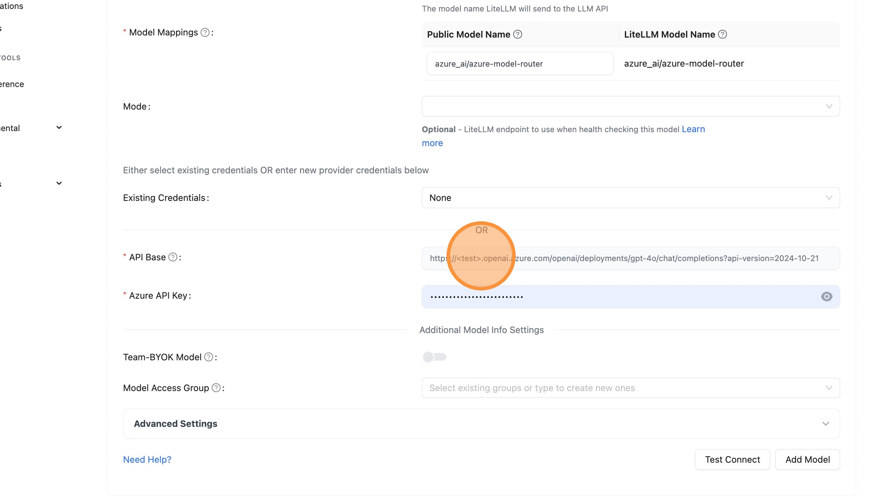

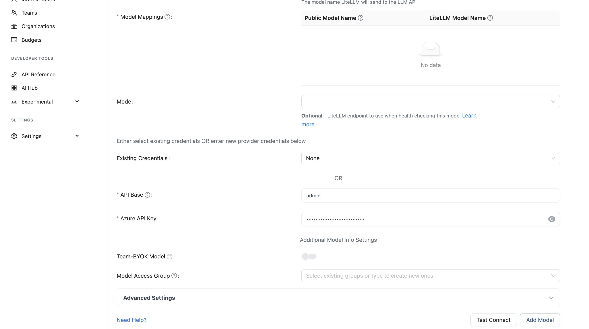

##### Copy API Key from Azure

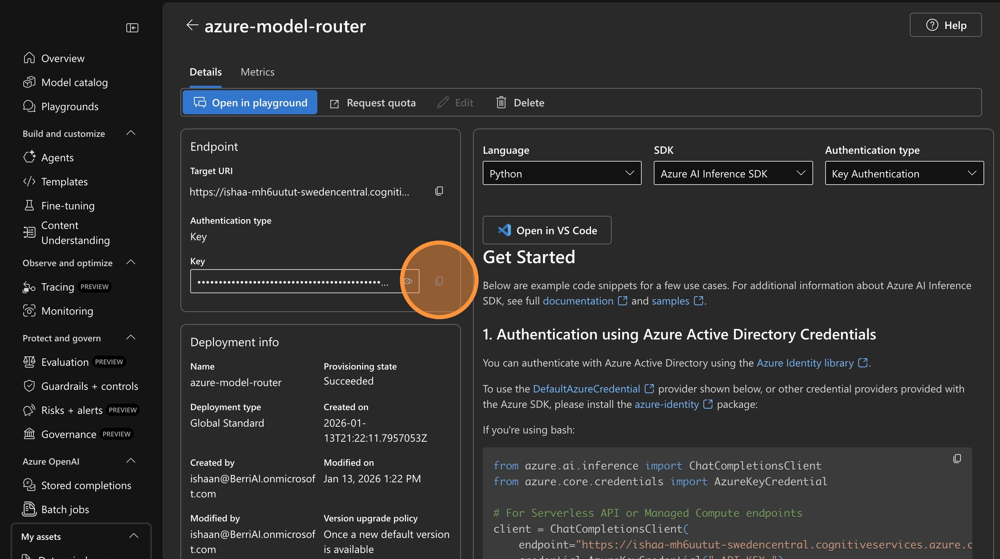

##### Enter API Key in LiteLLM

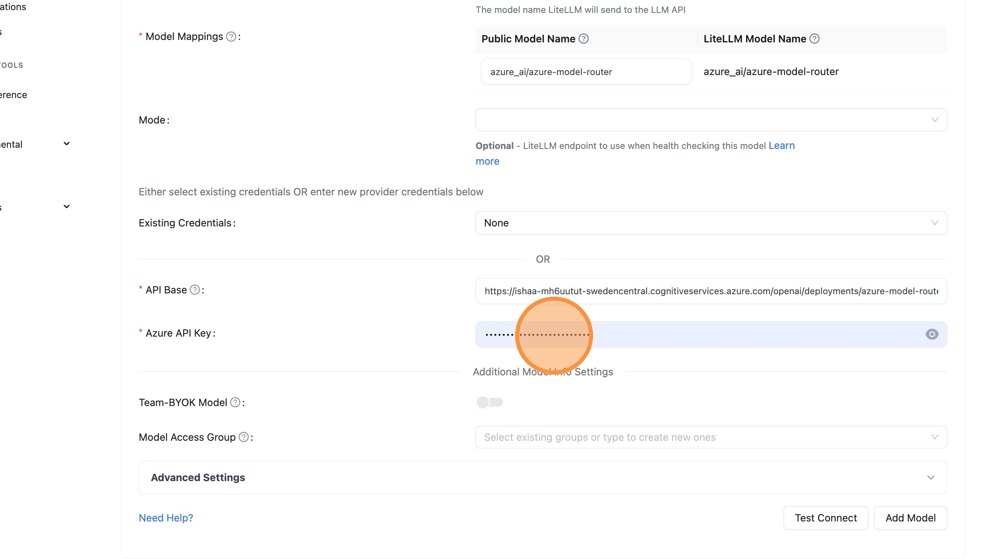

#### Step 4: Test and Add Model

Verify your configuration works and save the model.

##### Test Connection

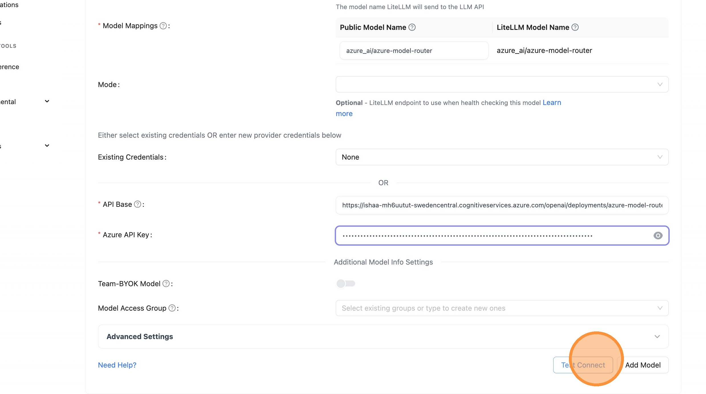

##### Close Test Dialog


##### Add Model

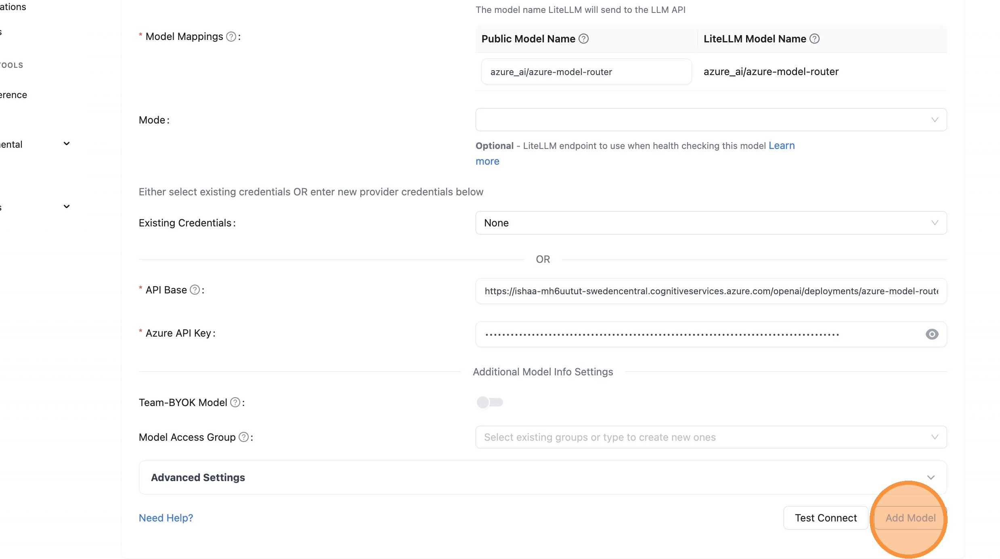

#### Step 5: Verify in Playground

Test your model and verify cost tracking is working.

##### Open Playground

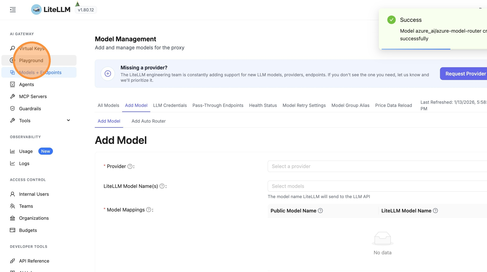

##### Select Model

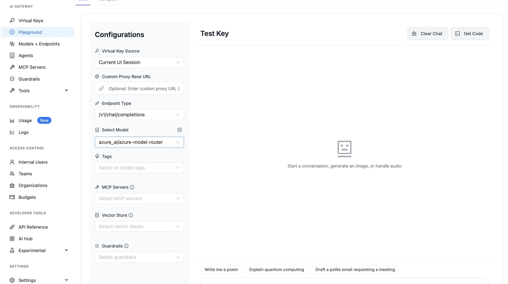

##### Send Test Message

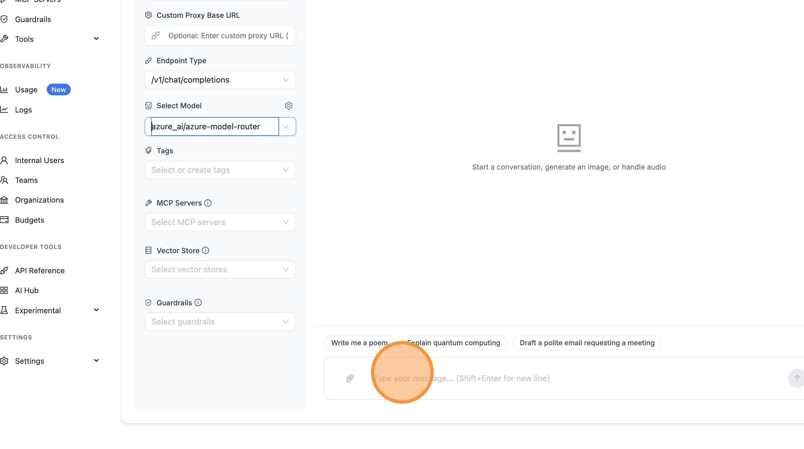

##### View Logs

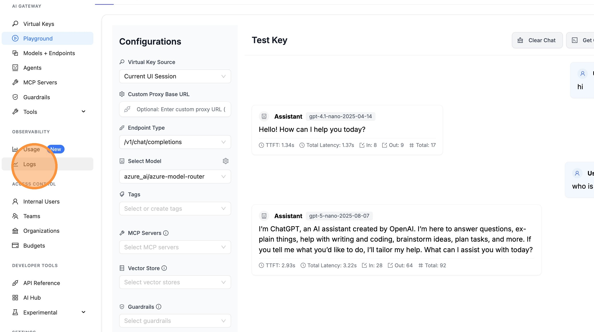

##### Verify Cost Tracking

Cost is tracked based on the actual model used (e.g., `gpt-4.1-nano`), plus a flat infrastructure cost of $0.14 per million input tokens for using the Model Router.

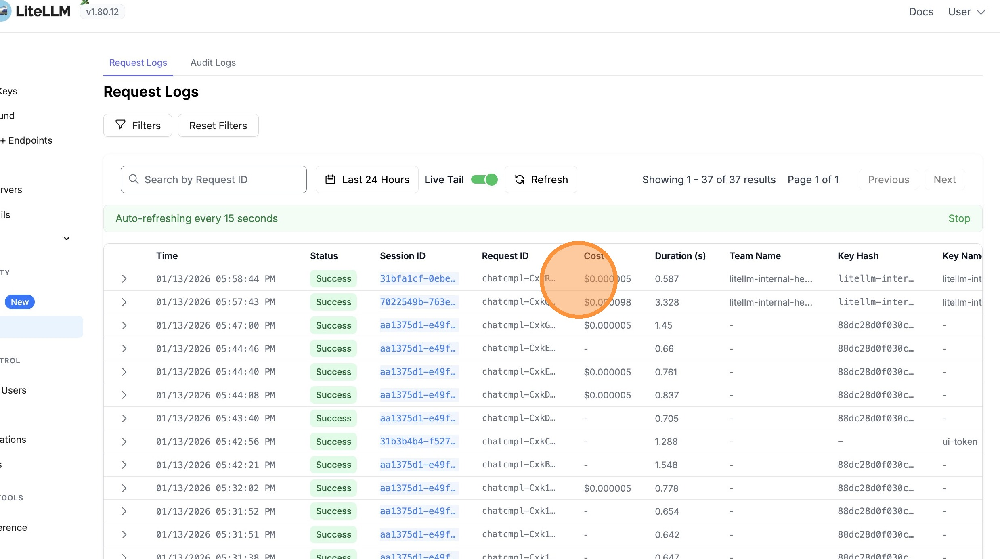

## Cost Tracking

LiteLLM automatically handles cost tracking for Azure Model Router by:

1. **Detecting the actual model**: When Azure Model Router routes your request to a specific model (e.g., `gpt-4.1-nano-2025-04-14`), LiteLLM extracts this from the response
2. **Calculating accurate costs**: Costs are calculated based on:
   - The actual model used (e.g., `gpt-4.1-nano` token costs)
   - Plus a flat infrastructure cost of **$0.14 per million input tokens** for using the Model Router
3. **Streaming support**: Cost tracking works correctly for both streaming and non-streaming requests

### Cost Breakdown

When you use Azure Model Router, the total cost includes:

- **Model Cost**: Based on the actual model that handled your request (e.g., `gpt-4.1-nano`)
- **Router Flat Cost**: $0.14 per million input tokens (Azure AI Foundry infrastructure fee)

### Example Response with Cost

```python
import litellm

response = litellm.completion(
    model="azure_ai/model_router/azure-model-router",
    messages=[{"role": "user", "content": "Hello!"}],
    api_base="https://your-endpoint.cognitiveservices.azure.com/openai/v1/",
    api_key="your-api-key",
)

# The response will show the actual model used
print(f"Model used: {response.model}")  # e.g., "azure_ai/gpt-4.1-nano-2025-04-14"

# Get cost (includes both model cost and router flat cost)
from litellm import completion_cost
cost = completion_cost(completion_response=response)
print(f"Total cost: ${cost}")

# Access detailed cost breakdown
if hasattr(response, '_hidden_params') and 'response_cost' in response._hidden_params:
    print(f"Response cost: ${response._hidden_params['response_cost']}")
```

### Viewing Cost Breakdown in UI

When viewing logs in the LiteLLM UI, you'll see:
- **Model Cost**: The cost for the actual model used
- **Azure Model Router Flat Cost**: The $0.14/M input tokens infrastructure fee
- **Total Cost**: Sum of both costs

This breakdown helps you understand exactly what you're paying for when using the Model Router.


