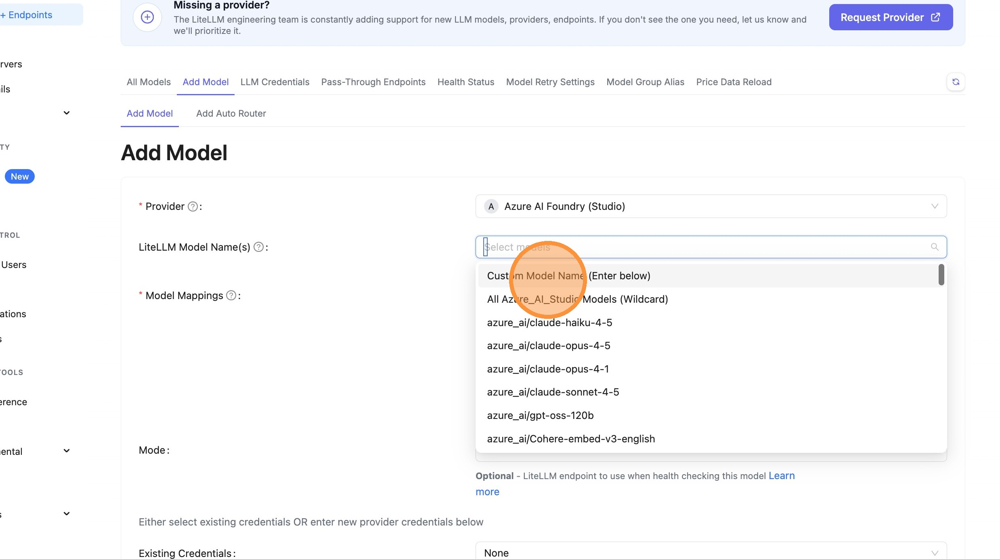
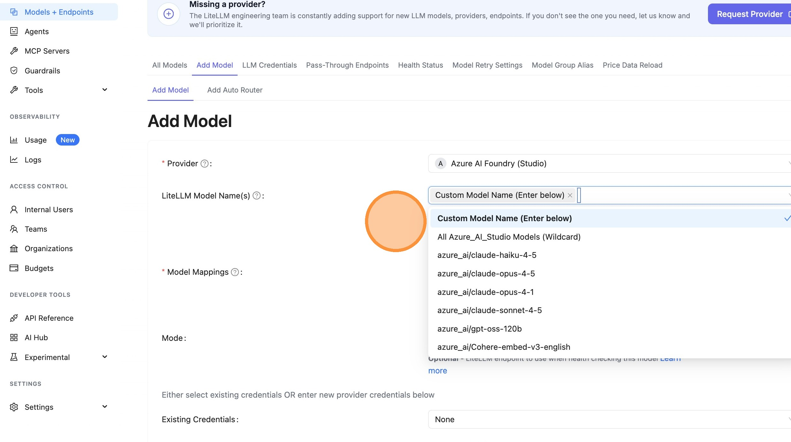
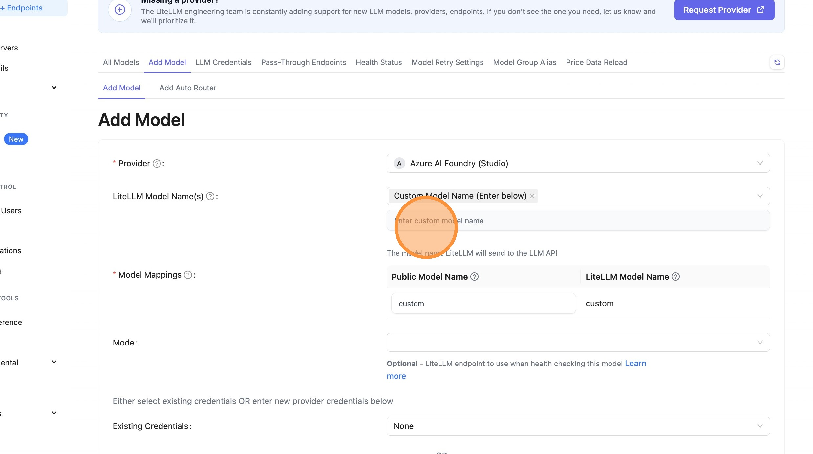
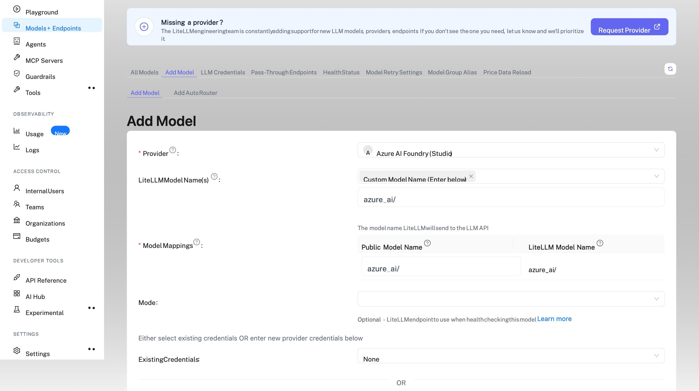
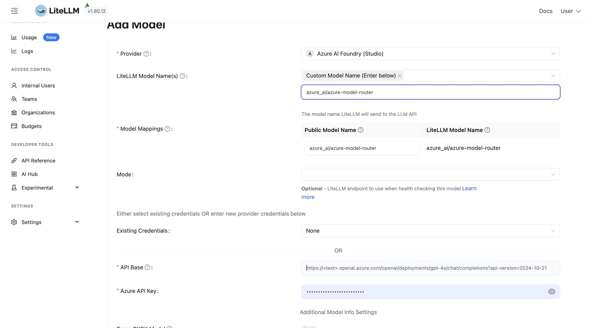

# Azure Model Router

Azure Model Router is a feature in Azure AI Foundry that automatically routes your requests to the best available model based on your requirements. This allows you to use a single endpoint that intelligently selects the optimal model for each request.

## Key Features

- **Automatic Model Selection**: Azure Model Router dynamically selects the best model for your request
- **Cost Tracking**: LiteLLM automatically tracks costs based on the actual model used (e.g., `gpt-4.1-nano`), not the router endpoint
- **Streaming Support**: Full support for streaming responses with accurate cost calculation

## LiteLLM Python SDK

### Basic Usage

```python
import litellm
import os

response = litellm.completion(
    model="azure_ai/azure-model-router",
    messages=[{"role": "user", "content": "Hello!"}],
    api_base="https://your-endpoint.cognitiveservices.azure.com/openai/v1/",
    api_key=os.getenv("AZURE_MODEL_ROUTER_API_KEY"),
)

print(response)
```

### Streaming with Usage Tracking

```python
import litellm
import os

response = await litellm.acompletion(
    model="azure_ai/azure-model-router",
    messages=[{"role": "user", "content": "hi"}],
    api_base="https://your-endpoint.cognitiveservices.azure.com/openai/v1/",
    api_key=os.getenv("AZURE_MODEL_ROUTER_API_KEY"),
    stream=True,
    stream_options={"include_usage": True},
)

async for chunk in response:
    print(chunk)
```

## LiteLLM Proxy (AI Gateway)

### config.yaml

```yaml
model_list:
  - model_name: azure-model-router
    litellm_params:
      model: azure_ai/azure-model-router
      api_base: https://your-endpoint.cognitiveservices.azure.com/openai/v1/
      api_key: os.environ/AZURE_MODEL_ROUTER_API_KEY
```

### Start Proxy

```bash
litellm --config config.yaml
```

### Test Request

```bash
curl -X POST http://localhost:4000/chat/completions \
  -H "Content-Type: application/json" \
  -H "Authorization: Bearer sk-1234" \
  -d '{
    "model": "azure-model-router",
    "messages": [{"role": "user", "content": "Hello!"}]
  }'
```

## Add Azure Model Router via LiteLLM UI

This walkthrough shows how to add an Azure Model Router endpoint to LiteLLM using the Admin Dashboard.

### Select Provider

Navigate to the Models page and select "Azure AI Foundry (Studio)" as the provider.

#### Navigate to Models Page


#### Click Provider Dropdown


#### Choose Azure AI Foundry


### Configure Model Name

Set up the model name by entering `azure_ai/` followed by your model router deployment name from Azure.

#### Click Model Name Field


#### Select Custom Model Name



#### Enter LiteLLM Model Name



#### Click Custom Model Name Field



#### Type Model Prefix

Type `azure_ai/` as the prefix.



#### Copy Model Name from Azure Portal

Switch to Azure AI Foundry and copy your model router deployment name.


#### Paste Model Name

Paste to get `azure_ai/azure-model-router`.



### Configure API Base and Key

Copy the endpoint URL and API key from Azure portal.

#### Copy API Base URL from Azure


#### Enter API Base in LiteLLM


#### Copy API Key from Azure


#### Enter API Key in LiteLLM


### Test and Add Model

Verify your configuration works and save the model.

#### Test Connection


#### Close Test Dialog


#### Add Model


### Verify in Playground

Test your model and verify cost tracking is working.

#### Open Playground


#### Select Model


#### Send Test Message


#### View Logs


#### Verify Cost Tracking

Cost is tracked based on the actual model used (e.g., `gpt-4.1-nano`).


## Cost Tracking

LiteLLM automatically handles cost tracking for Azure Model Router by:

1. **Detecting the actual model**: When Azure Model Router routes your request to a specific model (e.g., `gpt-4.1-nano-2025-04-14`), LiteLLM extracts this from the response
2. **Calculating accurate costs**: Costs are calculated based on the actual model used, not the router endpoint name
3. **Streaming support**: Cost tracking works correctly for both streaming and non-streaming requests

### Example Response with Cost

```python
import litellm

response = litellm.completion(
    model="azure_ai/azure-model-router",
    messages=[{"role": "user", "content": "Hello!"}],
    api_base="https://your-endpoint.cognitiveservices.azure.com/openai/v1/",
    api_key="your-api-key",
)

# The response will show the actual model used
print(f"Model used: {response.model}")  # e.g., "gpt-4.1-nano-2025-04-14"

# Get cost
from litellm import completion_cost
cost = completion_cost(completion_response=response)
print(f"Cost: ${cost}")
```


