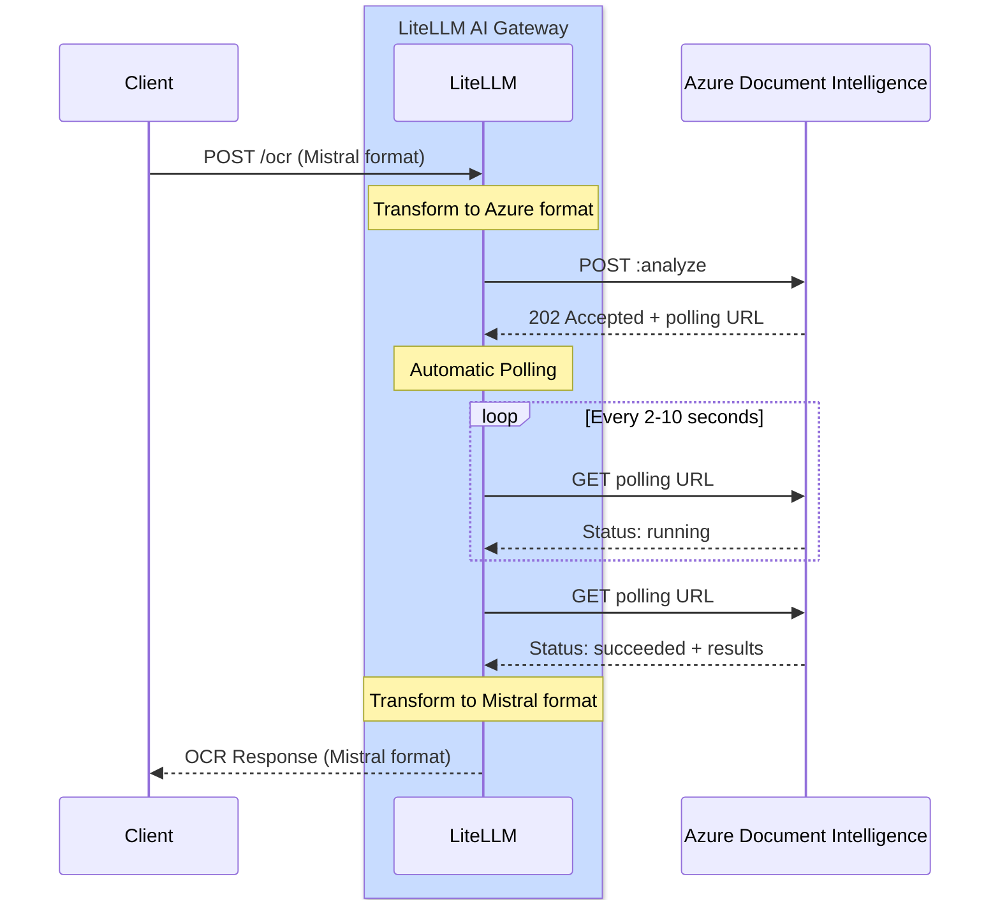

# Azure Document Intelligence OCR

## Overview

| Property | Details |
|-------|-------|
| Description | Azure Document Intelligence (formerly Form Recognizer) provides advanced document analysis capabilities including text extraction, layout analysis, and structure recognition |
| Provider Route on LiteLLM | `azure_ai/doc-intelligence/` |
| Supported Operations | `/ocr` |
| Link to Provider Doc | [Azure Document Intelligence ↗](https://learn.microsoft.com/en-us/azure/ai-services/document-intelligence/)

Extract text and analyze document structure using Azure Document Intelligence's powerful prebuilt models.

## Quick Start

### **LiteLLM SDK**

```python showLineNumbers title="SDK Usage"
import litellm
import os

# Set environment variables
os.environ["AZURE_DOCUMENT_INTELLIGENCE_API_KEY"] = "your-api-key"
os.environ["AZURE_DOCUMENT_INTELLIGENCE_ENDPOINT"] = "https://your-resource.cognitiveservices.azure.com"

# OCR with PDF URL
response = litellm.ocr(
    model="azure_ai/doc-intelligence/prebuilt-layout",
    document={
        "type": "document_url",
        "document_url": "https://example.com/document.pdf"
    }
)

# Access extracted text
for page in response.pages:
    print(f"Page {page.index}:")
    print(page.markdown)
```

### **LiteLLM PROXY**

```yaml showLineNumbers title="proxy_config.yaml"
model_list:
  - model_name: azure-doc-intel
    litellm_params:
      model: azure_ai/doc-intelligence/prebuilt-layout
      api_key: os.environ/AZURE_DOCUMENT_INTELLIGENCE_API_KEY
      api_base: os.environ/AZURE_DOCUMENT_INTELLIGENCE_ENDPOINT
    model_info:
      mode: ocr
```

**Start Proxy**
```bash
litellm --config proxy_config.yaml
```

**Call OCR via Proxy**
```bash showLineNumbers title="cURL Request"
curl -X POST http://localhost:4000/ocr \
  -H "Content-Type: application/json" \
  -H "Authorization: Bearer your-api-key" \
  -d '{
    "model": "azure-doc-intel",
    "document": {
      "type": "document_url",
      "document_url": "https://arxiv.org/pdf/2201.04234"
    }
  }'
```

## How It Works

Azure Document Intelligence uses an asynchronous API pattern. LiteLLM AI Gateway handles the request/response transformation and polling automatically.

### Complete Flow Diagram



### What LiteLLM Does For You

When you call `litellm.ocr()` via SDK or `/ocr` via Proxy:

1. **Request Transformation**: Converts Mistral OCR format → Azure Document Intelligence format
2. **Submits Document**: Sends transformed request to Azure DI API
3. **Handles 202 Response**: Captures the `Operation-Location` URL from response headers
4. **Automatic Polling**: 
   - Polls the operation URL at intervals specified by `retry-after` header (default: 2 seconds)
   - Continues until status is `succeeded` or `failed`
   - Respects Azure's rate limiting via `retry-after` headers
5. **Response Transformation**: Converts Azure DI format → Mistral OCR format
6. **Returns Result**: Sends unified Mistral format response to client

**Polling Configuration:**
- Default timeout: 120 seconds
- Configurable via `AZURE_OPERATION_POLLING_TIMEOUT` environment variable
- Uses sync (`time.sleep()`) or async (`await asyncio.sleep()`) based on call type

:::info
**Typical processing time**: 2-10 seconds depending on document size and complexity
:::

## Supported Models

Azure Document Intelligence offers several prebuilt models optimized for different use cases:

### prebuilt-layout (Recommended)

Best for general document OCR with structure preservation.

import Tabs from '@theme/Tabs';
import TabItem from '@theme/TabItem';

<Tabs>
<TabItem value="sdk" label="SDK">

```python showLineNumbers title="Layout Model - SDK"
import litellm
import os

os.environ["AZURE_DOCUMENT_INTELLIGENCE_API_KEY"] = "your-api-key"
os.environ["AZURE_DOCUMENT_INTELLIGENCE_ENDPOINT"] = "https://your-resource.cognitiveservices.azure.com"

response = litellm.ocr(
    model="azure_ai/doc-intelligence/prebuilt-layout",
    document={
        "type": "document_url",
        "document_url": "https://example.com/document.pdf"
    }
)
```

</TabItem>
<TabItem value="proxy" label="Proxy Config">

```yaml showLineNumbers title="proxy_config.yaml"
model_list:
  - model_name: azure-layout
    litellm_params:
      model: azure_ai/doc-intelligence/prebuilt-layout
      api_key: os.environ/AZURE_DOCUMENT_INTELLIGENCE_API_KEY
      api_base: os.environ/AZURE_DOCUMENT_INTELLIGENCE_ENDPOINT
    model_info:
      mode: ocr
```

**Usage:**
```bash
curl -X POST http://localhost:4000/ocr \
  -H "Authorization: Bearer your-api-key" \
  -d '{"model": "azure-layout", "document": {"type": "document_url", "document_url": "https://example.com/doc.pdf"}}'
```

</TabItem>
</Tabs>

**Features:**
- Text extraction with markdown formatting
- Table detection and extraction
- Document structure analysis
- Paragraph and section recognition

**Pricing:** $10 per 1,000 pages

### prebuilt-read

Optimized for reading text from documents - fastest and most cost-effective.

<Tabs>
<TabItem value="sdk" label="SDK">

```python showLineNumbers title="Read Model - SDK"
import litellm
import os

os.environ["AZURE_DOCUMENT_INTELLIGENCE_API_KEY"] = "your-api-key"
os.environ["AZURE_DOCUMENT_INTELLIGENCE_ENDPOINT"] = "https://your-resource.cognitiveservices.azure.com"

response = litellm.ocr(
    model="azure_ai/doc-intelligence/prebuilt-read",
    document={
        "type": "document_url",
        "document_url": "https://example.com/document.pdf"
    }
)
```

</TabItem>
<TabItem value="proxy" label="Proxy Config">

```yaml showLineNumbers title="proxy_config.yaml"
model_list:
  - model_name: azure-read
    litellm_params:
      model: azure_ai/doc-intelligence/prebuilt-read
      api_key: os.environ/AZURE_DOCUMENT_INTELLIGENCE_API_KEY
      api_base: os.environ/AZURE_DOCUMENT_INTELLIGENCE_ENDPOINT
    model_info:
      mode: ocr
```

**Usage:**
```bash
curl -X POST http://localhost:4000/ocr \
  -H "Authorization: Bearer your-api-key" \
  -d '{"model": "azure-read", "document": {"type": "document_url", "document_url": "https://example.com/doc.pdf"}}'
```

</TabItem>
</Tabs>

**Features:**
- Fast text extraction
- Optimized for reading-heavy documents
- Basic structure recognition

**Pricing:** $1.50 per 1,000 pages

### prebuilt-document

General-purpose document analysis with key-value pairs.

<Tabs>
<TabItem value="sdk" label="SDK">

```python showLineNumbers title="Document Model - SDK"
import litellm
import os

os.environ["AZURE_DOCUMENT_INTELLIGENCE_API_KEY"] = "your-api-key"
os.environ["AZURE_DOCUMENT_INTELLIGENCE_ENDPOINT"] = "https://your-resource.cognitiveservices.azure.com"

response = litellm.ocr(
    model="azure_ai/doc-intelligence/prebuilt-document",
    document={
        "type": "document_url",
        "document_url": "https://example.com/document.pdf"
    }
)
```

</TabItem>
<TabItem value="proxy" label="Proxy Config">

```yaml showLineNumbers title="proxy_config.yaml"
model_list:
  - model_name: azure-document
    litellm_params:
      model: azure_ai/doc-intelligence/prebuilt-document
      api_key: os.environ/AZURE_DOCUMENT_INTELLIGENCE_API_KEY
      api_base: os.environ/AZURE_DOCUMENT_INTELLIGENCE_ENDPOINT
    model_info:
      mode: ocr
```

**Usage:**
```bash
curl -X POST http://localhost:4000/ocr \
  -H "Authorization: Bearer your-api-key" \
  -d '{"model": "azure-document", "document": {"type": "document_url", "document_url": "https://example.com/doc.pdf"}}'
```

</TabItem>
</Tabs>

**Pricing:** $10 per 1,000 pages

## Document Types

Azure Document Intelligence supports various document formats.

### PDF Documents

```python showLineNumbers title="PDF OCR"
response = litellm.ocr(
    model="azure_ai/doc-intelligence/prebuilt-layout",
    document={
        "type": "document_url",
        "document_url": "https://example.com/document.pdf"
    }
)
```

### Image Documents

```python showLineNumbers title="Image OCR"
response = litellm.ocr(
    model="azure_ai/doc-intelligence/prebuilt-layout",
    document={
        "type": "image_url",
        "image_url": "https://example.com/image.png"
    }
)
```

**Supported image formats:** JPEG, PNG, BMP, TIFF

### Base64 Encoded Documents

```python showLineNumbers title="Base64 PDF"
import base64

# Read and encode PDF
with open("document.pdf", "rb") as f:
    pdf_base64 = base64.b64encode(f.read()).decode()

response = litellm.ocr(
    model="azure_ai/doc-intelligence/prebuilt-layout",
    document={
        "type": "document_url",
        "document_url": f"data:application/pdf;base64,{pdf_base64}"
    }
)
```

## Response Format

```python showLineNumbers title="Response Structure"
# Response has the following structure
response.pages          # List of pages with extracted text
response.model          # Model used
response.object         # "ocr"
response.usage_info     # Token usage information

# Access page content
for page in response.pages:
    print(f"Page {page.index}:")
    print(page.markdown)
    
    # Page dimensions (in pixels)
    if page.dimensions:
        print(f"Width: {page.dimensions.width}px")
        print(f"Height: {page.dimensions.height}px")
```

## Async Support

```python showLineNumbers title="Async Usage"
import litellm
import asyncio

async def process_document():
    response = await litellm.aocr(
        model="azure_ai/doc-intelligence/prebuilt-layout",
        document={
            "type": "document_url",
            "document_url": "https://example.com/document.pdf"
        }
    )
    return response

# Run async function
response = asyncio.run(process_document())
```

## Cost Tracking

LiteLLM automatically tracks costs for Azure Document Intelligence OCR:

| Model | Cost per 1,000 Pages |
|-------|---------------------|
| prebuilt-read | $1.50 |
| prebuilt-layout | $10.00 |
| prebuilt-document | $10.00 |

```python showLineNumbers title="View Cost"
response = litellm.ocr(
    model="azure_ai/doc-intelligence/prebuilt-layout",
    document={"type": "document_url", "document_url": "https://..."}
)

# Access cost information
print(f"Cost: ${response._hidden_params.get('response_cost', 0)}")
```

## Additional Resources

- [Azure Document Intelligence Documentation](https://learn.microsoft.com/en-us/azure/ai-services/document-intelligence/)
- [Pricing Details](https://azure.microsoft.com/en-us/pricing/details/ai-document-intelligence/)
- [Supported File Formats](https://learn.microsoft.com/en-us/azure/ai-services/document-intelligence/concept-model-overview)
- [LiteLLM OCR Documentation](https://docs.litellm.ai/docs/ocr)

