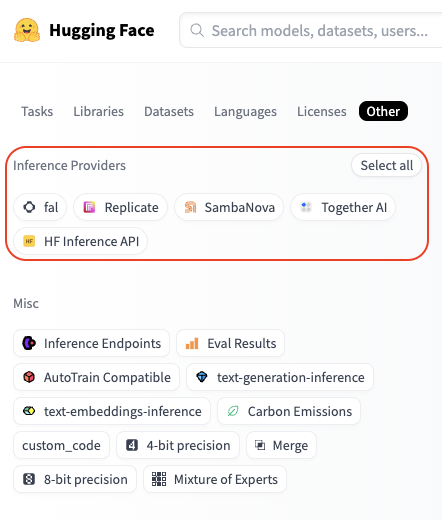

import Image from '@theme/IdealImage';
import Tabs from '@theme/Tabs';
import TabItem from '@theme/TabItem';

# Hugging Face
LiteLLM supports running inference across multiple services for models hosted on the Hugging Face Hub.

- **Serverless Inference Providers** - Hugging Face offers an easy and unified access to serverless AI inference through multiple inference providers, like [Together AI](https://together.ai) and [Sambanova](https://sambanova.ai). This is the fastest way to integrate AI in your products with a maintenance-free and scalable solution. More details in the [Inference Providers documentation](https://huggingface.co/docs/inference-providers/index).
- **Dedicated Inference Endpoints** - which is a product to easily deploy models to production. Inference is run by Hugging Face in a dedicated, fully managed infrastructure on a cloud provider of your choice. You can deploy your model on Hugging Face Inference Endpoints by following [these steps](https://huggingface.co/docs/inference-endpoints/guides/create_endpoint).


## Supported Models

### Serverless Inference Providers
You can check available models for an inference provider by going to [huggingface.co/models](https://huggingface.co/models), clicking the "Other" filter tab, and selecting your desired provider:



For example, you can find all Fireworks supported models [here](https://huggingface.co/models?inference_provider=fireworks-ai&sort=trending).


### Dedicated Inference Endpoints
Refer to the [Inference Endpoints catalog](https://endpoints.huggingface.co/catalog) for a list of available models.

## Usage

<Tabs>
<TabItem value="serverless" label="Serverless Inference Providers">

### Authentication
With a single Hugging Face token, you can access inference through multiple providers. Your calls are routed through Hugging Face and the usage is billed directly to your Hugging Face account at the standard provider API rates.

Simply set the `HF_TOKEN` environment variable with your Hugging Face token, you can create one here: https://huggingface.co/settings/tokens.

```bash
export HF_TOKEN="hf_xxxxxx"
```
or alternatively, you can pass your Hugging Face token as a parameter:
```python
completion(..., api_key="hf_xxxxxx")
```

### Getting Started

To use a Hugging Face model, specify both the provider and model you want to use in the following format:
```
huggingface/<provider>/<hf_org_or_user>/<hf_model>
```
Where `<hf_org_or_user>/<hf_model>` is the Hugging Face model ID and `<provider>` is the inference provider.  
By default, if you don't specify a provider, LiteLLM will use the [HF Inference API](https://huggingface.co/docs/api-inference/en/index).

Examples:

```python
# Run DeepSeek-R1 inference through Together AI
completion(model="huggingface/together/deepseek-ai/DeepSeek-R1",...)

# Run Qwen2.5-72B-Instruct inference through Sambanova
completion(model="huggingface/sambanova/Qwen/Qwen2.5-72B-Instruct",...)

# Run Llama-3.3-70B-Instruct inference through HF Inference API
completion(model="huggingface/meta-llama/Llama-3.3-70B-Instruct",...)
```


<a target="_blank" href="https://colab.research.google.com/github/BerriAI/litellm/blob/main/cookbook/LiteLLM_HuggingFace.ipynb">
  
</a>

### Basic Completion
Here's an example of chat completion using the DeepSeek-R1 model through Together AI:

```python
import os
from litellm import completion

os.environ["HF_TOKEN"] = "hf_xxxxxx"

response = completion(
    model="huggingface/together/deepseek-ai/DeepSeek-R1",
    messages=[
        {
            "role": "user",
            "content": "How many r's are in the word 'strawberry'?",
        }
    ],
)
print(response)
```

### Streaming
Now, let's see what a streaming request looks like.

```python
import os
from litellm import completion

os.environ["HF_TOKEN"] = "hf_xxxxxx"

response = completion(
    model="huggingface/together/deepseek-ai/DeepSeek-R1",
    messages=[
        {
            "role": "user",
            "content": "How many r's are in the word `strawberry`?",
            
        }
    ],
    stream=True,
)

for chunk in response:
    print(chunk)
```

### Image Input
You can also pass images when the model supports it. Here is an example using [Llama-3.2-11B-Vision-Instruct](https://huggingface.co/meta-llama/Llama-3.2-11B-Vision-Instruct) model through Sambanova.

```python
from litellm import completion

# Set your Hugging Face Token
os.environ["HF_TOKEN"] = "hf_xxxxxx"

messages=[
        {
            "role": "user",
            "content": [
                {"type": "text", "text": "What's in this image?"},
                {
                    "type": "image_url",
                    "image_url": {
                        "url": "https://awsmp-logos.s3.amazonaws.com/seller-xw5kijmvmzasy/c233c9ade2ccb5491072ae232c814942.png",
                    }
                },
            ],
        }
    ]

response = completion(
    model="huggingface/sambanova/meta-llama/Llama-3.2-11B-Vision-Instruct", 
    messages=messages,
)
print(response.choices[0])
```

### Function Calling
You can extend the model's capabilities by giving them access to tools. Here is an example with function calling using [Qwen2.5-72B-Instruct](https://huggingface.co/Qwen/Qwen2.5-72B-Instruct) model through Sambanova.

```python
import os
from litellm import completion

# Set your Hugging Face Token
os.environ["HF_TOKEN"] = "hf_xxxxxx"

tools = [
  {
    "type": "function",
    "function": {
      "name": "get_current_weather",
      "description": "Get the current weather in a given location",
      "parameters": {
        "type": "object",
        "properties": {
          "location": {
            "type": "string",
            "description": "The city and state, e.g. San Francisco, CA",
          },
          "unit": {"type": "string", "enum": ["celsius", "fahrenheit"]},
        },
        "required": ["location"],
      },
    }
  }
]
messages = [
    {
        "role": "user",
        "content": "What's the weather like in Boston today?",
    }
]

response = completion(
    model="huggingface/sambanova/meta-llama/Llama-3.3-70B-Instruct", 
    messages=messages,
    tools=tools,
    tool_choice="auto"
)
print(response)
```

</TabItem>

<TabItem value="endpoints" label="Inference Endpoints">

<a target="_blank" href="https://colab.research.google.com/github/BerriAI/litellm/blob/main/cookbook/LiteLLM_HuggingFace.ipynb">
  
</a>

### Basic Completion
After you have [deployed your Hugging Face Inference Endpoint](https://endpoints.huggingface.co/new) on dedicated infrastructure, you can run inference on it by providing the endpoint base URL in `api_base`, and indicating `huggingface/tgi` as the model name.

```python
import os
from litellm import completion

os.environ["HF_TOKEN"] = "hf_xxxxxx"

response = completion(
    model="huggingface/tgi",
    messages=[{"content": "Hello, how are you?", "role": "user"}],
    api_base="https://my-endpoint.endpoints.huggingface.cloud/v1/"
)
print(response)
```

### Streaming

```python
import os
from litellm import completion

os.environ["HF_TOKEN"] = "hf_xxxxxx"

response = completion(
    model="huggingface/tgi",
    messages=[{"content": "Hello, how are you?", "role": "user"}],
    api_base="https://my-endpoint.endpoints.huggingface.cloud/v1/",
    stream=True
)

for chunk in response:
    print(chunk)
```

### Image Input

```python
import os
from litellm import completion

os.environ["HF_TOKEN"] = "hf_xxxxxx"

messages=[
        {
            "role": "user",
            "content": [
                {"type": "text", "text": "What's in this image?"},
                {
                    "type": "image_url",
                    "image_url": {
                        "url": "https://awsmp-logos.s3.amazonaws.com/seller-xw5kijmvmzasy/c233c9ade2ccb5491072ae232c814942.png",
                    }
                },
            ],
        }
    ]
response = completion(
    model="huggingface/tgi",
    messages=messages,
    api_base="https://my-endpoint.endpoints.huggingface.cloud/v1/""
)
print(response.choices[0])
```

### Function Calling

```python
import os
from litellm import completion

os.environ["HF_TOKEN"] = "hf_xxxxxx"

functions = [{
    "name": "get_weather",
    "description": "Get the weather in a given location",
    "parameters": {
        "type": "object",
        "properties": {
            "location": {
                "type": "string",
                "description": "The location to get weather for"
            }
        },
        "required": ["location"]
    }
}]

response = completion(
    model="huggingface/tgi",
    messages=[{"content": "What's the weather like in San Francisco?", "role": "user"}],
    api_base="https://my-endpoint.endpoints.huggingface.cloud/v1/",
    functions=functions
)
print(response)
```

</TabItem>
</Tabs>

## LiteLLM Proxy Server with Hugging Face models
You can set up a [LiteLLM Proxy Server](https://docs.litellm.ai/#litellm-proxy-server-llm-gateway) to serve Hugging Face models through any of the supported Inference Providers. Here's how to do it:

### Step 1. Setup the config file

In this case, we are configuring a proxy to serve `DeepSeek R1` from Hugging Face, using Together AI as the backend Inference Provider.

```yaml
model_list:
  - model_name: my-r1-model
    litellm_params:
      model: huggingface/together/deepseek-ai/DeepSeek-R1
      api_key: os.environ/HF_TOKEN # ensure you have `HF_TOKEN` in your .env
```

### Step 2. Start the server
```bash
litellm --config /path/to/config.yaml
```

### Step 3. Make a request to the server
<Tabs>
<TabItem value="curl" label="curl">

```shell
curl --location 'http://0.0.0.0:4000/chat/completions' \
    --header 'Content-Type: application/json' \
    --data '{
    "model": "my-r1-model",
    "messages": [
        {
            "role": "user",
            "content": "Hello, how are you?"
        }
    ]
}'
```

</TabItem>
<TabItem value="python" label="python">

```python
# pip install openai
from openai import OpenAI

client = OpenAI(
    base_url="http://0.0.0.0:4000",
    api_key="anything",
)

response = client.chat.completions.create(
    model="my-r1-model",
    messages=[
        {"role": "user", "content": "Hello, how are you?"}
    ]
)
print(response)
```

</TabItem>
</Tabs>


## Embedding

LiteLLM supports Hugging Face's [text-embedding-inference](https://github.com/huggingface/text-embeddings-inference) models as well.

```python
from litellm import embedding
import os
os.environ['HF_TOKEN'] = "hf_xxxxxx"
response = embedding(
    model='huggingface/microsoft/codebert-base',
    input=["good morning from litellm"]
)
```

# FAQ

**How does billing work with Hugging Face Inference Providers?**

> Billing is centralized on your Hugging Face account, no matter which providers you are using. You are billed the standard provider API rates with no additional markup - Hugging Face simply passes through the provider costs. Note that [Hugging Face PRO](https://huggingface.co/subscribe/pro) users get $2 worth of Inference credits every month that can be used across providers.

**Do I need to create an account for each Inference Provider?**

> No, you don't need to create separate accounts. All requests are routed through Hugging Face, so you only need your HF token. This allows you to easily benchmark different providers and choose the one that best fits your needs.

**Will more inference providers be supported by Hugging Face in the future?**

> Yes! New inference providers (and models) are being added gradually.

We welcome any suggestions for improving our Hugging Face integration - Create an [issue](https://github.com/BerriAI/litellm/issues/new/choose)/[Join the Discord](https://discord.com/invite/wuPM9dRgDw)!