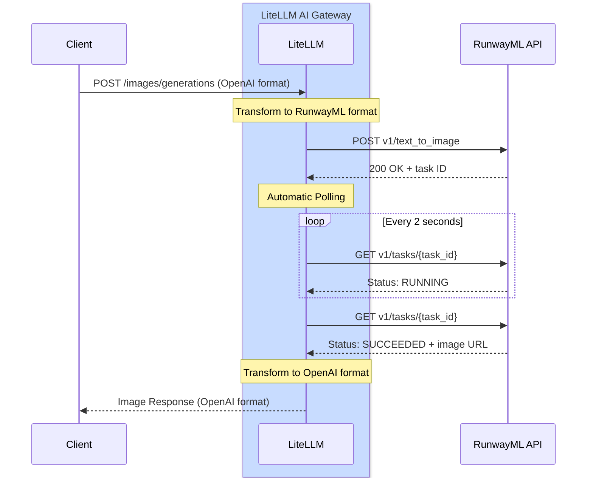

# RunwayML - Image Generation

## Overview

| Property | Details |
|-------|-------|
| Description | RunwayML provides advanced AI-powered image generation with high-quality results |
| Provider Route on LiteLLM | `runwayml/` |
| Supported Operations | [`/images/generations`](#quick-start) |
| Link to Provider Doc | [RunwayML API ↗](https://docs.dev.runwayml.com/) |

LiteLLM supports RunwayML's Gen-4 image generation API, allowing you to generate high-quality images from text prompts.

## Quick Start

```python showLineNumbers title="Basic Image Generation"
from litellm import image_generation
import os

os.environ["RUNWAYML_API_KEY"] = "your-api-key"

response = image_generation(
    model="runwayml/gen4_image",
    prompt="A serene mountain landscape at sunset",
    size="1920x1080"
)

print(response.data[0].url)
```

## Authentication

Set your RunwayML API key:

```python showLineNumbers title="Set API Key"
import os

os.environ["RUNWAYML_API_KEY"] = "your-api-key"
```

## Supported Parameters

| Parameter | Type | Required | Description |
|-----------|------|----------|-------------|
| `model` | string | Yes | Model to use (e.g., `runwayml/gen4_image`) |
| `prompt` | string | Yes | Text description for the image |
| `size` | string | No | Image dimensions (default: `1920x1080`) |

### Supported Sizes

- `1024x1024`
- `1792x1024`
- `1024x1792`
- `1920x1080` (default)
- `1080x1920`

## Async Usage

```python showLineNumbers title="Async Image Generation"
from litellm import aimage_generation
import os
import asyncio

os.environ["RUNWAYML_API_KEY"] = "your-api-key"

async def generate_image():
    response = await aimage_generation(
        model="runwayml/gen4_image",
        prompt="A futuristic city skyline at night",
        size="1920x1080"
    )
    
    print(response.data[0].url)

asyncio.run(generate_image())
```

## LiteLLM Proxy Usage

Add RunwayML to your proxy configuration:

```yaml showLineNumbers title="config.yaml"
model_list:
  - model_name: gen4-image
    litellm_params:
      model: runwayml/gen4_image
      api_key: os.environ/RUNWAYML_API_KEY
```

Start the proxy:

```bash
litellm --config /path/to/config.yaml
```

Generate images through the proxy:

```bash showLineNumbers title="Proxy Request"
curl --location 'http://localhost:4000/v1/images/generations' \
--header 'Content-Type: application/json' \
--header 'x-litellm-api-key: sk-1234' \
--data '{
    "model": "runwayml/gen4_image",
    "prompt": "A serene mountain landscape at sunset",
    "size": "1920x1080"
}'
```

## Supported Models

| Model | Description | Default Size |
|-------|-------------|--------------|
| `runwayml/gen4_image` | High-quality image generation | 1920x1080 |

## Cost Tracking

LiteLLM automatically tracks RunwayML image generation costs:

```python showLineNumbers title="Cost Tracking"
from litellm import image_generation, completion_cost

response = image_generation(
    model="runwayml/gen4_image",
    prompt="A serene mountain landscape at sunset",
    size="1920x1080"
)

cost = completion_cost(completion_response=response)
print(f"Image generation cost: ${cost}")
```

## Supported Features

| Feature | Supported |
|---------|-----------|
| Image Generation | ✅ |
| Cost Tracking | ✅ |
| Logging | ✅ |
| Fallbacks | ✅ |
| Load Balancing | ✅ |


## How It Works

RunwayML uses an asynchronous task-based API pattern. LiteLLM handles the polling and response transformation automatically.

### Complete Flow Diagram



### What LiteLLM Does For You

When you call `litellm.image_generation()` or `/v1/images/generations`:

1. **Request Transformation**: Converts OpenAI image generation format → RunwayML format
2. **Submits Task**: Sends transformed request to RunwayML API
3. **Receives Task ID**: Captures the task ID from the initial response
4. **Automatic Polling**: 
   - Polls the task status endpoint every 2 seconds
   - Continues until status is `SUCCEEDED` or `FAILED`
   - Default timeout: 10 minutes (configurable via `RUNWAYML_POLLING_TIMEOUT`)
5. **Response Transformation**: Converts RunwayML format → OpenAI format
6. **Returns Result**: Sends unified OpenAI format response to client

**Polling Configuration:**
- Default timeout: 600 seconds (10 minutes)
- Configurable via `RUNWAYML_POLLING_TIMEOUT` environment variable
- Uses sync (`time.sleep()`) or async (`await asyncio.sleep()`) based on call type

:::info
**Typical processing time**: 10-30 seconds depending on image size and complexity
:::
