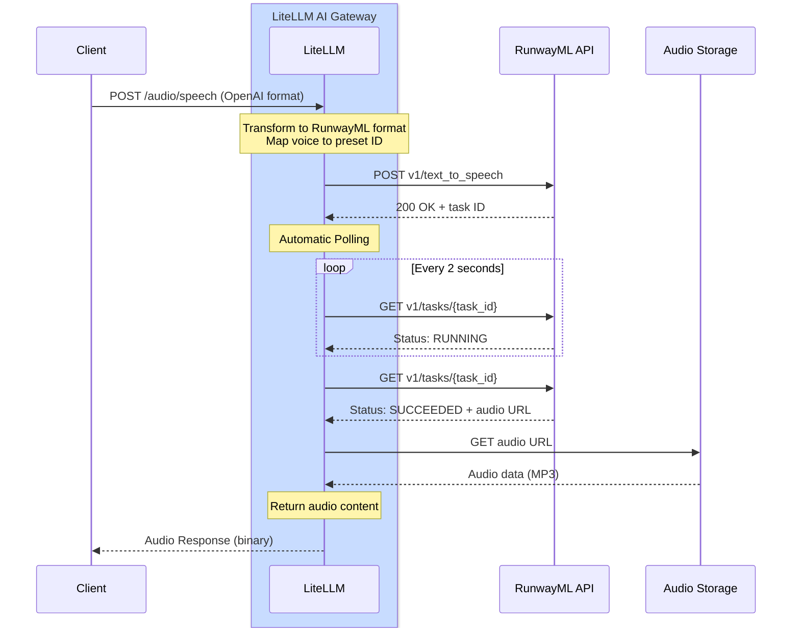

# RunwayML - Text-to-Speech

## Overview

| Property | Details |
|-------|-------|
| Description | RunwayML provides high-quality AI-powered text-to-speech with natural-sounding voices |
| Provider Route on LiteLLM | `runwayml/` |
| Supported Operations | [`/audio/speech`](#quick-start) |
| Link to Provider Doc | [RunwayML API ↗](https://docs.dev.runwayml.com/) |

LiteLLM supports RunwayML's text-to-speech API with automatic task polling, allowing you to generate natural-sounding audio from text.

## Quick Start

```python showLineNumbers title="Basic Text-to-Speech"
from litellm import speech
import os

os.environ["RUNWAYML_API_KEY"] = "your-api-key"

response = speech(
    model="runwayml/eleven_multilingual_v2",
    input="Step right up, ladies and gentlemen! Have you ever wished for a toaster that's not just a toaster but a marvel of modern ingenuity?",
    voice="alloy"
)

# Save the audio
with open("output.mp3", "wb") as f:
    f.write(response.content)
```

## Authentication

Set your RunwayML API key:

```python showLineNumbers title="Set API Key"
import os

os.environ["RUNWAYML_API_KEY"] = "your-api-key"
```

## Supported Parameters

| Parameter | Type | Required | Description |
|-----------|------|----------|-------------|
| `model` | string | Yes | Model to use (e.g., `runwayml/eleven_multilingual_v2`) |
| `input` | string | Yes | Text to convert to speech |
| `voice` | string or dict | Yes | Voice to use (OpenAI name, RunwayML preset, or voice config) |

## Voice Options

### Using OpenAI Voice Names

OpenAI voice names are automatically mapped to appropriate RunwayML voices:

```python showLineNumbers title="OpenAI Voice Names"
from litellm import speech

# These OpenAI voice names work automatically
response = speech(
    model="runwayml/eleven_multilingual_v2",
    input="Hello, world!",
    voice="alloy"  # Maya - neutral, balanced female voice
)
```

**Voice Mappings:**
- `alloy` → Maya (neutral, balanced female voice)
- `echo` → James (male voice)
- `fable` → Bernard (warm, storytelling voice)
- `onyx` → Vincent (deep male voice)
- `nova` → Serene (warm, expressive female voice)
- `shimmer` → Ella (clear, friendly female voice)

### Using RunwayML Preset Voices

You can directly specify any RunwayML preset voice by passing the preset name as a string:

```python showLineNumbers title="RunwayML Preset Names"
from litellm import speech

# Pass the RunwayML voice name as a string
response = speech(
    model="runwayml/eleven_multilingual_v2",
    input="Hello, world!",
    voice="Maya"  # LiteLLM automatically formats this for RunwayML
)

# Try different RunwayML voices
response = speech(
    model="runwayml/eleven_multilingual_v2",
    input="Step right up, ladies and gentlemen!",
    voice="Bernard"  # Great for storytelling
)
```

**Available RunwayML Voices:**

Maya, Arjun, Serene, Bernard, Billy, Mark, Clint, Mabel, Chad, Leslie, Eleanor, Elias, Elliot, Grungle, Brodie, Sandra, Kirk, Kylie, Lara, Lisa, Malachi, Marlene, Martin, Miriam, Monster, Paula, Pip, Rusty, Ragnar, Xylar, Maggie, Jack, Katie, Noah, James, Rina, Ella, Mariah, Frank, Claudia, Niki, Vincent, Kendrick, Myrna, Tom, Wanda, Benjamin, Kiana, Rachel

:::tip
Simply pass the voice name as a string - LiteLLM automatically handles the internal RunwayML API format conversion.
:::

## Async Usage

```python showLineNumbers title="Async Text-to-Speech"
from litellm import aspeech
import os
import asyncio

os.environ["RUNWAYML_API_KEY"] = "your-api-key"

async def generate_speech():
    response = await aspeech(
        model="runwayml/eleven_multilingual_v2",
        input="This is an asynchronous text-to-speech request.",
        voice="nova"
    )
    
    with open("output.mp3", "wb") as f:
        f.write(response.content)
    
    print("Audio generated successfully!")

asyncio.run(generate_speech())
```

## LiteLLM Proxy Usage

Add RunwayML to your proxy configuration:

```yaml showLineNumbers title="config.yaml"
model_list:
  - model_name: runway-tts
    litellm_params:
      model: runwayml/eleven_multilingual_v2
      api_key: os.environ/RUNWAYML_API_KEY
```

Start the proxy:

```bash
litellm --config /path/to/config.yaml
```

Generate speech through the proxy:

```bash showLineNumbers title="Proxy Request"
curl --location 'http://localhost:4000/v1/audio/speech' \
--header 'Content-Type: application/json' \
--header 'x-litellm-api-key: sk-1234' \
--data '{
    "model": "runwayml/eleven_multilingual_v2",
    "input": "Hello from the LiteLLM proxy!",
    "voice": "alloy"
}'
```

With RunwayML-specific voice:

```bash showLineNumbers title="Proxy Request with RunwayML Voice"
curl --location 'http://localhost:4000/v1/audio/speech' \
--header 'Content-Type: application/json' \
--header 'x-litellm-api-key: sk-1234' \
--data '{
    "model": "runwayml/eleven_multilingual_v2",
    "input": "Hello with a custom RunwayML voice!",
    "voice": "Bernard"
}'
```

## Supported Models

| Model | Description |
|-------|-------------|
| `runwayml/eleven_multilingual_v2` | High-quality multilingual text-to-speech |

## Cost Tracking

LiteLLM automatically tracks RunwayML text-to-speech costs:

```python showLineNumbers title="Cost Tracking"
from litellm import speech, completion_cost

response = speech(
    model="runwayml/eleven_multilingual_v2",
    input="Hello, world!",
    voice="alloy"
)

cost = completion_cost(completion_response=response)
print(f"Text-to-speech cost: ${cost}")
```

## Supported Features

| Feature | Supported |
|---------|-----------|
| Text-to-Speech | ✅ |
| Cost Tracking | ✅ |
| Logging | ✅ |
| Fallbacks | ✅ |
| Load Balancing | ✅ |
| 50+ Voice Presets | ✅ |

## How It Works

RunwayML uses an asynchronous task-based API pattern. LiteLLM handles the polling and response transformation automatically.

### Complete Flow Diagram



