# Forward Client Headers to LLM API

Control which model groups can forward client headers to the underlying LLM provider APIs.

## Overview

By default, LiteLLM does not forward client headers to LLM provider APIs for security reasons. However, you can selectively enable header forwarding for specific model groups using the `forward_client_headers_to_llm_api` setting.

## How it Works

LiteLLM does **not** forward all client headers to the LLM provider. Instead, it uses an **allowlist** approach — only headers matching specific rules are forwarded. This ensures sensitive headers (like your LiteLLM API key) are never accidentally sent to upstream providers.

```mermaid
sequenceDiagram
    participant Client as Client (SDK / curl)
    participant Proxy as LiteLLM Proxy
    participant Filter as Header Filter (Allowlist)
    participant LLM as LLM Provider (OpenAI, Anthropic, etc.)

    Client->>Proxy: Request with all headers<br/>(Authorization, x-trace-id,<br/>x-custom-header, anthropic-beta, etc.)
    
    Proxy->>Filter: Check forward_client_headers_to_llm_api<br/>setting for this model group

    Note over Filter: Allowlist rules:<br/>1. Headers starting with "x-" ✅<br/>2. "anthropic-beta" ✅<br/>3. "x-stainless-*" ❌ (blocked)<br/>4. All other headers ❌ (blocked)

    Filter-->>Proxy: Return only allowed headers

    Proxy->>LLM: Request with filtered headers<br/>(x-trace-id, x-custom-header,<br/>anthropic-beta)
    
    LLM-->>Proxy: Response
    Proxy-->>Client: Response
```



### Header Allowlist Rules

The following rules determine which headers are forwarded (see [`_get_forwardable_headers`](https://github.com/litellm/litellm/blob/main/litellm/proxy/litellm_pre_call_utils.py) in `litellm/proxy/litellm_pre_call_utils.py`):

| Rule | Example | Forwarded? |
|---|---|---|
| Headers starting with `x-` | `x-trace-id`, `x-custom-header`, `x-request-source` |  Yes |
| `anthropic-beta` header | `anthropic-beta: prompt-caching-2024-07-31` |  Yes |
| Headers starting with `x-stainless-*` | `x-stainless-lang`, `x-stainless-arch` |  No (causes OpenAI SDK issues) |
| Standard HTTP headers | `Authorization`, `Content-Type`, `Host` |  No |
| Other provider headers | `Accept`, `User-Agent` |  No |

### Additional Header Mechanisms

| Mechanism | Description | Reference |
|---|---|---|
| **`x-pass-` prefix** | Headers prefixed with `x-pass-` are always forwarded with the prefix stripped, regardless of settings. E.g., `x-pass-anthropic-beta: value` → `anthropic-beta: value`. Works for all pass-through endpoints. | [Source code](https://github.com/litellm/litellm/blob/main/litellm/passthrough/utils.py) |
| **`openai-organization`** | Forwarded only when `forward_openai_org_id: true` is set in `general_settings`. | [Forward OpenAI Org ID](#enable-globally) |
| **User information headers** | When `add_user_information_to_llm_headers: true`, LiteLLM adds `x-litellm-user-id`, `x-litellm-org-id`, etc. | [User Information Headers](#user-information-headers-optional) |
| **Vertex AI pass-through** | Uses a separate, stricter allowlist: only `anthropic-beta` and `content-type`. | [Source code](https://github.com/litellm/litellm/blob/main/litellm/constants.py) |

## Configuration

## Enable Globally

```yaml
general_settings:
  forward_client_headers_to_llm_api: true
```

## Forward LLM Provider Authentication Headers

**New in v1.82+**: By default, LiteLLM strips authentication headers like `x-api-key`, `x-goog-api-key`, and `api-key` from client requests for security (these are typically used to authenticate with the proxy itself). However, you can enable forwarding of these LLM provider authentication headers to allow **Bring Your Own Key (BYOK)** scenarios where clients send their own API keys to the LLM provider.

### Configuration

Add `forward_llm_provider_auth_headers: true` to your `general_settings`:

```yaml
general_settings:
  forward_client_headers_to_llm_api: true
  forward_llm_provider_auth_headers: true  # 👈 Enable BYOK
```

### Which Headers Are Forwarded

When `forward_llm_provider_auth_headers: true`, the following LLM provider authentication headers are preserved and forwarded:

| Header | Provider | Example |
|--------|----------|---------|
| `x-api-key` | Anthropic, Azure AI, Databricks | `x-api-key: sk-ant-api03-...` |
| `x-goog-api-key` | Google AI Studio | `x-goog-api-key: AIza...` |
| `api-key` | Azure OpenAI | `api-key: your-azure-key` |
| `ocp-apim-subscription-key` | Azure APIM | `ocp-apim-subscription-key: your-key` |

:::warning Important Security Note
The proxy's `Authorization` header (used for proxy authentication) is **never** forwarded to LLM providers, even with this setting enabled. This ensures your proxy authentication remains secure.
:::

### Use Case: Client-Side API Keys (BYOK)

This feature enables scenarios where:
1. **Clients bring their own LLM provider API keys** instead of using keys configured in the proxy
2. **Multi-tenant applications** where each tenant has their own Anthropic/OpenAI account
3. **Development environments** where developers use their personal API keys through a shared proxy

#### Example: Anthropic BYOK

```yaml
# proxy_config.yaml
model_list:
  - model_name: claude-sonnet-4
    litellm_params:
      model: anthropic/claude-sonnet-4-20250514
      # No api_key configured! Will use client's key

general_settings:
  forward_client_headers_to_llm_api: true
  forward_llm_provider_auth_headers: true  # Enable BYOK
```

Client request:
```bash
curl -X POST "http://localhost:4000/v1/messages" \
  -H "Authorization: Bearer sk-proxy-auth-123" \     # Proxy authentication (stripped)
  -H "x-api-key: sk-ant-api03-YOUR-KEY..." \        # Client's Anthropic key (forwarded!)
  -H "Content-Type: application/json" \
  -d '{
    "model": "claude-sonnet-4",
    "messages": [{"role": "user", "content": "Hello"}],
    "max_tokens": 100
  }'
```

#### Example: Google AI Studio BYOK

```yaml
model_list:
  - model_name: gemini-pro
    litellm_params:
      model: gemini/gemini-1.5-pro
      # No api_key configured

general_settings:
  forward_client_headers_to_llm_api: true
  forward_llm_provider_auth_headers: true
```

Client request:
```bash
curl -X POST "http://localhost:4000/v1/chat/completions" \
  -H "Authorization: Bearer sk-proxy-auth-123" \
  -H "x-goog-api-key: AIza..." \
  -d '{
    "model": "gemini-pro",
    "messages": [{"role": "user", "content": "Hello"}]
  }'
```

### Security Considerations

**When to Use This Feature:**
-  Internal tools where you trust all clients
-  Development/testing environments
-  Multi-tenant apps with proper client authentication
-  Scenarios where you want clients to use their own API keys

**When NOT to Use:**
-  Public APIs where you don't trust all clients
-  When you want centralized billing/cost control
-  When you need to enforce rate limits at the proxy level

### Backward Compatibility

For backward compatibility, if you have `forward_client_headers_to_llm_api: true` but don't explicitly set `forward_llm_provider_auth_headers`, the behavior is:
- **Default**: LLM provider auth headers are **NOT** forwarded (safe default)
- **Explicit `true`**: LLM provider auth headers **ARE** forwarded (BYOK enabled)

```yaml
# Safe default - auth headers NOT forwarded
general_settings:
  forward_client_headers_to_llm_api: true

# BYOK enabled - auth headers ARE forwarded
general_settings:
  forward_client_headers_to_llm_api: true
  forward_llm_provider_auth_headers: true  # 👈 Opt-in required
```

## Enable for a Model Group

Add the `forward_client_headers_to_llm_api` setting under `model_group_settings` in your configuration:

```yaml
model_list:
  - model_name: gpt-4o-mini
    litellm_params:
      model: openai/gpt-4o-mini
      api_key: "your-api-key"
  - model_name: "wildcard-models/*"
    litellm_params:
      model: "openai/*"
      api_key: "your-api-key"

litellm_settings:
  model_group_settings:
    forward_client_headers_to_llm_api:
      - gpt-4o-mini
      - wildcard-models/*
```

## Supported Model Patterns

The configuration supports various model matching patterns:

### 1. Exact Model Names
```yaml
forward_client_headers_to_llm_api:
  - gpt-4o-mini
  - claude-3-sonnet
```

### 2. Wildcard Patterns
```yaml
forward_client_headers_to_llm_api:
  - "openai/*"          # All OpenAI models
  - "anthropic/*"       # All Anthropic models
  - "wildcard-group/*"  # All models in wildcard-group
```

### 3. Team Model Aliases
If your team has model aliases configured, the forwarding will work with both the original model name and the alias.

## Forwarded Headers

When enabled for a model group, LiteLLM forwards the following types of headers:

### Custom Headers (x- prefix)
- Any header starting with `x-` (except `x-stainless-*` which can cause OpenAI SDK issues)
- Examples: `x-custom-header`, `x-request-id`, `x-trace-id`

### Provider-Specific Headers
- **Anthropic**: `anthropic-beta` headers
- **OpenAI**: `openai-organization` (when enabled via `forward_openai_org_id: true`)

### User Information Headers (Optional)
When `add_user_information_to_llm_headers` is enabled, LiteLLM adds:
- `x-litellm-user-id`
- `x-litellm-org-id`
- Other user metadata as `x-litellm-*` headers

## Security Considerations

⚠️ **Important Security Notes:**

1. **Sensitive Data**: Only enable header forwarding for trusted model groups, as headers may contain sensitive information
2. **API Keys**: Never include API keys or secrets in forwarded headers
3. **PII**: Be cautious about forwarding headers that might contain personally identifiable information
4. **Provider Limits**: Some providers have restrictions on custom headers

## Example Use Cases

### 1. Request Tracing
Forward tracing headers to track requests across your system:

```bash
curl -X POST "https://your-proxy.com/v1/chat/completions" \
  -H "Authorization: Bearer your-key" \
  -H "x-trace-id: abc123" \
  -H "x-request-source: mobile-app" \
  -d '{
    "model": "gpt-4o-mini",
    "messages": [{"role": "user", "content": "Hello"}]
  }'
```

### 2. Custom Metadata
Pass custom metadata to your LLM provider:

```bash
curl -X POST "https://your-proxy.com/v1/chat/completions" \
  -H "Authorization: Bearer your-key" \
  -H "x-customer-id: customer-123" \
  -H "x-environment: production" \
  -d '{
    "model": "gpt-4o-mini", 
    "messages": [{"role": "user", "content": "Hello"}]
  }'
```

### 3. Anthropic Beta Features
Enable beta features for Anthropic models:

```bash
curl -X POST "https://your-proxy.com/v1/chat/completions" \
  -H "Authorization: Bearer your-key" \
  -H "anthropic-beta: tools-2024-04-04" \
  -d '{
    "model": "claude-3-sonnet",
    "messages": [{"role": "user", "content": "Hello"}]
  }'
```

## Complete Configuration Example

```yaml
model_list:
  # Fixed model with header forwarding
  - model_name: byok-fixed-gpt-4o-mini
    litellm_params:
      model: openai/gpt-4o-mini
      api_base: "https://your-openai-endpoint.com"
      api_key: "your-api-key"
      
  # Wildcard model group with header forwarding
  - model_name: "byok-wildcard/*"
    litellm_params:
      model: "openai/*"
      api_base: "https://your-openai-endpoint.com"
      api_key: "your-api-key"
      
  # Standard model without header forwarding
  - model_name: standard-gpt-4
    litellm_params:
      model: openai/gpt-4
      api_key: "your-api-key"

litellm_settings:
  # Enable user info headers globally (optional)
  add_user_information_to_llm_headers: true
  
  model_group_settings:
    forward_client_headers_to_llm_api:
      - byok-fixed-gpt-4o-mini
      - byok-wildcard/*
      # Note: standard-gpt-4 is NOT included, so no headers forwarded

general_settings:
  # Enable OpenAI organization header forwarding (optional)
  forward_openai_org_id: true
```

## Testing Header Forwarding

To test if headers are being forwarded:

1. **Enable Debug Logging**: Set `set_verbose: true` in your config
2. **Check Provider Logs**: Monitor your LLM provider's request logs
3. **Use Webhook Sites**: For testing, you can use webhook.site URLs as api_base to see forwarded headers

## Troubleshooting

### Headers Not Being Forwarded

1. **Check Model Name**: Ensure the model name in your request matches the configuration
2. **Verify Pattern Matching**: Wildcard patterns must match exactly
3. **Review Logs**: Enable verbose logging to see header processing

### Provider Errors

1. **Invalid Headers**: Some providers reject unknown headers
2. **Header Limits**: Providers may have limits on header count/size
3. **Authentication**: Ensure forwarded headers don't conflict with authentication

## Related Features

- [Request Headers](./request_headers.md) - Complete list of supported request headers
- [Response Headers](./response_headers.md) - Headers returned by LiteLLM
- [Team Model Aliases](./team_model_add.md) - Configure model aliases for teams
- [Model Access Control](./model_access.md) - Control which users can access which models

## API Reference

The header forwarding is controlled by the `ModelGroupSettings` configuration:

```python
class ModelGroupSettings(BaseModel):
    forward_client_headers_to_llm_api: Optional[List[str]] = None
```

Where each string in the list can be:
- An exact model name (e.g., `"gpt-4o-mini"`)
- A wildcard pattern (e.g., `"openai/*"`)
- A model group name (e.g., `"my-model-group/*"`)
