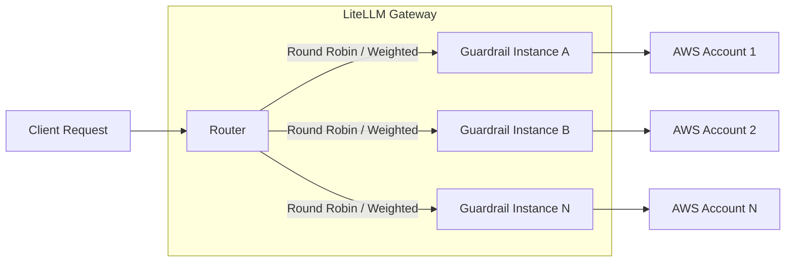
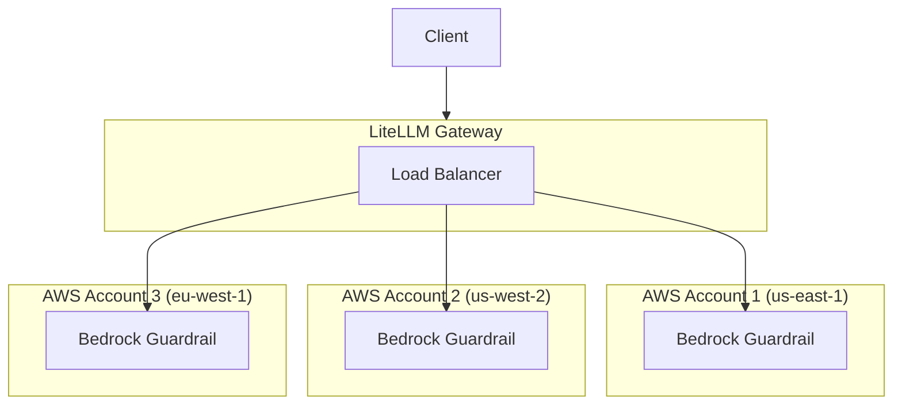

import Tabs from '@theme/Tabs';
import TabItem from '@theme/TabItem';

# Guardrail Load Balancing

Load balance guardrail requests across multiple guardrail deployments. This is useful when you have rate limits on guardrail providers (e.g., AWS Bedrock Guardrails) and want to distribute requests across multiple accounts or regions.

## How It Works



When you define multiple guardrails with the **same `guardrail_name`**, LiteLLM automatically load balances requests across them using the router's load balancing strategy.

## Why Use Guardrail Load Balancing?

| Use Case | Benefit |
|----------|---------|
| **AWS Bedrock Rate Limits** | Bedrock Guardrails have per-account rate limits. Distribute across multiple AWS accounts to increase throughput |
| **Multi-Region Redundancy** | Deploy guardrails across regions for failover and lower latency |
| **Cost Optimization** | Spread usage across accounts with different pricing tiers or credits |
| **A/B Testing** | Test different guardrail configurations with weighted distribution |

## Quick Start

### 1. Define Multiple Guardrails with Same Name

Define multiple guardrail entries with the **same `guardrail_name`** but different configurations:

<Tabs>
<TabItem value="bedrock" label="Bedrock Guardrails">

```yaml showLineNumbers title="config.yaml"
model_list:
  - model_name: gpt-4
    litellm_params:
      model: openai/gpt-4
      api_key: os.environ/OPENAI_API_KEY

guardrails:
  # First Bedrock guardrail - AWS Account 1
  - guardrail_name: "content-filter"
    litellm_params:
      guardrail: bedrock/guardrail
      mode: "pre_call"
      guardrailIdentifier: "abc123"
      guardrailVersion: "1"
      aws_access_key_id: os.environ/AWS_ACCESS_KEY_ID_1
      aws_secret_access_key: os.environ/AWS_SECRET_ACCESS_KEY_1
      aws_region_name: "us-east-1"
  
  # Second Bedrock guardrail - AWS Account 2
  - guardrail_name: "content-filter"
    litellm_params:
      guardrail: bedrock/guardrail
      mode: "pre_call"
      guardrailIdentifier: "def456"
      guardrailVersion: "1"
      aws_access_key_id: os.environ/AWS_ACCESS_KEY_ID_2
      aws_secret_access_key: os.environ/AWS_SECRET_ACCESS_KEY_2
      aws_region_name: "us-west-2"
```

</TabItem>

<TabItem value="custom" label="Custom Guardrails">

```yaml showLineNumbers title="config.yaml"
model_list:
  - model_name: gpt-4
    litellm_params:
      model: openai/gpt-4
      api_key: os.environ/OPENAI_API_KEY

guardrails:
  # First custom guardrail instance
  - guardrail_name: "pii-filter"
    litellm_params:
      guardrail: custom_guardrail.PIIFilterA
      mode: "pre_call"
  
  # Second custom guardrail instance
  - guardrail_name: "pii-filter"
    litellm_params:
      guardrail: custom_guardrail.PIIFilterB
      mode: "pre_call"
```

</TabItem>

<TabItem value="aporia" label="Aporia Guardrails">

```yaml showLineNumbers title="config.yaml"
model_list:
  - model_name: gpt-4
    litellm_params:
      model: openai/gpt-4
      api_key: os.environ/OPENAI_API_KEY

guardrails:
  # First Aporia instance
  - guardrail_name: "toxicity-filter"
    litellm_params:
      guardrail: aporia
      mode: "pre_call"
      api_key: os.environ/APORIA_API_KEY_1
      api_base: os.environ/APORIA_API_BASE_1
  
  # Second Aporia instance
  - guardrail_name: "toxicity-filter"
    litellm_params:
      guardrail: aporia
      mode: "pre_call"
      api_key: os.environ/APORIA_API_KEY_2
      api_base: os.environ/APORIA_API_BASE_2
```

</TabItem>
</Tabs>

### 2. Start LiteLLM Gateway

```bash showLineNumbers title="Start proxy"
litellm --config config.yaml --detailed_debug
```

### 3. Make Requests

Requests using the guardrail will be automatically load balanced:

```bash showLineNumbers title="Test request"
curl -X POST http://localhost:4000/v1/chat/completions \
  -H "Content-Type: application/json" \
  -H "Authorization: Bearer sk-1234" \
  -d '{
    "model": "gpt-4",
    "messages": [{"role": "user", "content": "Hello, how are you?"}],
    "guardrails": ["content-filter"]
  }'
```

## Weighted Load Balancing

Assign weights to distribute traffic unevenly across guardrail instances:

```yaml showLineNumbers title="config.yaml - Weighted distribution"
guardrails:
  # 80% of traffic
  - guardrail_name: "content-filter"
    litellm_params:
      guardrail: bedrock/guardrail
      mode: "pre_call"
      guardrailIdentifier: "primary-guard"
      guardrailVersion: "1"
      weight: 8  # Higher weight = more traffic
  
  # 20% of traffic
  - guardrail_name: "content-filter"
    litellm_params:
      guardrail: bedrock/guardrail
      mode: "pre_call"
      guardrailIdentifier: "secondary-guard"
      guardrailVersion: "1"
      weight: 2  # Lower weight = less traffic
```

## Bedrock Guardrails - Multi-Account Setup

AWS Bedrock Guardrails have rate limits per account. Here's how to set up load balancing across multiple AWS accounts:

### Architecture



### Configuration

```yaml showLineNumbers title="config.yaml - Multi-account Bedrock"
model_list:
  - model_name: claude-3
    litellm_params:
      model: bedrock/anthropic.claude-3-sonnet-20240229-v1:0

guardrails:
  # AWS Account 1 - US East
  - guardrail_name: "bedrock-content-filter"
    litellm_params:
      guardrail: bedrock/guardrail
      mode: "during_call"
      guardrailIdentifier: "guard-us-east"
      guardrailVersion: "DRAFT"
      aws_access_key_id: os.environ/AWS_ACCESS_KEY_1
      aws_secret_access_key: os.environ/AWS_SECRET_KEY_1
      aws_region_name: "us-east-1"
  
  # AWS Account 2 - US West
  - guardrail_name: "bedrock-content-filter"
    litellm_params:
      guardrail: bedrock/guardrail
      mode: "during_call"
      guardrailIdentifier: "guard-us-west"
      guardrailVersion: "DRAFT"
      aws_access_key_id: os.environ/AWS_ACCESS_KEY_2
      aws_secret_access_key: os.environ/AWS_SECRET_KEY_2
      aws_region_name: "us-west-2"
  
  # AWS Account 3 - EU West
  - guardrail_name: "bedrock-content-filter"
    litellm_params:
      guardrail: bedrock/guardrail
      mode: "during_call"
      guardrailIdentifier: "guard-eu-west"
      guardrailVersion: "DRAFT"
      aws_access_key_id: os.environ/AWS_ACCESS_KEY_3
      aws_secret_access_key: os.environ/AWS_SECRET_KEY_3
      aws_region_name: "eu-west-1"
```

### Test Multi-Account Setup

```bash showLineNumbers title="Run multiple requests to verify load balancing"
# Run 10 requests - they will be distributed across accounts
for i in {1..10}; do
  curl -s -X POST http://localhost:4000/v1/chat/completions \
    -H "Content-Type: application/json" \
    -H "Authorization: Bearer sk-1234" \
    -d '{
      "model": "claude-3",
      "messages": [{"role": "user", "content": "Hello"}],
      "guardrails": ["bedrock-content-filter"]
    }' &
done
wait
```

Check proxy logs to verify requests are distributed across different AWS accounts.

## Custom Guardrails Example

Create two custom guardrail classes for load balancing:

```python showLineNumbers title="custom_guardrail.py"
from litellm.integrations.custom_guardrail import CustomGuardrail
from litellm.proxy._types import UserAPIKeyAuth
from litellm.caching.caching import DualCache


class PIIFilterA(CustomGuardrail):
    """PII Filter Instance A"""
    
    async def async_pre_call_hook(
        self,
        user_api_key_dict: UserAPIKeyAuth,
        cache: DualCache,
        data: dict,
        call_type: str,
    ):
        print("PIIFilterA processing request")
        # Your PII filtering logic here
        return data


class PIIFilterB(CustomGuardrail):
    """PII Filter Instance B"""
    
    async def async_pre_call_hook(
        self,
        user_api_key_dict: UserAPIKeyAuth,
        cache: DualCache,
        data: dict,
        call_type: str,
    ):
        print("PIIFilterB processing request")
        # Your PII filtering logic here
        return data
```

```yaml showLineNumbers title="config.yaml"
guardrails:
  - guardrail_name: "pii-filter"
    litellm_params:
      guardrail: custom_guardrail.PIIFilterA
      mode: "pre_call"
  
  - guardrail_name: "pii-filter"
    litellm_params:
      guardrail: custom_guardrail.PIIFilterB
      mode: "pre_call"
```

## Verifying Load Balancing

Enable detailed debug logging to verify load balancing is working:

```bash showLineNumbers title="Start with debug logging"
litellm --config config.yaml --detailed_debug
```

You should see logs indicating which guardrail instance is selected:

```
Selected guardrail deployment: bedrock/guardrail (guard-us-east)
Selected guardrail deployment: bedrock/guardrail (guard-us-west)
Selected guardrail deployment: bedrock/guardrail (guard-eu-west)
...
```

## Related

- [Guardrails Quick Start](./quick_start.md)
- [Bedrock Guardrails](./bedrock.md)
- [Custom Guardrails](./custom_guardrail.md)
- [Load Balancing for LLM Calls](../load_balancing.md)

