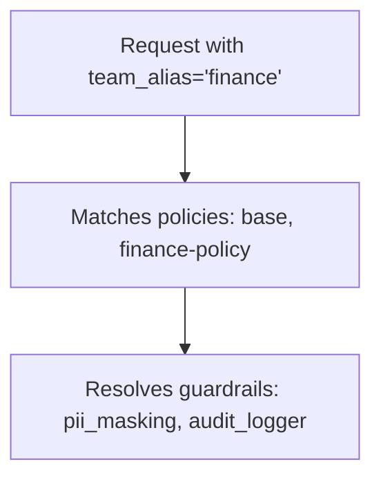

# [Beta] Guardrail Policies

Use policies to group guardrails and control which ones run for specific teams, keys, or models.

## Why use policies?

- Enable/disable specific guardrails for teams, keys, or models
- Group guardrails into a single policy
- Inherit from existing policies and override what you need

## Quick Start

```yaml showLineNumbers title="config.yaml"
model_list:
  - model_name: gpt-4
    litellm_params:
      model: openai/gpt-4

# 1. Define your guardrails
guardrails:
  - guardrail_name: pii_masking
    litellm_params:
      guardrail: presidio
      mode: pre_call

  - guardrail_name: prompt_injection
    litellm_params:
      guardrail: lakera
      mode: pre_call
      api_key: os.environ/LAKERA_API_KEY

# 2. Create a policy
policies:
  my-policy:
    guardrails:
      add:
        - pii_masking
        - prompt_injection

# 3. Attach the policy
policy_attachments:
  - policy: my-policy
    scope: "*"  # apply to all requests
```

Response headers show what ran:

```
x-litellm-applied-policies: my-policy
x-litellm-applied-guardrails: pii_masking,prompt_injection
```

## Add guardrails for a specific team

:::info
✨ Enterprise only feature for team/key-based policy attachments. [Get a free trial](https://www.litellm.ai/enterprise#trial)
:::

You have a global baseline, but want to add extra guardrails for a specific team.

```yaml showLineNumbers title="config.yaml"
policies:
  global-baseline:
    guardrails:
      add:
        - pii_masking

  finance-team-policy:
    inherit: global-baseline
    guardrails:
      add:
        - strict_compliance_check
        - audit_logger

policy_attachments:
  - policy: global-baseline
    scope: "*"

  - policy: finance-team-policy
    teams:
      - finance  # team alias from /team/new
```

Now the `finance` team gets `pii_masking` + `strict_compliance_check` + `audit_logger`, while everyone else just gets `pii_masking`.

## Remove guardrails for a specific team

:::info
✨ Enterprise only feature for team/key-based policy attachments. [Get a free trial](https://www.litellm.ai/enterprise#trial)
:::

You have guardrails running globally, but want to disable some for a specific team (e.g., internal testing).

```yaml showLineNumbers title="config.yaml"
policies:
  global-baseline:
    guardrails:
      add:
        - pii_masking
        - prompt_injection

  internal-team-policy:
    inherit: global-baseline
    guardrails:
      remove:
        - pii_masking  # don't need PII masking for internal testing

policy_attachments:
  - policy: global-baseline
    scope: "*"

  - policy: internal-team-policy
    teams:
      - internal-testing  # team alias from /team/new
```

Now the `internal-testing` team only gets `prompt_injection`, while everyone else gets both guardrails.

## Inheritance

Start with a base policy and build on it:

```yaml showLineNumbers title="config.yaml"
policies:
  base:
    guardrails:
      add:
        - pii_masking
        - toxicity_filter

  strict:
    inherit: base
    guardrails:
      add:
        - prompt_injection

  relaxed:
    inherit: base
    guardrails:
      remove:
        - toxicity_filter
```

What you get:
- `base` → `[pii_masking, toxicity_filter]`
- `strict` → `[pii_masking, toxicity_filter, prompt_injection]`
- `relaxed` → `[pii_masking]`

## Model Conditions

Run guardrails only for specific models:

```yaml showLineNumbers title="config.yaml"
policies:
  gpt4-safety:
    guardrails:
      add:
        - strict_content_filter
    condition:
      model: "gpt-4.*"  # regex - matches gpt-4, gpt-4-turbo, gpt-4o

  bedrock-compliance:
    guardrails:
      add:
        - audit_logger
    condition:
      model:  # exact match list
        - bedrock/claude-3
        - bedrock/claude-2
```

## Attachments

Policies don't do anything until you attach them. Attachments tell LiteLLM *where* to apply each policy.

**Global** - runs on every request:

```yaml showLineNumbers title="config.yaml"
policy_attachments:
  - policy: default
    scope: "*"
```

**Team-specific** (uses team alias from `/team/new`):

```yaml showLineNumbers title="config.yaml"
policy_attachments:
  - policy: hipaa-compliance
    teams:
      - healthcare-team  # team alias
      - medical-research  # team alias
```

**Key-specific** (uses key alias from `/key/generate`, wildcards supported):

```yaml showLineNumbers title="config.yaml"
policy_attachments:
  - policy: internal-testing
    keys:
      - "dev-*"  # key alias pattern
      - "test-*"  # key alias pattern
```

## Config Reference

### `policies`

```yaml
policies:
  <policy-name>:
    description: ...
    inherit: ...
    guardrails:
      add: [...]
      remove: [...]
    condition:
      model: ...
```

| Field | Type | Description |
|-------|------|-------------|
| `description` | `string` | Optional. What this policy does. |
| `inherit` | `string` | Optional. Parent policy to inherit guardrails from. |
| `guardrails.add` | `list[string]` | Guardrails to enable. |
| `guardrails.remove` | `list[string]` | Guardrails to disable (useful with inheritance). |
| `condition.model` | `string` or `list[string]` | Optional. Only apply when model matches. Supports regex. |

### `policy_attachments`

```yaml
policy_attachments:
  - policy: ...
    scope: ...
    teams: [...]
    keys: [...]
```

| Field | Type | Description |
|-------|------|-------------|
| `policy` | `string` | **Required.** Name of the policy to attach. |
| `scope` | `string` | Use `"*"` to apply globally. |
| `teams` | `list[string]` | Team aliases (from `/team/new`). |
| `keys` | `list[string]` | Key aliases (from `/key/generate`). Supports `*` wildcard. |

### Response Headers

| Header | Description |
|--------|-------------|
| `x-litellm-applied-policies` | Policies that matched this request |
| `x-litellm-applied-guardrails` | Guardrails that actually ran |

## How it works

Example config:

```yaml showLineNumbers title="config.yaml"
policies:
  base:
    guardrails:
      add: [pii_masking]

  finance-policy:
    inherit: base
    guardrails:
      add: [audit_logger]

policy_attachments:
  - policy: base
    scope: "*"
  - policy: finance-policy
    teams: [finance]
```



1. Request comes in with `team_alias='finance'`
2. Matches `base` (via `scope: "*"`) and `finance-policy` (via `teams: [finance]`)
3. Resolves guardrails: `base` adds `pii_masking`, `finance-policy` inherits and adds `audit_logger`
4. Final guardrails: `pii_masking`, `audit_logger`
