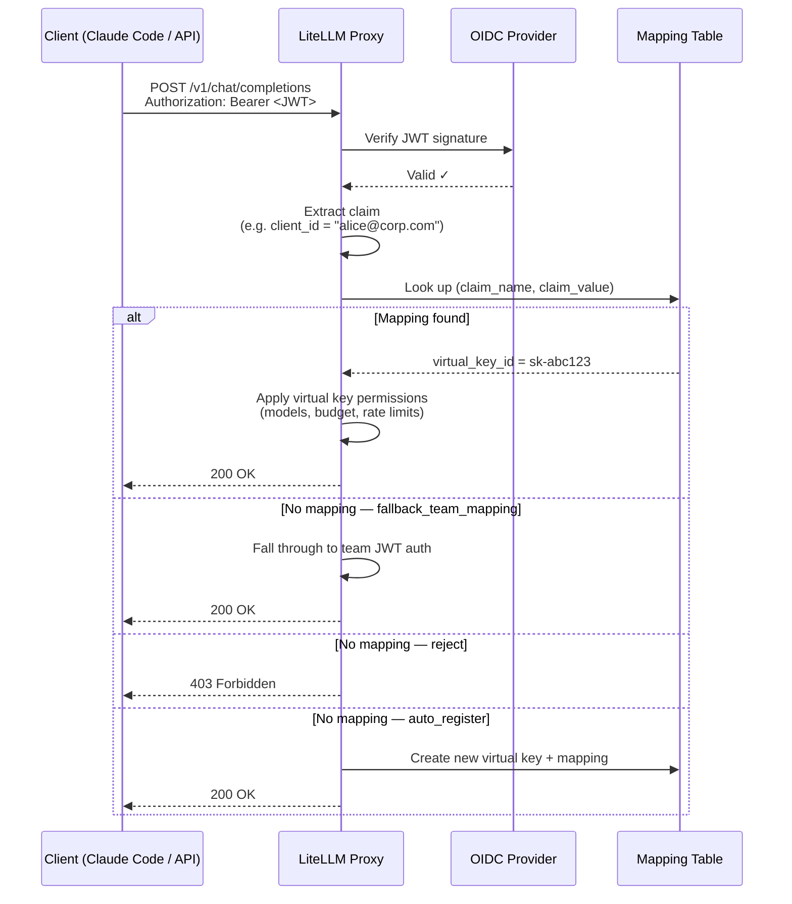

# JWT → Virtual Key Mapping

:::info Enterprise

JWT → Virtual Key Mapping is an Enterprise feature.

[Get a free trial](https://enterprise.litellm.ai/demo)

:::

Map JWT tokens to LiteLLM virtual keys — so every JWT client gets the same granular controls as a virtual key: model restrictions, spend limits, rate limits, guardrails, and full spend tracking.

**Why this matters:** Standard JWT auth maps a JWT to a *team*. That's a shared boundary — all clients under a team share the same limits. With JWT → Virtual Key Mapping, each individual JWT client (identified by a claim like `client_id`, `azp`, or `sub`) maps to its own virtual key. You get per-client accountability without issuing API keys to your users.

**Common use case:** Your company uses SSO/OIDC. Developers use Claude Code with their identity tokens. You want to enforce per-developer model access and spend limits without giving each person a LiteLLM API key.

---

## How It Works



---

## Setup

### Prerequisites

Complete [OIDC JWT Auth setup](./token_auth.md) first — you need `JWT_PUBLIC_KEY_URL` configured and `enable_jwt_auth: True` in your proxy config.

### Step 1. Configure the JWT claim to map on

Add `jwt_client_id_field` to your `litellm_jwtauth` config. This is the JWT claim LiteLLM uses as the lookup key:

```yaml
general_settings:
  master_key: sk-1234
  enable_jwt_auth: True
  litellm_jwtauth:
    team_id_jwt_field: "team_id"          # existing team mapping (optional)
    user_id_jwt_field: "sub"
    jwt_client_id_field: "client_id"      # 👈 claim used for key mapping
    unregistered_jwt_client_behavior: "fallback_team_mapping"  # see below
```

**`unregistered_jwt_client_behavior`** controls what happens when a JWT has no registered mapping:

| Value | Behavior |
|-------|----------|
| `fallback_team_mapping` | Fall through to team-based JWT auth (default — backward compatible) |
| `reject` | Return 403 if no mapping found |
| `auto_register` | Auto-create a virtual key + mapping on first encounter |

### Step 2. Register a JWT client → virtual key mapping

**Option A: Single call (creates key + mapping atomically)**

```bash
curl -X POST 'http://0.0.0.0:4000/jwt_client/new' \
  -H 'Authorization: Bearer <PROXY_MASTER_KEY>' \
  -H 'Content-Type: application/json' \
  -d '{
    "jwt_claim_name": "client_id",
    "jwt_claim_value": "dev-alice",
    "models": ["claude-sonnet-4-5", "claude-haiku-4-5"],
    "max_budget": 50.0,
    "budget_duration": "30d",
    "rpm_limit": 100,
    "tpm_limit": 50000,
    "team_id": "engineering"
  }'
```

Response includes the virtual key token (only shown on creation):

```json
{
  "key": "sk-abc123...",
  "key_id": "key_123",
  "mapping_id": "mapping_456",
  "jwt_claim_name": "client_id",
  "jwt_claim_value": "dev-alice"
}
```

**Option B: Map an existing virtual key**

```bash
curl -X POST 'http://0.0.0.0:4000/jwt/key/mapping/new' \
  -H 'Authorization: Bearer <PROXY_MASTER_KEY>' \
  -H 'Content-Type: application/json' \
  -d '{
    "jwt_claim_name": "client_id",
    "jwt_claim_value": "dev-alice",
    "virtual_key_id": "key_123"
  }'
```

### Step 3. Test it

```bash
# Get a JWT from your OIDC provider (must have client_id: dev-alice)
JWT_TOKEN="eyJhbG..."

curl -X POST 'http://0.0.0.0:4000/v1/chat/completions' \
  -H "Authorization: Bearer $JWT_TOKEN" \
  -H 'Content-Type: application/json' \
  -d '{
    "model": "claude-sonnet-4-5",
    "messages": [{"role": "user", "content": "Hello"}]
  }'
```

The request is now tracked against `dev-alice`'s virtual key — spend, rate limits, and model access enforced per-client.

---

## Walkthrough: Admin grants granular access, team uses Claude Code

This is the full flow for an engineering team using Claude Code with company SSO.

### Admin setup

**1. Create a team for engineering**

```bash
curl -X POST 'http://0.0.0.0:4000/team/new' \
  -H 'Authorization: Bearer <MASTER_KEY>' \
  -H 'Content-Type: application/json' \
  -d '{
    "team_alias": "engineering",
    "models": ["claude-sonnet-4-5", "claude-haiku-4-5"]
  }'
```

**2. Register each developer with their own key and spend limit**

```bash
# Alice — senior eng, higher budget
curl -X POST 'http://0.0.0.0:4000/jwt_client/new' \
  -H 'Authorization: Bearer <MASTER_KEY>' \
  -H 'Content-Type: application/json' \
  -d '{
    "jwt_claim_name": "client_id",
    "jwt_claim_value": "alice@corp.com",
    "team_id": "engineering",
    "models": ["claude-sonnet-4-5", "claude-haiku-4-5"],
    "max_budget": 200.0,
    "budget_duration": "30d",
    "rpm_limit": 200
  }'

# Bob — contractor, tighter limits
curl -X POST 'http://0.0.0.0:4000/jwt_client/new' \
  -H 'Authorization: Bearer <MASTER_KEY>' \
  -H 'Content-Type: application/json' \
  -d '{
    "jwt_claim_name": "client_id",
    "jwt_claim_value": "bob@contractor.com",
    "team_id": "engineering",
    "models": ["claude-haiku-4-5"],
    "max_budget": 20.0,
    "budget_duration": "30d",
    "rpm_limit": 30
  }'
```

**3. Configure Claude Code to use the proxy**

Set the proxy as the API base in your team's Claude Code config:

```bash
# Point Claude Code at the LiteLLM proxy instead of Anthropic directly.
# ANTHROPIC_API_KEY here is the bearer token sent to the proxy — set it to
# the user's SSO/OIDC JWT token (obtained from your IdP at login).
export ANTHROPIC_API_KEY="<user-sso-jwt-token>"
export ANTHROPIC_BASE_URL="http://your-litellm-proxy:4000"
```

Or in `~/.claude/settings.json`:

```json
{
  "env": {
    "ANTHROPIC_BASE_URL": "http://your-litellm-proxy:4000"
  }
}
```

**4. Developers authenticate with SSO as usual**

When Alice runs Claude Code, her JWT (issued by your IdP with `client_id: alice@corp.com`) goes to the proxy. LiteLLM looks up the mapping, finds her virtual key, and enforces her specific limits — her $200/month budget, 200 RPM cap, and access to Sonnet and Haiku only.

Bob's token maps to his own key — $20/month, Haiku only, 30 RPM.

No API keys distributed. No shared limits. Full per-developer spend visibility in the LiteLLM dashboard.

---

## Managing mappings

**View a mapping + its key settings**

```bash
curl 'http://0.0.0.0:4000/jwt/key/mapping/info?jwt_claim_name=client_id&jwt_claim_value=alice@corp.com' \
  -H 'Authorization: Bearer <MASTER_KEY>'
```

Response includes the linked key's `models`, `max_budget`, `spend`, `rpm_limit`, `expires`, etc.

**Update a mapping**

```bash
curl -X POST 'http://0.0.0.0:4000/jwt_client/update' \
  -H 'Authorization: Bearer <MASTER_KEY>' \
  -H 'Content-Type: application/json' \
  -d '{
    "jwt_claim_name": "client_id",
    "jwt_claim_value": "alice@corp.com",
    "max_budget": 300.0
  }'
```

**Delete a mapping**

```bash
curl -X DELETE 'http://0.0.0.0:4000/jwt/key/mapping/delete' \
  -H 'Authorization: Bearer <MASTER_KEY>' \
  -H 'Content-Type: application/json' \
  -d '{
    "jwt_claim_name": "client_id",
    "jwt_claim_value": "alice@corp.com"
  }'
```

---

## Security

JWT-bound keys are locked down:

- Non-admin users cannot call `/key/update`, `/key/delete`, or `/key/regenerate` on a JWT-bound key. These return 403.
- JWT-bound keys are automatically restricted to `llm_api_routes` — they can make LLM calls but cannot manage other keys or admin resources.
- Only proxy admins can create, update, or delete mappings.

---

## Multi-IdP support

If you have users across multiple identity providers that share the same claim values (e.g. two services both have `sub: user-123` from different issuers), set `issuer` when creating the mapping:

```bash
curl -X POST 'http://0.0.0.0:4000/jwt_client/new' \
  -H 'Authorization: Bearer <MASTER_KEY>' \
  -H 'Content-Type: application/json' \
  -d '{
    "jwt_claim_name": "sub",
    "jwt_claim_value": "user-123",
    "issuer": "https://idp-a.corp.com",
    "models": ["claude-sonnet-4-5"],
    "max_budget": 50.0
  }'
```

Mappings are unique per `(claim_name, claim_value, issuer)` — so `user-123` from IdP A and `user-123` from IdP B resolve to different virtual keys.

---

## What JWT clients can and can't do vs virtual keys

| Capability | Virtual Key | JWT → Key Mapping |
|---|---|---|
| Per-client model access | ✅ | ✅ |
| Per-client spend budget | ✅ | ✅ |
| Per-client RPM/TPM limits | ✅ | ✅ |
| Team membership | ✅ | ✅ |
| Spend tracking in dashboard | ✅ | ✅ |
| Guardrails | ✅ | ✅ |
| Key rotation | ✅ | ✅ (admin only) |
| Key expiry | ✅ | ✅ |
| No API key distribution needed | ❌ | ✅ |
| Works with existing SSO/OIDC | ❌ | ✅ |

---

## Related

- [OIDC JWT Auth](./token_auth.md) — base JWT auth setup required before using this feature
- [Virtual Keys](./virtual_keys.md) — full virtual key documentation
- [Access Control](./access_control.md) — model and team access control
